# 💾 데이터베이스 기본 개념

🔗 참고:

- [Full Stack Developer Roadmap](https://roadmap.sh/full-stack)
- [DB-Engines Ranking](https://db-engines.com/en/ranking)

---

## 🧩 CRUD

> Create, Read, Update, Delete
>
> 데이터베이스의 기본 4가지 기능

---

## 📊 기본 용어

| 용어                                  | 설명                                                             |
| ------------------------------------- | ---------------------------------------------------------------- |
| **데이터 (Data)**                     | 가공되지 않은 단순한 사실이나 값                                 |
| **정보 (Information)**                | 데이터를 목적에 맞게 가공하여 의미를 부여한 것                   |
| **데이터베이스 (Database)**           | 여러 사용자가 공유할 수 있도록 체계적으로 관리되는 데이터의 집합 |
| **DBMS (Database Management System)** | 데이터베이스를 효율적으로 관리·운영하는 소프트웨어               |

---

## 💡 파일 시스템 vs 데이터베이스

**데이터베이스의 장점**

- ✅ 데이터 중복 최소화
- ✅ 데이터 일관성 보장
- ✅ 동시 접근 가능
- ✅ SQL을 통한 효율적인 검색 및 가공
- ✅ 사용자별 권한 관리
- ✅ 백업 / 복구 기능
- ✅ 높은 보안과 안정성

---

## 🧱 관계형 데이터베이스 (RDBMS)

> 데이터를 표(Table) 형태로 저장하고, 테이블 간 관계를 통해 데이터를 관리하는 시스템

📌 **예시:** MySQL, Oracle, PostgreSQL, SQL Server

### 📘 기본 구조

| 용어                        | 설명                                            |
| --------------------------- | ----------------------------------------------- |
| **테이블 (Table)**          | 데이터를 행과 열로 구성한 표                    |
| **행 (Row / Record)**       | 테이블의 가로 한 줄 → 하나의 완전한 데이터 항목 |
| **열 (Column / Attribute)** | 테이블의 세로 한 줄 → 데이터의 특정 속성        |

---

## 🗃️ NoSQL (Not Only SQL)

> 관계형 모델이 아닌 형태로 데이터를 저장하는 데이터베이스

### ⚖️ RDBMS vs NoSQL

| 구분            | RDBMS                          | NoSQL                          |
| --------------- | ------------------------------ | ------------------------------ |
| **데이터 모델** | 정형화된 표 (Table)            | 문서, Key-Value 등 비정형      |
| **스키마**      | 고정 스키마 (Strict)           | 유연한 스키마 (Flexible)       |
| **확장 방식**   | 수직 확장 (Scale-Up)           | 수평 확장 (Scale-Out)          |
| **트랜잭션**    | **ACID** (강력한 일관성)       | **BASE** (최종 일관성)         |
| **사용 사례**   | 금융 등 무결성이 중요한 시스템 | SNS 등 대용량·빠른 처리 시스템 |

---

## 🔑 키(Key)의 종류

| 키 유형                       | 설명                                                 |
| ----------------------------- | ---------------------------------------------------- |
| **기본 키 (Primary Key, PK)** | 각 행을 **고유하게 식별**하는 키 👉 중복 ❌, NULL ❌ |
| **외래 키 (Foreign Key, FK)** | 다른 테이블의 **기본 키를 참조**하여 관계를 연결     |
| **후보 키 (Candidate Key)**   | 기본 키가 될 수 있는 **모든 키** (유일성 + 최소성)   |
| **대체 키 (Alternate Key)**   | 후보 키 중 **기본 키로 선택되지 않은 키**            |

---

## 🔗 테이블 관계 (Relationship)

| 관계 유형          | 설명                                          | 예시               |
| ------------------ | --------------------------------------------- | ------------------ |
| **1 : 1 (일대일)** | 한 행이 다른 테이블의 **정확히 한 행**과 연결 | 직원 ↔ 사원증      |
| **1 : N (일대다)** | 한 행이 다른 테이블의 **여러 행**과 연결      | 부서 ↔ 직원        |
| **N : M (다대다)** | 양쪽 테이블의 행이 **여러 개씩 연결**         | 학생 ↔ 수강 ↔ 과목 |

💡 _N:M 관계는 “중간 테이블(Junction Table)”을 통해 1:N 관계 두 개로 분해함._

---

## 🧭 데이터 무결성 (Data Integrity)

> 데이터의 정확성과 일관성을 보장하기 위한 규칙

| 무결성 유형            | 설명                                                      |
| ---------------------- | --------------------------------------------------------- |
| **개체 무결성**        | 기본 키(PK)는 NULL이거나 중복될 수 없음                   |
| **참조 무결성**        | 외래 키(FK)는 참조하는 테이블의 PK 값이거나 NULL이어야 함 |
| **도메인 무결성**      | 열의 값은 정의된 데이터 타입과 범위에 맞아야 함           |
| **사용자 정의 무결성** | 비즈니스 규칙에 따라 사용자가 직접 정의하는 제약 조건     |

---

## ⚙️ 트랜잭션 (Transaction)

> 데이터 조작의 한 단위를 의미하며, 일련의 SQL 작업을 하나의 논리적 단위로 묶은 것

---

### 🧩 RDBMS 트랜잭션 원칙 — **ACID**

| 원칙                | 설명                                                            |
| ------------------- | --------------------------------------------------------------- |
| **A (Atomicity)**   | 트랜잭션의 모든 작업이 **완전히 수행되거나 전혀 수행되지 않음** |
| **C (Consistency)** | 트랜잭션 완료 후 데이터베이스는 **일관된 상태 유지**            |
| **I (Isolation)**   | 동시에 실행되는 트랜잭션은 **서로 간섭하지 않음**               |
| **D (Durability)**  | 완료된 트랜잭션의 결과는 **영구적으로 저장됨**                  |

---

### 🌐 NoSQL 트랜잭션 원칙 — **BASE**

| 원칙                     | 설명                                   |
| ------------------------ | -------------------------------------- |
| **Basically Available**  | 항상 사용 가능한 상태 유지             |
| **Soft State**           | 데이터 상태가 시간에 따라 변할 수 있음 |
| **Eventual Consistency** | 일정 시간 후 최종적으로 일관성 유지    |

---

## 🧮 SQL (Structured Query Language)

> 데이터베이스를 정의·조작·제어하기 위한 표준 언어

---

## MYSQL 설치

[MySQL Downloads](https://www.mysql.com/downloads/)


### MySQL Community Server


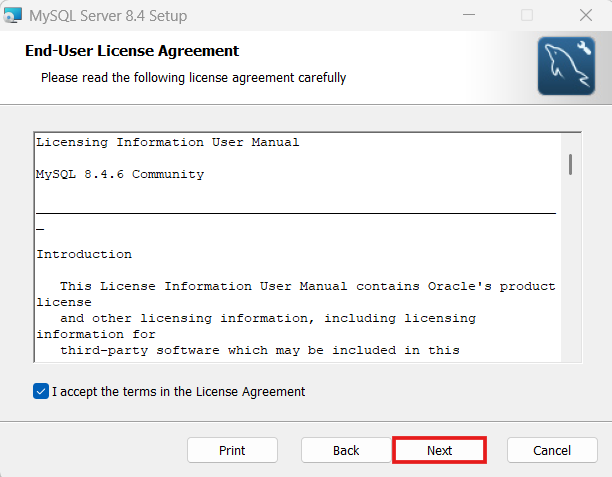

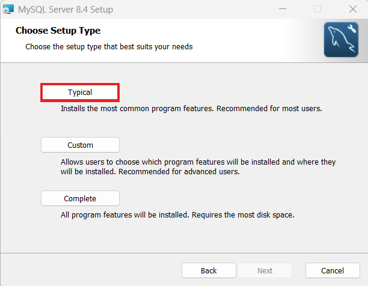

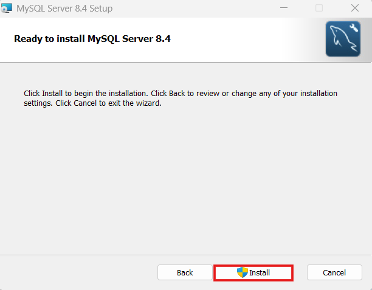

### MySQL Configurator 클릭 설치

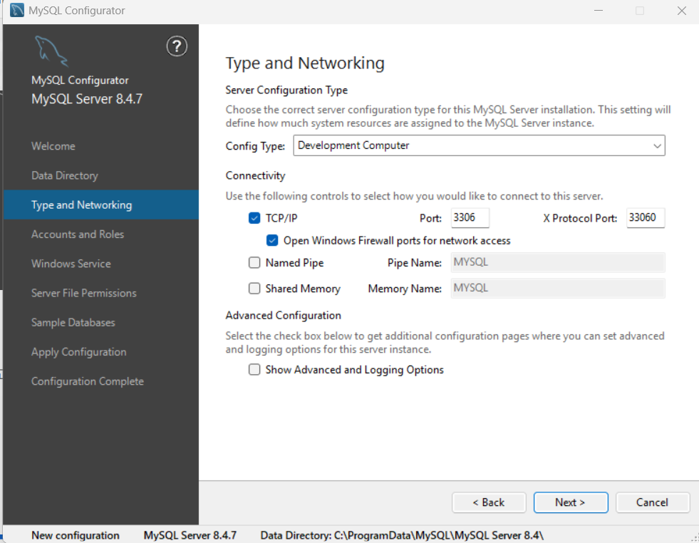

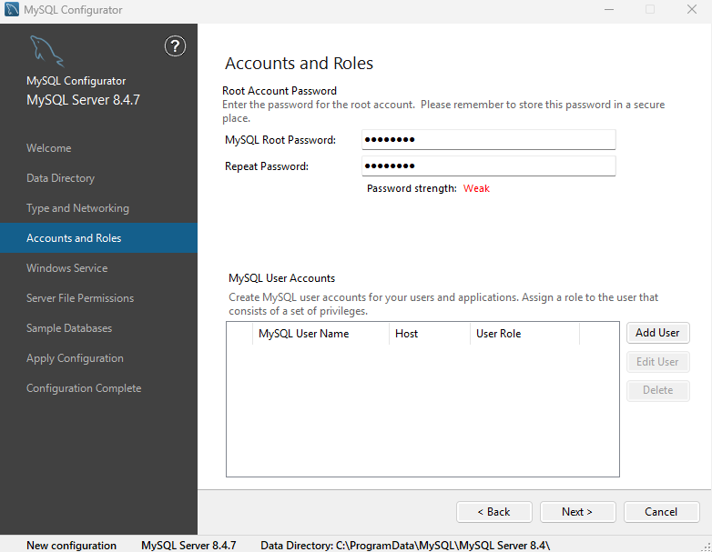

- password 입력

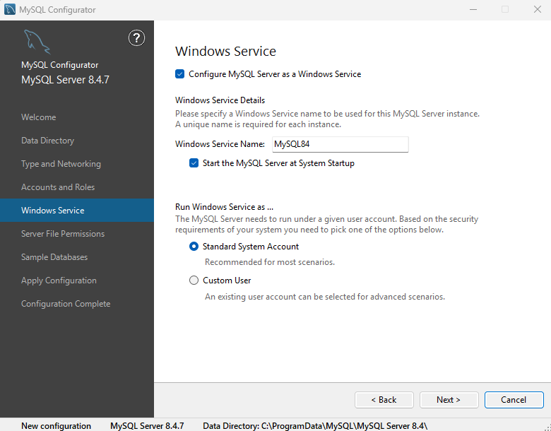


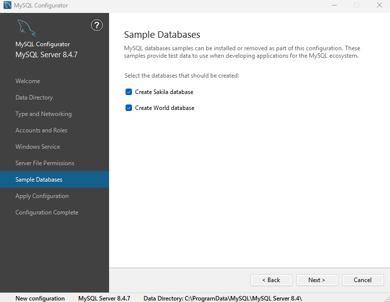

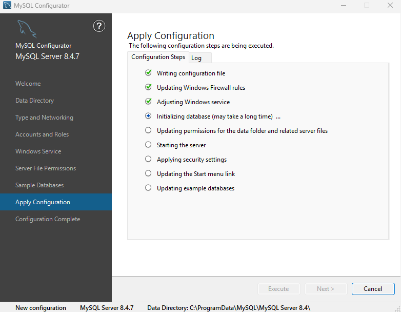

### Workbench 설치


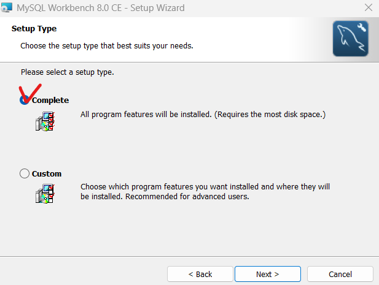

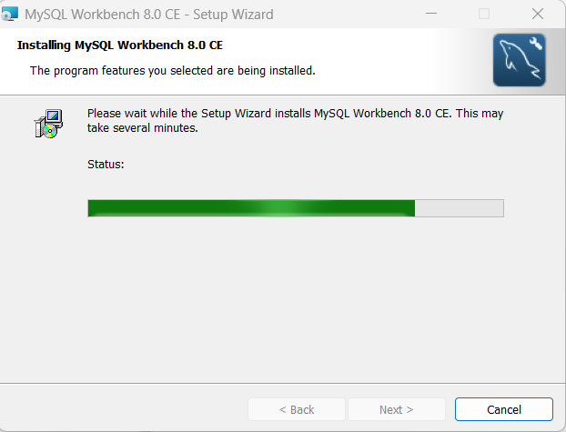

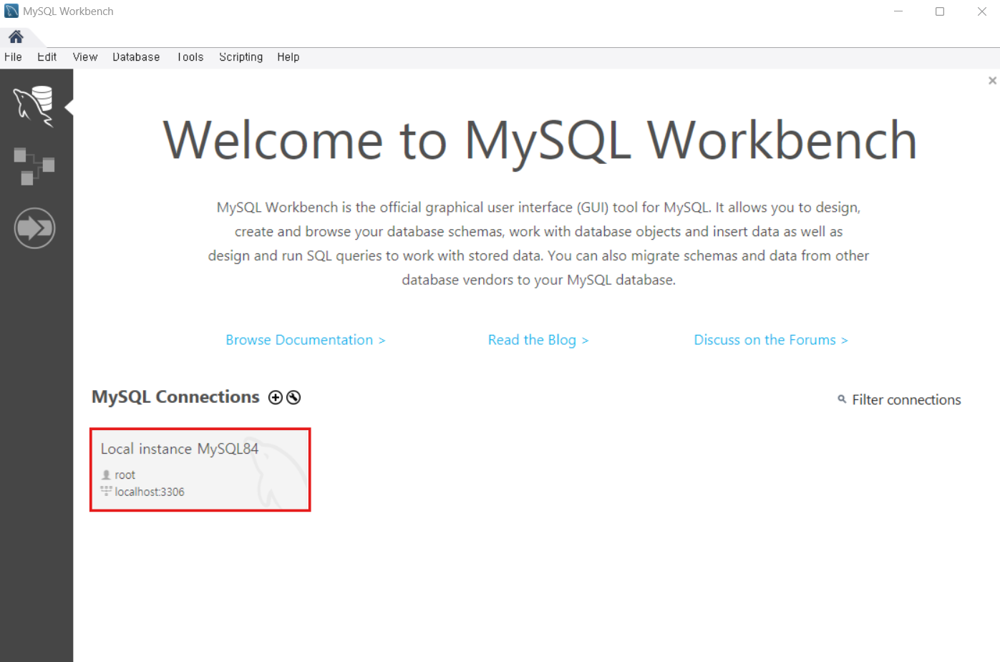


- password 입력

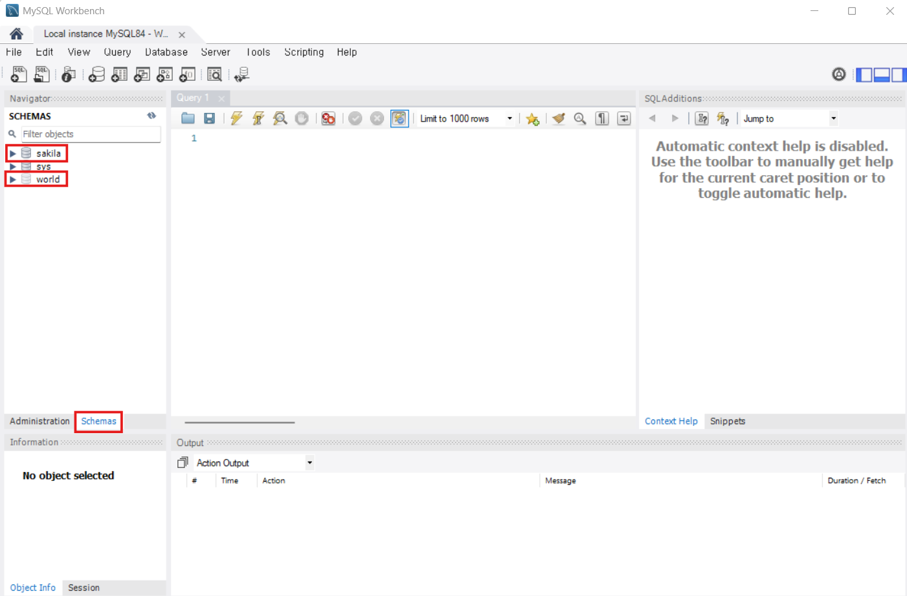

- sample data 확인 가능 (sakila, world)
- 없다면 아래 링크를 통해서 sample data 다운로드 후 파일 열고 번개 클릭해서 스크립트 실행
  - 스크립트 실행 시 schema 먼저 실행 후 data 실행할 것
  - [Other MySQL Documentation](https://dev.mysql.com/doc/index-other.html)


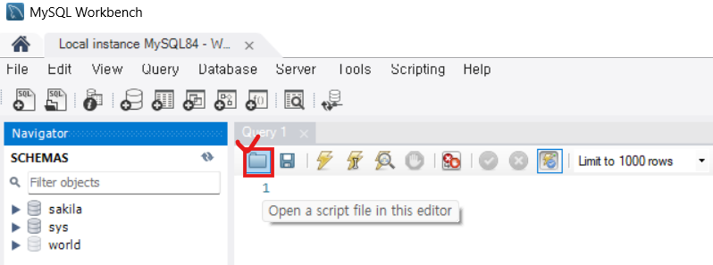

---

# ⚙️ 기본 SQL 실행

데이터베이스를 **정의·조작·제어**하기 위한 표준 언어

---

## 🧭 명령어 분류

| 분류                      | 설명                                 | 주요 명령어                            |
| ------------------------- | ------------------------------------ | -------------------------------------- |
| **DDL (데이터 정의어)**   | 데이터 구조를 생성, 수정, 삭제       | `CREATE`, `ALTER`, `DROP`              |
| **DML (데이터 조작어)**   | 실제 데이터를 조회, 삽입, 수정, 삭제 | `SELECT`, `INSERT`, `UPDATE`, `DELETE` |
| **DCL (데이터 제어어)**   | 데이터 접근 권한을 부여/회수         | `GRANT`, `REVOKE`                      |
| **TCL (트랜잭션 제어어)** | 변경사항을 반영하거나 취소           | `COMMIT`, `ROLLBACK`                   |

---

## 🧮 데이터 타입 (Data Types)

| 데이터 타입     | 설명                                   | 예시                  |
| --------------- | -------------------------------------- | --------------------- |
| `INT`           | 정수형                                 | 나이, 수량            |
| `VARCHAR(n)`    | 가변 길이 문자열 (최대 n자)            | 이름, 이메일          |
| `TEXT`          | 긴 텍스트 데이터                       | 게시글 내용           |
| `DATE`          | 날짜                                   | `2025-10-21`          |
| `DATETIME`      | 날짜 + 시간                            | `2025-10-21 15:30:00` |
| `DECIMAL(m, n)` | 정확한 소수 (전체 m자리, 소수점 n자리) | 가격, 금액            |

---

## 🔒 제약 조건 (Constraints)

| 제약 조건        | 설명                            |
| ---------------- | ------------------------------- |
| `PRIMARY KEY`    | 기본 키 (중복 불가, NULL 불가)  |
| `FOREIGN KEY`    | 외래 키 (다른 테이블의 PK 참조) |
| `NOT NULL`       | NULL 값 입력 불가               |
| `UNIQUE`         | 중복 값 불가 (단, NULL 허용)    |
| `DEFAULT value`  | 값이 없을 때 기본값 지정        |
| `AUTO_INCREMENT` | 자동 증가 숫자 (MySQL 전용)     |

## 🧱 SCHEMA 생성 예시 (`temp_db`)

> 💡 Tip:
>
> - 명령문 끝에는 세미콜론(`;`)
> - **키워드 대문자 권장** → `SELECT`, `FROM`, `WHERE`
> - 주석
>   - 한 줄: `- 주석`
>   - 여러 줄: `/* 주석 내용 */`
> - 번개 버튼:
>   - 왼쪽 → 전체 실행
>   - 오른쪽 → 커서 부분만 실행

```sql
-- world 데이터베이스 사용
USE world;
SELECT * FROM city;

-- 새 데이터베이스 생성
CREATE DATABASE temp_db;
USE temp_db;

-- DDL : 테이블 생성
CREATE TABLE student (
  id INT PRIMARY KEY AUTO_INCREMENT,
  name VARCHAR(50) NOT NULL
);

-- 테이블 삭제
DROP TABLE student;

-- DML : 데이터 조작
-- 데이터 추가 (Create)
INSERT INTO student (name) VALUES ('kim');

-- 데이터 조회 (Read)
SELECT * FROM student;

-- 데이터 수정 (Update)
UPDATE student SET name = 'hong' WHERE id = 1;

-- 데이터 삭제 (Delete)
DELETE FROM student WHERE id = 1;
```

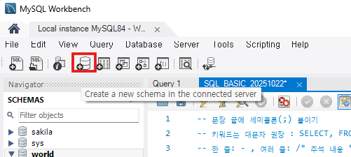


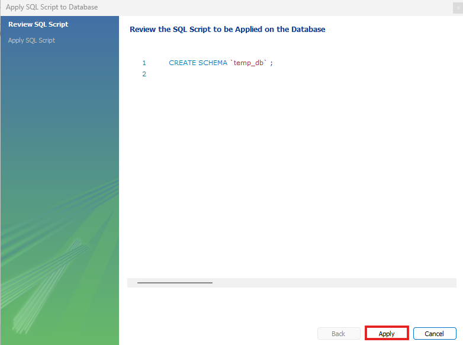

---

# 🧩 ERD (Entity Relationship Diagram)

**ERD란?**  
데이터베이스를 설계할 때 **데이터 구조를 시각적으로 표현한 설계도**  
👉 집을 짓기 전 설계도를 그리듯, DB 설계 전 구조를 명확히 정의하는 단계

---

## 🏗️ 구성 요소

### 🧱 **Entity (개체)**

- 데이터베이스에 저장할 **정보의 단위**
- **사각형**으로 표현
- ex. `회원`, `상품`, `주문`, `카테고리`
- **명사형으로 작성**

### 📄 **Attribute (속성)**

- 개체가 가지는 **세부 정보 항목**
- 개체 내부에 목록으로 표시
- 주요 속성:
  - **PK (Primary Key)** : 각 행을 고유하게 식별
  - **FK (Foreign Key)** : 다른 테이블의 PK를 참조

### 🔗 **Relationship (관계)**

- 개체 간의 **논리적 연관성**
- **선(Line)** 으로 표현

---

## 🔄 관계 유형

### 1️⃣ **1 : 1 관계 (One-to-One)**

```
회원 |-------| 회원프로필
     1       1
한 명의 회원은 하나의 프로필만 가짐
```

---

### 🌱 **1 : N 관계 (One-to-Many)**

```
회원 |-------< 게시글
     1         N
한 명의 회원은 여러 개의 게시글을 작성할 수 있음
```

---

### 🔁 **N : M 관계 (Many-to-Many)**

```
학생 >-------< 과목
한 학생은 여러 과목을 수강
한 과목에는 여러 학생이 등록
```

> ⚙️ 실제 DB에서는 중간 테이블(Junction Table) 로 1:N 관계 두 개로 분리하여 구현
>
> 예: `student_subject(student_id, subject_id)`

https://app.diagrams.net/

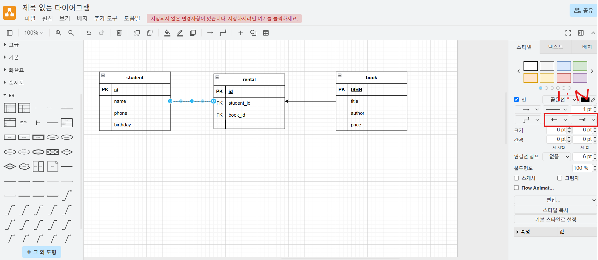


### MySQL Diagram


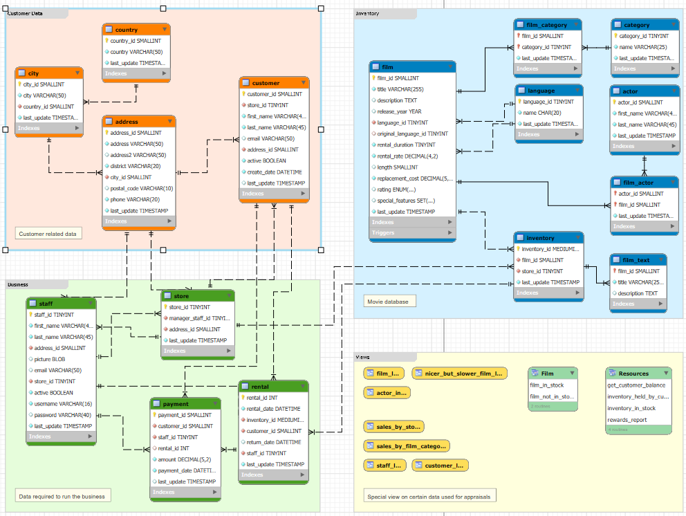
