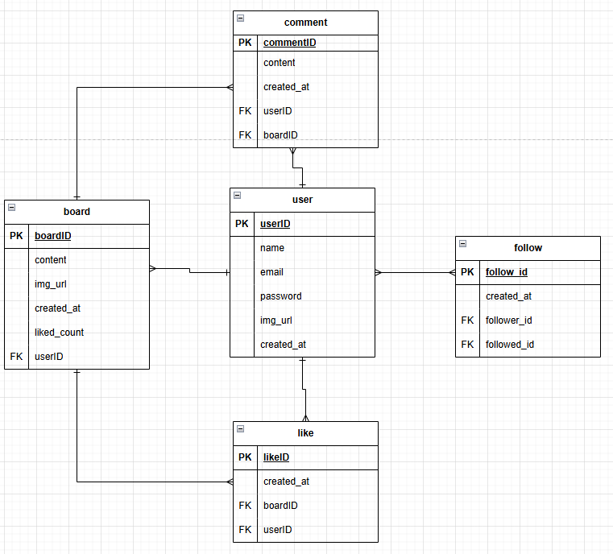
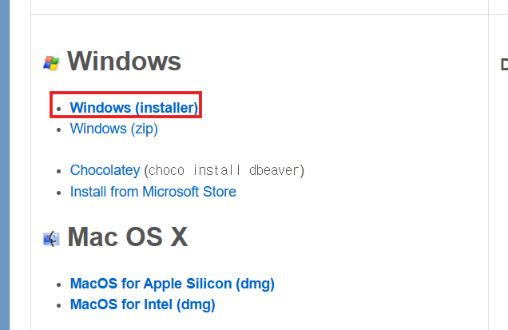
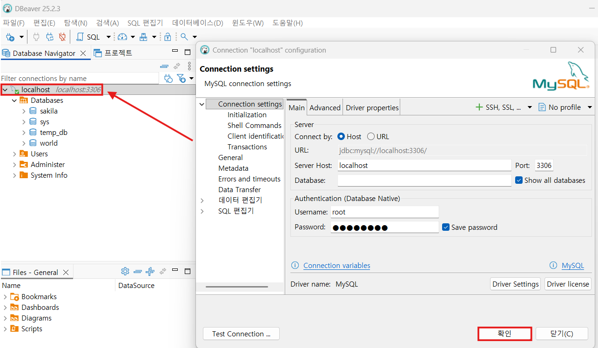
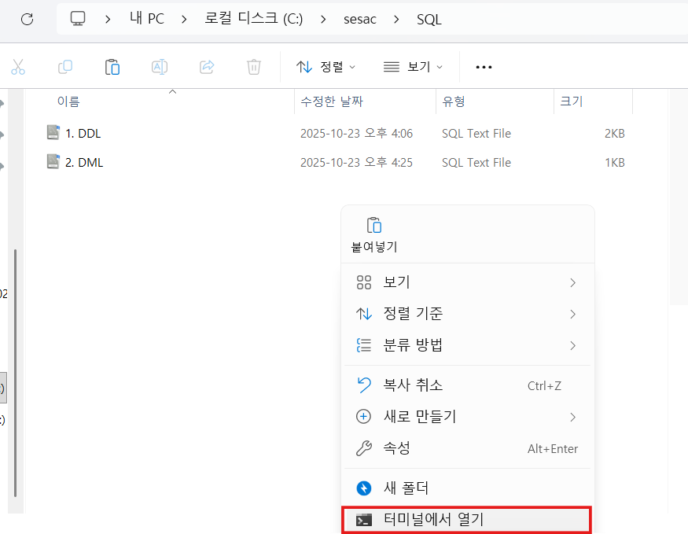
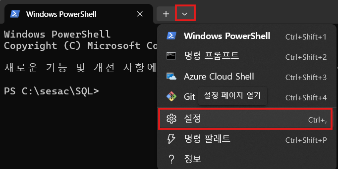
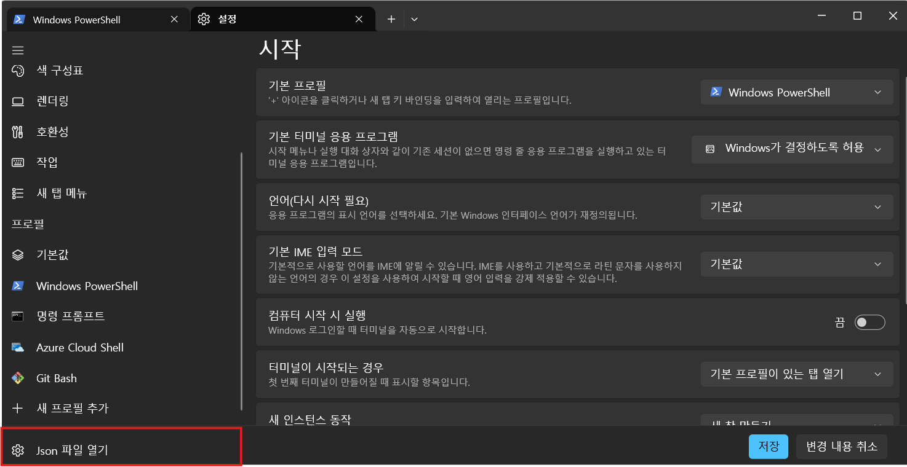
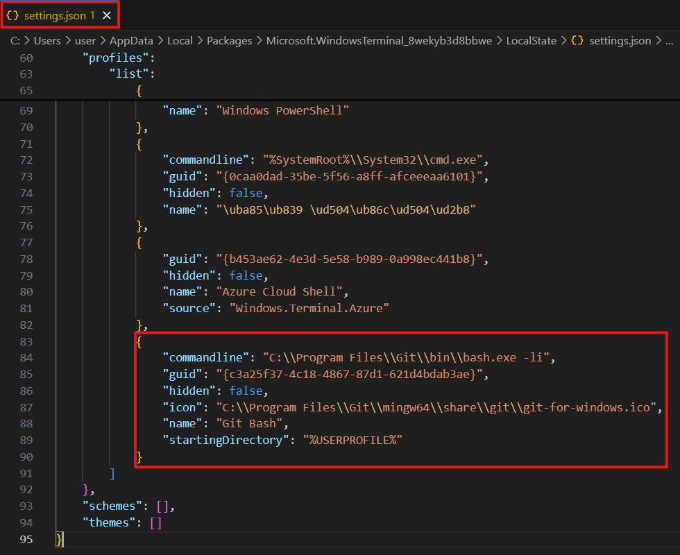
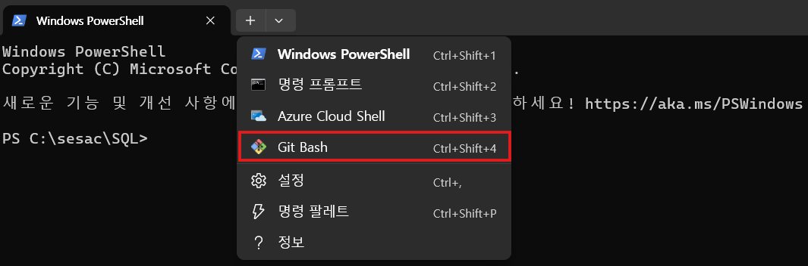

## 💡 **정규화(Normalization)**

> 정규화 = 데이터 정리정돈
>
> 중복을 최소화하고, 데이터의 무결성을 보장하기 위해 테이블 구조를 체계적으로 나누는 과정입니다.

---

### ⚠️ **정규화하지 않았을 때의 문제**

```sql
-- 정규화되지 않은 주문 테이블 예시
+----------+----------+----------+----------------+
| 주문번호 | 고객명   | 고객전화 | 상품목록       |
+----------+----------+----------+----------------+
| 1        | 홍길동   | 010-1111 | 노트북, 마우스 |
| 2        | 김영희   | 010-2222 | 키보드         |
| 3        | 홍길동   | 010-1111 | 모니터         |
+----------+----------+----------+----------------+
```

- 🔁 **중복** : `홍길동` 정보가 여러 행에 반복 저장
- 🧩 **수정 이상** : 전화번호 바꾸려면 모든 행을 수정해야 함
- 🗑 **삭제 이상** : 주문 삭제 시 고객 정보까지 사라짐
- 🚫 **삽입 이상** : 주문이 없으면 고객 정보를 추가할 수 없음

---

## ✅ **데이터 무결성 (Data Integrity)**

| 구분                                    | 설명                                    |
| --------------------------------------- | --------------------------------------- |
| **개체 무결성 (Entity Integrity)**      | 각 행(Row)은 고유해야 함 (PK 중복 불가) |
| **참조 무결성 (Referential Integrity)** | FK는 존재하는 PK만 참조 가능            |
| **도메인 무결성 (Domain Integrity)**    | 속성값은 정의된 범위 내여야 함          |

---

## 🧩 **정규형 요약 및 예시**

---

### **1️⃣ 제1정규형 (1NF) — 원자값(Atomic Value)**

> 모든 속성(열)은 더 이상 쪼갤 수 없는 단일값(Atomic Value) 을 가져야 한다.

### ❌ 정규화 전

| 고객명 | 연락처   | 구매상품       |
| ------ | -------- | -------------- |
| 홍길동 | 010-1111 | 노트북, 마우스 |

### ✅ 정규화 후

| 고객명 | 연락처   | 구매상품 |
| ------ | -------- | -------- |
| 홍길동 | 010-1111 | 노트북   |
| 홍길동 | 010-1111 | 마우스   |

👉 **복합 데이터(쉼표로 구분된 데이터)를 분리**

---

### **2️⃣ 제2정규형 (2NF) — 부분 종속 제거**

> 기본키(PK)의 일부에만 종속된 컬럼을 제거 (복합키 사용하는 경우에 해당)

### ❌ 정규화 전 (복합키: 주문번호 + 상품번호)

| 주문번호 | 상품번호 | 상품명 | 고객명 |
| -------- | -------- | ------ | ------ |
| 1        | A1       | 노트북 | 홍길동 |
| 1        | A2       | 마우스 | 홍길동 |

👉 `고객명`은 `주문번호`에만 종속되고 `상품번호`와는 무관함

### ✅ 정규화 후

**주문 테이블**

| 주문번호 | 고객명 |
| -------- | ------ |
| 1        | 홍길동 |

**주문상품 테이블**

| 주문번호 | 상품번호 | 상품명 |
| -------- | -------- | ------ |
| 1        | A1       | 노트북 |
| 1        | A2       | 마우스 |

👉 **주문과 상품 테이블을 분리하여 중복 제거**

---

### **3️⃣ 제3정규형 (3NF) — 이행 종속 제거**

> 기본키가 아닌 컬럼이 다른 컬럼에 종속될 경우 제거해야 함

### ❌ 정규화 전

| 고객ID | 고객명 | 지역코드 | 지역명 |
| ------ | ------ | -------- | ------ |
| 1      | 홍길동 | 02       | 서울   |
| 2      | 김영희 | 051      | 부산   |

👉 `지역명`은 `고객ID` → `지역코드` → `지역명` 으로 종속됨 (이행적 종속)

### ✅ 정규화 후

**고객 테이블**

| 고객ID | 고객명 | 지역코드 |
| ------ | ------ | -------- |
| 1      | 홍길동 | 02       |
| 2      | 김영희 | 051      |

**지역 테이블**

| 지역코드 | 지역명 |
| -------- | ------ |
| 02       | 서울   |
| 051      | 부산   |

👉 **비핵심 컬럼 간의 종속 관계 제거**

---

## 🧩 **SNS 시스템 요구사항 분석**

### **사용자 관리**

- 사용자는 사용자ID, 이름, 이메일, 비밀번호, 프로필사진URL, 가입일을 가진다
- 사용자ID와 이메일은 중복될 수 없다
- 사용자는 다른 사용자를 팔로우할 수 있다
- 사용자는 자신을 팔로우한 사람 목록(팔로워)을 볼 수 있다

### **게시글 관리**

- 게시글은 게시글번호, 내용, 이미지URL, 작성일시를 가진다
- 한 사용자는 여러 개의 게시글을 작성할 수 있다
- 게시글은 반드시 한 명의 사용자에게 속한다
- 게시글에는 좋아요 수가 표시된다

### **댓글 관리**

- 댓글은 댓글번호, 내용, 작성일시를 가진다
- 한 게시글에 여러 개의 댓글이 달릴 수 있다
- 댓글은 반드시 한 개의 게시글에 속한다
- 한 사용자는 여러 개의 댓글을 작성할 수 있다

### **좋아요 관리**

- 사용자는 여러 게시글에 좋아요를 누를 수 있다
- 한 게시글에는 여러 사용자가 좋아요를 누를 수 있다
- 같은 사용자가 같은 게시글에 좋아요를 중복으로 누를 수 없다
- 좋아요는 누른 시간 정보를 가진다

### **팔로우 관리**

- 팔로우 관계는 팔로우한 날짜 정보를 가진다

https://app.diagrams.net/



## 🧑‍💼 **user (사용자)**

| user_id | name   | email               | password    | img_url                                      | created_at          |
| ------- | ------ | ------------------- | ----------- | -------------------------------------------- | ------------------- |
| 1       | 홍길동 | qwe234@naver.com    | \*!@#!@#    | https://example.com/images/laptop_main.jpg   | 2012-04-13 13:45:23 |
| 2       | 김덕배 | asd@gmail.com       | $%$%^$%     | https://example.com/images/phone_primary.png | 2011-09-23 09:12:56 |
| 3       | 호날두 | zxc123@gmail.com    | &_(&_(&\*%^ | https://example.com/images/headphones.webp   | 2020-11-07 20:31:31 |
| 4       | 메시   | kjh93@hotmail.com   | @#$#$%$$    | https://example.com/images/boots_sole.jpg    | 2019-07-30 17:27:01 |
| 5       | 손흥민 | opifjg456@gmail.com | #$%^^&&^^   | https://example.com/images/boots_side.jpg    | 2016-06-06 10:55:59 |

---

## 📝 **board (게시글)**

| board_id | user_id | content               | img_url                                      | created_at          | liked_count |
| -------- | ------- | --------------------- | -------------------------------------------- | ------------------- | ----------- |
| 1        | 2       | hello world           | https://example.com/images/laptop_main.jpg   | 2013-09-23 09:12:56 | 3           |
| 2        | 5       | 데이터 베이스 수업중~ | _(NULL)_                                     | 2017-04-13 13:45:23 | 1           |
| 3        | 1       | 게시판 샘플 데이터1   | https://example.com/images/phone_primary.png | 2013-04-13 13:45:23 | 0           |
| 4        | 1       | 게시판 샘플 데이터 2  | _(NULL)_                                     | 2013-05-13 13:45:23 | 0           |
| 5        | 3       | 게시판 샘플 데이터 3  | _(NULL)_                                     | 2021-11-07 20:31:31 | 1           |

---

## 💬 **comment (댓글)**

| comment_id | user_id | board_id | content                    | created_at          |
| ---------- | ------- | -------- | -------------------------- | ------------------- |
| 1          | 2       | 1        | 내가 쓴 글에 댓글 달아볼게 | 2013-09-23 09:12:56 |
| 2          | 3       | 4        | 나는야 호날두              | 2023-11-07 20:31:31 |
| 3          | 3       | 4        | 호날두 댓글 또 달아요      | 2023-11-07 20:35:31 |
| 4          | 4       | 1        | 안녕 나 메시야             | 2019-07-30 17:27:01 |
| 5          | 5       | 3        | 안뇽하세요 손흥민입니다    | 2017-06-06 10:55:59 |

---

## ❤️ **like (좋아요)**

| like_id | user_id | board_id | created_at          |
| ------- | ------- | -------- | ------------------- |
| 1       | 2       | 1        | 2023-09-23 09:12:56 |
| 2       | 3       | 1        | 2022-07-23 09:12:56 |
| 3       | 5       | 2        | 2019-04-13 13:45:23 |
| 4       | 5       | 1        | 2024-10-03 09:12:56 |
| 5       | 1       | 5        | 2024-12-07 20:31:31 |

---

## 🔁 **follow (팔로우)**

| follow_id | following_user_id | follower_user_id | created_at          |
| --------- | ----------------- | ---------------- | ------------------- |
| 1         | 5                 | 3                | 2012-04-13 13:45:23 |
| 2         | 2                 | 3                | 2011-09-23 09:12:56 |
| 3         | 2                 | 5                | 2020-11-07 20:31:31 |
| 4         | 1                 | 4                | 2019-07-30 17:27:01 |
| 5         | 4                 | 5                | 2016-06-06 10:55:59 |

---

※ 인스타그램 데이터 모델링 참고

https://github.com/ipinid613/Instagram_Clone_sv

https://my-codinglog.tistory.com/46

## 🔄 **역정규화 (Denormalization)**

> 정규화된 데이터를 조회나 출력 효율을 위해 일부러 합치는 과정

| 구분         | 설명                                       | 예시                                                      |
| ------------ | ------------------------------------------ | --------------------------------------------------------- |
| **정규화**   | 데이터 중복을 줄이고 무결성을 높임         | 게시글, 사용자, 댓글을 각각 테이블로 분리                 |
| **역정규화** | 사용자가 보기 쉽게, 빠르게 조회하도록 합침 | `게시글 + 사용자 이름 + 댓글 수`를 조인된 뷰(View)로 구성 |

<aside>
💡

**DDL**

</aside>

## 🧱 **DDL (Data Definition Language)**

> 데이터를 담는 “그릇”의 구조를 정의하고 관리하는 언어

| 명령어       | 설명                                      | 예시                                   |
| ------------ | ----------------------------------------- | -------------------------------------- |
| **CREATE**   | 데이터베이스나 테이블을 새로 생성         | `CREATE TABLE user (...);`             |
| **ALTER**    | 기존 테이블의 구조를 수정                 | `ALTER TABLE user ADD COLUMN age INT;` |
| **DROP**     | 테이블 또는 데이터베이스 삭제             | `DROP TABLE user;`                     |
| **TRUNCATE** | 테이블의 모든 데이터를 삭제 (구조는 유지) | `TRUNCATE TABLE board;`                |

🧠 **요약**

- DDL은 **데이터 구조(스키마)** 를 정의하는 언어
- 실제 데이터를 조작하는 DML(`SELECT`, `INSERT`, `UPDATE`, `DELETE`)과는 구분됨
- 즉, **“데이터를 담는 그릇을 만드는 언어”**

## DBeaver 설치 및 MySQL 연동





## 💾 **데이터 타입 (Data Type)**

데이터 타입은 **테이블 컬럼에 저장할 수 있는 데이터의 형태와 크기**를 정의합니다.

즉, **숫자냐 문자냐 날짜냐**에 따라 알맞은 타입을 선택해야 합니다.

---

### 🔢 **숫자형 (Numeric Types)**

| 타입           | 설명                                                 | 예시                                              |
| -------------- | ---------------------------------------------------- | ------------------------------------------------- |
| `INT`          | 일반적인 정수 (약 ±21억 범위)                        | `user_id INT`                                     |
| `BIGINT`       | 매우 큰 정수 (±9경까지)                              | `view_count BIGINT`                               |
| `TINYINT`      | 작은 정수 (-128 ~ 127) → 보통 `boolean` 표현 시 사용 | `is_active TINYINT(1)`                            |
| `DECIMAL(p,s)` | 고정 소수점 (정확한 계산 필요 시)                    | `price DECIMAL(10,2)` → 최대 10자리 중 소수 2자리 |
| `DOUBLE`       | 부동 소수점 (근사치 계산용, 과학적 데이터 등)        | `temperature DOUBLE`                              |

> 💡 TIP:
>
> `DECIMAL` 은 **금액, 점수** 등 정밀한 계산이 필요한 데이터에 사용하고,
>
> `DOUBLE` 은 **센서 값, 측정값**처럼 오차를 허용할 수 있는 데이터에 사용합니다.

---

### 🔠 **문자형 (Character Types)**

| 타입         | 설명                                  | 예시                            |
| ------------ | ------------------------------------- | ------------------------------- |
| `VARCHAR(n)` | 가변 길이 문자열 (최대 n자)           | `name VARCHAR(50)`              |
| `CHAR(n)`    | 고정 길이 문자열 (항상 n자리 확보)    | `gender CHAR(1)` → `'M'`, `'F'` |
| `TEXT`       | 긴 텍스트 데이터 저장 (최대 65,535자) | `content TEXT`                  |

> 💡 TIP:
>
> `CHAR`는 **길이가 일정한 코드형 데이터**(예: 주민번호, 우편번호)에,
>
> `VARCHAR`는 **길이가 다양한 문자열**(예: 이름, 이메일)에 적합합니다.

---

### ⏰ **날짜/시간형 (Date & Time Types)**

| 타입        | 설명                                               | 예시                                                                         |
| ----------- | -------------------------------------------------- | ---------------------------------------------------------------------------- |
| `DATE`      | 날짜 (YYYY-MM-DD)                                  | `birth DATE` → `1990-05-14`                                                  |
| `DATETIME`  | 날짜 + 시간 (YYYY-MM-DD HH:MM:SS)                  | `created_at DATETIME`                                                        |
| `TIMESTAMP` | 날짜 + 시간 (서버 시간대 기준, 자동 업데이트 가능) | `updated_at TIMESTAMP DEFAULT CURRENT_TIMESTAMP ON UPDATE CURRENT_TIMESTAMP` |

> 💡 TIP:
>
> `DATETIME`은 절대 시간(고정된 시각)을,
>
> `TIMESTAMP`는 시스템 시간대에 따라 변하는 시각을 저장할 때 사용합니다.

---

### 📘 **정리 요약**

| 분류 | 자주 쓰는 타입             | 비고                           |
| ---- | -------------------------- | ------------------------------ |
| 숫자 | `INT`, `BIGINT`, `DECIMAL` | 정수, 카운트, 금액 등          |
| 문자 | `VARCHAR`, `TEXT`          | 이름, 설명, 내용 등            |
| 날짜 | `DATETIME`, `TIMESTAMP`    | 생성일, 수정일, 로그인 시각 등 |

---

## ⚙️ **제약조건 (Constraints)**

| 제약조건                     | 설명                                                                  | 예시                                        | 적용 컬럼 예시 |
| ---------------------------- | --------------------------------------------------------------------- | ------------------------------------------- | -------------- |
| **PRIMARY KEY**              | 테이블에서 **각 행(Row)을 고유하게 식별**하는 컬럼. 중복 ❌, NULL ❌  | `id INT PRIMARY KEY`                        | `id`           |
| **FOREIGN KEY**              | **다른 테이블의 기본키(PK)를 참조**하여 관계를 설정. 참조 무결성 보장 | `FOREIGN KEY (user_id) REFERENCES user(id)` | `user_id`      |
| **UNIQUE**                   | 중복된 값을 허용하지 않음 (NULL은 1개 허용됨)                         | `email VARCHAR(100) UNIQUE`                 | `email`        |
| **NOT NULL**                 | NULL 값을 허용하지 않음 (반드시 값 입력 필요)                         | `name VARCHAR(50) NOT NULL`                 | `name`         |
| **DEFAULT**                  | 값이 입력되지 않으면 **기본값**으로 자동 설정                         | `created_at DATETIME DEFAULT NOW()`         | `created_at`   |
| **AUTO_INCREMENT**           | 숫자형 컬럼에 자동으로 1씩 증가하는 값 부여 (보통 PK에 사용)          | `id INT AUTO_INCREMENT`                     | `id`           |
| **CHECK** _(MySQL 8.0 이상)_ | 컬럼 값이 특정 조건을 만족해야 함                                     | `age INT CHECK (age >= 0)`                  | `age`          |
| **ON DELETE / ON UPDATE**    | 외래키(FK) 연쇄 동작 설정 (삭제·수정 시)                              | `ON DELETE CASCADEON UPDATE RESTRICT`       | `user_id`      |

## 🔗 **ON DELETE / ON UPDATE 옵션 정리**

| 옵션            | 설명                                                                                   | 동작 예시                                                         | 사용 추천 상황                                                            |
| --------------- | -------------------------------------------------------------------------------------- | ----------------------------------------------------------------- | ------------------------------------------------------------------------- |
| **CASCADE**     | 부모 레코드가 삭제(또는 수정)되면, **참조하는 자식 레코드도 자동으로 삭제(또는 수정)** | `user` 삭제 시 해당 `user_id`를 가진 `board`, `comment` 자동 삭제 | 부모 데이터가 사라지면 자식 데이터도 의미가 없을 때 → SNS 게시글, 댓글 등 |
| **SET NULL**    | 부모 레코드가 삭제되면, **자식의 외래키를 NULL로 변경**                                | `user` 삭제 시 `board.user_id` → `NULL`                           | 부모 삭제 후에도 자식 데이터 일부 남겨두고 싶을 때                        |
| **RESTRICT**    | 부모 레코드가 **참조 중이라면 삭제/수정 불가** (에러 발생)                             | `user`가 `board`에 참조 중이면 삭제 ❌                            | 부모 데이터 삭제를 막아야 하는 경우 → 주문-상품 관계                      |
| **NO ACTION**   | `RESTRICT`와 동일 (MySQL에서는 차이 없음)                                              | 삭제 시 참조 중이면 오류 발생                                     | 대부분 `RESTRICT`와 동일하게 취급                                         |
| **SET DEFAULT** | 부모 삭제 시 자식의 외래키를 **기본값(DEFAULT)** 으로 설정                             | `user_id DEFAULT 0` 등으로 변경                                   | 거의 사용되지 않음 (MySQL에서 지원 제한적)                                |

---

### 🧠 **ON DELETE / ON UPDATE 차이점**

| 구분          | 설명                                           | 예시                                                    |
| ------------- | ---------------------------------------------- | ------------------------------------------------------- |
| **ON DELETE** | 부모 행이 삭제될 때 자식의 동작 제어           | `ON DELETE CASCADE` → 부모 삭제 시 자식도 삭제          |
| **ON UPDATE** | 부모의 기본키(PK)가 변경될 때 자식의 동작 제어 | `ON UPDATE CASCADE` → 부모 PK 변경 시 자식 FK 자동 수정 |

## 🧭 **MySQL DDL + DML 기본 예제 (정리 버전)**

```sql
-- ===========================================
-- 🧱 [1] 데이터베이스 생성 / 삭제 / 조회
-- ===========================================

-- 데이터베이스 생성 (한글 깨짐 방지)
CREATE DATABASE temp CHARACTER SET utf8mb4;

-- 데이터베이스 삭제
-- DROP DATABASE temp;

-- 모든 데이터베이스 조회
SHOW DATABASES;

-- 생성한 데이터베이스 사용
USE temp;

-- ===========================================
-- 🧱 [2] 테이블 생성 / 제약조건
-- ===========================================

-- 고객 테이블 생성
CREATE TABLE customer (
    id INT PRIMARY KEY AUTO_INCREMENT,    -- 기본키
    name VARCHAR(50) NOT NULL,            -- 이름 (필수)
    email VARCHAR(100) NOT NULL           -- 이메일 (필수)
);

-- 주문 테이블 생성 (외래키 포함)
CREATE TABLE orders (
    id INT PRIMARY KEY AUTO_INCREMENT,    -- 주문 번호 (기본키)
    customer_id INT NOT NULL,             -- 고객 번호 (외래키)
    FOREIGN KEY (customer_id)
        REFERENCES customer(id)
        ON DELETE CASCADE                 -- 고객 삭제 시 주문도 삭제
        ON UPDATE CASCADE
);

-- ===========================================
-- 🧱 [3] 테이블 구조 관리
-- ===========================================

-- 테이블 구조 조회
DESC customer;
DESC orders;

-- 컬럼 추가
ALTER TABLE customer
ADD COLUMN phone VARCHAR(50);

-- 컬럼 수정 (NULL 허용 → NOT NULL)
ALTER TABLE customer
MODIFY COLUMN phone VARCHAR(50) NOT NULL;

-- 컬럼 이름 변경
ALTER TABLE customer
CHANGE COLUMN phone phone_num VARCHAR(50) NOT NULL;

-- 컬럼 삭제
ALTER TABLE customer
DROP COLUMN phone_num;

-- 테이블 데이터 초기화 (구조 유지)
TRUNCATE TABLE customer;

-- 테이블 삭제
DROP TABLE orders;
DROP TABLE customer;

-- ===========================================
-- 🧱 [4] CRUD (데이터 조작어)
-- ===========================================

-- 테이블 재생성
CREATE TABLE customer (
    id INT PRIMARY KEY AUTO_INCREMENT,
    name VARCHAR(50) NOT NULL,
    email VARCHAR(100) NOT NULL
);

-- (C) 데이터 삽입
INSERT INTO customer (name, email) VALUES
('kim', 'asdf@naver.com'),
('lee', '1234@naver.com'),
('hong', 'qwer@naver.com');

-- (R) 데이터 조회
SELECT * FROM customer;

-- 컬럼명 변경 조회 (AS 별칭)
SELECT name, email AS 이메일 FROM customer;

-- ===========================================
-- 🧱 [5] UPDATE / DELETE
-- ===========================================

-- (U) 데이터 수정
UPDATE customer
SET email = '1234@naver.com',
    name = 'choi'
WHERE id = 2;

-- (D) 데이터 삭제
DELETE FROM customer WHERE id = 1;

-- ===========================================
-- 🧱 [6] 예시: world 데이터베이스 활용
-- ===========================================

USE world;

-- country 테이블 조회
SELECT * FROM country;

-- 대륙(Continent) 중복 제거 조회
SELECT DISTINCT Continent FROM country;
```

## Windows Terminal에 git bash 추가

[Windows Terminal에 git bash 추가하기](https://velog.io/@alsry922/Windows-Terminal%EC%97%90-git-bash-%EC%B6%94%EA%B0%80%ED%95%98%EA%B8%B0)









`settings.json` 에 아래 코드 추가 후 저장, 터미널 재시작

```json
{
	"guid": "{c3a25f37-4c18-4867-87d1-621d4bdab3ae}",
	"hidden": false,
	"name": "Git Bash",
	"commandline": "C:\\Program Files\\Git\\bin\\bash.exe -li",
	"icon": "C:\\Program Files\\Git\\mingw64\\share\\git\\git-for-windows.ico",
	"startingDirectory": "%USERPROFILE%"
}
```


