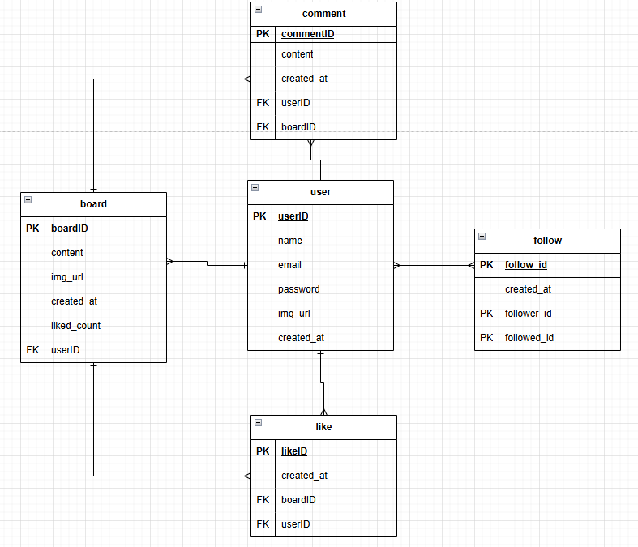

## 💡 **정규화(Normalization)**

> 정규화 = 데이터 정리정돈
>
> 중복을 최소화하고, 데이터의 무결성을 보장하기 위해 테이블 구조를 체계적으로 나누는 과정입니다.

---

### ⚠️ **정규화하지 않았을 때의 문제**

```sql
-- 정규화되지 않은 주문 테이블 예시
+----------+----------+----------+----------------+
| 주문번호 | 고객명   | 고객전화 | 상품목록       |
+----------+----------+----------+----------------+
| 1        | 홍길동   | 010-1111 | 노트북, 마우스 |
| 2        | 김영희   | 010-2222 | 키보드         |
| 3        | 홍길동   | 010-1111 | 모니터         |
+----------+----------+----------+----------------+
```

- 🔁 **중복** : `홍길동` 정보가 여러 행에 반복 저장
- 🧩 **수정 이상** : 전화번호 바꾸려면 모든 행을 수정해야 함
- 🗑 **삭제 이상** : 주문 삭제 시 고객 정보까지 사라짐
- 🚫 **삽입 이상** : 주문이 없으면 고객 정보를 추가할 수 없음

---

## ✅ **데이터 무결성 (Data Integrity)**

| 구분                                    | 설명                                    |
| --------------------------------------- | --------------------------------------- |
| **개체 무결성 (Entity Integrity)**      | 각 행(Row)은 고유해야 함 (PK 중복 불가) |
| **참조 무결성 (Referential Integrity)** | FK는 존재하는 PK만 참조 가능            |
| **도메인 무결성 (Domain Integrity)**    | 속성값은 정의된 범위 내여야 함          |

---

## 🧩 **정규형 요약 및 예시**

---

### **1️⃣ 제1정규형 (1NF) — 원자값(Atomic Value)**

> 모든 속성(열)은 더 이상 쪼갤 수 없는 단일값(Atomic Value) 을 가져야 한다.

### ❌ 정규화 전

| 고객명 | 연락처   | 구매상품       |
| ------ | -------- | -------------- |
| 홍길동 | 010-1111 | 노트북, 마우스 |

### ✅ 정규화 후

| 고객명 | 연락처   | 구매상품 |
| ------ | -------- | -------- |
| 홍길동 | 010-1111 | 노트북   |
| 홍길동 | 010-1111 | 마우스   |

👉 **복합 데이터(쉼표로 구분된 데이터)를 분리**

---

### **2️⃣ 제2정규형 (2NF) — 부분 종속 제거**

> 기본키(PK)의 일부에만 종속된 컬럼을 제거 (복합키 사용하는 경우에 해당)

### ❌ 정규화 전 (복합키: 주문번호 + 상품번호)

| 주문번호 | 상품번호 | 상품명 | 고객명 |
| -------- | -------- | ------ | ------ |
| 1        | A1       | 노트북 | 홍길동 |
| 1        | A2       | 마우스 | 홍길동 |

👉 `고객명`은 `주문번호`에만 종속되고 `상품번호`와는 무관함

### ✅ 정규화 후

**주문 테이블**

| 주문번호 | 고객명 |
| -------- | ------ |
| 1        | 홍길동 |

**주문상품 테이블**

| 주문번호 | 상품번호 | 상품명 |
| -------- | -------- | ------ |
| 1        | A1       | 노트북 |
| 1        | A2       | 마우스 |

👉 **주문과 상품 테이블을 분리하여 중복 제거**

---

### **3️⃣ 제3정규형 (3NF) — 이행 종속 제거**

> 기본키가 아닌 컬럼이 다른 컬럼에 종속될 경우 제거해야 함

### ❌ 정규화 전

| 고객ID | 고객명 | 지역코드 | 지역명 |
| ------ | ------ | -------- | ------ |
| 1      | 홍길동 | 02       | 서울   |
| 2      | 김영희 | 051      | 부산   |

👉 `지역명`은 `고객ID` → `지역코드` → `지역명` 으로 종속됨 (이행적 종속)

### ✅ 정규화 후

**고객 테이블**

| 고객ID | 고객명 | 지역코드 |
| ------ | ------ | -------- |
| 1      | 홍길동 | 02       |
| 2      | 김영희 | 051      |

**지역 테이블**

| 지역코드 | 지역명 |
| -------- | ------ |
| 02       | 서울   |
| 051      | 부산   |

👉 **비핵심 컬럼 간의 종속 관계 제거**

---

## 🧩 **SNS 시스템 요구사항 분석**

### **사용자 관리**

- 사용자는 사용자ID, 이름, 이메일, 비밀번호, 프로필사진URL, 가입일을 가진다
- 사용자ID와 이메일은 중복될 수 없다
- 사용자는 다른 사용자를 팔로우할 수 있다
- 사용자는 자신을 팔로우한 사람 목록(팔로워)을 볼 수 있다

### **게시글 관리**

- 게시글은 게시글번호, 내용, 이미지URL, 작성일시를 가진다
- 한 사용자는 여러 개의 게시글을 작성할 수 있다
- 게시글은 반드시 한 명의 사용자에게 속한다
- 게시글에는 좋아요 수가 표시된다

### **댓글 관리**

- 댓글은 댓글번호, 내용, 작성일시를 가진다
- 한 게시글에 여러 개의 댓글이 달릴 수 있다
- 댓글은 반드시 한 개의 게시글에 속한다
- 한 사용자는 여러 개의 댓글을 작성할 수 있다

### **좋아요 관리**

- 사용자는 여러 게시글에 좋아요를 누를 수 있다
- 한 게시글에는 여러 사용자가 좋아요를 누를 수 있다
- 같은 사용자가 같은 게시글에 좋아요를 중복으로 누를 수 없다
- 좋아요는 누른 시간 정보를 가진다

### **팔로우 관리**

- 팔로우 관계는 팔로우한 날짜 정보를 가진다

https://app.diagrams.net/




## 🧑‍💼 **user (사용자)**

| user_id | name   | email               | password    | img_url                                      | created_at          |
| ------- | ------ | ------------------- | ----------- | -------------------------------------------- | ------------------- |
| 1       | 홍길동 | qwe234@naver.com    | \*!@#!@#    | https://example.com/images/laptop_main.jpg   | 2012-04-13 13:45:23 |
| 2       | 김덕배 | asd@gmail.com       | $%$%^$%     | https://example.com/images/phone_primary.png | 2011-09-23 09:12:56 |
| 3       | 호날두 | zxc123@gmail.com    | &_(&_(&\*%^ | https://example.com/images/headphones.webp   | 2020-11-07 20:31:31 |
| 4       | 메시   | kjh93@hotmail.com   | @#$#$%$$    | https://example.com/images/boots_sole.jpg    | 2019-07-30 17:27:01 |
| 5       | 손흥민 | opifjg456@gmail.com | #$%^^&&^^   | https://example.com/images/boots_side.jpg    | 2016-06-06 10:55:59 |

---

## 📝 **board (게시글)**

| board_id | user_id | content               | img_url                                      | created_at          | liked_count |
| -------- | ------- | --------------------- | -------------------------------------------- | ------------------- | ----------- |
| 1        | 2       | hello world           | https://example.com/images/laptop_main.jpg   | 2013-09-23 09:12:56 | 3           |
| 2        | 5       | 데이터 베이스 수업중~ | _(NULL)_                                     | 2017-04-13 13:45:23 | 1           |
| 3        | 1       | 게시판 샘플 데이터1   | https://example.com/images/phone_primary.png | 2013-04-13 13:45:23 | 0           |
| 4        | 1       | 게시판 샘플 데이터 2  | _(NULL)_                                     | 2013-05-13 13:45:23 | 0           |
| 5        | 3       | 게시판 샘플 데이터 3  | _(NULL)_                                     | 2021-11-07 20:31:31 | 1           |

---

## 💬 **comment (댓글)**

| comment_id | user_id | board_id | content                    | created_at          |
| ---------- | ------- | -------- | -------------------------- | ------------------- |
| 1          | 2       | 1        | 내가 쓴 글에 댓글 달아볼게 | 2013-09-23 09:12:56 |
| 2          | 3       | 4        | 나는야 호날두              | 2023-11-07 20:31:31 |
| 3          | 3       | 4        | 호날두 댓글 또 달아요      | 2023-11-07 20:35:31 |
| 4          | 4       | 1        | 안녕 나 메시야             | 2019-07-30 17:27:01 |
| 5          | 5       | 3        | 안뇽하세요 손흥민입니다    | 2017-06-06 10:55:59 |

---

## ❤️ **like (좋아요)**

| like_id | user_id | board_id | created_at          |
| ------- | ------- | -------- | ------------------- |
| 1       | 2       | 1        | 2023-09-23 09:12:56 |
| 2       | 3       | 1        | 2022-07-23 09:12:56 |
| 3       | 5       | 2        | 2019-04-13 13:45:23 |
| 4       | 5       | 1        | 2024-10-03 09:12:56 |
| 5       | 1       | 5        | 2024-12-07 20:31:31 |

---

## 🔁 **follow (팔로우)**

| follow_id | following_user_id | follower_user_id | created_at          |
| --------- | ----------------- | ---------------- | ------------------- |
| 1         | 5                 | 3                | 2012-04-13 13:45:23 |
| 2         | 2                 | 3                | 2011-09-23 09:12:56 |
| 3         | 2                 | 5                | 2020-11-07 20:31:31 |
| 4         | 1                 | 4                | 2019-07-30 17:27:01 |
| 5         | 4                 | 5                | 2016-06-06 10:55:59 |
