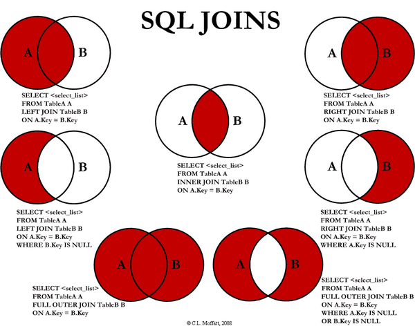

[ 사진 참조]

https://blog.advenoh.pe.kr/%EA%B4%80%EA%B3%84%ED%98%95-%EB%8D%B0%EC%9D%B4%ED%84%B0%EB%B2%A0%EC%9D%B4%EC%8A%A4%EC%97%90%EC%84%9C-%EC%A1%B0%EC%9D%B8-join%EC%9D%B4%EB%9E%80/



# 🧩 MySQL JOIN 완벽 정리

> ✅ 실습 데이터베이스
>
> `world`, `sakila`

---

## 1️⃣ INNER JOIN (교집합)

> 두 테이블 모두에 일치하는 데이터만 조회합니다.
>
> 즉, **양쪽 테이블 모두에 존재하는 행만** 결과에 포함됩니다.

```sql
USE world;

SELECT
	ci.Name AS 도시명,
    co.Name AS 나라이름,
    co.Continent AS 대륙,
    ci.Population AS 도시인구,
    co.Population AS 국가인구,
    ROUND(ci.Population / co.Population * 100, 2) AS 도시인구비율
FROM city ci
INNER JOIN country co
ON ci.CountryCode = co.Code
WHERE co.Name = 'South Korea'
ORDER BY 도시인구비율 DESC;

```

🧠 **핵심 포인트**

- `ON` 조건을 기준으로 두 테이블 결합
- 일치하지 않는 데이터는 제외
- 실무에서는 보통 FK(외래키)를 기준으로 JOIN

---

## 2️⃣ GROUP BY + JOIN 예제

> 국가별, 대륙별 집계 예제

### 🌍 국가별 도시 개수

```sql
SELECT
	co.Name AS 나라이름,
    COUNT(*) AS 도시개수
FROM city ci
INNER JOIN country co
ON ci.CountryCode = co.Code
GROUP BY co.Name
ORDER BY 도시개수 DESC;

```

### 🗺️ 대륙별 도시 통계

```sql
SELECT
	co.Continent AS 대륙,
    COUNT(*) AS 도시수,
    ROUND(AVG(ci.Population), 2) AS 평균도시인구
FROM city ci
INNER JOIN country co
ON ci.CountryCode = co.Code
GROUP BY co.Continent;

```

---

## 3️⃣ LEFT JOIN (왼쪽 테이블 기준)

> 왼쪽 테이블의 모든 데이터를 유지하면서,
>
> 오른쪽 테이블에 일치하는 데이터가 있으면 함께 표시합니다.

```sql
SELECT
	co.Name AS 국가명,
    ci.Name AS 도시명
FROM country co
LEFT JOIN city ci
ON co.Code = ci.CountryCode
ORDER BY co.Population DESC;

```

🧠 **핵심**

- 왼쪽(`country`)은 모두 표시됨
- 오른쪽(`city`)에 없으면 `NULL`로 표시

---

## 4️⃣ RIGHT JOIN (오른쪽 테이블 기준)

> 오른쪽 테이블의 모든 데이터를 유지하면서,
>
> 왼쪽 테이블에 일치하는 데이터가 있으면 함께 표시합니다.

```sql
SELECT
	co.Name AS 국가명,
    ci.Name AS 도시명
FROM country co
RIGHT JOIN city ci
ON co.Code = ci.CountryCode
ORDER BY co.Population DESC;

```

🧠 **핵심**

- `LEFT JOIN`의 반대 개념
- MySQL에서는 거의 `LEFT JOIN`으로 대체 가능

---

## 5️⃣ FULL OUTER JOIN (MySQL에서는 직접 구현)

> MySQL은 FULL OUTER JOIN을 지원하지 않음
>
> → 대신 `LEFT JOIN + RIGHT JOIN + UNION`으로 구현 가능

```sql
SELECT
    co.Name AS 국가명,
    ci.Name AS 도시명
FROM country co
LEFT JOIN city ci ON co.Code = ci.CountryCode

UNION

SELECT
    co.Name AS 국가명,
    ci.Name AS 도시명
FROM country co
RIGHT JOIN city ci ON co.Code = ci.CountryCode
LIMIT 50;

```

🧠 **핵심**

- 두 테이블의 **모든 데이터**를 포함
- 중복된 행은 `UNION`으로 자동 제거

---

## 6️⃣ SELF JOIN (자기 자신과 조인)

> 같은 테이블을 스스로와 조인하는 방식입니다.
>
> 주로 **같은 그룹이나 조건을 가진 행끼리 비교**할 때 사용합니다.

```sql
SELECT
	c1.Name AS 도시1,
    c2.Name AS 도시2
FROM city c1
INNER JOIN city c2
ON c1.CountryCode = c2.CountryCode
WHERE c1.CountryCode = 'KOR';

```

🧠 **핵심**

- 같은 테이블에 별칭을 주어 `c1`, `c2`로 구분
- `c1.ID < c2.ID` 조건을 추가하면 중복 제거 가능

---

## 7️⃣ 다중 JOIN (3개 이상 테이블)

> 여러 테이블을 순차적으로 연결할 수 있습니다.

```sql
SELECT
	*
FROM country co
INNER JOIN city ci ON co.Code = ci.CountryCode
INNER JOIN countrylanguage cl ON ci.CountryCode = cl.CountryCode;

```

🧠 **핵심**

- JOIN은 순서대로 적용
- 각 단계마다 `ON` 조건을 명확히 지정

---

# 🎬 `sakila` 데이터베이스 실습

---

## 🎥 영화와 언어 조인

```sql
SELECT
	f.title AS 영화제목,
    l.name AS 언어
FROM film f
INNER JOIN language l
ON f.language_id = l.language_id;

```

---

## 🎞️ 영화와 카테고리 조인

```sql
SELECT
	f.title AS 영화제목,
    c.name AS 카테고리,
    f.rental_rate AS 대여료
FROM film f
INNER JOIN film_category fc ON f.film_id = fc.film_id
INNER JOIN category c ON fc.category_id = c.category_id;

```

---

## 👤 고객과 대여 내역 (LEFT JOIN)

```sql
SELECT
	c.first_name,
    c.last_name,
    r.rental_id,
    r.rental_date
FROM customer c
LEFT JOIN rental r ON c.customer_id = r.customer_id;

```

---

## 📊 고객별 대여 횟수

```sql
SELECT
	c.customer_id,
    CONCAT(c.first_name, "_" ,c.last_name) AS full_name,
    COUNT(*)
FROM customer c
LEFT JOIN rental r ON c.customer_id = r.customer_id
GROUP BY c.customer_id
ORDER BY COUNT(*) DESC;
```

---

## ⏱️ 같은 상영 시간의 영화 쌍 찾기

```sql
SELECT
	f1.title AS 영화1,
    f2.title AS 영화2,
    f1.length AS 상영시간
FROM film f1
INNER JOIN film f2 ON f1.length = f2.length
WHERE f1.film_id < f2.film_id -- 중복 제거
ORDER BY f1.length DESC
LIMIT 10;

```

🧠 **핵심**

- 자기 자신과 JOIN (SELF JOIN 형태)
- `<` 조건으로 중복 쌍 제거

---

# 🧭 JOIN 요약표

| JOIN 종류           | 포함 데이터      | 설명                   |
| ------------------- | ---------------- | ---------------------- |
| **INNER JOIN**      | 양쪽 일치 행     | 교집합                 |
| **LEFT JOIN**       | 왼쪽 + 일치 행   | 왼쪽 기준              |
| **RIGHT JOIN**      | 오른쪽 + 일치 행 | 오른쪽 기준            |
| **FULL OUTER JOIN** | 양쪽 모든 행     | MySQL은 UNION으로 구현 |
| **SELF JOIN**       | 자기 자신        | 같은 테이블 비교       |
| **MULTI JOIN**      | 3개 이상 테이블  | 단계별 결합            |

---

# 🧩 서브쿼리 (Subquery)

> **서브쿼리(Subquery)**란
>
> 하나의 SQL 문 안에 포함된 **다른 SELECT 문**으로,
>
> **다른 쿼리의 결과를 조건으로 활용**할 때 사용합니다.

---

## 🧠 서브쿼리 종류

| 구분                            | 설명                            | 반환 행 수 | 예시 키워드                  |
| ------------------------------- | ------------------------------- | ---------- | ---------------------------- |
| **단일 행 서브쿼리**            | 한 개의 결과만 반환             | 1개        | `=`, `>`, `<`, `>=`, `<=`    |
| **다중 행 서브쿼리**            | 여러 개의 결과 반환             | 여러 행    | `IN`, `ANY`, `ALL`, `EXISTS` |
| **인라인 뷰 (FROM절 서브쿼리)** | 서브쿼리를 가상 테이블처럼 사용 | 여러 행    | `FROM (SELECT ...) AS 별칭`  |

---

## 🧩 1️⃣ 단일 행 서브쿼리 (Single-Row Subquery)

> 서브쿼리가 하나의 결과값만 반환할 때 사용합니다.

```sql
-- 서울의 인구보다 많은 도시 조회
SELECT *
FROM city
WHERE Population > (
    SELECT Population FROM city WHERE Name = 'SEOUL'
);
```

```sql
-- 평균 인구보다 많은 국가 조회
SELECT
    Name, Population
FROM country
WHERE Population > (
    SELECT AVG(Population) FROM country
)
ORDER BY Population DESC;
```

---

## 🧩 2️⃣ 다중 행 서브쿼리 (Multi-Row Subquery)

> 서브쿼리가 여러 행을 반환할 때 사용합니다.
>
> `IN`, `NOT IN`, `ANY`, `ALL` 등을 함께 활용합니다.

### ✅ `IN`

```sql
-- 아시아 대륙의 모든 도시 조회
SELECT
    Name, CountryCode, Population
FROM city
WHERE CountryCode IN (
    SELECT Code FROM country WHERE Continent = 'Asia'
);
```

---

### ❌ `NOT IN`

```sql
-- 도시가 하나도 없는 국가 조회
SELECT *
FROM country
WHERE Code NOT IN (
    SELECT DISTINCT CountryCode FROM city
);
```

---

### 🟡 `ANY`

```sql
-- 유럽의 어떤 국가보다 인구가 많은 아시아 국가
SELECT
    Name AS 국가명,
    Population AS 인구
FROM country
WHERE
    Continent = 'Asia'
    AND Population > ANY (
        SELECT Population FROM country WHERE Continent = 'Europe'
    )
ORDER BY Population DESC
LIMIT 10;
```

---

### 🔵 `ALL`

```sql
-- 유럽의 모든 국가보다 인구가 많은 아시아 국가
SELECT
    Name AS 국가명,
    Population AS 인구
FROM country
WHERE
    Continent = 'Asia'
    AND Population > ALL (
        SELECT Population FROM country WHERE Continent = 'Europe'
    )
ORDER BY Population DESC;
```

---

### 🟢 `EXISTS`

```sql
-- 도시가 등록된 국가만 조회 (존재 여부 확인)
SELECT
    Name AS 국가명,
    Continent AS 대륙,
    Population AS 인구
FROM country co
WHERE EXISTS (
    SELECT 1 FROM city ci WHERE ci.CountryCode = co.Code
)
ORDER BY Population DESC
LIMIT 10;
```

---

## 🧩 3️⃣ FROM절 서브쿼리 (인라인 뷰)

> 서브쿼리를 가상 테이블처럼 사용합니다.

```sql
SELECT *
FROM (
    SELECT Continent, COUNT(*) AS co_count
    FROM country
    GROUP BY Continent
) AS continent_table
WHERE co_count > 40;
```

---

## ⚖️ 4️⃣ JOIN vs 서브쿼리

> 같은 결과를 다른 방식으로 표현할 수 있습니다.

```sql
-- (1) 서브쿼리 방식: 아시아 국가의 도시
SELECT Name
FROM city
WHERE CountryCode IN (
    SELECT Code FROM country WHERE Continent = 'Asia'
)
LIMIT 10;
```

```sql
-- (2) JOIN 방식
SELECT ci.Name
FROM city ci
INNER JOIN country co ON ci.CountryCode = co.Code
WHERE co.Continent = 'Asia'
LIMIT 10;
```

| 비교 항목     | 서브쿼리                      | JOIN                     |
| ------------- | ----------------------------- | ------------------------ |
| **가독성**    | 간단한 조건일 때 좋음         | 여러 테이블 결합 시 명확 |
| **성능**      | 상황에 따라 느릴 수 있음      | 인덱스 최적화에 유리     |
| **사용 예시** | `WHERE`, `HAVING` 절에서 사용 | 다중 테이블 관계 조회    |

---

## 📘 핵심 요약

| 키워드              | 의미                           | 사용 목적       |
| ------------------- | ------------------------------ | --------------- |
| `IN`                | 서브쿼리 결과 중 하나라도 일치 | 다중 행 비교    |
| `NOT IN`            | 서브쿼리 결과와 일치하지 않음  | 제외 조건       |
| `ANY`               | 하나라도 조건 만족 시 TRUE     | 부분 비교       |
| `ALL`               | 모든 조건 만족 시 TRUE         | 완전 비교       |
| `EXISTS`            | 행 존재 여부만 확인            | 존재성 검증     |
| `FROM (SELECT ...)` | 가상 테이블로 사용             | 집계, 통계 분석 |

---

# 🎬서브쿼리 실습 (Sakila 예제)

> 아래 예제들은 sakila 데이터베이스를 기반으로
>
> 서브쿼리를 이용해 **조건 비교 / 데이터 필터링 / 집계** 등을 수행하는 연습입니다.

---

## 🎯 1️⃣ 평균 대여료(`rental_rate`)보다 비싼 영화 조회

> 단일 행 서브쿼리 (Single-Row Subquery)
>
> 서브쿼리에서 평균 대여료(`AVG(rental_rate)`)를 구하고,
>
> 메인쿼리에서 그보다 비싼 영화만 필터링합니다.

```sql
USE sakila;

SELECT
    title, rental_rate
FROM film
WHERE rental_rate > (
    SELECT ROUND(AVG(rental_rate), 2) FROM film
)
ORDER BY rental_rate DESC
LIMIT 10;
```

📘 **설명**

- `ROUND(AVG(rental_rate), 2)` → 평균 대여료를 소수 둘째 자리로 반올림
- `>` → 평균보다 높은 값만 선택
- `ORDER BY rental_rate DESC` → 비싼 영화부터 정렬
- `LIMIT 10` → 상위 10개만 출력

---

## ⚔️ 2️⃣ ‘Action’ 카테고리에 속한 영화 조회

> 다중 행 서브쿼리 (Multi-Row Subquery)
>
> 서브쿼리를 중첩해 “Action 카테고리의 film_id”를 찾고,
>
> 그 결과를 이용해 `film` 테이블에서 해당 영화 목록을 조회합니다.

```sql
SELECT
    title
FROM film
WHERE film_id IN (
    SELECT film_id
    FROM film_category
    WHERE category_id = (
        SELECT category_id
        FROM category
        WHERE name = 'Action'
    )
);
```

📘 **설명**

- **2단 서브쿼리**
  1️⃣ `category` 테이블에서 ‘Action’의 `category_id` 찾기
  2️⃣ `film_category`에서 해당 `category_id`에 속한 `film_id` 찾기
- **메인쿼리** → `film` 테이블에서 `film_id`로 영화 제목 가져오기

---

## 👥 3️⃣ 대여 기록이 있는 고객만 조회

> EXISTS 서브쿼리 (존재 여부 확인)
>
> `rental` 테이블에 고객의 대여 기록이 존재하면 참(`TRUE`)으로 간주합니다.

```sql
SELECT
    first_name, last_name, email
FROM customer
WHERE EXISTS (
    SELECT *
    FROM rental
    WHERE customer.customer_id = rental.customer_id
);
```

📘 **설명**

- `EXISTS`는 **행의 존재 여부만** 확인 (값 비교 X)
- 조건을 만족하는 데이터가 하나라도 존재하면 `TRUE`
- `EXISTS`는 `IN`보다 **성능이 더 좋음** (특히 대량 데이터 시)

---

## 📈 4️⃣ 고객별 대여 횟수 계산 후, 30회 이상 고객만 조회

> FROM 절의 서브쿼리 (인라인 뷰)
>
> 서브쿼리에서 고객별 대여 횟수를 집계하고,
>
> 그 결과를 메인쿼리에서 조건 필터링합니다.

```sql
SELECT
    c_name, c_id, c_count
FROM (
    SELECT
        CONCAT(c.first_name, "_", c.last_name) AS c_name,
        c.customer_id AS c_id,
        COUNT(*) AS c_count
    FROM customer c
    INNER JOIN rental r
        ON c.customer_id = r.customer_id
    GROUP BY c.customer_id
) AS customer_rental
WHERE c_count >= 30
ORDER BY c_count DESC;
```

📘 **설명**

- `INNER JOIN` → 고객과 대여기록 연결
- `COUNT(*)` → 고객별 대여 횟수 계산
- `FROM (...)` → 결과를 **가상 테이블(customer_rental)** 로 활용
- `WHERE c_count >= 30` → 대여 30회 이상인 고객만 표시

---

## 🧠 정리 요약

| 구분             | 서브쿼리 위치       | 예제                   | 특징             |
| ---------------- | ------------------- | ---------------------- | ---------------- |
| 단일 행 서브쿼리 | `WHERE`             | 평균보다 비싼 영화     | 결과 1행         |
| 다중 행 서브쿼리 | `WHERE IN`          | ‘Action’ 카테고리 영화 | 결과 여러 행     |
| 존재 여부        | `WHERE EXISTS`      | 대여 기록이 있는 고객  | 존재만 확인      |
| 인라인 뷰        | `FROM (SELECT ...)` | 30회 이상 대여 고객    | 가상 테이블 활용 |

---

# ⚡ INDEX & VIEW 정리

> 효율적인 데이터베이스 조회와 관리의 핵심 도구
>
> 👉 **INDEX(검색 성능 향상)** + **VIEW(가상 테이블)**

---

## 🧩 INDEX (인덱스)

### 📖 1️⃣ 개념

> **인덱스(index)**는 데이터베이스 검색 속도를 향상시키기 위한 자료구조입니다.
>
> 책의 "색인(index)"과 같은 개념으로, 원하는 데이터를 **빠르게 탐색**할 수 있게 합니다.

---

### ⚙️ 2️⃣ 특징

| 구분          | 설명                                                                   |
| ------------- | ---------------------------------------------------------------------- |
| **목적**      | 검색 속도 향상, 효율적인 데이터 접근                                   |
| **기본 구조** | B-Tree (Binary Tree)                                                   |
| **적용 대상** | 자주 조회되는 컬럼 (`WHERE`, `JOIN`, `ORDER BY`에 자주 사용)           |
| **단점**      | - INSERT/UPDATE/DELETE 시 인덱스 갱신 비용 발생- 너무 많으면 성능 저하 |

---

### 🧠 3️⃣ 주요 명령어 & 실습

### 🔍 인덱스 조회

```sql
USE world;
SHOW INDEX FROM city;
```

### 📋 테이블 구조 확인

```sql
DESC city;
```

### 🧱 인덱스 생성

```sql
CREATE INDEX idx_city_name ON city(Name);
```

> ✅ idx_city_name : 인덱스 이름
>
> ✅ `city(Name)` : 인덱스를 적용할 테이블과 컬럼

### 🚀 인덱스 적용 여부 확인 (`EXPLAIN`)

```sql
EXPLAIN SELECT * FROM city WHERE Name = 'Seoul';
```

> EXPLAIN은 쿼리 실행 계획을 보여줍니다.
>
> `key` 컬럼에 `idx_city_name`이 표시되면 인덱스가 사용된 것!

### 🗑️ 인덱스 삭제

```sql
DROP INDEX idx_city_name ON city;
SHOW INDEX FROM city;
```

---

### 🧩 인덱스 정리 요약

| 명령어                                   | 설명                              |
| ---------------------------------------- | --------------------------------- |
| `SHOW INDEX FROM table`                  | 인덱스 목록 확인                  |
| `CREATE INDEX idx_name ON table(column)` | 인덱스 생성                       |
| `EXPLAIN SELECT ...`                     | 실행 계획 확인 (인덱스 사용 여부) |
| `DROP INDEX idx_name ON table`           | 인덱스 삭제                       |

---

## 🧱 VIEW (뷰)

### 📖 1️⃣ 개념

> **뷰(View)**는 하나 이상의 테이블에서 데이터를 추출하여 만든
>
> **가상의 테이블(Virtual Table)** 입니다.
>
> 실제 데이터를 저장하지 않고, 정의된 **SELECT 문을 저장**한 객체입니다.

---

### ⚙️ 2️⃣ 뷰의 장점

| 구분         | 설명                                          |
| ------------ | --------------------------------------------- |
| **재사용성** | 복잡한 쿼리를 뷰로 만들어 간단히 호출 가능    |
| **보안성**   | 민감한 컬럼을 제외하고 접근 권한 부여 가능    |
| **독립성**   | 원본 테이블 변경 시에도 동일한 구조 유지 가능 |

---

### 🧠 3️⃣ 주요 명령어 & 실습

### ✅ 뷰 생성 (단순 뷰)

```sql
CREATE VIEW large_country AS
SELECT *
FROM country
WHERE Population >= 50000000;
```

```sql
SELECT * FROM large_country;
```

> large_country 뷰는 인구 5천만 이상 국가만 조회하는 가상 테이블입니다.

---

### ✅ 다중 테이블 조인 뷰

```sql
CREATE VIEW country_view AS
SELECT
    co.Name AS co_name,
    ci.Name AS ci_name
FROM country co
INNER JOIN city ci
ON co.Code = ci.CountryCode;

SELECT * FROM country_view;
```

> country_view는 국가명과 도시명을 연결한 조인 뷰입니다.

---

### 🔎 뷰 목록 조회

```sql
SHOW FULL TABLES WHERE Table_type = 'VIEW';
```

### 🗑️ 뷰 삭제

```sql
DROP VIEW large_country;
```

---

### 🧩 VIEW 정리 요약

| 명령어                                     | 설명           |
| ------------------------------------------ | -------------- |
| `CREATE VIEW view_name AS SELECT ...`      | 뷰 생성        |
| `SELECT * FROM view_name`                  | 뷰 데이터 조회 |
| `SHOW FULL TABLES WHERE Table_type='VIEW'` | 뷰 목록 조회   |
| `DROP VIEW view_name`                      | 뷰 삭제        |

---

## ⚙️ INDEX vs VIEW 비교

| 항목                 | INDEX                | VIEW                     |
| -------------------- | -------------------- | ------------------------ |
| **목적**             | 검색 속도 향상       | 쿼리 단순화, 재사용      |
| **저장 형태**        | 실제 인덱스 파일     | 가상 테이블 (SELECT 문)  |
| **데이터 저장 여부** | O (메타 정보 저장)   | X (쿼리 정의만 저장)     |
| **성능 영향**        | 검색 빠름, 수정 느림 | 실행 시 원본 테이블 접근 |
| **활용 예시**        | 자주 조회되는 컬럼   | 복잡한 조인/집계 쿼리    |

---

💡 **추가 팁**

- 인덱스는 “자주 검색되는 컬럼”에만 설정하세요.
  너무 많으면 오히려 `INSERT`, `UPDATE`, `DELETE` 성능이 떨어집니다.
- 뷰는 “공통 쿼리”나 “민감한 데이터 제외용”으로 사용하면 유지보수에 유리합니다.
