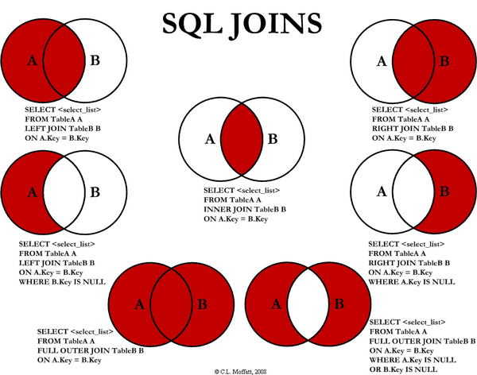

[ 사진 참조]

https://blog.advenoh.pe.kr/%EA%B4%80%EA%B3%84%ED%98%95-%EB%8D%B0%EC%9D%B4%ED%84%B0%EB%B2%A0%EC%9D%B4%EC%8A%A4%EC%97%90%EC%84%9C-%EC%A1%B0%EC%9D%B8-join%EC%9D%B4%EB%9E%80/



# 🧩 MySQL JOIN 완벽 정리

> ✅ 실습 데이터베이스
>
> `world`, `sakila`

---

## 1️⃣ INNER JOIN (교집합)

> 두 테이블 모두에 일치하는 데이터만 조회합니다.
>
> 즉, **양쪽 테이블 모두에 존재하는 행만** 결과에 포함됩니다.

```sql
USE world;

SELECT
	ci.Name AS 도시명,
    co.Name AS 나라이름,
    co.Continent AS 대륙,
    ci.Population AS 도시인구,
    co.Population AS 국가인구,
    ROUND(ci.Population / co.Population * 100, 2) AS 도시인구비율
FROM city ci
INNER JOIN country co
ON ci.CountryCode = co.Code
WHERE co.Name = 'South Korea'
ORDER BY 도시인구비율 DESC;

```

🧠 **핵심 포인트**

- `ON` 조건을 기준으로 두 테이블 결합
- 일치하지 않는 데이터는 제외
- 실무에서는 보통 FK(외래키)를 기준으로 JOIN

---

## 2️⃣ GROUP BY + JOIN 예제

> 국가별, 대륙별 집계 예제

### 🌍 국가별 도시 개수

```sql
SELECT
	co.Name AS 나라이름,
    COUNT(*) AS 도시개수
FROM city ci
INNER JOIN country co
ON ci.CountryCode = co.Code
GROUP BY co.Name
ORDER BY 도시개수 DESC;

```

### 🗺️ 대륙별 도시 통계

```sql
SELECT
	co.Continent AS 대륙,
    COUNT(*) AS 도시수,
    ROUND(AVG(ci.Population), 2) AS 평균도시인구
FROM city ci
INNER JOIN country co
ON ci.CountryCode = co.Code
GROUP BY co.Continent;

```

---

## 3️⃣ LEFT JOIN (왼쪽 테이블 기준)

> 왼쪽 테이블의 모든 데이터를 유지하면서,
>
> 오른쪽 테이블에 일치하는 데이터가 있으면 함께 표시합니다.

```sql
SELECT
	co.Name AS 국가명,
    ci.Name AS 도시명
FROM country co
LEFT JOIN city ci
ON co.Code = ci.CountryCode
ORDER BY co.Population DESC;

```

🧠 **핵심**

- 왼쪽(`country`)은 모두 표시됨
- 오른쪽(`city`)에 없으면 `NULL`로 표시

---

## 4️⃣ RIGHT JOIN (오른쪽 테이블 기준)

> 오른쪽 테이블의 모든 데이터를 유지하면서,
>
> 왼쪽 테이블에 일치하는 데이터가 있으면 함께 표시합니다.

```sql
SELECT
	co.Name AS 국가명,
    ci.Name AS 도시명
FROM country co
RIGHT JOIN city ci
ON co.Code = ci.CountryCode
ORDER BY co.Population DESC;

```

🧠 **핵심**

- `LEFT JOIN`의 반대 개념
- MySQL에서는 거의 `LEFT JOIN`으로 대체 가능

---

## 5️⃣ FULL OUTER JOIN (MySQL에서는 직접 구현)

> MySQL은 FULL OUTER JOIN을 지원하지 않음
>
> → 대신 `LEFT JOIN + RIGHT JOIN + UNION`으로 구현 가능

```sql
SELECT
    co.Name AS 국가명,
    ci.Name AS 도시명
FROM country co
LEFT JOIN city ci ON co.Code = ci.CountryCode

UNION

SELECT
    co.Name AS 국가명,
    ci.Name AS 도시명
FROM country co
RIGHT JOIN city ci ON co.Code = ci.CountryCode
LIMIT 50;

```

🧠 **핵심**

- 두 테이블의 **모든 데이터**를 포함
- 중복된 행은 `UNION`으로 자동 제거

---

## 6️⃣ SELF JOIN (자기 자신과 조인)

> 같은 테이블을 스스로와 조인하는 방식입니다.
>
> 주로 **같은 그룹이나 조건을 가진 행끼리 비교**할 때 사용합니다.

```sql
SELECT
	c1.Name AS 도시1,
    c2.Name AS 도시2
FROM city c1
INNER JOIN city c2
ON c1.CountryCode = c2.CountryCode
WHERE c1.CountryCode = 'KOR';

```

🧠 **핵심**

- 같은 테이블에 별칭을 주어 `c1`, `c2`로 구분
- `c1.ID < c2.ID` 조건을 추가하면 중복 제거 가능

---

## 7️⃣ 다중 JOIN (3개 이상 테이블)

> 여러 테이블을 순차적으로 연결할 수 있습니다.

```sql
SELECT
	*
FROM country co
INNER JOIN city ci ON co.Code = ci.CountryCode
INNER JOIN countrylanguage cl ON ci.CountryCode = cl.CountryCode;

```

🧠 **핵심**

- JOIN은 순서대로 적용
- 각 단계마다 `ON` 조건을 명확히 지정

---

# 🎬 `sakila` 데이터베이스 실습

---

## 🎥 영화와 언어 조인

```sql
SELECT
	f.title AS 영화제목,
    l.name AS 언어
FROM film f
INNER JOIN language l
ON f.language_id = l.language_id;

```

---

## 🎞️ 영화와 카테고리 조인

```sql
SELECT
	f.title AS 영화제목,
    c.name AS 카테고리,
    f.replacement_cost AS 대여료
FROM film f
INNER JOIN film_category fc ON f.film_id = fc.film_id
INNER JOIN category c ON fc.category_id = c.category_id;

```

---

## 👤 고객과 대여 내역 (LEFT JOIN)

```sql
SELECT
	c.first_name,
    c.last_name,
    r.rental_id,
    r.rental_date
FROM customer c
LEFT JOIN rental r ON c.customer_id = r.customer_id;

```

---

## 📊 고객별 대여 횟수

```sql
SELECT
	CONCAT(c.first_name, "_", c.last_name) AS full_name,
    COUNT(r.rental_id) AS rentalCnt
FROM customer c
LEFT JOIN rental r ON c.customer_id = r.customer_id
GROUP BY full_name
ORDER BY rentalCnt DESC;

```

---

## ⏱️ 같은 상영 시간의 영화 쌍 찾기

```sql
SELECT
	f1.title AS 영화1,
    f2.title AS 영화2,
    f1.length AS 상영시간
FROM film f1
INNER JOIN film f2 ON f1.length = f2.length
WHERE f1.film_id < f2.film_id -- 중복 제거
ORDER BY f1.length DESC
LIMIT 10;

```

🧠 **핵심**

- 자기 자신과 JOIN (SELF JOIN 형태)
- `<` 조건으로 중복 쌍 제거

---

# 🧭 JOIN 요약표

| JOIN 종류           | 포함 데이터      | 설명                   |
| ------------------- | ---------------- | ---------------------- |
| **INNER JOIN**      | 양쪽 일치 행     | 교집합                 |
| **LEFT JOIN**       | 왼쪽 + 일치 행   | 왼쪽 기준              |
| **RIGHT JOIN**      | 오른쪽 + 일치 행 | 오른쪽 기준            |
| **FULL OUTER JOIN** | 양쪽 모든 행     | MySQL은 UNION으로 구현 |
| **SELF JOIN**       | 자기 자신        | 같은 테이블 비교       |
| **MULTI JOIN**      | 3개 이상 테이블  | 단계별 결합            |
