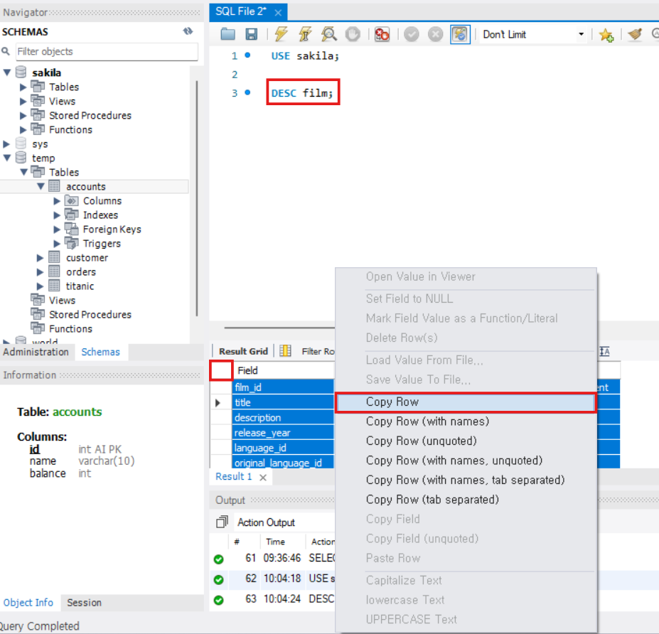
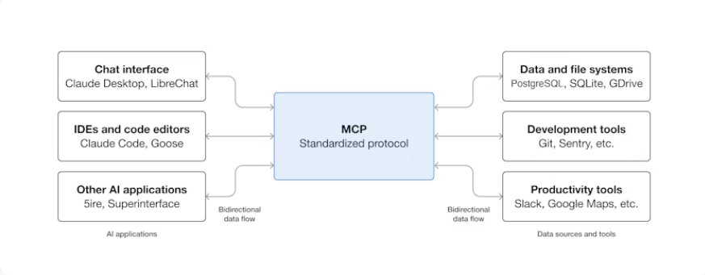
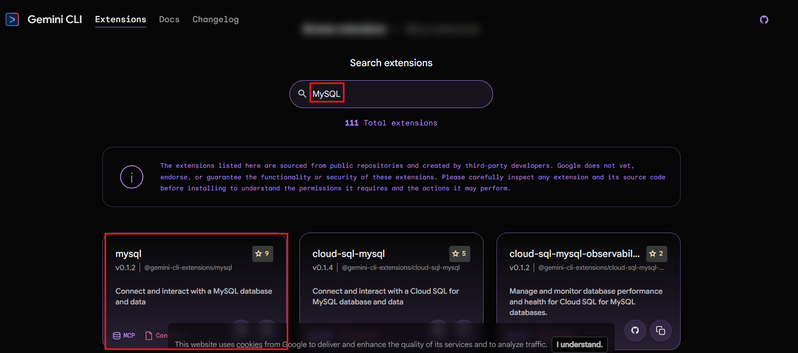
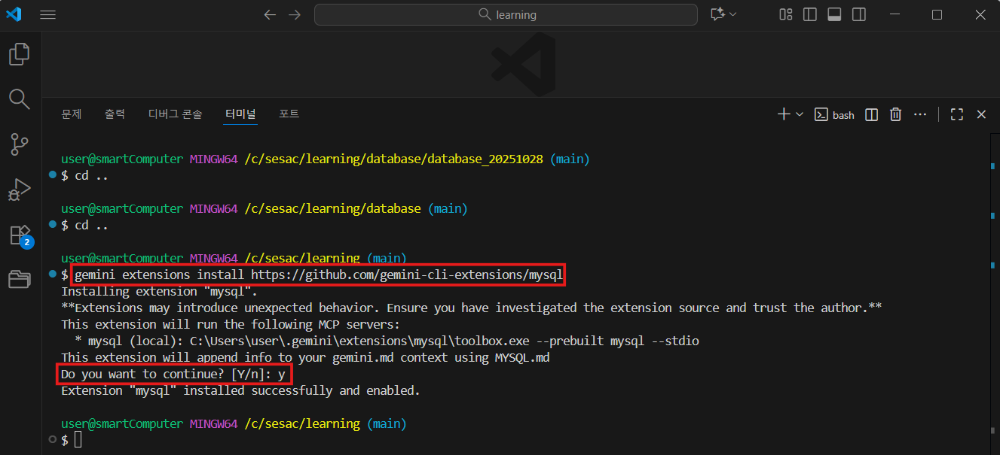
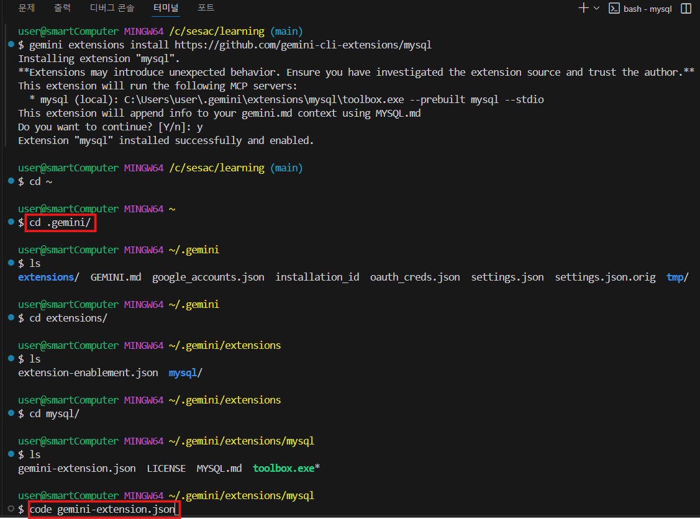
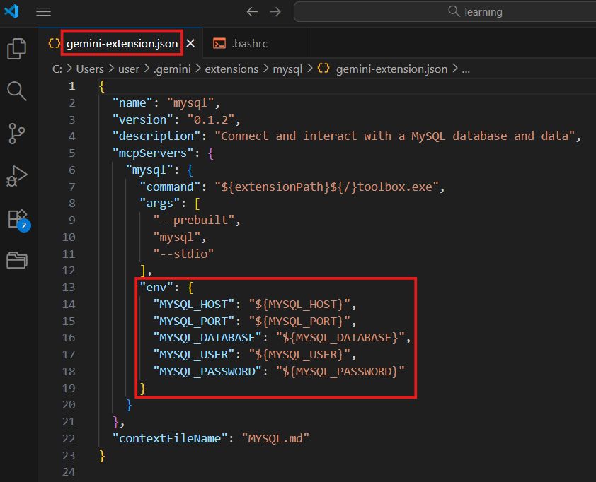
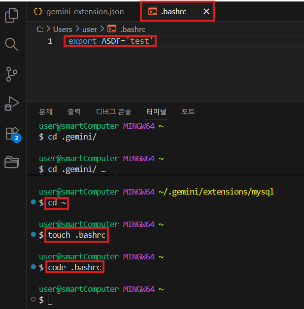
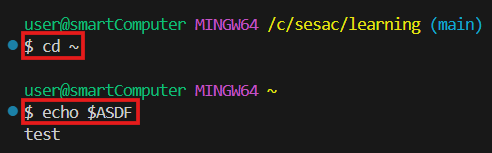
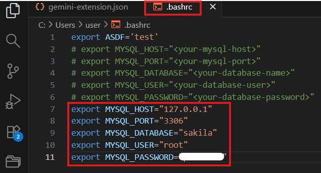
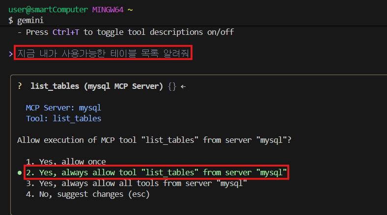

## 💡 **Transaction (트랜잭션)**

### ✅ 개념

- 데이터베이스에서 수행되는 **하나의 논리적인 작업 단위**
- 여러 개의 SQL 문을 하나로 묶어 **모두 성공(All)하거나 모두 실패(Nothing)** 하도록 보장

---

### ✅ 트랜잭션이 필요한 이유

| 구분                   | 설명                                                |
| ---------------------- | --------------------------------------------------- |
| **데이터 일관성 보장** | 여러 작업을 하나의 단위로 처리하여 불일치 방지      |
| **동시성 제어**        | 여러 사용자가 동시에 데이터를 수정할 때 충돌 방지   |
| **복구 가능성**        | 장애 발생 시 `ROLLBACK`으로 데이터 일관성 유지 가능 |

---

### ✅ ACID 속성

| 속성                | 의미   | 설명                                                             |
| ------------------- | ------ | ---------------------------------------------------------------- |
| **A (Atomicity)**   | 원자성 | 트랜잭션의 모든 작업이 완전히 수행되거나 전혀 수행되지 않아야 함 |
| **C (Consistency)** | 일관성 | 트랜잭션 전후로 데이터베이스의 무결성 제약조건이 항상 유지       |
| **I (Isolation)**   | 격리성 | 동시에 실행되는 트랜잭션이 서로 간섭하지 않고 독립적으로 수행    |
| **D (Durability)**  | 지속성 | `COMMIT`된 결과는 영구적으로 저장되어야 함                       |

---

## 🧩 **예시 SQL**

### 1️⃣ 트랜잭션 기본 예제

```sql
USE temp;

CREATE TABLE accounts (
    id INT PRIMARY KEY AUTO_INCREMENT,
    name VARCHAR(10),
    balance INT
);

INSERT INTO accounts (name, balance) VALUES ('kim', 100000);
INSERT INTO accounts (name, balance) VALUES ('kang', 2000000);

SELECT * FROM accounts;

-- 트랜잭션 시작
START TRANSACTION;

UPDATE accounts SET balance = balance + 10000 WHERE id = 1;
UPDATE accounts SET balance = balance - 10000 WHERE id = 2;

-- 모든 변경사항 영구 반영
COMMIT;
```

---

### 2️⃣ 롤백 예제

```sql
START TRANSACTION;

UPDATE accounts SET balance = balance + 10000 WHERE id = 1;
UPDATE accounts SET balance = balance - 10000 WHERE id = 2;

-- 변경사항 취소
ROLLBACK;
```

---

### 3️⃣ SAVEPOINT (부분 롤백) 예제

```sql
START TRANSACTION;

INSERT INTO accounts (name, balance) VALUES ('hong', 0);
SAVEPOINT sp1;

INSERT INTO accounts (name, balance) VALUES ('choi', 999999999);
SAVEPOINT sp2;

-- sp1까지 롤백 (choi 삽입 취소, hong만 남음)
ROLLBACK TO SAVEPOINT sp1;

-- 현재 상태 확정
COMMIT;
```

---

### 4️⃣ 자동 커밋 (Autocommit)

```sql
-- 현재 자동 커밋 상태 확인 (1: 활성화, 0: 비활성화)
SELECT @@autocommit;

-- 자동 커밋 비활성화
SET @@autocommit = 0;

INSERT INTO accounts (name, balance) VALUES ('test', 0);

-- 커밋하지 않았으므로 롤백 시 취소됨
ROLLBACK;
```

---

### ⚠️ 주의: DDL 명령어는 자동 COMMIT 발생

> CREATE, ALTER, DROP, TRUNCATE, RENAME

- 위 명령어들은 실행 시 자동으로 COMMIT이 수행되어
  **ROLLBACK이 불가능**합니다.

---

**AI Prompting**

- 효과적인 프롬프트 작성 구조
  - 명확하고 구체적인 요청
  - `[데이터베이스] + [테이블] + [컬럼] + [조건] + [정렬/제한]`
  - `DESC <테이블명>;` 혹은 `SHOW CREATE TABLE <테이블명>;` 로 조회한 정보 보내기



---

## 💡 **MCP (Model Context Protocol)**

https://modelcontextprotocol.io/docs/getting-started/intro



### Gemini CLI안에 확장 프로그램 설치

https://geminicli.com/extensions/



[MySQL 확장 프로그램](https://github.com/gemini-cli-extensions/mysql)

`gemini extensions install https://github.com/gemini-cli-extensions/mysql`




`gemini-extenstion.json`


`gemini-extension.json` 파일에 mysql 연결 정보가 있어야 되는데 우리는 별로의 파일에서 입력해 줄 것

테스트를 위해 `cd ~` 상위 폴더에서 `.bashrc` 파일 생성 후 `ASDF` 변수 생성


`.bashrc` 저장 후 터미널 다시 켜고 상위(`cd ~`)로 이동 후

`echo $ASDF` 명령어 입력하면 값 확인 가능

정상 작동 확인


`.bashrc` 파일에 MySQL 환경 변수 입력

```sql
export MYSQL_HOST="<your-mysql-host>"
export MYSQL_PORT="<your-mysql-port>"
export MYSQL_DATABASE="<your-database-name>"
export MYSQL_USER="<your-database-user>"
export MYSQL_PASSWORD="<your-database-password>"
```



파일 저장 후 터미널을 다시 켜고 상위(`cd ~`)로 이동 후 `echo $<변수명>` 으로 설정이 잘 된지 확인

`gemini-extenstion.json` 에서 직접 수정하는 것 보다 외부 폴더에서 설정하는 것을 권장

```bash
gemini
# mysql 설치된 것 확인 가능
/mcp list
```



연결이 정상적으로 이루어졌다면, 사용가능한 테이블 목록들이 나올 것
