## 💡 **Transaction (트랜잭션)**

### ✅ 개념

- 데이터베이스에서 수행되는 **하나의 논리적인 작업 단위**
- 여러 개의 SQL 문을 하나로 묶어 **모두 성공(All)하거나 모두 실패(Nothing)** 하도록 보장

---

### ✅ 트랜잭션이 필요한 이유

| 구분                   | 설명                                                |
| ---------------------- | --------------------------------------------------- |
| **데이터 일관성 보장** | 여러 작업을 하나의 단위로 처리하여 불일치 방지      |
| **동시성 제어**        | 여러 사용자가 동시에 데이터를 수정할 때 충돌 방지   |
| **복구 가능성**        | 장애 발생 시 `ROLLBACK`으로 데이터 일관성 유지 가능 |

---

### ✅ ACID 속성

| 속성                | 의미   | 설명                                                             |
| ------------------- | ------ | ---------------------------------------------------------------- |
| **A (Atomicity)**   | 원자성 | 트랜잭션의 모든 작업이 완전히 수행되거나 전혀 수행되지 않아야 함 |
| **C (Consistency)** | 일관성 | 트랜잭션 전후로 데이터베이스의 무결성 제약조건이 항상 유지       |
| **I (Isolation)**   | 격리성 | 동시에 실행되는 트랜잭션이 서로 간섭하지 않고 독립적으로 수행    |
| **D (Durability)**  | 지속성 | `COMMIT`된 결과는 영구적으로 저장되어야 함                       |

---

## 🧩 **예시 SQL**

### 1️⃣ 트랜잭션 기본 예제

```sql
USE temp;

CREATE TABLE accounts (
    id INT PRIMARY KEY AUTO_INCREMENT,
    name VARCHAR(10),
    balance INT
);

INSERT INTO accounts (name, balance) VALUES ('kim', 100000);
INSERT INTO accounts (name, balance) VALUES ('kang', 2000000);

SELECT * FROM accounts;

-- 트랜잭션 시작
START TRANSACTION;

UPDATE accounts SET balance = balance + 10000 WHERE id = 1;
UPDATE accounts SET balance = balance - 10000 WHERE id = 2;

-- 모든 변경사항 영구 반영
COMMIT;
```

---

### 2️⃣ 롤백 예제

```sql
START TRANSACTION;

UPDATE accounts SET balance = balance + 10000 WHERE id = 1;
UPDATE accounts SET balance = balance - 10000 WHERE id = 2;

-- 변경사항 취소
ROLLBACK;
```

---

### 3️⃣ SAVEPOINT (부분 롤백) 예제

```sql
START TRANSACTION;

INSERT INTO accounts (name, balance) VALUES ('hong', 0);
SAVEPOINT sp1;

INSERT INTO accounts (name, balance) VALUES ('choi', 999999999);
SAVEPOINT sp2;

-- sp1까지 롤백 (choi 삽입 취소, hong만 남음)
ROLLBACK TO SAVEPOINT sp1;

-- 현재 상태 확정
COMMIT;
```

---

### 4️⃣ 자동 커밋 (Autocommit)

```sql
-- 현재 자동 커밋 상태 확인 (1: 활성화, 0: 비활성화)
SELECT @@autocommit;

-- 자동 커밋 비활성화
SET @@autocommit = 0;

INSERT INTO accounts (name, balance) VALUES ('test', 0);

-- 커밋하지 않았으므로 롤백 시 취소됨
ROLLBACK;
```

---

### ⚠️ 주의: DDL 명령어는 자동 COMMIT 발생

> CREATE, ALTER, DROP, TRUNCATE, RENAME

- 위 명령어들은 실행 시 자동으로 COMMIT이 수행되어
  **ROLLBACK이 불가능**합니다.

---

**AI Prompting**

- 효과적인 프롬프트 작성 구조
  - 명확하고 구체적인 요청
  - `[데이터베이스] + [테이블] + [컬럼] + [조건] + [정렬/제한]`
  - `DESC <테이블명>;` 혹은 `SHOW CREATE TABLE <테이블명>;` 로 조회한 정보 보내기

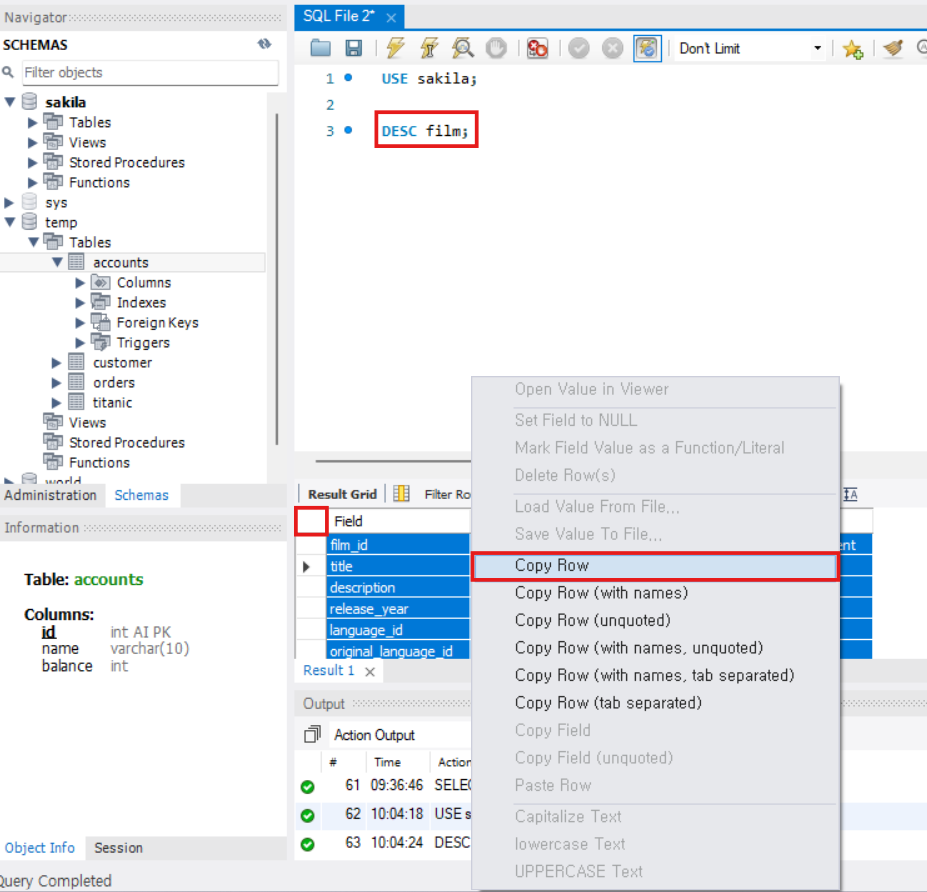

---

## 💡 **MCP (Model Context Protocol)**

https://modelcontextprotocol.io/docs/getting-started/intro


### Gemini CLI안에 확장 프로그램 설치

https://geminicli.com/extensions/

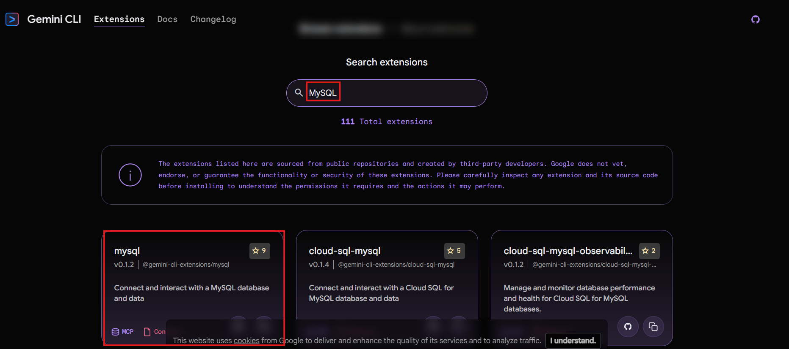

[MySQL 확장 프로그램](https://github.com/gemini-cli-extensions/mysql)

`gemini extensions install https://github.com/gemini-cli-extensions/mysql`

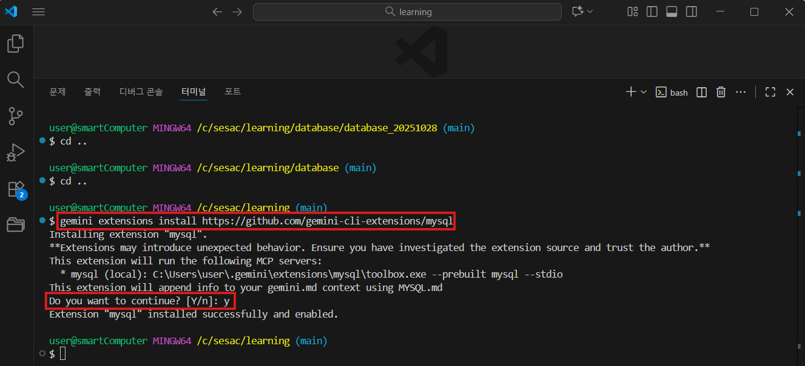
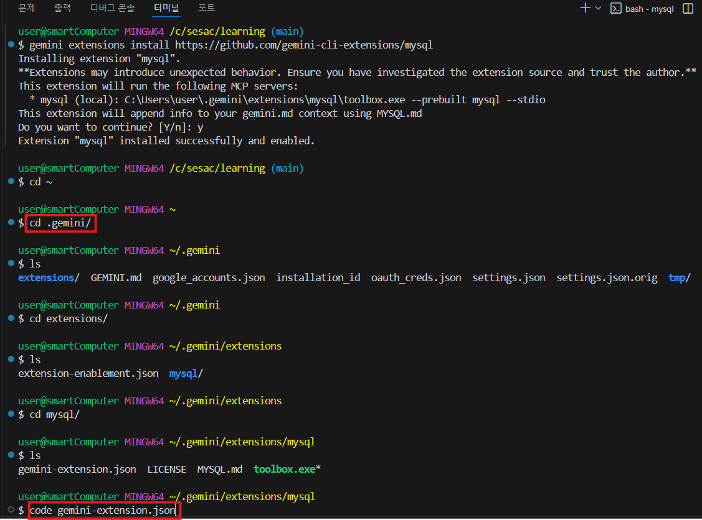

`gemini-extenstion.json`
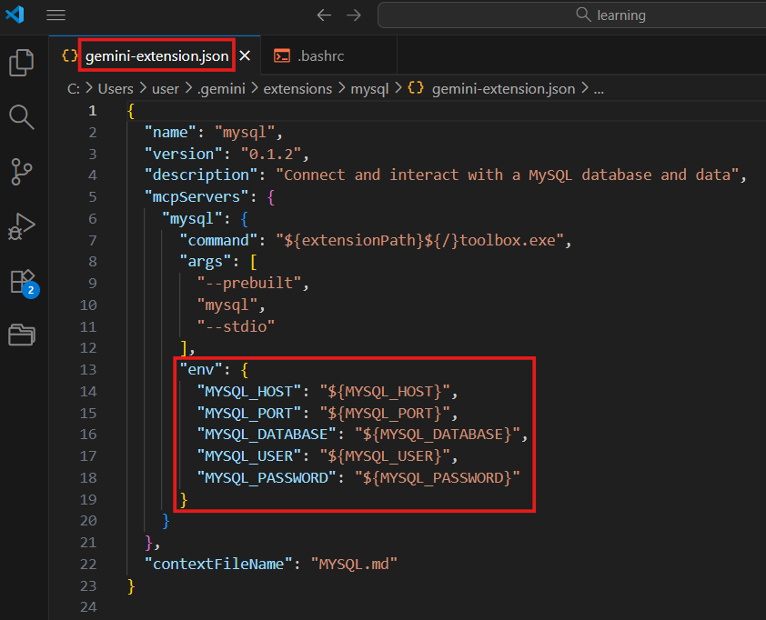

`gemini-extension.json` 파일에 mysql 연결 정보가 있어야 되는데 우리는 별로의 파일에서 입력해 줄 것

테스트를 위해 `cd ~` 상위 폴더에서 `.bashrc` 파일 생성 후 `ASDF` 변수 생성
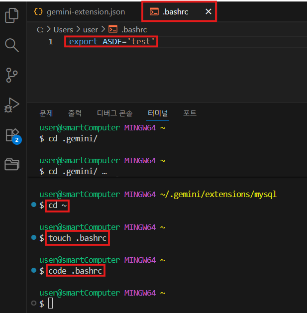

`.bashrc` 저장 후 터미널 다시 켜고 상위(`cd ~`)로 이동 후

`echo $ASDF` 명령어 입력하면 값 확인 가능

정상 작동 확인
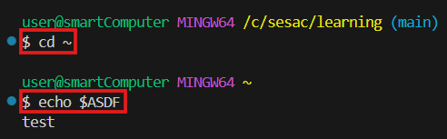

`.bashrc` 파일에 MySQL 환경 변수 입력

```sql
export MYSQL_HOST="<your-mysql-host>"
export MYSQL_PORT="<your-mysql-port>"
export MYSQL_DATABASE="<your-database-name>"
export MYSQL_USER="<your-database-user>"
export MYSQL_PASSWORD="<your-database-password>"
```

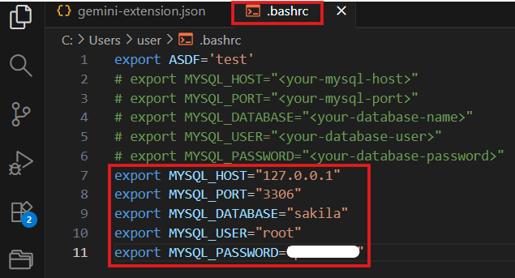

파일 저장 후 터미널을 다시 켜고 상위(`cd ~`)로 이동 후 `echo $<변수명>` 으로 설정이 잘 된지 확인

`gemini-extenstion.json` 에서 직접 수정하는 것 보다 외부 폴더에서 설정하는 것을 권장

```bash
gemini
# mysql 설치된 것 확인 가능
/mcp list
```

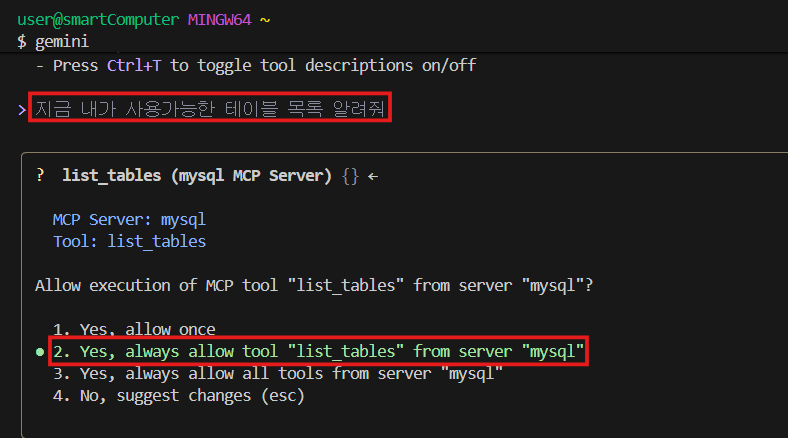

연결이 정상적으로 이루어졌다면, 사용가능한 테이블 목록들이 나올 것

## AI Agent(Gemini)를 활용한 데이터 분석

## 📘 1️⃣ 리텐션 분석 (Retention Analysis)

### 🔹 개념

> **리텐션(Retention)**이란,
>
> “특정 시점에 유입된 사용자가 시간이 지나도 여전히 서비스를 이용하고 있는 비율”
>
> 을 의미합니다.

즉, **‘사용자가 다시 돌아오는 비율’**을 분석하는 것입니다.

---

### 🔹 예시

| 날짜  | 신규가입자 수 | 다음날 재방문자 수 | 1일차 리텐션율 |
| ----- | ------------- | ------------------ | -------------- |
| 10/01 | 100명         | 50명               | 50%            |
| 10/02 | 120명         | 60명               | 50%            |

→ 10/01에 가입한 100명 중 50명이 10/02에도 로그인했다면 **1일차 리텐션이 50%**

---

### 🔹 리텐션의 핵심 포인트

| 구분                    | 설명                                                                      |
| ----------------------- | ------------------------------------------------------------------------- |
| **Day N Retention**     | 가입/방문 기준일로부터 N일 뒤에 돌아온 비율 (ex. Day 1, Day 7, Day 30 등) |
| **Week N Retention**    | N주 후 유지율 — 장기적인 서비스 이용 분석에 적합                          |
| **Churn Rate (이탈률)** | 1 - 리텐션율 (얼마나 떠나는지)                                            |
| **Stickiness (활성도)** | DAU/MAU (하루 이용자가 월 이용자 대비 얼마나 많은가)                      |

---

### 🔹 리텐션 분석의 목적

✅ **서비스 지속 이용성 판단**

→ “유저가 한 번 쓰고 떠나는가?”

✅ **기능 업데이트 효과 측정**

→ “새 기능 추가 후 리텐션이 올랐나?”

✅ **이탈 시점 파악 및 대응 전략 수립**

→ “언제 유저가 많이 이탈하는가?”

---

## 📗 2️⃣ 코호트 분석 (Cohort Analysis)

### 🔹 개념

> **코호트(Cohort)**란,
>
> **같은 시점 혹은 동일한 조건에서 공통 특성을 가진 사용자 그룹**을 말합니다.

즉,

- “언제 가입했는가?”
- “어떤 마케팅 채널로 유입됐는가?”
- “어떤 상품을 처음 구매했는가?”

이런 기준으로 유저를 **그룹화**해서 각 그룹의 행동 변화를 **비교·추적**하는 분석 방법입니다.

---

### 🔹 예시

| 가입 월     | 1주차 리텐션 | 2주차 리텐션 | 3주차 리텐션 |
| ----------- | ------------ | ------------ | ------------ |
| 10월 가입자 | 80%          | 60%          | 45%          |
| 11월 가입자 | 85%          | 70%          | 60%          |

→ 11월에 가입한 사용자가 전반적으로 더 오래 남아 있음

→ 즉, **신규 온보딩 개편이 효과적이었다**는 인사이트를 얻을 수 있음.

---

### 🔹 코호트의 종류

| 유형                                 | 설명                        | 예시                                 |
| ------------------------------------ | --------------------------- | ------------------------------------ |
| **가입 코호트(Signup Cohort)**       | 가입 시점을 기준으로 그룹화 | “10월 가입자”, “11월 가입자”         |
| **획득 채널 코호트(Channel Cohort)** | 유입 채널 기준 그룹화       | “광고 유입”, “자연 검색”, “SNS 공유” |
| **행동 코호트(Behavioral Cohort)**   | 특정 행동 기준 그룹화       | “첫 결제 유저”, “장바구니 이탈 유저” |

---

### 🔹 코호트 분석의 장점

✅ 단순 평균이 아니라 **그룹별 패턴**을 확인할 수 있음

✅ 특정 시점의 정책이나 이벤트 효과를 **직접 비교 가능**

✅ 서비스 문제를 **정확히 특정 코호트로 좁혀 분석 가능**

---

## 📊 3️⃣ 리텐션 vs 코호트 요약 비교

| 항목          | 리텐션 분석                  | 코호트 분석                                      |
| ------------- | ---------------------------- | ------------------------------------------------ |
| **초점**      | “얼마나 돌아오는가”          | “누가, 어떤 그룹이 어떻게 유지되는가”            |
| **기준**      | 전체 사용자                  | 그룹(가입월, 유입경로 등)별 사용자               |
| **단위**      | 시간(일, 주, 월)             | 그룹별 시간 흐름                                 |
| **주요 지표** | Day 1, 7, 30 리텐션율        | 코호트별 N일차 리텐션율                          |
| **목적**      | 유지율 향상                  | 유지율의 원인 분석                               |
| **활용 예시** | “전체 앱의 7일 리텐션이 45%” | “광고 유입 코호트는 30%, 검색 유입 코호트는 60%” |

---

## 💡 4️⃣ 실제 활용 예시 (서비스 기획 관점)

| 시나리오                             | 분석 방법            | 인사이트                                      |
| ------------------------------------ | -------------------- | --------------------------------------------- |
| 신규 기능 출시 후 유저 재방문율 확인 | 리텐션 분석          | Day 7 리텐션이 10% 상승 → 기능 성공           |
| 마케팅 채널별 충성도 비교            | 코호트 분석          | 유료 광고 유입 코호트 리텐션 낮음 → 타겟 조정 |
| 월별 신규 유입 유저의 잔존율 비교    | 코호트 + 리텐션 결합 | 온보딩 UI 변경 이후 잔존율 개선 확인          |

---

## 🧭 요약 정리

| 개념            | 설명                                                               |
| --------------- | ------------------------------------------------------------------ |
| **리텐션 분석** | 일정 기간이 지난 후에도 사용자가 남아 있는 비율 측정 (유지율 중심) |
| **코호트 분석** | 공통 특성을 가진 사용자 그룹의 행동 변화 추적 (원인 중심)          |
| **결합 분석**   | 코호트별 리텐션율을 추적하여 어떤 그룹이 가장 충성도가 높은지 파악 |

https://www.kaggle.com/datasets

데이터 다운로드 후 workbench or DBeaver를 통한 import (매우 빠름)

workbench는 속도가 느려서 DBeaver 사용

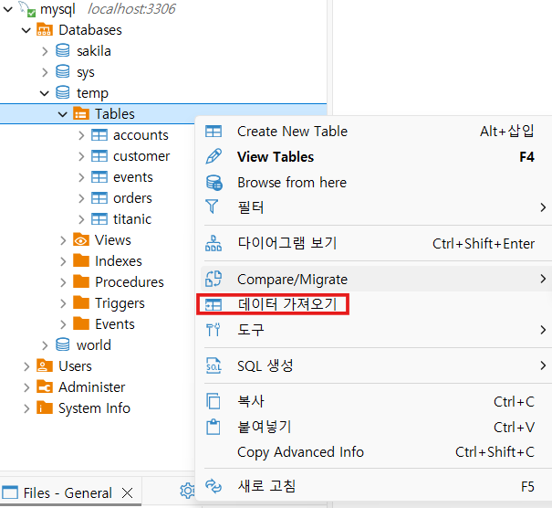
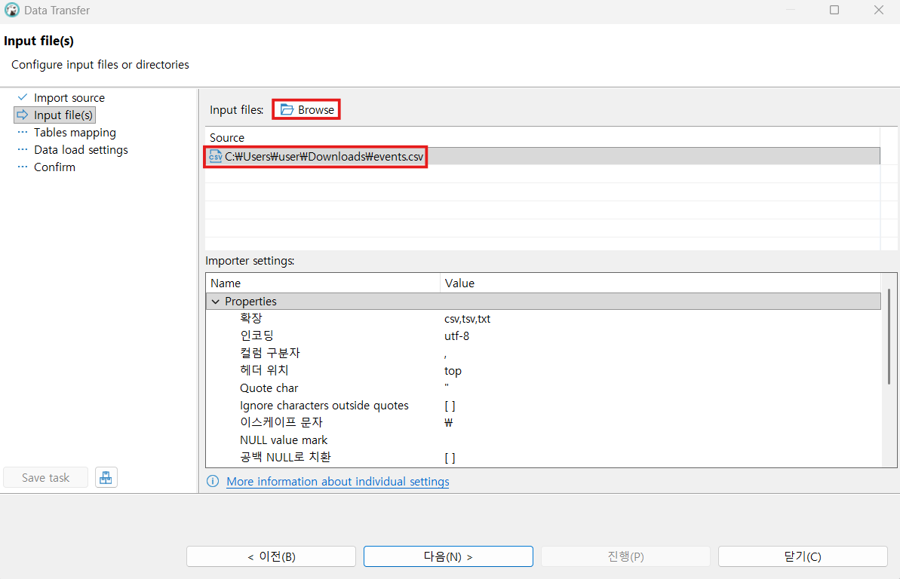
Default로 계속 다음하고 진행
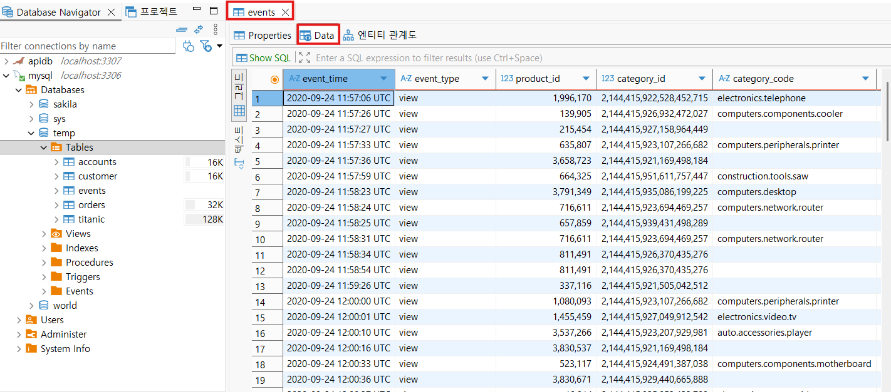
Data 클릭하면 import된 데이터들 확인 가능

gemini를 실행하여 events 테이블에 대한 데이터를 커널 분석하도록 요청

- 커널 분석
  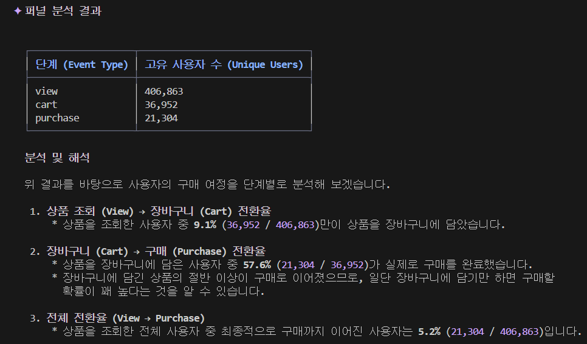
- 리텐션 분석
  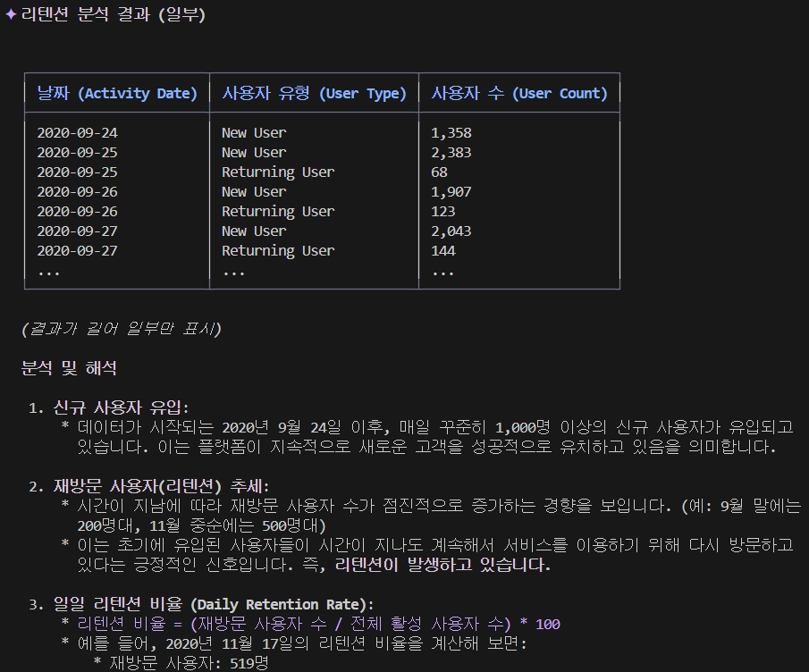
  ⇒ 위와 같은 방식으로 데이터를 분석하여 마케팅에 활용할 수 있다.
