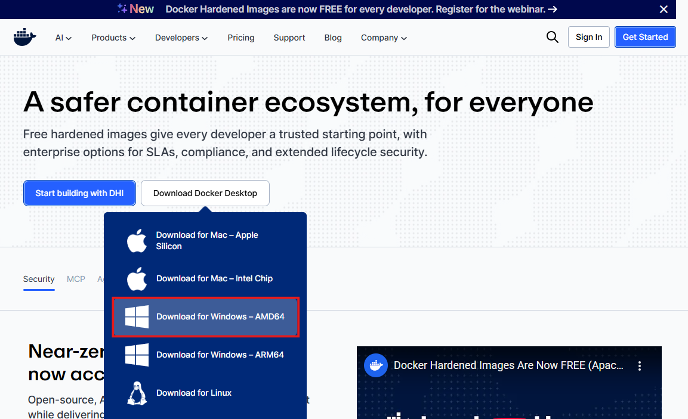

# 1. Docker 설치 및 이미지 생성

## 1. Docker 설치 및 환경 확인

### 설치

1. Docker 공식 사이트에서 다운로드: [https://www.docker.com/](https://www.docker.com/)

   

2. 설치 시 기본 옵션(Default)으로 설치
3. 설치 후 시스템 재부팅

   

### Docker Desktop

- 설치 후 계정 생성 및 로그인
- Docker Hub 로그인: [https://hub.docker.com/](https://hub.docker.com/)
  
  
- git bash 실행
  ```bash
  wsl --update
  ```
  

---

## 2. Docker 기본 명령어 정리

### 버전 확인

```bash
docker --version
```

### 이미지 관리

```bash
# 이미지 다운로드
docker pull nginx
docker pull nginx:1.25

# 다운로드한 이미지 확인
docker images

# 이미지 삭제
docker rmi nginx
docker rmi nginx:1.25
```

GUI도 사용 가능


### 컨테이너 실행

```bash
# 기본 실행
docker run nginx

# 백그라운드 실행
docker run -d nginx

# 이름 지정 후 실행
docker run -d --name my-nginx nginx

# 포트 매핑
docker run -d --name my-nginx2 -p 8080:80 nginx

# 일회성 실행 후 자동 삭제
docker run --rm nginx
```


### 컨테이너 관리

```bash
# 실행 중인 컨테이너 확인
docker ps

# 모든 컨테이너 확인(중지 포함)
docker ps -a

# 컨테이너 종료
docker stop <컨테이너 이름>

# 컨테이너 삭제
docker rm <컨테이너 이름>

# 중지된 컨테이너 모두 삭제
docker container prune
```

### 로그 확인

```bash
docker logs <컨테이너 이름>
docker logs --tail 10 <컨테이너 이름># 최근 10줄만
docker logs -f <컨테이너 이름># 실시간 로그 확인
```

### 컨테이너 내부 명령 실행

```bash
docker exec my-nginx ls
docker restart <컨테이너 이름>
```

---

## 3. MySQL 이미지 생성 및 실행 실습

```bash
# MySQL 컨테이너 실행
docker run --name my-mysql -d -p 3308:3306 -e MYSQL_ROOT_PASSWORD=비밀번호 mysql

# 로그 확인
docker logs --tail 10 my-mysql

# MySQL 버전 확인
docker exec -it my-mysql mysql --version

# MySQL 접속
docker exec -it my-mysql mysql -u root -p
```

**Tip:** 컨테이너 삭제 시 데이터도 함께 사라지는 단점 → **Volume 사용 추천**


`docker exec -it my-mysql mysql --version` → 접속 테스트


3306포트는 이미 사용중으로 3308포트로 설정


Driver properties > allowPublicKeyRetrieval > **true**


Docker에서 MySQL에 접근해 생성한 테이블 확인 가능

---

## 4. Docker Volume

- 컨테이너 외부에 데이터를 저장
- 컨테이너를 삭제하거나 재생성해도 데이터 유지 가능
- MySQL, PostgreSQL 등 DB 컨테이너에서 필수적

---

## 5. Dockerfile 기초

### 기본 구조

```docker
# 베이스 이미지
FROM alpine:3.19

# 작업 디렉토리
WORKDIR /app

# 패키지 설치
RUN apk add --no-cache curl

# 파일 복사
COPY hello.txt ./

# 환경 변수
ENV MY_NAME=KIM
ENV MY_ENV=LOCAL

# 실행 명령
CMD ["cat", "hello.txt"]
```

### 이미지 빌드 및 실행

```bash
docker build -t myapp:v1 .
docker run --name myappv1 -d myapp:v1
docker run -it myapp:v1 sh
```

### 환경 변수 관리

`.env` 파일 생성

```bash
ENV MY_NAME=KIM
ENV MY_ENV=LOCAL
```


```bash
# 컨테이너 실행 시 환경 변수 덮어쓰기
docker run -e MY_ENV=DEV -it myapp:v6 sh

# .env 파일 사용
docker run --env-file .env -it myapp:v6 sh
```


---

## 6. 실제 프로젝트 Docker화 (Insta-backend 예제)

### 1) 소스 코드 준비

```bash
gitclone https://github.com/SESAC-SD3/insta-back.git
./gradlew build -xtest# test 제외 빌드
```

### 2) Dockerfile 생성 (멀티 스테이지 빌드)

```docker
# ====== 빌드 스테이지 ======
FROM gradle:8-jdk21 AS builder
WORKDIR /app

COPY build.gradle settings.gradle ./
RUN gradle dependencies

COPY src ./src
RUN gradle build -x test

# ====== 실행 스테이지 ======
FROM eclipse-temurin:21-jdk-alpine
WORKDIR /app
COPY --from=builder /app/build/libs/*.jar app.jar

CMD ["java", "-jar", "app.jar"]
```

### 3) .dockerignore

```docker
.gradle
build/
.idea
gradle/
```

### 4) .env 파일


```docker
KAKAO_CLIENT_ID=발급받은 ID
KAKAO_CLIENT_SECRET=발급받은 SECRET KEY
```

### 5) 이미지 빌드 및 실행

```bash
docker build -t insta:v4 .
docker run --name insta-back -d --env-file .env -p 8080:8080 insta:v4
```


- 접속: [http://localhost:8080/swagger-ui/index.html](http://localhost:8080/swagger-ui/index.html)
- 데이터베이스는 컨테이너 내에 존재 → 재실행 시 데이터는 사라짐 → Volume 필요

---

## 7. 실제 프로젝트 Docker화2 (devso 예제)

### 1. Dockerfile 생성

```docker
# ====== 빌드 스테이지 =====
FROM gradle:8-jdk AS builder
WORKDIR /app

COPY build.gradle settings.gradle ./

RUN gradle dependencies

COPY src ./src
RUN gradle build -x test

# ====== 실행 스테이지 =====
FROM eclipse-temurin:21-jdk-alpine
WORKDIR /app

COPY --from=builder /app/build/libs/*.jar app.jar

CMD ["java", "-jar", "app.jar"]
```

### 2. .dockerignore 및 .env 파일 생성

- `.gitignore`파일에 `.env` 를 추가
- `.dockerignore`
  ```docker
  .gradle
  build/
  .idea
  gradle/
  ```
- `.env`
  ```docker
  GEMINI_API_KEY=발급받은 GEMINI API KEY
  KAKAO_CLIENT_ID=발급받은 KAKAO ID
  KAKAO_CLIENT_SECRET=발급받은 KAKAO SECRET KEY
  ```

### 3. 이미지 생성

`docker build -t devso:v1 .`


### 4. 이미지 실행

`docker run --name devso -d --env-file .env -p 8080:8080 devso:v1`


[http://localhost:8080/swagger-ui/index.html](http://localhost:8080/swagger-ui/index.html)(접속 성공)

---

## 8. Docker 컨테이너 개념 정리

- **컨테이너(Container)**: 애플리케이션을 독립적으로 실행하는 가볍고 빠른 환경
- **이미지(Image)**: 컨테이너를 만들기 위한 설계도
- 특징:
  - **격리성**: 각 컨테이너 독립 실행
  - **경량성**: OS 전체 포함 X
  - **일관성**: 개발/테스트/운영 동일 환경
  - **이식성**: Docker 설치 환경 어디서나 실행 가능

---

## 9. NGINX (Web Server)

- 역할:
  - 요청 수신 (HTTP/HTTPS)
  - 포트/도메인 기반 요청 분기
  - 리버스 프록시
  - 정적 파일 제공
  - 로드 밸런싱
- 예시 실행:

```bash
docker run -d --name my-nginx2 -p 8080:80 nginx
```

- 접속: [http://localhost:8080/](http://localhost:8080/)
