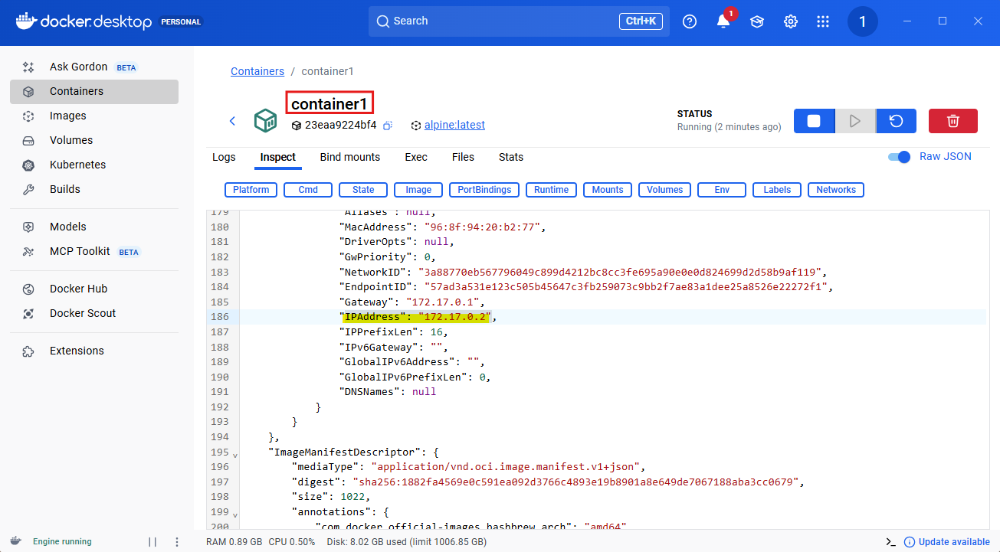

# 2. Docker 네트워크

## 1. 기본 Bridge 네트워크 테스트

- Docker 설치 시 기본으로 제공되는 **bridge 네트워크**는 컨테이너 이름을 DNS처럼 인식하지 못함.
- 컨테이너 간 통신은 IP 기반으로만 가능.

```bash
# 현재 네트워크 목록 확인
docker networkls

# 기본 bridge 상세 정보 확인
docker network inspect bridge

# 테스트 컨테이너 2개 실행
docker run -d --name container1 alpinesleep 3600
docker run -d --name container2 alpinesleep 3600

# 컨테이너 IP 확인
docker inspect container1 | grep"IPAddress"
docker inspect container2 | grep"IPAddress"

# IP로 통신 테스트 (성공)
dockerexec container1 ping -c 2 172.17.0.3

# 이름으로 통신 테스트 (실패)
dockerexec container1 ping -c 2 container2
```

- `docker inspect container1`
- IP로 통신 성공:
    
    
    
    
    

---

## 2. 사용자 정의 네트워크 (User-defined Network)

- 컨테이너 이름을 호스트 이름처럼 사용 가능 (내장 DNS 제공)
- 기본 bridge와 달리 이름 기반 통신 가능

```bash
# 네트워크 생성
docker network create my-network

# 컨테이너 실행
docker run -d --name web --network my-network nginx
docker run -d --name app --network my-network alpinesleep 3600

# IP 확인 후 통신
docker inspect web | grep"IPAddress"
dockerexec app ping -c 2 172.18.0.2

# 이름 기반 통신 (성공)
dockerexec app ping -c 2 web
```

- 결과: 컨테이너 이름으로 ping 가능
    
    
    
    
    

---

### 2.1 Network Alias

- 한 컨테이너에 **여러 별칭** 설정 가능

```bash
# DB 컨테이너
docker run -d --name mysql-server \
  --network my-network \
  --network-alias db \
  -e MYSQL_ROOT_PASSWORD=비밀번호 mysql:8

# Web 컨테이너 (web, frontend 별칭)
docker run -d --name web-server \
  --network my-network \
  --network-alias web \
  --network-alias frontend nginx

# 클라이언트 컨테이너에서 별칭 통신
docker run -d --name client --network my-network alpinesleep 3600
dockerexec client ping -c 2 db
dockerexec client ping -c 2 frontend
```

---

### 2.2 커스텀 서브넷 및 게이트웨이

```bash
docker network create --driver bridge \
  --subnet 192.168.100.0/24 \
  --gateway 192.168.100.1 \
  custom-network

docker network inspect custom-network
```

- `/24` 서브넷 → `192.168.100.0 ~ 192.168.100.255` 사용 가능
- 게이트웨이 → 외부와 통신하는 출입구

---

### 2.3 실행 중인 컨테이너 네트워크 연결/해제

```bash
docker run -d --name web-server nginx

# 추가 연결
docker network connect custom-network web-server

# 연결 확인
docker inspect web-server | grep -i"Networks" -A 20

# 연결 해제
docker network disconnect custom-network web-server
```


---

### 2.4 다중 네트워크 구성 (Network Isolation)

- 보안 목적으로 특정 컨테이너만 여러 네트워크 연결

```bash
docker network create frontend-network
docker network create backend-network

# DB, API: backend
docker run -d --name db --network backend-network alpinesleep 3600
docker run -d --name api --network backend-network alpinesleep 3600

# Web: frontend
docker run -d --name web --network frontend-network alpinesleep 3600

# API를 frontend에도 연결
docker network connect frontend-network api

# 통신 확인
dockerexec web ping -c 2 api# 성공
dockerexec web ping -c 2 db# 실패
dockerexec api ping -c 2 db# 성공
```

---

## 3. 데이터 영속성 (Volume)

- 도커 컨테이너는 기본적으로 휘발성
- 영속성 보존 방식

| 구분 | Named Volume | Bind Mount | tmpfs |
| --- | --- | --- | --- |
| 위치 | Docker 전용 | 호스트 경로 | 메모리(RAM) |
| 관리 주체 | Docker | 사용자 | Docker/OS |
| 데이터 유지 | O | O | X |
| 보안 | 높음 | 낮음 | 매우 높음 |
| 주요 사용처 | DB, 영구 데이터 | 개발 코드, 설정 공유 | 임시파일, 민감키 |

---

### 3.1 Named Volume 실습

도커가 관리하는 내부 영역에 데이터를 저장하여 **컨테이너가 삭제되어도 데이터를 유지**

```bash
docker volume create mysql-data
docker volumels
docker volume inspect mysql-data

# 컨테이너 연결
docker run -d --name mysql-v \
  -e MYSQL_ROOT_PASSWORD=password \
  -e MYSQL_DATABASE=testdb \
  -v mysql-data:/var/lib/mysql \
  mysql:8

# 데이터 입력
dockerexec -it mysql-v mysql -u root -ppassword testdb -e"CREATE TABLE memo(title VARCHAR(10)); INSERT INTO memo VALUES ('hello');"

# 컨테이너 삭제 후 재연결
docker stop mysql-v
dockerrm mysql-v
docker run -d --name mysql-v -e MYSQL_ROOT_PASSWORD=password -e MYSQL_DATABASE=testdb -v mysql-data:/var/lib/mysql mysql:8

# 데이터 확인 ('hello' 유지)
dockerexec -it mysql-v mysql -u root -ppassword testdb -e"SELECT * FROM memo;"
```

---

### 3.2 Bind Mount 실습

내 컴퓨터의 특정 폴더를 컨테이너 내부와 **실시간으로 동기화**

```bash
mkdir -p ~/docker-volume-test/html
echo'<h1>hello volume</h1>' > html/index.html

# 컨테이너 실행
docker run -d --name web -p 8080:80 -v //$(pwd)/html:/usr/share/nginx/html nginx
# 또는 --mount 방식 권장
docker run -d --name web -p 8080:80 --mounttype=bind,source=//$(pwd)/html,target=/usr/share/nginx/html nginx

# 확인
curl localhost:8080

# 파일 수정 즉시 반영
echo'<h1> update!!!</h1>' > html/index.html
curl localhost:8080
```


---

### 3.3 tmpfs (휘발성)

메모리에 저장하여 속도는 빠르지만, 컨테이너 재시작/종료 시 데이터가 삭제

```bash
docker run -d --name normal--tmpfs //tmp alpinesleep 3600
docker exec normal sh -c"echo 'hello' > /tmp/test.txt"
# 컨테이너 재시작 시 유지 but 삭제 후 재생성 시 데이터 삭제
docker restart normal
```

---

### 3.4 Volume 백업

Named Volume은 접근이 어렵기 때문에 **임시 컨테이너를 이용해 압축 파일로 백업**


```bash
docker volume create backup-test
docker run -d --name data-container -v backup-test:/data alpinesleep 3600

docker run --rm \
  -v backup-test:/source \
  -v //$(pwd)://backup \
  alpine tar cvzf //backup/mydata.tar.gz -C /source .
```

- Windows 경로 문제 방지:
    
    ```bash
    export MSYS_NO_PATHCONV=1
    ```
    

---

## 4. Docker Compose

- 여러 컨테이너를 `yml`로 정의, 관리 가능

```yaml
# docker run -d --name web -p 8080:80 nginx
services:
  web:
    image: nginx
    ports:
      - "8080:80"
    volumes:
      - ./html:/usr/share/nginx/html
  db:
    image: mysql:8
    environment:
      MYSQL_ROOT_PASSWORD: password
      MYSQL_DATABASE: testdb
    volumes:
      - mysql-data:/var/lib/mysql
volumes:
  mysql-data:
# docker compose up -d
```

- 주요 명령어
    - `docker compose up` : 실행 (포그라운드)
    - `docker compose up -d` : 실행 (백그라운드)
    - `docker compose down` : 컨테이너/네트워크 삭제

```bash
# web container의 exec에서 아래 명령어 실행
apt-get update
# ip utils ping 설치
apt-get install -y iputils-ping
# ping 보내기
ping -c 2 db

# db container의 exec에서 아래 명령어 실행
mysql -u root -p[비밀번호] testdb
```

내 로컬의 index.html

`<h1>hello compose</h1>`

web container에도 자동으로 반영


---

### 4.1 Compose 실습 (Insta-back)

### applicaiton-docker.propertes

Spring Boot는 환경별 설정을 **프로파일(Profile)** 단위로 나눌 수 있다.

예를 들어:

- 기본 설정: `application.properties`
- 개발 환경: `application-dev.properties`
- 테스트 환경: `application-test.properties`
- 도커 환경: `application-docker.properties`

Spring Boot는 **활성화된 프로파일**에 따라 해당 설정 파일을 자동으로 불러오고, 기본 `application.properties`를 덮어쓴다.

```yaml
# MySQL 데이터베이스 (Docker 환경)
spring.datasource.url=jdbc:mysql://db:3306/instagram?useSSL=false&allowPublicKeyRetrieval=true&serverTimezone=Asia/Seoul
spring.datasource.username=${MYSQL_USER}
spring.datasource.password=${MYSQL_PASSWORD}
spring.datasource.driver-class-name=com.mysql.cj.jdbc.Driver

# JPA - MySQL용 설정
spring.jpa.hibernate.ddl-auto=update
spring.jpa.properties.hibernate.dialect=org.hibernate.dialect.MySQLDialect

# H2 콘솔 비활성화
spring.h2.console.enabled=false
```

### docker-compose.yml

- `SPRING_PROFILES_ACTIVE` 환경 변수
    - `application.properties` 읽기
    - 활성 프로파일 `docker`에 해당하는 `application-docker.properties` 읽기
    - 동일한 설정 키가 있으면 **`application-docker.properties` 값으로 덮어쓰기**

```yaml
services:
  db:
    image: mysql:8
    container_name: insta-mysql
    volumes:
      - mysql-data:/var/lib/mysql
    environment:
      MYSQL_ROOT_PASSWORD: password
      MYSQL_DATABASE: instagram
    ports:
      - "3308:3306"
    healthcheck:
      test: ["CMD", "mysqladmin", "ping", "-h", "localhost"]
      interval: 10s
      timeout: 5s
      retries: 5
      start_period: 30s
  api:
    build: .
    container_name: insta-api
    environment:
      **SPRING_PROFILES_ACTIVE: docker**
      MYSQL_USER: ${MYSQL_USER}
      MYSQL_PASSWORD: ${MYSQL_PASSWORD}
      KAKAO_CLIENT_ID: ${KAKAO_CLIENT_ID}
      KAKAO_CLIENT_SECRET: ${KAKAO_CLIENT_SECRET}
    ports:
      - "8080:8080"
    depends_on:
      db:
        condition: service_healthy
    restart: unless-stopped

volumes:
  mysql-data:
```


- 데이터 초기화 후 오류 발생 시:
    
    ```bash
    # 컨테이너, 네트워크, 그리고 Compose에서 생성한 Named Volume까지 모두 삭제
    docker compose down -v
    # # docker-compose.yml 기준으로 모든 서비스 컨테이너를 백그라운드에서 실행
    docker compose up -d
    ```