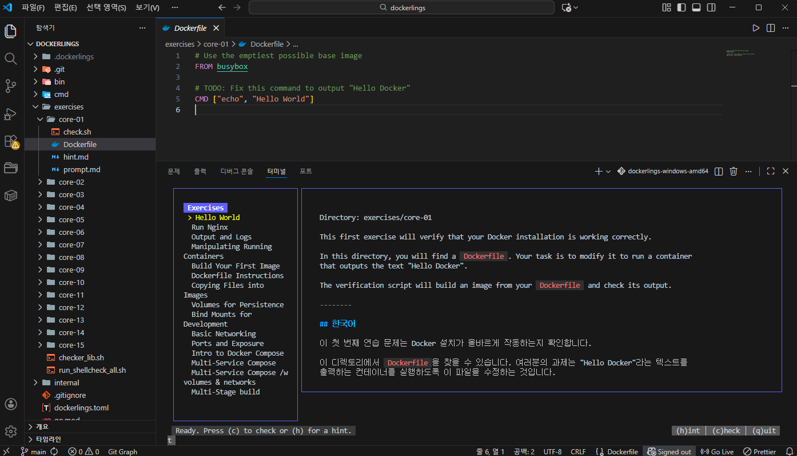

# 3. Docker 연습(insta-front)

## 1. Dockerlings 저장소 클론

```bash
gitclone https://github.com/SESAC-SD3/dockerlings.git
```

- Docker 연습용 문제들이 포함된 저장소
- 단계별로 Docker 기본 개념을 학습 가능

---

## 2. Dockerlings 실행 (Windows)

```bash
./bin/dockerlings-windows-amd64.exe watch
```

### 실행 설명

- `watch` 모드: 문제 진행 상황을 실시간으로 감시
- 각 문제를 해결하면 자동으로 다음 단계로 이동

---

## 3. 실습 화면 안내



- 터미널 기반 인터랙티브 학습
- 현재 풀어야 할 Docker 문제와 설명 표시

### 사용 가능한 단축키

| 키 | 기능 |
| --- | --- |
| `c` | 정답 확인 |
| `h` | 힌트 보기 |
| `q` | Dockerlings 종료 |

---

## 4. 정답 검증 및 상세 피드백 확인

```bash
cd exercises/core-01
bash check.sh
```

### check.sh 역할

- 문제 해결 여부 자동 검사
- 틀린 부분에 대한 상세 피드백 제공
- Docker 명령어 사용 방식 검증

---

# Docker 이미지 빌드 및 레포지토리 Push 정리

## 1. Dockerfile 작성

```docker
FROM alpine:latest
RUN echo "hello docker" > /hello.txt
CMD ["cat", "/hello.txt"]
```

### Dockerfile 설명

- **FROM alpine:latest**
    
    → 경량 리눅스 이미지인 Alpine 사용
    
- **RUN**
    
    → 이미지 빌드 시 `/hello.txt` 파일 생성
    
- **CMD**
    
    → 컨테이너 실행 시 `/hello.txt` 내용 출력
    

---

## 2. 이미지 네이밍 규칙

```
본인도커이름/이미지이름:버전
```

- **본인도커이름**: `docker login` 시 사용하는 Username
- **이미지이름**: 자유롭게 지정
- **버전**: 보통 `1.0.0`, `latest` 등 사용

### 예시

```
username/hello:1.0.0
```

---

## 3. Docker 이미지 빌드

```bash
docker build -t username/hello:1.0.0 .
```

- `t` : 이미지 태그 지정
- `.` : 현재 디렉토리의 Dockerfile 사용

---

## 4. Docker 이미지 실행

```bash
docker run username/hello:1.0.0
```

### 실행 결과


→ Dockerfile의 `CMD` 명령어가 실행됨

---

## 5. Docker Hub 로그인

```bash
docker login
```

- Docker Hub 계정의 **Username / Password** 입력
    
    
    

---

## 6. Docker 레포지토리에 이미지 Push

```bash
docker push username/hello:1.0.0
```

- 로컬에서 빌드한 이미지를 Docker Hub 레포지토리에 업로드


### 7. Docker 레포지토리에서 이미지 pull

`docker rmi username/hello:1.0.0`

`docker pull username/hello:1.0.0`

`docker run --rm username/hello:1.0.0`

## 8. 연습(insta-back)

### Dockerfile

```docker
# ====== 빌드 스테이지 ======
FROM gradle:8-jdk21 AS builder
WORKDIR /app

# 의존성 파일만 먼저 복사
COPY build.gradle settings.gradle ./

RUN gradle dependencies

# 소스 코드 복사
COPY src ./src
RUN gradle build -x test

# ====== 실행 스테이지 ======
FROM eclipse-temurin:21-jdk-alpine

WORKDIR /app

COPY --from=builder /app/build/libs/*.jar app.jar

CMD ["java", "-jar", "app.jar"]
```

### docker-compose.yml

```yaml
services:
  db:
    image: mysql:8
    container_name: insta-mysql
    volumes:
      - mysql-data:/var/lib/mysql
    environment:
      MYSQL_ROOT_PASSWORD: password
      MYSQL_DATABASE: instagram
    ports:
      - "3308:3306"
    healthcheck:
      test: ["CMD", "mysqladmin", "ping", "-h", "localhost"]
      interval: 10s
      timeout: 5s
      retries: 5
      start_period: 30s
  api:
    build: .
    **image: username/insta-back:1.0.0**
    container_name: insta-api
    environment:
      SPRING_PROFILES_ACTIVE: docker
      MYSQL_USER: ${MYSQL_USER}
      MYSQL_PASSWORD: ${MYSQL_PASSWORD}
      KAKAO_CLIENT_ID: ${KAKAO_CLIENT_ID}
      KAKAO_CLIENT_SECRET: ${KAKAO_CLIENT_SECRET}
    ports:
      - "8080:8080"
    depends_on:
      db:
        condition: service_healthy
    restart: unless-stopped

volumes:
  mysql-data:
```

`docker compose build api`

`docker compose push api`


하나의 컴퓨터의 다중 컨테이너(FE/BE)

insta-docker-compose 폴더에 FE/BE 각각 클론


FE : `npm install` 실행

`npm start` 후 [`localhost:3000/login`](http://localhost:3000/login) 

아래 화면처럼 렌더링 되는지 확인


react →**정적 파일**로 변경→ html → **nginx(서빙)** → 서버로 전달할 예정

`npm run build`


### nginx.conf

```docker
server{
  listen 80;
  root /usr/share/nginx/html;

  location /api/ {
      proxy_pass http://api:8080/api/;
  }

  location /uploads/ {
      proxy_pass http://api:8080/uploads/;
  }

  location / {
      try_files $uri $uri/ /index.html;
  }
}
```

### Dockerfile

```docker
# build
FROM node:20-alpine AS builder
WORKDIR /app
COPY package.json ./
COPY package-lock.json ./
RUN npm install
COPY . .
RUN npm run build

# prod
FROM nginx:alpine
COPY nginx.conf /etc/nginx/conf.d/default.conf
COPY --from=builder /app/build /usr/share/nginx/html
EXPOSE 80
CMD [ "nginx", "-g", "daemon off;" ]
```

- npm ci : clean install (기본 패키지 삭제 후 다시 설치) ⇒ 나의 경우 ci오류로 npm install로 진행
- npm install : 기존 패키지 있는 경우 update 없으면 설치

### .dockerignore

```docker
node_modules
.git
.gitignore
Dockerfile
npm-debug.log
.env
build
dist
```

`docker build -t insta-front .` 


`docker run -d --name insta-front -p 80:80 insta-front`