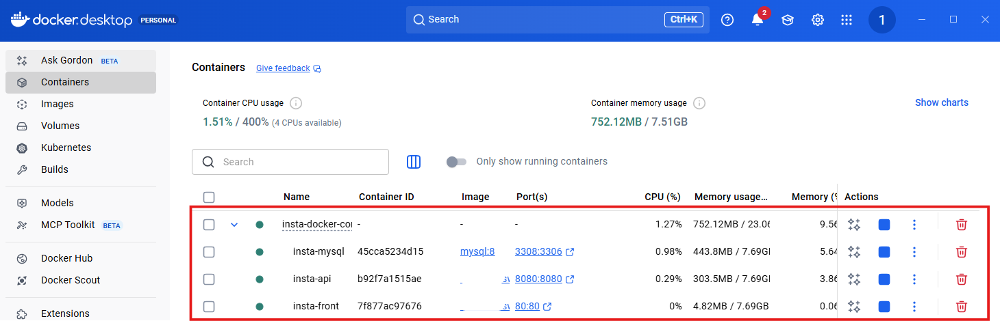

# 4. AWS EC2 배포 및 GitHub Actions 기반 CI/CD 파이프라인 구축

### insta/docker-compose

docker-compose.yml

```yaml
services:
  db:
    image: mysql:8
    container_name: insta-mysql
    volumes:
      - mysql-data:/var/lib/mysql
    environment:
      MYSQL_ROOT_PASSWORD: ${MYSQL_ROOT_PASSWORD}
      MYSQL_DATABASE: instagram
    ports:
      - "3308:3306"
    healthcheck:
      test: ["CMD", "mysqladmin", "ping", "-h", "localhost"]
      interval: 10s
      timeout: 5s
      retries: 5
      start_period: 30s
  api:
    image: 123rkdduswn/insta-back:latest
    container_name: insta-api
    environment:
      SPRING_PROFILES_ACTIVE: docker
      MYSQL_USER: ${MYSQL_USER}
      MYSQL_PASSWORD: ${MYSQL_PASSWORD}
      KAKAO_CLIENT_ID: ${KAKAO_CLIENT_ID}
      KAKAO_CLIENT_SECRET: ${KAKAO_CLIENT_SECRET}
    ports:
      - "8080:8080"
    depends_on:
      db:
        condition: service_healthy
    restart: unless-stopped
  front:
    image: 123rkdduswn/insta-front:latest
    container_name: insta-front
    ports:
      - "80:80"
    depends_on:
      - api

volumes:
  mysql-data:
```

### insta-back 실행

`docker compose up -d`

### insta-front 실행

`docker build -t insta-front .`

src/api/index.js 수정

```jsx
// 하나의 컴퓨터에 FE/BE 각각의 컨테이너를 생성 즉, 동일한 도메인 사용
// export const API_URL = process.env.REACT_APP_API_URL || 'http://localhost:8080';
// ?? : 빈 문자열의 경우 앞에 값을 사용
export const API_URL = process.env.REACT_APP_API_URL ?? "http://localhost:8080";
```

Dockerfile

```docker
# build
FROM node:20-alpine AS builder
WORKDIR /app
**# ARG -> 빌드 단계에서 환경변수 적용
ARG REACT_APP_API_URL=""
# ENV -> 실행할 때 환경변수 사용
ENV REACT_APP_API_URL=$REACT_APP_API_URL**
COPY package.json ./
COPY package-lock.json ./
RUN npm install
COPY . .
RUN npm run build

# prod
FROM nginx:alpine
COPY nginx.conf /etc/nginx/conf.d/default.conf
COPY --from=builder /app/build /usr/share/nginx/html
EXPOSE 80
CMD [ "nginx", "-g", "daemon off;" ]
```

SecurityConfig (nginx를 통해서만 접근)

```java
@Bean
    public CorsConfigurationSource corsConfigurationSource() {
        CorsConfiguration configuration = new CorsConfiguration();
        **// configuration.setAllowedOrigins(List.of("http://localhost:3000"));**
        **configuration.setAllowedOriginPatterns(List.of("*"));//모든 도메인 허용**
        configuration.setAllowedMethods(List.of("GET", "POST", "PUT", "DELETE", "PATCH", "OPTIONS"));
        configuration.setAllowedHeaders(List.of("*"));
        configuration.setAllowCredentials(true);

        UrlBasedCorsConfigurationSource source = new UrlBasedCorsConfigurationSource();
        source.registerCorsConfiguration("/**", configuration);
        return source;
    }
```

`docker compose up --build -d`

`docker compose down -v` (초기 데이터 설정으로 볼륨도 같이 삭제)

`docker compose up -d`

mysql이 켜지는데 시간 소요



### Docker hub에 이미지 push

`docker compose push api`

`docker compose push front`


### AWS EC2(Amazon Elastic Compute Cloud) : 컴퓨터 임대 서비스

1. EC2

   

2. 인스턴스 생성

   

   인스턴스 시작

   

   이름 및 태그

   

   OS 선택 : Ubuntu

   

   아키텍처: 64비트(x86) (만약 CPU가 AMD인 경우 AMD로 선택)

   

   인스턴스 유형: t2.small (본인 선택 - 요금)

   

   새 키 페어 생성

   

   키 페어 이름 설정 > 유형(RSA) > 프라이빗 키 파일 형식(.pem)

   

   다운로드 폴더에 `sd3.pem` 파일 생성 > 최상위 폴더에 복사 (보통 키 전용 폴더에 넣음)

   

   

   인터넷에서 HTTP 트래픽 허용 체크 > 인스턴스 시작

   

   모든 인스턴스 보기 > 내가 만든 인스턴스 확인 가능

   

   ### 접속

   인스턴스 선택 > 보안

   22포트 : SSH(접속 프로그램)

   80포트 : nginx(웹 서버)

   

   인스턴스 > 인스턴스 ID > 퍼블릭 IPv4주소 복사

   

   `ssh -i ~/sd3.pem ubuntu@[복사한 주소IP]`

   

   접속 성공(window)

   ```bash
   # mac의 경우 권한 설정 필요
   chmod 400 ~/sd3.pem
   ssh -i ~/sd3.pem ubuntu@[복사한 주소IP]
   ```

   

   도커 설치 및 내가 만들어 놓은 이미지 pull 받을 예정

   ssh를 사용해 터미널로 접근한 방식(`exit` 종료)

   편의성을 위해 vsCode에서 **Remote -SSH** 확장 프로그램 설치(GUI 형식)

   

   

   `config` 파일 수정

   ```bash
   # Read more about SSH config files: https://linux.die.net/man/5/ssh_config
   Host insta-ec2
       HostName 인스턴스IP
       User ubuntu
       IdentityFile ~/sd3.pem # 키 파일 위치
   ```

   insta-ec2 >Connect in New window > Linux 선택

   

   `/home/ubuntu` 파일 열기

   

   접속 성공

   - EC2의 퍼블릭 IPv4주소의 경우 변경 가능

### 도커 설치

Developers > Documentation > Manuals > Docker Engine > Install > Ubuntu

[https://docs.docker.com/engine/install/ubuntu/#install-using-the-convenience-script](https://docs.docker.com/engine/install/ubuntu/#install-using-the-convenience-script)


도커 엔진 설치

`curl -fsSL [https://get.docker.com](https://get.docker.com/) -o [get-docker.sh](http://get-docker.sh/)`

`sudo sh ./get-docker.sh --dry-run`

`sudo sh [get-docker.sh](http://get-docker.sh/)`

`docker --version` : 버전 확인


`docker run --rm alpine` : 권한 없음 발생


`sudo usermod -aG docker ubuntu` : 권한 부여

`newgrp docker` : 도커 사용 그룹 생성

`docker run --rm alpine` : 재시도 성공(로그인 필요)

mac의 경우 플랫폼 설정 변경

- docker-compose.yml에서 `platform: linux/amd64` 추가
- 다시 빌드 `docker compose build api` , `docker compose build front` 후 docker hub에 다시 push

`docker push username/insta-front:latest`

`docker push username/insta-back:latest`

docker hub에 이미지 push


이제 ssh에서 insta폴더 생성 > docker-compose.yml (이전 insta의 yml에서 build부분 제거)

- docker-compose.yml

  ```yaml
  services:
    db:
      image: mysql:8
      container_name: insta-mysql
      volumes:
        - mysql-data:/var/lib/mysql
      environment:
        MYSQL_ROOT_PASSWORD: ${MYSQL_ROOT_PASSWORD}
        MYSQL_DATABASE: instagram
      ports:
        - "3308:3306"
      healthcheck:
        test: ["CMD", "mysqladmin", "ping", "-h", "localhost"]
        interval: 10s
        timeout: 5s
        retries: 5
        start_period: 30s
    api:
      build:
        context: ./insta-back
        dockerfile: Dockerfile
      image: 123rkdduswn/insta-back:1.0.0
      container_name: insta-api
      environment:
        SPRING_PROFILES_ACTIVE: docker
        MYSQL_USER: ${MYSQL_USER}
        MYSQL_PASSWORD: ${MYSQL_PASSWORD}
        KAKAO_CLIENT_ID: ${KAKAO_CLIENT_ID}
        KAKAO_CLIENT_SECRET: ${KAKAO_CLIENT_SECRET}
      ports:
        - "8080:8080"
      depends_on:
        db:
          condition: service_healthy
      restart: unless-stopped
    front:
      build:
        context: ./insta-front
        dockerfile: Dockerfile
      image: 123rkdduswn/insta-front:1.0.0
      container_name: insta-front
      ports:
        - "80:80"
      depends_on:
        - api

  volumes:
    mysql-data:
  ```

- .env
  ```yaml
  MYSQL_ROOT_PASSWORD=비밀번호
  MYSQL_USER=사용자
  MYSQL_PASSWORD=비밀번호
  KAKAO_CLIENT_ID=kakao ID
  KAKAO_CLIENT_SECRET=kakao secret key
  ```

`cd insta`

`docker compose up -d`

`docker compose logs -f api` : 오류 발생 시 로그 확인

**`EC2 IP 주소:80`** 접속 성공


EC2를 통해 대여한 컴퓨터에 내가 기존에 올렸던 docker 이미지를 pull 받은 후 실행되는 것 확인 가능

### 로컬에서 소스 수정 시(ex. 로고 Instagram → Insta 수정)

`docker compose build front`

`docker compose push front` : docker hub에 이미지 다시 push

원격 터미널에서

`docker compose down -v` : 도커 종료(-v: 나의 경우 초기 데이터가 있어 삭제)

`docker compose pull front` : docker hub에 있는 이미지 다시 pull

`docker compose up -d` : 도커 다시 실행


### 파이프라인 - github Action


원격 저장소 주소 추가

`git remote add sesac [https://github.com/username/insta-front.git](https://github.com/username/insta-front.git)`

`git remote add sesac https://github.com/username/insta-back.git`

`.github/workflows/docker.yml` 폴더 및 파일 생성

### docker.yml

```yaml
name: build and push
# trigger : 언제 시작할지
on:
  push:
    branches: [main]
# github 컴퓨터를 사용
jobs:
  build:
    runs-on: ubuntu-latest
    steps:
      - name: checkout
        uses: actions/checkout@v4

      - name: login to docker hub
        uses: docker/login-action@v3
        with:
          username: ${{secrets.DOCKERHUB_ID}}
          password: ${{secrets.DOCKERHUB_PW}}

        # context 도커 파일 위치
      - name: build and push
        uses: docker/build-push-action@v6
        with:
          context: .
          push: true
          tags: ${{secrets.DOCKERHUB_ID}}/insta-front:latest

      - name: pull and compose up
        uses: appleboy/ssh-action@v1
        with:
          host: ${{secrets.EC2_IP}}
          username: ubuntu
          key: ${{secrets.EC2_PEM}}
          script: |
            cd ~/insta
            docker compose pull
            docker compose up -d --remove-orphans
            docker image prune -f
```

[https://github.com/marketplace](https://github.com/marketplace)

Actions > All actions


Checkout : 내 코드를 복제


SeSAC-insta-front 레포지토리>settings > secrets > actions > New repository secret


docker hub > account settings > **Personal access tokens >generate new token**


**DOCKERHUB_ID : 도커 username**

**DOCKERHUB_PW : personal access token**


`git add .`

`git commit -m "msg"`

`git push sesac main`


github action이 성공적으로 빌드됐다면 docker hub에서 push 이력을 확인


이제 코드 수정 시 github가 build and push 작업 실행

### Github Action에서 EC2의 SSH를 접속을 통한 배포


`docker.yml` 아래 내용 추가

```yaml
- name: pull and compose up
        uses: appleboy/ssh-action@v1
        with:
          host: ${{secrets.EC2_IP}}
          username: ubuntu
          key: ${{secrets.EC2_PEM}}
          script: |
            cd ~/insta
            docker compose pull
            docker compose up -d --remove-orphans
            docker image prune -f
```


EC2_IP : EC2 인스턴스의 **퍼블릭 IPv4 주소**

EC2_PEM: EC2에서 발급받은 PEM파일을 txt로 열어서 복붙

`git add .`

`git commit -m "msg"`

`git push sesac main`


앞으로 github에 add, commit, push하면 Github Action이 도커에 수정된 이미지를 push하고 EC2 SSH를 통한 배포까지 한 번에 끝!!

insta-back도 동일하게 진행

- .github/workflows/docker.yml

  ```yaml
  name: build and push
  # trigger : 언제 시작할지
  on:
    push:
      branches: [main]
  # github 컴퓨터를 사용
  jobs:
    build:
      runs-on: ubuntu-latest
      steps:
        - name: checkout
          uses: actions/checkout@v4

        - name: login to docker hub
          uses: docker/login-action@v3
          with:
            username: ${{secrets.DOCKERHUB_ID}}
            password: ${{secrets.DOCKERHUB_PW}}

          # context 도커 파일 위치
        - name: build and push
          uses: docker/build-push-action@v6
          with:
            context: .
            push: true
            tags: ${{secrets.DOCKERHUB_ID}}/insta-back:latest

        - name: pull and compose up
          uses: appleboy/ssh-action@v1
          with:
            host: ${{secrets.EC2_IP}}
            username: ubuntu
            key: ${{secrets.EC2_PEM}}
            script: |
              cd ~/insta
              docker compose pull
              docker compose up -d --remove-orphans
              docker image prune -f
  ```


정상적으로 잘 끝났다면 docker hub의 insta-back에서 update 확인


```
services:
  db:
    image: mysql:8
    container_name: insta-mysql
    volumes:
      - mysql-data:/var/lib/mysql
    environment:
      MYSQL_ROOT_PASSWORD: ${MYSQL_ROOT_PASSWORD}
      MYSQL_DATABASE: instagram
    ports:
      - "3308:3306"
    healthcheck:
      test: ["CMD", "mysqladmin", "ping", "-h", "localhost"]
      interval: 10s
      timeout: 5s
      retries: 5
      start_period: 30s
  api:
    image: 123rkdduswn/insta-back:latest
    container_name: insta-api
    environment:
      SPRING_PROFILES_ACTIVE: docker
      MYSQL_USER: ${MYSQL_USER}
      MYSQL_PASSWORD: ${MYSQL_PASSWORD}
      KAKAO_CLIENT_ID: ${KAKAO_CLIENT_ID}
      KAKAO_CLIENT_SECRET: ${KAKAO_CLIENT_SECRET}
    ports:
      - "8080:8080"
    depends_on:
      db:
        condition: service_healthy
    restart: unless-stopped
  front:
    image: 123rkdduswn/insta-front:latest
    container_name: insta-front
    ports:
      - "80:80"
    depends_on:
      - api

volumes:
  mysql-data:

```
