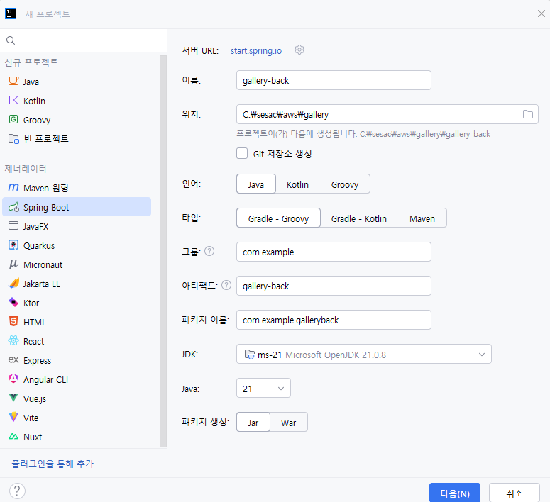

# 5. AWS EC2 와 RDS (gallery배포)

dev, prod 나눠서 작업

### EC2 : 컴퓨터 대여

### RDS : 데이터베이스가 설치된 컴퓨터 대여

### S3 : 외부 저장소에 이미지 업로드 (다음주 작업)

1. dev
    
    gallery CRUD 작업
    
    
    
    
    

1. github 레포지토리 생성
    
    ```yaml
    # 1. Initialize the local directory as a Git repository
    git init
    
    # 2. Add the remote origin (the command that failed previously)
    git remote add origin https://github.com/qqqkyj/SeSAC-gallery-back.git
    
    # 3. Stage all your files for the first commit
    git add .
    
    # 4. Create your initial commit
    git commit -m "Initial commit"
    
    git push origin main
    ```
    

1. front 소스 fork
    
    [`https://github.com/qqqkyj/SeSAC-gallery-front.git`](https://github.com/qqqkyj/SeSAC-gallery-front.git)
    
    
    
    vsCode로 gallery-front폴더 오픈
    
    `npm install`
    
    `npm run dev` : 실행 확인
    
    [`http://localhost:5173`](http://localhost:5173/)
    
    `.env` 파일 생성
    
    ```yaml
    VITE_API_URL=http://localhost:8080/api
    VITE_IMAGE_URL=http://localhost:8080
    ```
    

1. back 소스
    
    dev: docker mysql container 사용
    
    prod: rds 사용
    
    `application.properties`
    
    ```yaml
    spring.application.name=gallery-back
    
    #A:B => A값이 없으면 B를 기본값으로 사용
    spring.datasource.url=jdbc:mysql://${DB_HOST:localhost}:${DB_PORT:3306}/${DB_NAME:gallery}
    spring.datasource.username=${DB_USERNAME:root}
    spring.datasource.password=${DB_USERNAME:password}
    
    #jpa
    spring.jpa.hibernate.ddl-auto=update
    
    spring.servlet.multipart.max-file-size=10MB
    spring.servlet.multipart.max-request-size=10MB
    upload.path=uploads
    ```
    
2. gallery폴더를 vsCode로 실행
    
    `docker-compose.dev.yml` (개발) ⇒ 로컬에서 도커의 mysql 컨테이너 사용을 위해 생성
    
    ```yaml
    services:
      db:
        image: mysql:8.0
        container_name: gallery-db
        environment:
          MYSQL_ROOT_PASSWORD: root
          MYSQL_DATABASE: gallery
        ports:
          - "3300:3306"
        volumes:
          - gallery_mysql_data:/var/lib/mysql
    
    volumes:
      gallery_mysql_data:
    ```
    
    docker desktop 실행
    
    `docker compose -f docker-compose.dev.yml up -d`
    
    
    
    `docker-compose.yml` : prod
    
    ```yaml
    services:
      frontend:
        build: ./SeSAC-gallery-front
        **image: 123rkdduswn/gallery-front:latest**
        ports:
          - "80:80"
        depends_on:
          - backend
      backend:
        build: ./gallery-back
        **image: 123rkdduswn/gallery-back:latest**
        environment:
          - DB_HOST=db
          - DB_PORT=3306
          - DB_NAME=gallery
          - DB_USERNAME=root
          - DB_PASSWORD=root
        depends_on:
          db:
            condition: service_healthy
        volumes:
          - uploads:/app/uploads
      db:
        image: mysql:8.0
        environment:
          MYSQL_ROOT_PASSWORD: root
          MYSQL_DATABASE: gallery
        volumes:
          - mysql_data:/var/lib/mysql
        healthcheck:
          test: ["CMD", "mysqladmin", "ping", "-h", "localhost"]
          interval: 10s
          timeout: 5s
          retries: 5
    
    volumes:
      mysql_data:
      uploads: 
    ```
    
    `docker compose up -d`
    
    `docker compose build`
    
    
    
    entity, dto, repository, service, controller, config 등 구현
    
    gallery-back폴더에 Dockerfile파일 생성
    
    ### Dockerfile
    
    ```docker
    # build
    #jdk: java development kit
    FROM eclipse-temurin:21-jdk AS build
    WORKDIR /app
    
    COPY gradlew .
    COPY gradle gradle
    COPY build.gradle .
    COPY settings.gradle .
    
    RUN chmod +x ./gradlew
    RUN ./gradlew dependencies -x test --no-daemon
    
    COPY src src
    RUN ./gradlew build -x test --no-daemon
    
    # run
    #jre: java run evironment
    FROM eclipse-temurin:21-jre
    WORKDIR /app
    
    COPY --from=build /app/build/libs/*.jar app.jar
    
    RUN mkdir -p /app/uploads
    EXPOSE 8080
    # CMD : 명령어 덮어쓰기
    # ENTRYPOINT : 무조건 해당 명령어로 실행 (덮어쓰기 X)
    ENTRYPOINT ["java", "-jar", "app.jar"]
    ```
    
    ### .dockerignore
    
    ```yaml
    .git
    .gitignore
    .idea
    build
    .gradle
    uploads
    ```
    

gallery-back 소스 빌드

`docker build -t username/gallery-back:1.0.0 .`


`docker run -d --name gallery-back username/gallery-back:1.0.0`

gallery-front

### Dockerfile

```docker
#build
FROM node:20-alpine AS build
WORKDIR /app

COPY package.json .
RUN npm install

COPY . .
RUN npm run build

#run
FROM nginx:alpine
COPY --from=build /app/dist /usr/share/nginx/html
COPY nginx.conf /etc/nginx/conf.d/default.conf

EXPOSE 80

CMD [ "nginx", "-g", "daemon off;"]
```

### .dockerignore

```docker
node_modules
dist
.git
.gitignore
.env
```

### nginx.conf

```docker
server{
  listen 80;
  server_name localhost;
  root /usr/share/nginx/html;

  location /uploads {
    proxy_pass http://backend:8080;
    proxy_set_header Host $host;
  }

  location /api {
    proxy_pass http://backend:8080;
    proxy_set_header Host $host;
  }

  location / {
    # /index.html
    # /assets/js/asdf.js
    # /assets/css/asdf.css
    try_files $uri $uri/ /index.html;
  }
}
```

`docker build -t gallery-frontend .`

`docker run -d gallery-frontend`

1. AWS EC2 인스턴스 생성
    
    
    
    인스턴스 시작
    
    
    
    모든 인스턴스 보기
    
    
    
    vsCode에서 SSH 오픈
    
    
    
    SSH 오른쪽 톱니바퀴 클릭 > C:\Users\user\.ssh\config
    
    ```docker
    Host gallery-ec2
        HostName 43.201.116.32
        User ubuntu
        IdentityFile ~/sd3.pem
    ```
    
    gallery-ec2 오른쪽에 connect in new window클릭 > Linux > /home/ubuntu
    
    
    
    터미널 open : `Ctrl+`` 
    
    최상위 폴더인 gallery에서 build 했던 이미지를 docker hub에 push
    
    
    
    `docker push 123rkdduswn/gallery-back:latest`
    
    `docker push 123rkdduswn/gallery-front:latest`
    
    
    
    
    
    기존 `docker-compose.yml` 을 복사한 뒤 build부분 삭제(docker hub에 push했던 이미지를 사용)
    
    **`docker-compose.prod.yml`**
    
    ```yaml
    services:
      frontend:
        image: 123rkdduswn/gallery-front:latest
        ports:
          - "80:80"
        depends_on:
          - backend
      backend:
        image: 123rkdduswn/gallery-back:latest
        environment:
          - DB_HOST=db
          - DB_PORT=3306
          - DB_NAME=gallery
          - DB_USERNAME=root
          - DB_PASSWORD=root
        depends_on:
          db:
            condition: service_healthy
        volumes:
          - uploads:/app/uploads
      db:
        image: mysql:8.0
        environment:
          MYSQL_ROOT_PASSWORD: root
          MYSQL_DATABASE: gallery
        volumes:
          - mysql_data:/var/lib/mysql
        healthcheck:
          test: ["CMD", "mysqladmin", "ping", "-h", "localhost"]
          interval: 10s
          timeout: 5s
          retries: 5
    
    volumes:
      mysql_data:
      uploads: 
    ```
    
    위 파일을 복사해서 SSH에 `docker-compose.yml`에 붙여넣기
    
    
    
    ### 도커 설치
    
    Developers > Documentation > Manuals > Docker Engine > Install > Ubuntu 
    
    [https://docs.docker.com/engine/install/ubuntu/#install-using-the-convenience-script](https://docs.docker.com/engine/install/ubuntu/#install-using-the-convenience-script)
    
    
    
    도커 엔진 설치 
    
    `curl -fsSL [https://get.docker.com](https://get.docker.com/) -o [get-docker.sh](http://get-docker.sh/)`
    
    `sudo sh ./get-docker.sh --dry-run`
    
    `sudo sh [get-docker.sh](http://get-docker.sh/)` 
    
    `docker --version` : 버전 확인
    
    
    
    `docker run --rm alpine` : 권한 없음 발생
    
    
    
    `sudo usermod -aG docker ubuntu` : 권한 부여
    
    `newgrp docker` : 도커 사용 그룹 생성
    
    `docker run --rm alpine` : 재시도 성공(로그인 필요)
    

`mkdir gallery` : gallery 폴더 생성

`cd gallery` : gallery 폴더로 이동

`docker compose up -d` : 실행

[`http://43.201.116.32](http://43.201.116.32/):80` : 접속 성공


EC2 컨테이너에서 db빼고 RDS 사용 예정


### AWS RDS(Relational Database Service) : DB가 설치된 또 다른 컴퓨터 대여

- 아마존 웹 서비스(AWS)에서 제공하는 **관리형 관계형 데이터베이스 서비스**
- DB 서버를 직접 설치·관리하지 않아도 되는 클라우드 DB


EC2 gallery 인스턴스의 보안 그룹 이름과 동일하게 RDS의 기존 VPC 보안 그룹에 설정

`launch-wizard4` (my-gallery 인스턴스의 보안 그룹 이름)


데이터베이스 > gallery-db > 연결 및 보안 > 보안 그룹


인바운드 규칙 추가 


SSH의 docker-compose.yml 수정

`docker-compose.yml`

```yaml
services:
  frontend:
    image: 123rkdduswn/gallery-front:latest
    ports:
      - "80:80"
    depends_on:
      - backend
  backend:
    image: 123rkdduswn/gallery-back:latest
    environment:
      - DB_HOST=gallery-db.ct2gaqocas8h.ap-northeast-2.rds.amazonaws.com
      - DB_PORT=3306
      - DB_NAME=gallery
      - DB_USERNAME=admin
      - DB_PASSWORD=password
    # depends_on:
    #   db:
    #     condition: service_healthy
    volumes:
      - uploads:/app/uploads
  # db:
  #   image: mysql:8.0
  #   environment:
  #     MYSQL_ROOT_PASSWORD: root
  #     MYSQL_DATABASE: gallery
  #   volumes:
  #     - mysql_data:/var/lib/mysql
  #   healthcheck:
  #     test: ["CMD", "mysqladmin", "ping", "-h", "localhost"]
  #     interval: 10s
  #     timeout: 5s
  #     retries: 5

volumes:
  mysql_data:
  uploads: 
```

`docker compose down` :종료

`docker compose up -d` : 재실행

즉, 기존 로컬에서 사용하던 DB를 AWS의 RDS로 교체(EC2의 부하가 줄어듦)

nginx와 springboot만 돌아가고 있음

[`http://43.201.116.32/`](http://43.201.116.32/) : 접속 성공


### RDS 삭제


