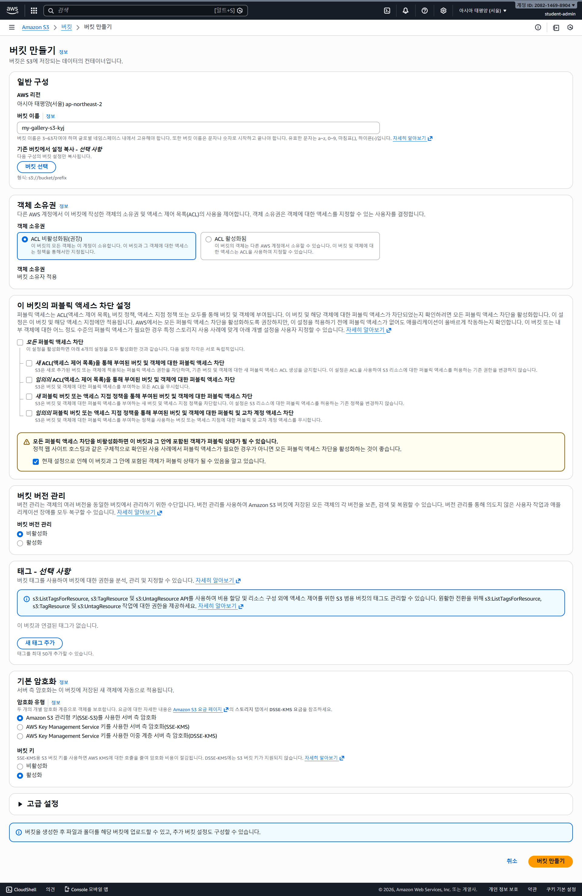

# 6. AWS 인프라 전환: RDS 및 S3 기반 클라우드 고도화

### AWS S3

- 아마존 웹 서비스에서 제공하는 **객체 스토리지 서비스**
- 인터넷상에 데이터를 안전하게 저장하고 언제 어디서든 꺼내 쓸 수 있는 **무한한 용량의 온라인 저장소**



### 버킷 정책 설정

- **버킷(Bucket):** 이 파일(객체)들을 담기 위해 반드시 먼저 만들어야 하는 바구니
- **객체(Object):** 버킷 안에 들어가는 실제 파일(이미지, 영상, 문서 등)

버킷 > 권한 > 버킷 정책 > 편집


Action에 GetObject 추가


리소스 추가


Principal 모든 권한 허용


하단의 변경 사항 저장 클릭

### CORS(Cross-Origin Resource Sharing) 설정

- 웹 브라우저에서 실행되는 스크립트가 **처음 자원을 가져온 도메인(Origin)과 다른 도메인**에 있는 자원에 접근하려고 할 때, 이를 허용할지 말지 결정하는 보안 메커니즘

버킷 > 권한 > CORS(Cross-origin 리소스 공유) > 편집


JSON 작성


```json
[
    {
        "AllowedHeaders": ["*"],
        "AllowedMethods": ["GET", "PUT", "POST", "DELETE"],
        "AllowedOrigins": ["*"],
        "ExposeHeaders":[]
    }
]
```

하단의 변경 사항 저장 클릭

### docker 실행


현재 로컬의 데이터베이스 사용중


[`http://localhost](http://localhost/):80` : 접속 성공


현재는 backend 소스 폴더의 uploads폴더에 이미지를 저장중 

앞으로 S3에 이미지를 업로드 할 수 있도록 변경예정

### AWS IAM

- AWS 리소스에 대한 **'누가(인증)'**, **'무엇을(인가)'** 할 수 있는지를 결정하는 **권한 관리 서비스**
- 버킷에 접근할 수 있는 USER 권한 설정(파일 추가, 삭제, 수정 등)

사용자 생성 > S3 권한 부여


직접 정책 연결 > AmazonS3FullAccess(권한 부여) > 다음


다음 > 사용자 생성


사용자 선택(gallery-s3-user) > 보안 자격 증명 > 액세스 키 > 액세스 키 발급 > AWS 외부에서 실행되는 애플리케이션(Spring에서 사용 예정) > 다음 > 액세스 키 만들기


액세스 키는 프라이빗하게 보관할 것(공유x) ⇒ **`.csv 파일 다운로드`**

secret key는 한 번만 확인 가능


### Backend 소스 수정

`build.gradle` 에 dependencies 추가 후 코끼리로 실행

`implementation 'software.amazon.awssdk:s3:2.25.0'` 


`application.properties`에 아래 내용 추가 (`.env`에 변수 추가할 것)

```bash
cloud.aws.s3.bucket=${S3_BUCKET:}
cloud.aws.region.static=${AWS_REGION:ap-northeast-2}
cloud.aws.credentials.access-key=${AWS_ACCESS_KEY:}
cloud.aws.credentials.secret-key=${AWS_SECRET_KEY:}
```

최상단 폴더>  `.env` 생성 후 `.gitignore` 에 `.env` 추가

AWS_ACCESS_KEY와 AWS_SECRET_KEY는 엑세스 키 생성 시 다운받은  **`.csv 파일`** 

```bash
S3_BUCKET=my-gallery-s3-kyj
AWS_REGION=ap-northeast-2
AWS_ACCESS_KEY=[AWS_ACCESS_KEY]
AWS_SECRET_KEY=[AWS_SECRET_KEY]
```

gallery 폴더의 `docker-compose.yml` 에 환경 변수 파일 위치 추가

```yaml
backend:
    build: ./gallery-back
    image: 123rkdduswn/gallery-back:latest
    environment:
      - DB_HOST=db
      - DB_PORT=3306
      - DB_NAME=gallery
      - DB_USERNAME=root
      - DB_PASSWORD=root
    **env_file:
      - ./gallery-back/.env**
    depends_on:
      db:
        condition: service_healthy
    volumes:
      - uploads:/app/uploads
```

config > **`S3Config`**
`@ConditionalOnProperty(name = "cloud.aws.s3.bucket")`

application.properties파일에 `cloud.aws.s3.bucket` 값이 있으면 해당 클래스를 Bean으로 등록

```java
package com.example.galleryback.config;

import org.springframework.beans.factory.annotation.Value;
import org.springframework.boot.autoconfigure.condition.ConditionalOnProperty;
import org.springframework.context.annotation.Bean;
import org.springframework.context.annotation.Configuration;
import software.amazon.awssdk.auth.credentials.AwsBasicCredentials;
import software.amazon.awssdk.auth.credentials.StaticCredentialsProvider;
import software.amazon.awssdk.regions.Region;
import software.amazon.awssdk.services.s3.S3Client;

@Configuration
@ConditionalOnProperty(name = "cloud.aws.s3.bucket")//특정 설정값(Property)이 존재하거나 특정 조건일 때만 이 클래스를 Bean으로 등록
public class S3Config {
    @Value("${cloud.aws.credentials.access-key}")
    private String accessKey;

    @Value("${cloud.aws.credentials.secret-key}")
    private String secretKey;

    @Value("${cloud.aws.region.static}")
    private String region;

    @Bean
    public S3Client **s3Client**() {
        AwsBasicCredentials credentials = AwsBasicCredentials.create(accessKey, secretKey);

        return S3Client.builder()
                .region(Region.of(region))
                .credentialsProvider(StaticCredentialsProvider.create(credentials))
                .build();
    }
}
```

[https://docs.aws.amazon.com/ko_kr/sdk-for-java/latest/developer-guide/java_s3_code_examples.html](https://docs.aws.amazon.com/ko_kr/sdk-for-java/latest/developer-guide/java_s3_code_examples.html)

service > `S3FileStorageService` 클래스 생성

```java
package com.example.galleryback.service;

import lombok.RequiredArgsConstructor;
import org.springframework.beans.factory.annotation.Value;
import org.springframework.boot.autoconfigure.condition.ConditionalOnProperty;
import org.springframework.context.annotation.Primary;
import org.springframework.stereotype.Service;
import org.springframework.web.multipart.MultipartFile;
import software.amazon.awssdk.core.sync.RequestBody;
import software.amazon.awssdk.services.s3.S3Client;
import software.amazon.awssdk.services.s3.model.DeleteObjectRequest;
import software.amazon.awssdk.services.s3.model.PutObjectRequest;

import java.io.IOException;
import java.util.UUID;

@Service
@Primary // 구현체 중 이 클래스를 최우선으로 주입
@ConditionalOnProperty(name = "cloud.aws.s3.bucket")//특정 설정값(Property)이 존재하거나 특정 조건일 때만 이 클래스를 Bean으로 등록
@RequiredArgsConstructor
public class S3FileStorageService implements FileStorageService{

    private final S3Client s3Client;

    @Value("${cloud.aws.region.static}")
    private String region;

    @Value("${cloud.aws.s3.bucket}")
    private String bucket;

    @Override
    public String uploud(MultipartFile file)
    {
        try
        {
            String key = "uploads/" + UUID.randomUUID() + "_" + file.getOriginalFilename();
            PutObjectRequest request = PutObjectRequest.builder()
                    .bucket(bucket)
                    .key(key)
                    .contentType(file.getContentType())
                    .build();

            s3Client.**putObject**(request, RequestBody.fromInputStream(file.getInputStream(), file.getSize()));

            return "https://" + bucket + ".s3." + region + ".amazonaws.com/" + key; //실제 저장 위치
        }
        catch (IOException e)
        {
            throw new RuntimeException(e);
        }
    }

    @Override
    public void delete(String imageUrl) {
        String prefix = "https://" + bucket + ".s3." + region + ".amazonaws.com/";
        //https://my-gallery-s3-kyj.s3.ap-northeast-2.amazonaws.com/uploads/91654294-85f9-4589-ab2a-975853cb7ee2_%EB%BD%80.png
        //key = uploads/91654294-85f9-4589-ab2a-975853cb7ee2_%EB%BD%80.png
        String key = imageUrl.replace(prefix,"");

        DeleteObjectRequest deleteObjectRequest = DeleteObjectRequest.builder()
                .bucket(bucket)
                .key(key)
                .build();

        s3Client.**deleteObject**(deleteObjectRequest);
    }
}
```

`docker compose down`

`docker compose up -d --build`


S3에 이미지 업로드 성공

`docker compose push` : 수정된 소스 docker hub에 push

### AWS EC2

인스턴스 생성


새롭게 생성한 인스턴스의 퍼블릭 IPv4주소를 SSH에 등록


### 도커 설치

Developers > Documentation > Manuals > Docker Engine > Install > Ubuntu 

[https://docs.docker.com/engine/install/ubuntu/#install-using-the-convenience-script](https://docs.docker.com/engine/install/ubuntu/#install-using-the-convenience-script)


도커 엔진 설치 

`curl -fsSL [https://get.docker.com](https://get.docker.com/) -o [get-docker.sh](http://get-docker.sh/)`

`sudo sh ./get-docker.sh --dry-run`

`sudo sh [get-docker.sh](http://get-docker.sh/)` 

`docker --version` : 버전 확인


`docker run --rm alpine` : 권한 없음 발생


`sudo usermod -aG docker ubuntu` : 권한 부여

`newgrp docker` : 도커 사용 그룹 생성

`docker run --rm alpine` : 재시도 성공(로그인 필요)

`mkdir app`: app폴더 생성

`cd app`: app폴더로 이동

app폴더에 기존에 생성했던 `.env` , `docker-compose.yml` 파일을 복사

`docker-compose.yml` 수정

```yaml
services:
  frontend:
    # build: ./SeSAC-gallery-front
    image: 123rkdduswn/gallery-front:latest
    ports:
      - "80:80"
    depends_on:
      - backend
  backend:
    # build: ./gallery-back
    image: 123rkdduswn/gallery-back:latest
    environment:
      - DB_HOST=db
      - DB_PORT=3306
      - DB_NAME=gallery
      - DB_USERNAME=root
      - DB_PASSWORD=root
    env_file:
      - .env
    depends_on:
      db:
        condition: service_healthy
    volumes:
      - uploads:/app/uploads
  db:
    image: mysql:8.0
    environment:
      MYSQL_ROOT_PASSWORD: root
      MYSQL_DATABASE: gallery
    volumes:
      - mysql_data:/var/lib/mysql
    healthcheck:
      test: ["CMD", "mysqladmin", "ping", "-h", "localhost"]
      interval: 10s
      timeout: 5s
      retries: 5

volumes:
  mysql_data:
  uploads:
```

`docker compose up -d` : 실행 (`cd app` 상태에서 실행할 것)

[`http://13.125.230.112/`](http://13.125.230.112/) : 실행 성공


### EC2 로그 보는 법

`docker ps` : 실행중인 컨테이너 확인

`docker logs -f --tail 100 app-backend-1`

### AWS RDS


RDS 생성


my-gallery-db > 보안 그룹 > 인바운드 규칙 편집


EC2 (my-gallery)의 보안 그룹 이름을 확인


RDS의 인바운드 규칙에 해당 보안 그룹(launch-wizard-5)을 추가 > 규칙 저장


보안 설정을 통해 **EC2 컴퓨터에서만 RDS에 접근할 수 있도록 설정**

만약 DBeaver로 접근하고 싶다면 EC2를 통해 접근할 수 있다.(DBeaver SSH 터널링 연결 방법)

SSH > HOST(EC2 도메인), User Name(ubuntu),Authentication Method(Public key) , Private key(.pem 경로)

RDS의 엔드포인트로 `docker-compose.yml`의 DB_HOST변경


### docker-compose.yml

- **EC2 경량화 (Resource Optimization):**
    - **DB 컨테이너 제거:** EC2에서 메모리를 가장 많이 잡아먹는 MySQL 컨테이너를 삭제했습니다. 이제 모든 데이터 처리는 외부의 RDS가 담당하므로 EC2의 RAM 사용량이 획기적으로 줄어듭니다.
    - **로컬 빌드 제거:** `build: ./...` 구문을 제거하고 Docker Hub에서 이미지를 직접 `pull` 받도록 설정했습니다. EC2 내에서 빌드 과정을 거치지 않으므로 CPU와 디스크 공간을 아낄 수 있습니다.
    - **로컬 스토리지 볼륨 제거:** `uploads` 볼륨을 제거했습니다. 모든 이미지는 S3로 직접 업로드되므로 EC2의 디스크(EBS) 용량 부족 문제를 방지합니다.
- **S3 전환 준비:**
    - 파일 저장을 위해 사용하던 `volumes: - uploads:/app/uploads` 설정을 삭제했습니다.
    - 이제 백엔드 소스코드 내의 `S3FileStorageService`가 활성화되어 S3로 파일을 보냅니다.
- **환경 변수 관리:**
    - RDS 접속 정보(Host, ID, PW)는 `environment`에 명시하여 관리하기 편하게 구성했습니다.
    - AWS 계정 키(Access Key, Secret Key)와 버킷 이름 등은 `.env` 파일을 통해 주입받도록 하여 보안을 유지했습니다.

```yaml
services:
  frontend:
    # build: ./SeSAC-gallery-front
    image: 123rkdduswn/gallery-front:latest
    ports:
      - "80:80"
    depends_on:
      - backend
  backend:
    # build: ./gallery-back
    image: 123rkdduswn/gallery-back:latest
    environment:
      # - DB_HOST=db
      - DB_HOST=my-gallery-db.ct2gaqocas8h.ap-northeast-2.rds.amazonaws.com
      - DB_PORT=3306
      - DB_NAME=gallery
      - DB_USERNAME=admin
      - DB_PASSWORD=password
    env_file:
      - .env
    # depends_on:
    #   db:
    #     condition: service_healthy
    # volumes:
    #   - uploads:/app/uploads
  # db:
  #   image: mysql:8.0
  #   environment:
  #     MYSQL_ROOT_PASSWORD: root
  #     MYSQL_DATABASE: gallery
  #   volumes:
  #     - mysql_data:/var/lib/mysql
  #   healthcheck:
  #     test: ["CMD", "mysqladmin", "ping", "-h", "localhost"]
  #     interval: 10s
  #     timeout: 5s
  #     retries: 5

# volumes:
#   # mysql_data:
#   uploads:
```

`docker system prune` : 시스템 정리

`docker compose up -d` : 실행

### 도메인 생성


[https://www.duckdns.org/](https://www.duckdns.org/) (무료 도메인 발급 사이트)


도메인 이름 넣고 `add domain` 클릭


IP에 **EC2인스턴스의 IPv4주소** 입력 > update ip


[**`kyj-gallery.duckdns.org`](http://kyj-gallery.duckdns.org/)** : 해당 도메인으로 접근 가능

### SSH 인증서 등록

AWS EC2인스턴스 > 보안 > 보안그룹(launch-wizard-5) > 인바운드 규칙 편집 > 규칙 추가


front 최상위 폴더에 **`nginx.prod.conf`** 파일 생성

```bash
server{
  listen 80;
  server_name _;

  return 301 https://$host$request_uri;
}

server{
  listen 443 ssl;
  server_name _;

  ssl_certificate /etc/nginx/ssl/fullchain.pem;
  ssl_certificate_key /etc/nginx/ssl/privkey.pem;

  root /usr/share/nginx/html;
  index index.html;

  location / {
    try_files $uri $uri/ /index.html;
  }

  location /api {
    proxy_pass http://backend:8080;

    # host => my-gallery.duckdns.org
    proxy_set_header Host $host;
    # 실제 클라이언트 ip
    proxy_set_header X-Real_IP $remote_addr;
    # 원본 프로토콜
    proxy_set_header X-Forwarded-Proto $scheme;
  }
}
```

`docker compose build`

`docker compose push`

SSH 인증서 발급

EC2 컴퓨터 접속 SSH

[https://letsencrypt.org/](https://letsencrypt.org/)

`sudo apt update` : 리눅스 패키지 최신화

`docker compose down` : 80포트에서 사용중인 프로그램 종료 (`cd app` 에서 down)

`sudo apt install -y certbot` : certbot 설치

`certbot --version` : 설치 확인


`sudo certbot certonly --standalone -d [**kyj-gallery.duckdns.org](http://kyj-gallery.duckdns.org/)`** 

본인 이메일 입력

yes

no


인증서 발급 완료

`sudo ls /etc/letsencrypt/live/kyj-gallery.duckdns.org/`


위에서 발급받은 .pem들은 nginx가 사용할 수 있도록 설정 필요

### docker-compose.yml 수정

```yaml
services:
  frontend:
    # build: ./SeSAC-gallery-front
    image: 123rkdduswn/gallery-front:latest
    ports:
      - "80:80"
      **- "443:443"
    volumes:
      - ./nginx.prod.conf:/etc/nginx/conf.d/default.conf
      - /etc/letsencrypt/live/kyj-gallery.duckdns.org/fullchain.pem:/etc/nginx/ssl/fullchain.pem:ro
      - /etc/letsencrypt/live/kyj-gallery.duckdns.org/privkey.pem:/etc/nginx/ssl/privkey.pem:ro**
      # -  /etc/letsencrypt/archive/kyj-gallery.duckdns.org:/etc/letsencrypt/archive/
    depends_on:
      - backend
  backend:
    # build: ./gallery-back
    image: 123rkdduswn/gallery-back:latest
    environment:
      # - DB_HOST=db
      - DB_HOST=my-gallery-db.ct2gaqocas8h.ap-northeast-2.rds.amazonaws.com
      - DB_PORT=3306
      - DB_NAME=gallery
      - DB_USERNAME=admin
      - DB_PASSWORD=password
    env_file:
      - .env
    # depends_on:
    #   db:
    #     condition: service_healthy
    # volumes:
    #   - uploads:/app/uploads
  # db:
  #   image: mysql:8.0
  #   environment:
  #     MYSQL_ROOT_PASSWORD: root
  #     MYSQL_DATABASE: gallery
  #   volumes:
  #     - mysql_data:/var/lib/mysql
  #   healthcheck:
  #     test: ["CMD", "mysqladmin", "ping", "-h", "localhost"]
  #     interval: 10s
  #     timeout: 5s
  #     retries: 5

# volumes:
#   # mysql_data:
#   uploads:
```

front 최상위 폴더에서 만들었던 **`nginx.prod.conf`** 파일을 SSH의 app폴더 안에 복붙하기


`cd app`

`docker compose up -d`

[`https://kyj-gallery.duckdns.org/`](https://kyj-gallery.duckdns.org/) : HTTPS로 접속 성공

