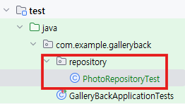

# 7. 테스트 코드 작성과 GitHub Actions 기반 CI/CD 배포 가이드

### BE 소스 (테스트 코드 작성)

단위테스트



`build.gradle` 에 테스트 용 dependencies 추가

```yaml
testRuntimeOnly'com.h2database:h2'
testCompileOnly 'org.projectlombok:lombok'
testAnnotationProcessor 'org.projectlombok:lombok'
```

1.  given : 필요한 데이터 설정
2.  when : 테스트 동작 수행
3.  then : 결과가 일치하는지 확인

**`import static org.assertj.core.api.Assertions.assertThat;` : repository import 시 주의**

**`import static org.mockito.BDDMockito.*;` : service test에서 import 시 주의**

- repository > PhotoRepositoryTest

  ```java
  package com.example.galleryback.repository;

  import com.example.galleryback.entity.Photo;
  import lombok.RequiredArgsConstructor;
  import org.assertj.core.api.Assertions.*;
  import org.junit.jupiter.api.DisplayName;
  import org.junit.jupiter.api.Test;
  import org.springframework.boot.test.autoconfigure.orm.jpa.DataJpaTest;
  import org.springframework.test.context.TestConstructor;

  import java.util.List;

  **import static org.assertj.core.api.Assertions.assertThat;**

  @DataJpaTest
  @RequiredArgsConstructor
  @TestConstructor(autowireMode = TestConstructor.AutowireMode.ALL)
  public class PhotoRepositoryTest {
      private final PhotoRepository photoRepository;

      @Test
      @DisplayName("사진 저장 테스트")
      void save() {
          // given : 필요한 데이터 설정
          Photo photo = Photo.builder()
                  .title("test img")
                  .description("test desc")
                  .imageUrl("/uploads/test.jpg")
                  .build();

          // when : 테스트 동작 수행
          Photo saved = photoRepository.save(photo);

          // then : 결과가 일치하는지 확인
          assertThat(saved.getId()).isNotNull();
          assertThat(saved.getTitle()).isEqualTo("test img");
      }

      @Test
      @DisplayName("사진 목록 조회")
      void findAll(){
          // given
          photoRepository.save(Photo.builder().title("test1 img").description("test1 desc").imageUrl("/uploads/test1.jpg").build());
          photoRepository.save(Photo.builder().title("test2 img").description("test2 desc").imageUrl("/uploads/test2.jpg").build());

          // when
          List<Photo> photos = photoRepository.findAll();

          // then
          assertThat(photos).hasSize(2);
      }
  }
  ```

- service > PhotoServiceTest (로직이 잘 작동하는지)

  ```java
  package com.example.galleryback.service;

  import com.example.galleryback.dto.PhotoResponse;
  import com.example.galleryback.entity.Photo;
  import com.example.galleryback.repository.PhotoRepository;
  import org.junit.jupiter.api.DisplayName;
  import org.junit.jupiter.api.Test;
  import org.junit.jupiter.api.extension.ExtendWith;
  import org.mockito.InjectMocks;
  import org.mockito.Mock;
  import org.springframework.test.context.junit.jupiter.SpringExtension;

  import java.util.List;

  **import static org.assertj.core.api.Assertions.assertThat;
  import static org.mockito.BDDMockito.*;**

  @ExtendWith(SpringExtension.class)
  public class PhotoServiceTest {

      @Mock
      private PhotoRepository photoRepository;

      @Mock
      private FileStorageService fileStorageService;

      @InjectMocks
      private PhotoService photoService;

      @Test
      @DisplayName("사진 목록 조회")
      void findAll() {
          List<Photo> photos = List.of(
              createPhoto("사진1", "/uploads/1.jpg"),
              createPhoto("사진2", "/uploads/2.jpg")
          );

          given(photoRepository.findAll()).willReturn(photos);
          List<PhotoResponse> result = photoService.findAll();
          assertThat(result).hasSize(2);
      }

      @Test
      @DisplayName("사진 상세 조회")
      void findById() {
          Photo photo = createPhoto("test image", "1.jpg");
          given(photoRepository.findById(1L)).willReturn(Optional.of(photo));
          PhotoResponse result = photoService.findById(1L);
          assertThat(result.getTitle()).isEqualTo(photo.getTitle());
          assertThat(result.getImageUrl()).isEqualTo(photo.getImageUrl());
      }

      private Photo createPhoto(String title, String imageUrl) {
          return Photo.builder().title(title).imageUrl(imageUrl).build();
      }
  }
  ```

- controller > PhotoControllerTest (api 호출이 잘 작동하는지)

  ```java
  package com.example.galleryback.controller;

  import com.example.galleryback.dto.PhotoResponse;
  import com.example.galleryback.service.PhotoService;
  import lombok.RequiredArgsConstructor;
  import org.junit.jupiter.api.DisplayName;
  import org.junit.jupiter.api.Test;
  import org.springframework.boot.test.autoconfigure.web.servlet.WebMvcTest;
  import org.springframework.boot.test.mock.mockito.MockBean;
  import org.springframework.test.context.TestConstructor;
  import org.springframework.test.web.servlet.MockMvc;

  **import static org.mockito.BDDMockito.*;
  import static org.springframework.test.web.servlet.request.MockMvcRequestBuilders.get;
  import static org.springframework.test.web.servlet.result.MockMvcResultMatchers.*;**

  import java.util.List;

  @WebMvcTest(PhotoController.class)
  @TestConstructor(autowireMode = TestConstructor.AutowireMode.ALL)
  @RequiredArgsConstructor
  public class PhotoControllerTest {
      private final MockMvc mockMvc;

      @MockBean
      private PhotoService photoService;

      @Test
      @DisplayName("GET /api/photos")
      void list() throws Exception {
          List<PhotoResponse> photos = List.of(
                  PhotoResponse.builder()
                          .id(1L)
                          .title("img1")
                          .imageUrl("1.jpg")
                          .build(),
                  PhotoResponse.builder()
                          .id(2L)
                          .title("img2")
                          .imageUrl("2.jpg")
                          .build()
          );
          given(photoService.findAll()).willReturn(photos);

          mockMvc.perform(get("/api/photos"))
                  .andExpect(status().isOk())
                  .andExpect(jsonPath("$[0].title").value("img1"));
  //                 $:전체 테이터
  //                {id:1, title: "test", }
  //                {id:2, title: "hello", }
      }

  }
  ```

- integration > PhotoIntegrationTest

  ```java
  package com.example.galleryback.integration;

  import com.example.galleryback.entity.Photo;
  import com.example.galleryback.repository.PhotoRepository;
  import com.fasterxml.jackson.databind.ObjectMapper;
  import lombok.RequiredArgsConstructor;
  import org.junit.jupiter.api.DisplayName;
  import org.junit.jupiter.api.Test;
  import org.springframework.boot.test.autoconfigure.web.servlet.AutoConfigureMockMvc;
  import org.springframework.boot.test.context.SpringBootTest;
  import org.springframework.test.context.ActiveProfiles;
  import org.springframework.test.context.TestConstructor;
  import org.springframework.test.web.servlet.MockMvc;
  import org.springframework.transaction.annotation.Transactional;

  import static org.springframework.test.web.servlet.request.MockMvcRequestBuilders.get;
  import static org.springframework.test.web.servlet.result.MockMvcResultMatchers.*;

  @SpringBootTest
  @AutoConfigureMockMvc
  @Transactional
  @TestConstructor(autowireMode = TestConstructor.AutowireMode.ALL)
  @RequiredArgsConstructor
  public class PhotoIntegrationTest {
      private final MockMvc mockMvc;
      private final PhotoRepository photoRepository;
      private final ObjectMapper objectMapper; //json 변환

      @Test
      @DisplayName("사진 목록 조회")
      void getPhotos() throws Exception {
          photoRepository.save(
                  Photo.builder().title("image1").imageUrl("1.jpg").build()
          );
          photoRepository.save(
                  Photo.builder().title("image2").imageUrl("2.jpg").build()
          );

          mockMvc.perform(get("/api/photos"))
                  .andExpect(status().isOk())
                  .andExpect(jsonPath("$[0].title").value("image1"));
      }
  }
  ```

- test > resources > [application.properties](http://application.properties) (테스트용)

  ```java
  spring.application.name=gallery-back

  spring.datasource.url=jdbc:h2:mem:testdb
  spring.datasource.driver-class-name=org.h2.Driver
  spring.datasource.username=sa
  spring.datasource.password=

  #jpa
  spring.jpa.hibernate.ddl-auto=update

  spring.servlet.multipart.max-file-size=10MB
  spring.servlet.multipart.max-request-size=10MB
  upload.path=uploads/
  ```


코끼리 > Tasks > test 더블 클릭 시 만든 테스트 메서드 모두 실행 가능


터미널에서 실행하는 방법 : **`./gradlew test`** 명령어를 입력

default로 생성된 테스트는 사용안할 예정(`@Disabled`)


### CI/CD

최상단 폴더에 **`.github > workflows > cicd.yml`**생성


[https://github.com/marketplace?type=actions](https://github.com/marketplace?type=actions)

- **cicd.yml**

  ```yaml
  name: CI/CD

  on:
    push:
      branches: [main]
    pull_request:
      branches: [main]

  # test -> build -> deploy
  jobs:
    test:
      runs-on: ubuntu-latest

      steps:
        - name: Checkout
          uses: actions/checkout@v4

        - name: Set up jdk 21
          uses: actions/setup-java@v4
          with:
            java-version: "21"
            distribution: "temurin"
            cache: "gradle"

        - name: Permission
          run: chmod +x gradlew

        - name: Run tests
          run: ./gradlew test
    build:
      needs: test
      if: github.event_name == 'push' && github.ref == 'refs/heads/main'
      runs-on: ubuntu-latest

      steps:
        - name: Checkout
          uses: actions/checkout@v4

        - name: Set up Docker Buildx
          uses: docker/setup-buildx-action@v3

        - name: Login to docker hub
          uses: docker/login-action@v3
          with:
            username: ${{secrets.DOCKER_USERNAME}}
            password: ${{secrets.DOCKER_PASSWORD}}

        - name: Build and Push
          uses: docker/build-push-action@v5
          with:
            context: .
            push: true
            tags: |
              ${{secrets.DOCKER_USERNAME}}/gallery-back:latest
              ${{secrets.DOCKER_USERNAME}}/gallery-back:${{github.sha}}
    deploy:
      needs: build
      runs-on: ubuntu-latest

      steps:
        - name: Deploy to EC2
          uses: appleboy/ssh-action@v1.0.3
          with:
            host: ${{secrets.SSH_HOST}}
            username: ${{secrets.SSH_USER}}
            key: ${{secrets.SSH_PRIVATE_KEY}}
            script: |
              cd ~/app
              docker pull $${{secrets.DOCKER_USERNAME}}/gallery-back:latest
              docker compose down
              docker compose up -d
              docker image prune -f
  ```

### docker hub에서 token 발급

[https://hub.docker.com/](https://hub.docker.com/)


Settings > Personal access tokens > Generate new token


발급받은 token(DOCKER_PASSWORD)

github 레포지토리 > settings > Secrets and variables에 등록


### github 원격저장소에 push


테스트를 위해 강제로 테스트 코드의 일부를 틀리게 설정 후 다시 github에 push

아래 처럼 오류 내역 확인이 가능


도커 토큰 발급 후 push


### FE 소스 CI/CD

최상단 폴더에 **`.github > workflows > cicd.yml`**생성

- cicd.yml

  ```yaml
  name: CI/CD

  on:
    push:
      branches: [main]

  jobs:
    build:
      runs-on: ubuntu-latest
      steps:
        - name: Checkout
          uses: actions/checkout@v4

        - name: Set up Node.js
          uses: actions/setup-node@v4
          with:
            node-version: "20"
            cache: "npm"

        - name: Install dependencies
          run: npm ci

        - name: Build
          run: npm run build

    docker:
      needs: build #build 후에 docker 실행
      if: github.event_name == 'push' && github.ref == 'refs/heads/main'
      runs-on: ubuntu-latest
      steps:
        - name: Checkout
          uses: actions/checkout@v4

        - name: Set up Docker Buildx
          uses: docker/setup-buildx-action@v3

        - name: Login to Docker Hub
          uses: docker/login-action@v3
          with:
            username: ${{ secrets.DOCKER_USERNAME }}
            password: ${{ secrets.DOCKER_PASSWORD }}

        - name: Build and Push
          uses: docker/build-push-action@v5
          with:
            context: .
            push: true
            tags: |
              ${{ secrets.DOCKER_USERNAME }}/gallery-front:latest
              ${{ secrets.DOCKER_USERNAME }}/gallery-front:${{ github.sha }}

    deploy:
      needs: docker #docker 후에 deploy 실행
      runs-on: ubuntu-latest
      steps:
        - name: Deploy to EC2
          uses: appleboy/ssh-action@v1.0.3
          with:
            host: ${{ secrets.SSH_HOST }}
            username: ${{ secrets.SSH_USER }}
            key: ${{ secrets.SSH_PRIVATE_KEY }}
            script: |
              cd ~/app
              docker pull ${{ secrets.DOCKER_USERNAME }}/gallery-front:latest
              docker compose down
              docker compose up -d
              docker image prune -f
  ```


back과 동일하게 front도 github 레포지토리 > settings > Secrets and variables에 등록


add, commit, push 하면 github Action 실행


### EC2 인스턴스 생성


FE,BE소스가 모두 있는 최상위 폴더(gallery)에서 SSH에 EC2 등록


gallery-ec2 오른쪽에 새창으로 열기 클릭> 계속 > 폴더 열기 > /home/ubuntu > 확인

### 도커 설치(Ctrl+ ` : 터미널 오픈)

```bash
curl -fsSL https://get.docker.com -o get-docker.sh
sudo sh get-docker.sh
sudo groupadd docker
sudo usermod -aG docker $USER
newgrp docker
docker --version
```

**설치 성공**


BE, FE소스의 .github>workflows>cicd.yml에서 jobs에 deploy부분 작성

github BE 레포지토리 > settings > Secrets and variables > Actions에 아래 3가지 변수 값 추가

[**SSH의 config**에 작성했던 내용 참고할 것]

SSH_HOST : EC2 IPv4

SSH_USER: ubuntu

SSH_PRIVATE_KEY: 발급 받았던 pem파일을 text로 열어서 전체 복붙


add, commit, push


배포 성공

### app > .env

```yaml
S3_BUCKET=my-gallery-s3-kyj
AWS_REGION=ap-northeast-2
AWS_ACCESS_KEY=
AWS_SECRET_KEY=
```

### app > docker-compose.yml

```yaml
services:
  frontend:
    image: 123rkdduswn/gallery-front:latest
    ports:
      - "80:80"
    depends_on:
      - backend
  backend:
    image: 123rkdduswn/gallery-back:latest
    environment:
      - DB_HOST=db
      - DB_PORT=3306
      - DB_NAME=gallery
      - DB_USERNAME=root
      - DB_PASSWORD=root
    env_file:
      - .env
    depends_on:
      db:
        condition: service_healthy
    volumes:
      - uploads:/app/uploads
  db:
    image: mysql:8.0
    environment:
      MYSQL_ROOT_PASSWORD: root
      MYSQL_DATABASE: gallery
    volumes:
      - mysql_data:/var/lib/mysql
    healthcheck:
      test: ["CMD", "mysqladmin", "ping", "-h", "localhost"]
      interval: 10s
      timeout: 5s
      retries: 5

volumes:
  mysql_data:
  uploads:
```

`cd app` : 이동

`docker compose pull` : docker hub의 이미지 pull(FE,BE 소스 수정 시 pull 할 것!!)

`docker compose up -d` : 실행

`docker compose down` : 정지

`docker compose logs backend` : 로그

## 🏗️ 백엔드 배포 및 관리 핵심 요약

### 1. Docker (도커): "배포의 표준화와 편의성"

**사용 이유:** 로컬 개발 환경과 서버 환경을 **'컨테이너'**라는 박스로 일치시켜 배포 오류를 줄이고 과정을 단순화합니다.

- **과거 방식 (전통적 배포):**
  - 수정 사항 발생 시, 특정 파일(`.class` 등)만 골라 EC2에 올리고 직접 교체해야 함.
  - EC2마다 자바 버전, 환경 설정이 다르면 "내 컴퓨터에선 되는데 서버에선 안 되는" 상황 발생.
- **도커 방식 (현대적 배포):**
  - 수정 사항이 생기면 소스를 **빌드**하여 새로운 **이미지**를 만듦.
  - **Docker Hub**라는 저장소에 `push`하면 끝.
  - EC2는 `pull`로 통째로 가져와서 실행만 하면 됨. (환경 설정 고민 필요 없음)

---

### 2. Docker Compose (도커 컴포즈): "다중 컨테이너 관리"

**사용 이유:** 한 대의 서버 안에서 여러 개의 컨테이너(Spring, MySQL, Redis 등)를 한꺼번에 띄우고 서로 연결하기 위해 사용합니다.

- **특징:** `docker-compose.yml` 파일 하나에 모든 서비스 설정을 적어두고, 명령어 한 줄(`up`)로 시스템 전체를 실행할 수 있음.
- **한계:** **서버(EC2)가 1대일 때**만 유효함. 서버가 2대, 3대로 늘어나면 각 서버마다 접속해서 관리해야 하는 불편함이 여전함.

---

### 3. Kubernetes (K8s, 쿠버네티스): "컨테이너 오케스트레이션"

**사용 이유:** 서버가 여러 대(클러스터)일 때, 수많은 컨테이너를 **자동으로** 배치하고 관리하기 위해 사용합니다.

- **핵심 기능:**
  - **자동 배치:** 어느 서버에 여유가 있는지 판단해서 컨테이너를 알아서 나눠 담음.
  - **자가 치유 (Self-healing):** 특정 서버나 컨테이너가 죽으면, 다른 서버에 즉시 새로 띄워 서비스 중단을 막음.
  - **오토 스케일링:** 사용자가 몰리면 서버 대수를 자동으로 늘려줌.
- **비유:** 도커 컨테이너가 하나하나의 '악기'라면, 쿠버네티스는 수많은 악기들이 조화롭게 연주되도록 지휘하는 **'지휘자(오케스트레이션)'** 역할.
