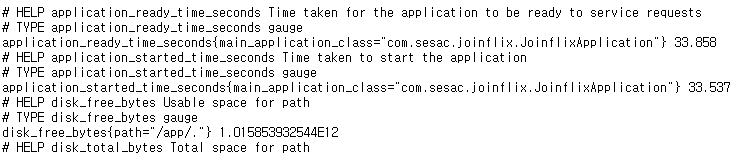

# 1. 모니터링 시스템 구축 (Actuator + Prometheus + Grafana)

애플리케이션의 상태를 실시간으로 파악하기 위해 **데이터 생성 -> 수집 -> 시각화**의 3단계 구조를 구축합니다.

- **Spring Boot Actuator (생성):** 애플리케이션 내부의 메트릭(CPU, 메모리, HTTP 요청 등)을 수집하여 엔드포인트로 노출합니다.
- **Prometheus (수집):** 설정된 주기마다 Actuator 엔드포인트에 접속하여 데이터를 긁어와(Scraping) 시계열 데이터베이스에 저장합니다.
- **Grafana (시각화):** Prometheus에 저장된 데이터를 쿼리하여 사용자가 보기 쉬운 대시보드로 그려줍니다.

---

1. 의존성 추가(build.gradle)

   ```pascal
   // Actuator: 데이터 제공
   implementation 'org.springframework.boot:spring-boot-starter-actuator'
   // Micrometer : 데이터 수집
   implementation 'io.micrometer:micrometer-registry-prometheus'
   ```

2. 설정(application.yml)

   ```yaml
   #actuator
   management:
     endpoints:
       web:
         base-path: ${ACTUATOR_BASE_PATH:/actuator}
         exposure:
           include: ${ACTUATOR_ENDPOINTS:*}
     endpoint:
       health:
         show-details: ${ACTUATOR_HEALTH_DETAILS:always}
       env:
         show-values: ${ACTUATOR_SHOW_VALUES:always}
     metrics:
       tags:
         application: joinflix
     security:
       enabled: ${ACTUATOR_SECURITY:false}
   ```

3. 확인

   서버를 실행하고 [http://localhost:8080/actuator/prometheus](http://localhost:8080/actuator/prometheus) 에 접속
   Json이 아닌 아래와 같은 텍스트 형식의 데이터가 나오면 성공!

   

   ※ 해당 url로 바로 접근할 수 있도록 아래 내용 추가
   - JwtFilter

   ```java
   @Override
       protected boolean shouldNotFilter(HttpServletRequest request) {
           String path = request.getServletPath();
           return path.startsWith("/actuator");
       }
   ```

   - SecurityConfig

   ```java
   // monitoring
   .requestMatchers("/actuator/health").permitAll()
   .requestMatchers("/actuator/prometheus").permitAll()
   ```

4. prometheus.yml 생성 (프로젝트 루트)

   ```yaml
   global:
     scrape_interval: 15s

   scrape_configs:
     - job_name: 'spring-boot'
       metrics_path: '/actuator/prometheus'
       static_configs:
   	    # ★ 핵심: Docker 내부에서 내 PC(로컬호스트)를 찾으려면
   	    # 'localhost' 대신 컨테이너 이름('backend')을 써야한다!
   	    # 만약 Spring boot를 로컬에서 실행할 경우 `host.docker.internal`를 사용할 것
         - targets: ['backend:8080']
   ```

5. docker-compose.yml 추가

   ```yaml
   # 5. Prometheus(데이터 수집)
   prometheus:
     image: prom/prometheus:latest
     container_name: prometheus-joinflix
     ports:
       - "9090:9090"
     volumes:
       - ./prometheus.yml:/etc/prometheus/prometheus.yml # 위에서 만든 설정 파일 연결
     depends_on:
       - backend
     networks:
       - joinflix-network

   # 6. Grafana(시각화)
   grafana:
     image: grafana/grafana:latest
     container_name: grafana-joinflix
     ports:
       - "3001:3000"
     environment:
       - GF_SECURITY_ADMIN_USER=admin
       - GF_SECURITY_ADMIN_PASSWORD=admin123
     volumes:
       - grafana_data:/var/lib/grafana
     depends_on:
       - prometheus
     networks:
       - joinflix-network
   ```

6. 실행

   `docker compose up -d --build`

   

7. 확인
   - Prometheus ([`http://localhost:9090`](http://localhost:9090/) )
     status > Target health > backend가 UP(성공)
     
   - Grafana ([`http://localhost:3001`](http://localhost:3001/))
     ID: admin, PW: admin123 (docker-compose.yml 에서 설정)
     - 로그인
       
     - 데이터 소스 추가
       
       
       
       ※ URL : `http://prometheus:9090` 입력 > 하단의 Save & Test 클릭
       [`https://grafana.com/grafana/dashboards/19004-spring-boot-statistics/`](https://grafana.com/grafana/dashboards/19004-spring-boot-statistics/)
       해당 url에서 템플릿의 **id(19004)** 를 복사한뒤, 우리가 로컬에 띄워둔 그라파나로 복귀
       
       DashBoards > Create dashboard > Import dashboard > **`19004`**> Load
       ※ 기존에 ID: `4701` 시도 했으나 오류 구버전
       
       prometheus 선택 > Import
       
       
       모니터링 성공!!
     ***
     ## 🛠️ 트러블슈팅 (핵심 경험)
     이 프로젝트의 가장 큰 수확은 발생한 에러를 해결하며 구조를 이해한 과정입니다.
     ### 이슈 1: Actuator 접근 시 401 Unauthorized 발생
     - **원인:** Spring Security가 모든 요청을 가로채 인증을 요구함.
     - **해결:** `SecurityConfig`에서 Actuator 경로를 허용하고, `JwtFilter`에서 필터링을 제외하여 Prometheus가 데이터를 읽어갈 수 있도록 조치함.
     ### 이슈 2: Grafana 대시보드 "No Data" 현상
     - **상황:** `4701` 템플릿 사용 시 데이터가 표시되지 않음.
     - **원인 1 (버전 문제):** `4701`은 구버전 템플릿으로 최신 Micrometer 메트릭 이름과 불일치.
     - **원인 2 (Label 부재):** 대시보드가 `application`이라는 이름표를 찾고 있었으나, 백엔드 설정에 해당 태그가 누락됨.
     - **해결:** 1. `application.yml`에 `management.metrics.tags.application` 설정 추가.
     2. Spring Boot 3.x에 최적화된 **`19004`** 대시보드 템플릿으로 변경하여 호환성 해결.
