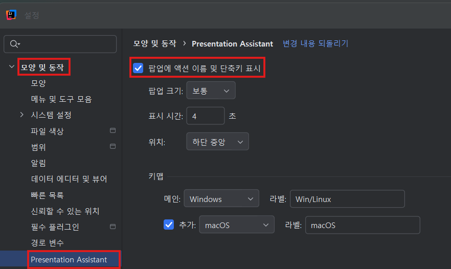
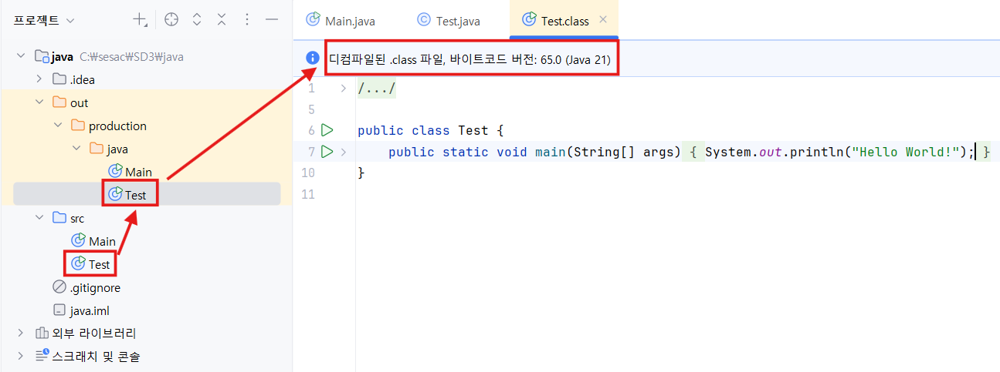
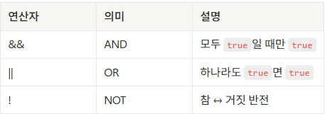
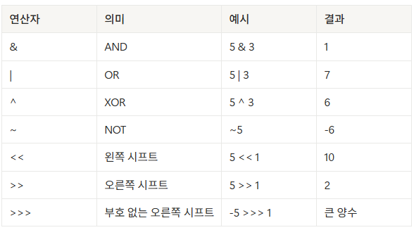
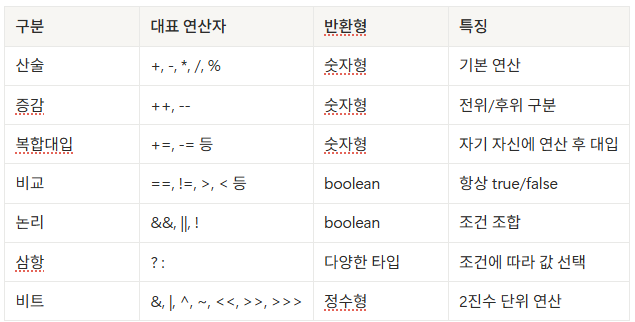

# 💻 Java - 기초

---

## 🧩 Java란?

> 객체 지향 프로그래밍(OOP: Object Oriented Programming) 언어로,
>
> 코드의 **재사용성**과 **유지 보수성**을 높이는 데 중점을 둔 언어입니다.

- 운영체제에 **독립적**으로 실행 가능
- **정적 타입(Statically-Typed)** 언어 → 변수의 타입을 반드시 명시해야 함
- **컴파일 언어(Compiled Language)**
  → 실행 전 컴파일 과정을 거쳐 `.class` 바이트코드 생성
  → 문법 오류 등을 **사전에 확인** 가능

---

## ☕ JVM (Java Virtual Machine)

- Java 프로그램을 실제 OS 환경에 맞게 실행시켜 주는 **가상 머신**
- JVM이 설치되어 있다면 **Windows / macOS / Linux 어디서든 동일하게 실행 가능**

---

## ⚖️ Java vs JavaScript

| 구분            | **JavaScript**                        | **Java**                           |
| --------------- | ------------------------------------- | ---------------------------------- |
| **타입 시스템** | 동적 타입 (Dynamic Typing)            | 정적 타입 (Static Typing)          |
| **실행 환경**   | 브라우저, Node.js                     | JVM (Java Virtual Machine)         |
| **컴파일 방식** | 인터프리터 방식(실행 시 한 줄씩 해석) | 컴파일 후 실행(`.class` 파일 생성) |
| **클래스 구조** | ES6+ 지원, 프로토타입 기반            | 처음부터 클래스 기반 OOP           |
| **대표 용도**   | 웹, 서버 (Node.js)                    | 서버, 안드로이드, 엔터프라이즈 앱  |

---

### 💡 참고

- **JavaScript**
  - 인터프리터 언어
  - 개발자 입장에서는 컴파일 과정이 보이지 않음
  - V8 엔진 등은 내부적으로 **JIT(Just-In-Time) 컴파일** 수행
- **TypeScript**
  - JavaScript에 **정적 타입 시스템**을 추가한 언어

---

## 🧱 Java 개발 환경 구성

---

### 🔧 JDK / JRE / JVM 관계

| 구성 요소 | 설명                                  |
| --------- | ------------------------------------- |
| **JVM**   | Java 바이트코드를 실행하는 가상 머신  |
| **JRE**   | JVM + 표준 라이브러리 (실행 환경)     |
| **JDK**   | JRE + 개발 도구 (컴파일러, 디버거 등) |

> ✅ JDK(Java Development Kit) = 개발용 필수 도구 세트

---

### 📥 JDK 설치 방법

1. **JDK 다운로드**
   - Oracle JDK 👉 https://www.oracle.com/java/technologies/downloads/
   - OpenJDK 👉 https://adoptium.net/
2. **환경 변수 설정**
   - `JAVA_HOME` → JDK 설치 경로
   - `PATH` → JDK의 `bin` 디렉터리 추가
3. **설치 확인**

```bash
java -version
javac -version
```

---

## 🧰 개발 환경 (IDE) 설정

Java 개발에 자주 사용되는 IDE 비교 👇

| IDE                  | 특징                                                     |
| -------------------- | -------------------------------------------------------- |
| **IntelliJ IDEA** ⭐ | 강력한 자동완성, 리팩토링 기능Community Edition 무료     |
| **Eclipse**          | 오픈소스, 무료오랜 역사와 커뮤니티 보유                  |
| **VS Code**          | JavaScript 개발자에게 친숙“Extension Pack for Java” 필요 |

> ⚡ Node.js 환경에서 개발에 익숙하다면 VS Code + Java Extension도 가능하지만,
>
> **IntelliJ IDEA**를 **가장 추천**합니다.

---

📚 **정리**

- Java는 **정적 타입 + 컴파일 언어**
- JVM 위에서 **운영체제에 독립적으로 실행**
- **객체지향 설계(OOP)** 기반으로 대규모 프로젝트에 적합
- 개발 환경은 **JDK + IDE(IntelliJ/Eclipse)** 조합으로 구성


https://www.jetbrains.com/store/redeem/

- 위 경로에서 Coupon 등록

---

# ☕ **Java - 기초 정리**

---

## 💡 **프로젝트 생성 및 IntelliJ 설정**

- **Java 21 사용**
  

📁 **설정 경로:**

`파일 > 설정 > 모양 및 동작 > Presentation Assistant`


- 코드 실행: **`Ctrl + Shift + F10`**
- 디버깅:
  - **break point** 설정 후 상단의 🐞 버튼 클릭
  - `F8` → 다음 스텝 실행
    
- **out 폴더**: 컴파일된 `.class` 파일을 **디컴파일(decompile)** 해서 확인 가능

  

---

### ⚙️ **컴파일 과정**

```
HelloWorld.java (소스코드)
        ↓ javac (컴파일러)
HelloWorld.class (바이트코드)
        ↓ java (JVM)
    실행 결과
```

---

## 💡 **Java 코드 작성 규칙**

### 🧱 네이밍 규칙

| 구분         | 규칙                | 예시               |
| ------------ | ------------------- | ------------------ |
| **패키지명** | 모두 소문자         | `com.example.test` |
| **클래스명** | 파스칼(Pascal Case) | `HelloWorld`       |
| **메서드명** | 카멜(Camel Case)    | `printName()`      |
| **상수명**   | 모두 대문자         | `MAX_COUNT`        |

---

### 🖨️ **출력 예제**

```java
public class Test {
    public static void main(String[] args){
        // : 한 줄 주석 (Ctrl + /)
        /* 여러 줄 주석 */

        System.out.print("Hello");   // 기본 출력
        System.out.print("world");

        System.out.println("bye");   // 줄바꿈 출력
        System.out.println("world");

        // javascript: let name = "kim"
        String name = "kim";

        // 서식 지정자를 사용한 출력 (s: 문자열, c:문자, d:정수, f: 실수, n:줄바꿈)
        // javascript: console.log(`이름 : ${name}`);
        System.out.printf("이름 : %s", name);
    }
}
```

---

## 🧮 **변수 (Variable)**

> 데이터를 저장하는 메모리 공간에 이름을 붙인 것
>
> 프로그램에서 값을 저장하고 필요할 때 꺼내 쓰는 “상자” 역할

### 🪜 **명명 규칙**

- **카멜 케이스(Camel Case)** 사용
  - 첫 글자 소문자, 이후 단어의 첫 글자는 대문자
  - 예: `phoneNumber`, `teamMembersCount`
- **대소문자 구분**
- **길이 제한 없음**
- **예약어 사용 불가**
- **숫자로 시작 불가**
- **특수문자**는 `_`, `$`만 허용

---

### 🧾 **변수 선언 예제**

```java
package a.basic;

public class Variable {
    public static void main(String[] args){
        // 선언
        int age;

        // 할당
        age = 20;
        System.out.printf("나이: %d%n", age);

        // 선언과 동시에 초기화
        String name = "kim";
        System.out.printf("이름 : %s", name);
    }
}
```

---

## 🧩 **기본형 타입 (Primitive Types)**

| 분류   | 타입                   | 바이트     | 예시                   |
| ------ | ---------------------- | ---------- | ---------------------- |
| 정수형 | byte, short, int, long | 1, 2, 4, 8 | `int age = 20;`        |
| 실수형 | float, double          | 4, 8       | `double pi = 3.14;`    |
| 문자형 | char                   | 2          | `char grade = 'A';`    |
| 논리형 | boolean                | 1          | `boolean isOk = true;` |

```java
package a.basic;

public class Variable {
    public static void main(String[] args){
        byte b = 100;
        short s = 10000;
        int i = 10000000;
        long l = 10000000000L;

        float f = 3.14f;
        double d = 3.14;

        char c = 'A';
        boolean bool = true;

        System.out.println(b);
        System.out.println(d);
        System.out.println(c);
        System.out.println(bool);
    }
}
```

---

## 🧠 **참조형 타입 (Reference Types)**

> 기본형(primitive)이 아닌 모든 타입은 참조형(reference)
>
> 실제 데이터가 저장된 메모리의 **주소값을 참조**

- 대표: `String`, `Array`, `Class`, `Interface`, `null` 등
- **`String`은 불변(immutable)** 객체

```java
package a.basic;

public class Variable {
    public static void main(String[] args){
        String str = "Hello";
        String str2 = "world";
        String msg = String.join(" ", str, str2);
        System.out.println(msg);

        // null은 참조형 타입에만 가능
        String str3 = null;
        System.out.println(str3);
    }
}
```

---

## 🔄 **형 변환 (Type Casting)**

### ✅ 자동 타입 변환 (묵시적 변환)

> 작은 타입 → 큰 타입으로 자동 변환됨

```
byte → short → int → long → float → double
       char  →

```

### ⚠️ 강제 타입 변환 (명시적 변환)

> 큰 타입 → 작은 타입으로 변환할 때는 명시적 캐스팅 필요

```java
package a.basic;

public class Variable {
    public static void main(String[] args){
        int iA = 100;
        double dA = iA; // 자동 형변환

        double dB = 3.14;
        int iB = (int) dB; // 강제 형변환
        System.out.println(iB);
    }
}
```

---

## 🆕 **`var` 키워드 (Java 10+)**

> 타입 추론(type inference) 기능 제공
>
> 한 번 추론된 타입은 **변경 불가**

```java
package a.basic;

public class Variable {
    public static void main(String[] args){
        var myData = true;    // boolean myData = true;
        var myData2 = 100;    // int myData2 = 100;
        var myData3 = "hello"; // String myData3 = "hello";
    }
}
```

---

📘 **정리 요약**

| 항목        | 핵심 포인트                             |
| ----------- | --------------------------------------- |
| 실행 단축키 | `Ctrl + Shift + F10`                    |
| 디버깅      | Breakpoint → F8 (다음 단계)             |
| 기본 출력   | `System.out.print`, `println`, `printf` |
| 주요 타입   | 기본형(8개), 참조형(String 등)          |
| 형변환      | 자동/명시적 변환 구분                   |
| var 키워드  | Java 10 이후 타입 추론 지원             |

---

# 💡 **Java 연산자(Operator) 정리**

---

## 🧮 **1. 기본 산술 연산자**

| 연산자 | 의미   | 예시    | 결과 |
| ------ | ------ | ------- | ---- |
| +      | 덧셈   | 10 + 3  | 13   |
| -      | 뺄셈   | 10 - 3  | 7    |
| \*     | 곱셈   | 10 \* 3 | 30   |
| /      | 나눗셈 | 10 / 3  | 3    |
| %      | 나머지 | 10 % 3  | 1    |

> ⚠️ 정수끼리의 나눗셈(/) 은 정수 결과만 반환합니다.
>
> 실수 결과를 얻으려면 **형변환**이 필요합니다 → `(double) x / y`

```java
int x = 10, y = 3;
System.out.println(x / y);        // 3 (정수 나눗셈)
System.out.println((double)x / y); // 3.3333 (실수 나눗셈)
```

---

## 🔼 **2. 증감 연산자**

| 형태 | 설명              | 예시             | 결과                |
| ---- | ----------------- | ---------------- | ------------------- |
| ++a  | 먼저 증가 후 사용 | int a = 10; ++a; | a = 11              |
| a++  | 사용 후 증가      | int a = 10; a++; | a = 11 (출력 시 10) |
| --a  | 먼저 감소 후 사용 | int a = 10; --a; | a = 9               |
| a--  | 사용 후 감소      | int a = 10; a--; | a = 9 (출력 시 10)  |

```java
int x = 10;
System.out.println(x++); // 10
System.out.println(++x); // 12
```

---

## 🔁 **3. 복합 대입 연산자**

| 연산자 | 의미        | 예시     | 결과       |
| ------ | ----------- | -------- | ---------- |
| +=     | 더해서 대입 | x += 5;  | x = x + 5  |
| -=     | 빼서 대입   | x -= 3;  | x = x - 3  |
| \*=    | 곱해서 대입 | x \*= 2; | x = x \* 2 |
| /=     | 나눠서 대입 | x /= 4;  | x = x / 4  |
| %=     | 나머지 대입 | x %= 2;  | x = x % 2  |

```java
int x = 10;
x += 5; // x = 15
```

---

## ⚖️ **4. 비교 연산자**

비교 연산 결과는 항상 `boolean` (`true` / `false`) 입니다.

| 연산자 | 의미        | 예시   | 결과  |
| ------ | ----------- | ------ | ----- |
| ==     | 같다        | 5 == 5 | true  |
| !=     | 다르다      | 5 != 3 | true  |
| >      | 크다        | 5 > 3  | true  |
| <      | 작다        | 5 < 3  | false |
| >=     | 크거나 같다 | 5 >= 5 | true  |
| <=     | 작거나 같다 | 3 <= 5 | true  |

> ⚠️ 문자열 비교는 ==이 아닌 .equals() 사용!

```java
String strA = "hello";
String strB = new String("hello");

System.out.println(strA == strB);         // false (주소 비교)
System.out.println(strA.equals(strB));    // true (값 비교)
```

---

## 🔐 **5. 논리 연산자**



```java
boolean a = true, b = false;
System.out.println(!a);        // false
System.out.println(a && b);    // false
System.out.println(a || b);    // true
```

🧠 **단락 평가 (Short-Circuit Evaluation)**

- `&&` → 앞이 `false`면 뒤는 평가하지 않음
- `||` → 앞이 `true`면 뒤는 평가하지 않음

---

## ❓ **6. 삼항 연산자**

형식:

```java
조건식 ? 참일_때_값 : 거짓일_때_값;
```

예시:

```java
int age = 30;
String result = (age >= 20) ? "성인" : "청소년";
System.out.println(result); // 성인
```

---

## ⚙️ **7. 비트 연산자**

비트 단위(0과 1)로 연산합니다.



```java
int a = 14; // 1110
int b = 6;  // 0110
System.out.println(a & b); // 6
```

---

## ✅ **정리 요약**


