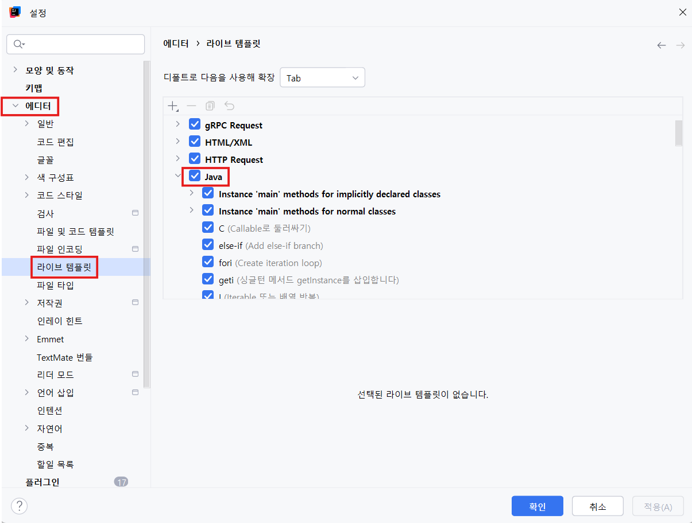
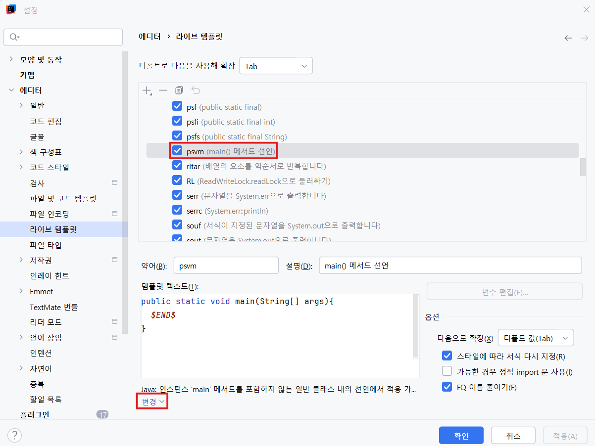
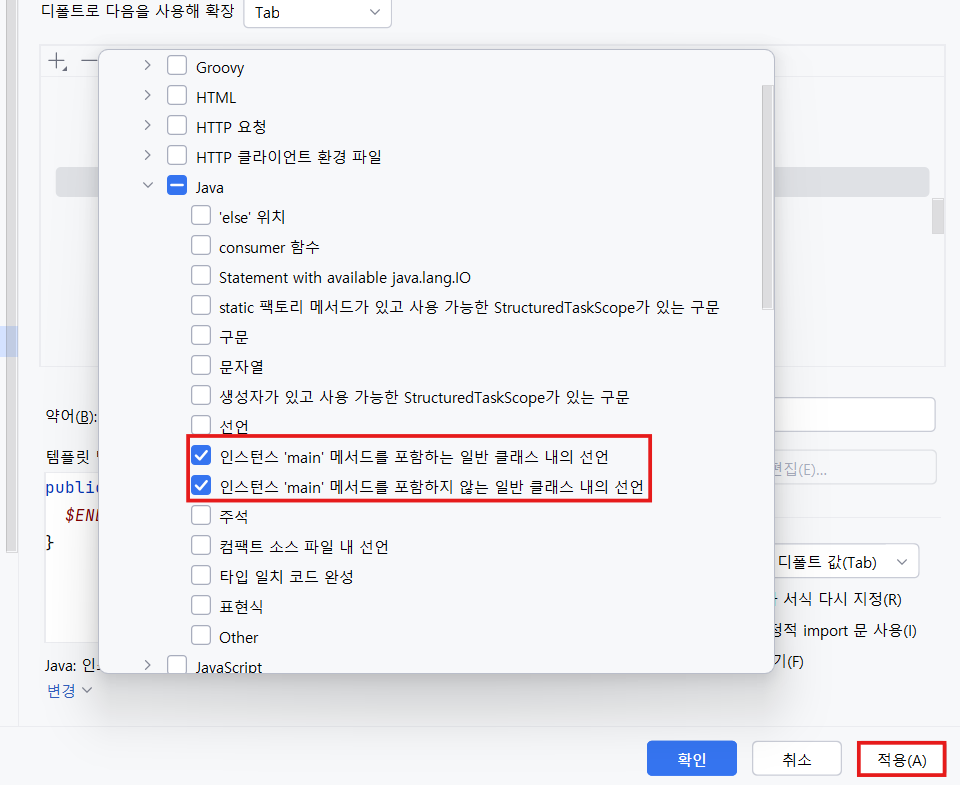

## 💡 **반복문 (Loops)**

자바에서 반복문은 **특정 조건이 만족될 때까지 코드를 반복 실행**할 때 사용한다.

---

### 🔹 **1. for문 (for loop)**

> 반복 횟수가 명확할 때 사용

```java
/*
for (초기화; 조건식; 증감식) {
     반복 실행될 코드
}
*/

public class ForExample {
    public static void main(String[] args) {
        // 기본 for문
        for(int i = 0; i < 10 ; i++){
            System.out.println(i);
        }
        System.out.println();

        // 역순 반복
        for(int i = 10; i >= 1 ; i--){
            System.out.println(i);
        }
        System.out.println();

        // 2씩 증가
        for(int i = 0; i < 10 ; i += 2){
            System.out.println(i);
        }
    }
}
```

**실행 순서**

1. 초기화 (최초 1회만 실행)
2. 조건식 검사
3. 조건이 `true`면 코드 블록 실행
4. 증감식 실행
5. 2단계로 돌아감

---

### 🔹 **2. 중첩 for문 (Nested for loop)**

> 반복문 안에 또 다른 반복문을 포함시켜 이중 반복을 구현할 수 있다.

**예: 구구단**

```java
// 중첩 for문
for(int i = 2; i < 10; i++){
    System.out.printf("**** %d단 ****%n", i);
    for(int j = 1; j < 10; j++){
        System.out.printf("%d X %d = %d%n", i, j, i * j);
    }
}
```

---

### 🔹 **3. while문 (while loop)**

> 조건이 true인 동안 반복
>
> 반복 횟수가 명확하지 않을 때 사용

```java
// while문
int i = 0;

while(i < 10){
    System.out.println(i);
    i++;
}
```

💡 `for`는 반복 횟수가 정해졌을 때,

`while`은 조건이 중요할 때 사용.

---

### 🔹 **4. do-while문 (do-while loop)**

> 최소 1회는 실행되는 반복문
>
> 조건을 **나중에 검사**

```java
// do-while문
int j = 10;

do {
    System.out.println(j);
    j++;
} while (j < 10);
```

---

### 🔹 **5. 향상된 for문 (Enhanced for / for-each)**

> 배열이나 컬렉션의 모든 요소를 순회할 때 사용

```java
int[] numbers = {1, 2, 3, 4, 5};

// 기본 for문 (인덱스로 접근)
for(int i = 0; i < numbers.length; i++){
    System.out.println(numbers[i]);
}
System.out.println();

// 향상된 for문 (요소로 직접 접근)
for(int number : numbers){
    System.out.println(number);
}
```

**✅ 장점**

- 코드가 간결하고 가독성 좋음
- 인덱스 실수 방지
- 모든 요소 순회 보장

**⚠️ 단점**

- 인덱스 직접 접근 불가
- 원시 타입 값 변경 불가
- 역순 순회 불가

---

### 🔹 **6. break**

> 반복문을 즉시 종료

```java
for(int z = 0; z < 10; z++){
    System.out.println(z);
    if(z == 5) break; // 반복 종료
}
```

---

### 🔹 **7. continue**

> 현재 반복을 건너뛰고 다음 반복으로 진행

```java
for(int z = 0; z < 10; z++){
    if(z % 2 == 0) continue; // 짝수 건너뛰기
    System.out.println(z);
}
```

---

### 🔹 **8. Label (레이블)**

> 중첩 반복문에서 특정 반복문을 제어할 때 사용
>
> `break`나 `continue`와 함께 활용

```java
outer: // 레이블 이름
for(int x = 2; x < 10; x++){
    if(x > 4) break outer; // 4단까지만 출력
    System.out.printf("***** %d단 *****%n", x);
    for(int y = 1; y < 10; y++){
        System.out.printf("%d X %d = %d%n", x, y, x * y);
    }
}
```

---

### ✅ **정리 요약표**

| 문법       | 사용 목적               | 특징                       |
| ---------- | ----------------------- | -------------------------- |
| `for`      | 반복 횟수가 명확할 때   | 초기화, 조건, 증감 한 줄에 |
| `while`    | 조건이 중요할 때        | 조건만으로 제어            |
| `do-while` | 최소 1회 실행 필요할 때 | 조건 나중에 검사           |
| `for-each` | 배열, 컬렉션 순회       | 인덱스 접근 불가           |
| `break`    | 반복 즉시 종료          | 조건에 따라 탈출           |
| `continue` | 다음 반복으로 건너뜀    | 일부만 건너뛰기            |
| `label`    | 중첩 반복 제어          | break/continue와 함께 사용 |

# 🧩 Java 기본 실습 정리

> 패키지: a.basic.practice2
>
> 파일명: `Practice.java`

---

## 📘 문제 1. 구구단

2단부터 9단까지 구구단 출력

```java
for(int i = 2; i < 10; i++){
    System.out.printf("*****%d단*****%n", i);
    for(int j = 1; j < 10; j++){
        System.out.printf("%d X %d = %d%n", i, j, i*j);
    }
}
```

---

## ⭐ 문제 2. 별 찍기 패턴 1

```
*
**
***
****
*****
```

```java
for(int i = 1; i <= 5; i++){
    for(int j = 1; j <= i; j++){
        System.out.print("*");
    }
    System.out.println();
}
```

---

## ⭐ 문제 3. 별 찍기 패턴 2

```
*****
****
***
**
*
```

```java
for(int i = 5; i >= 1; i--){
    for(int j = i; j > 0; j--){
        System.out.print("*");
    }
    System.out.println();
}
```

---

## ⭐ 문제 4. 별 찍기 패턴 3 (피라미드)

```
    *
   ***
  *****
 *******
*********
```

```java
for(int i = 1; i <= 5; i++){
    for(int j = 5; j > i; j--){
        System.out.print(" ");
    }
    for(int x = 1; x <= 2*i - 1; x++){
        System.out.print("*");
    }
    System.out.println();
}
```

---

## 🔢 문제 5. 약수 구하기

```java
int num = 24;
for(int i = 1; i <= num; i++){
    if(num % i == 0)
        System.out.printf("%d ", i);
}
System.out.println();
```

---

## 🔍 문제 6. 소수 판별

```java
int num = 17;
boolean flag = true;

for(int x = 2; x < num; x++){
    if(num % x == 0){
        flag = false;
        break;
    }
}
System.out.println(flag ? "소수입니다." : "소수가 아닙니다.");
```

---

## ⚡ 문제 7. 소수 판별 (최적화 버전)

```java
int num = 17;
boolean flag = true;

for(int i = 2; i <= Math.sqrt(num); i++){
    if(num % i == 0){
        flag = false;
        break;
    }
}
System.out.println(flag ? "소수입니다." : "소수가 아닙니다.");
```

**번외 문제 (1 ~ num까지의 숫자 중 소수 구하기):**

```java
int[] isPrimeArr = new int[num+1];
isPrimeArr[0] = 1;
isPrimeArr[1] = 1;
int cnt = 0;

for(int i=2; i<=num; i++){
    if(isPrimeArr[i]!=1){
        cnt++; // 소수의 개수
        System.out.println(i); // 소수 출력
        for(int j=i; j<=num; j+=i){
            isPrimeArr[j] = 1;
        }
    }
}
System.out.println("1~"+num+"까지 소수의 개수: "+cnt);
```

---

## 💯 문제 8. 최대공약수 (GCD)

```java
int a = 48, b = 18;
while(b != 0){
    int tmp = a % b;
    a = b;
    b = tmp;
}
System.out.println("최대공약수: " + a);
```

---

## 💡 문제 9. 최소공배수 (LCM)

```java
int a = 12;
int b = 18;
Practice p = new Practice();
System.out.println("최소공배수: " + (long)a * b / p.gcd(a, b));
```

---

## 🌀 문제 10. 피보나치 수열

```java
int n = 10;
int[] array = new int[n];
array[0] = 0;
array[1] = 1;

for(int i = 2; i < n; i++){
    array[i] = array[i-1] + array[i-2];
}
System.out.printf("%d번째 피보나치 수: %d%n", n, array[n-1]);
```

---

## 🧮 문제 11. 팩토리얼

```java
int n = 5;
long result = 1;
for(int i = 1; i <= n; i++){
    result *= i;
}
System.out.printf("%d! = %d%n", n, result);
```

---

## 🔄 문제 12. 역순 숫자 출력

```java
int num = 12345;
String strNum = String.valueOf(num);
String revStrNum = new StringBuilder(strNum).reverse().toString();
int revNum = Integer.parseInt(revStrNum);
System.out.println(revNum);
```

---

## ➕ 문제 13. 숫자 자릿수 합

**방법 1 (문자열 이용):**

```java
int num = 12345;
String[] digits = String.valueOf(num).split("");
int total = 0;
for(String s : digits){
    total += Integer.parseInt(s);
}
System.out.println(total);
```

**방법 2 (수학적 방법):**

```java
int num2 = 12345;
int result = 0;
while(num2 != 0){
    result += num2 % 10;
    num2 /= 10;
}
System.out.println(result);
```

---

## 🚫 문제 14. 구구단 특정 단 건너뛰기

```java
for(int i = 2; i <= 9; i++){
    if(i == 5) continue; // 5단 건너뛰기
    System.out.printf("*****%d단*****%n", i);
    for(int j = 1; j <= 9; j++){
        System.out.printf("%d X %d = %d%n", i, j, i*j);
    }
}
```

---

## 🔧 gcd() 메서드 (최대공약수 계산)

```java
public int gcd(int a, int b) {
    while(b != 0){
        int tmp = a % b;
        a = b;
        b = tmp;
    }
    return a;
}
```

---

### ✅ 전체 요약

| 유형          | 주제               | 키워드                    |
| ------------- | ------------------ | ------------------------- |
| 반복문        | 구구단, 별 찍기    | `for`, `nested loop`      |
| 조건문        | 약수, 소수 판별    | `if`, `break`, `continue` |
| 수학 알고리즘 | GCD, LCM, 팩토리얼 | `while`, `method`         |
| 배열          | 피보나치 수열      | `array`, `index`          |
| 문자열        | 역순, 자릿수 합    | `StringBuilder`, `split`  |

---

## 💡 **인텔리제이 psvm 설정**

> psvm → public static void main(String[] args) 자동 완성 템플릿

---

### ⚙️ 설정 경로

**`설정 > 에디터 > 라이브 템플릿`**

1. 왼쪽에서 **Java 선택**

   

2. 목록 중 **psvm 선택**

   

3. 아래쪽 설명 부분을 클릭

   

---

### ✅ 수정 방법

- `인스턴스 ‘main’ 메서드를 포함하는 일반 클래스 내의 선언`
- `인스턴스 ‘main’ 메서드를 포함하지 않는 일반 클래스 내의 선언`
  → **두 항목 모두 체크 후 [적용] 클릭**

이제 `psvm` 입력 후 `Tab` 누르면 자동으로

```java
public static void main(String[] args) {

}
```

이 생성됩니다 🎉

---

## 💡 **배열 (Array)**

> **같은 타입의 데이터**를 연속된 메모리 공간에 저장하는 자료구조

---

### 🔹 **배열 선언 및 초기화**

```java
package a.basic;

public class Array {
    public static void main(String[] args) {
        // 배열 선언 (크기 지정)
        int[] numbers = new int[5]; // 기본값은 0으로 초기화

        // 값 할당
        numbers[0] = 100;
        numbers[1] = 200;

        System.out.println(numbers.length); // 배열 길이
        System.out.println(numbers[0]);
        System.out.println(numbers[4]);

        // (1) 선언 후 한 칸씩 초기화
        int[] arr1 = new int[5];
        arr1[0] = 1;
        arr1[1] = 2;
        arr1[2] = 3;

        // (2) 선언과 동시에 초기화
        int[] arr2 = new int[]{1, 2, 3, 4, 5};

        // (3) new 생략 가능
        int[] arr3 = {1, 2, 3, 4, 5};

        // 문자열 배열
        String[] names = {"kim", "lee", "park"};
        System.out.println(names.length);

        // 배열 순회
        int[] scores = {80, 40, 80, 90, 100};

        // 인덱스로 접근
        for(int i = 0; i < scores.length; i++){
            System.out.println(scores[i]);
        }

        // 향상된 for문
        for(int score : scores){
            System.out.println(score);
        }
    }
}
```

---

### 🧠 **배열 특징**

| 항목   | 설명                                                     |
| ------ | -------------------------------------------------------- |
| 자료형 | 모든 요소는 같은 타입                                    |
| 인덱스 | 0부터 시작                                               |
| 길이   | `배열명.length`                                          |
| 초기값 | 정수형 → 0, 실수형 → 0.0, boolean → false, 참조형 → null |
| 크기   | 고정 (생성 후 변경 불가)                                 |

---

### 🔹 **다차원 배열 (2차원 배열)**

> **배열 안에 또 다른 배열**을 담을 수 있음

```java
// 2차원 배열 선언 및 초기화
int[][] matrix = {
    {1, 2, 3}, // 0행
    {4, 5, 6}, // 1행
    {7, 8, 9}  // 2행
};

// 인덱스로 접근
for(int i = 0; i < matrix.length; i++){
    for(int j = 0; j < matrix[i].length; j++){
        System.out.println(matrix[i][j]);
    }
}
```

---

### 🔹 **가변 배열 (Jagged Array)**

> 행마다 열의 길이가 다른 배열

```java
int[][] jagged = {
    {1},
    {2, 3},
    {4, 5, 6},
    {7, 8, 9, 10}
};

// 향상된 for문
for(int[] row : jagged){
    for(int item : row){
        System.out.println(item);
    }
}
```

---

### ✅ **정리 요약표**

| 구분        | 문법                              | 설명                   |
| ----------- | --------------------------------- | ---------------------- |
| 선언        | `int[] arr = new int[5];`         | 크기 5의 int 배열 생성 |
| 초기화      | `int[] arr = {1,2,3,4,5};`        | 선언과 동시에 초기화   |
| 접근        | `arr[0]`                          | 첫 번째 요소           |
| 길이        | `arr.length`                      | 배열 크기 확인         |
| 반복        | `for` / `for-each`                | 모든 요소 순회         |
| 다차원 배열 | `int[][] matrix = new int[3][3];` | 2차원 구조 표현 가능   |

---

## 💡 `java.util.Arrays` 클래스 정리

배열을 다루는 다양한 유틸리티 메서드를 제공하는 클래스입니다.

```java
import java.util.Arrays;

public class ArraysExample {
    public static void main(String[] args) {
        int[] nums = {5, 2, 1, 7, 8};

        // 1. toString() - 배열을 문자열로 출력
        System.out.println(nums); // [I@b4c966a (주소값)
        System.out.println(Arrays.toString(nums)); // [5, 2, 1, 7, 8]

        // 2. sort() - 정렬
        Arrays.sort(nums);
        System.out.println(Arrays.toString(nums)); // [1, 2, 5, 7, 8]

        // 3. binarySearch() - 이진 탐색 (정렬된 배열에서만 사용)
        int idx = Arrays.binarySearch(nums, 7);
        System.out.println(idx); // 7의 인덱스

        // 4. fill() - 배열의 모든 요소를 동일한 값으로 채움
        int[] filled = new int[10];
        Arrays.fill(filled, 99);
        System.out.println(Arrays.toString(filled)); // [99, 99, 99, 99, 99, 99, 99, 99, 99, 99]

        // 5. copyOf() - 깊은 복사(새로운 배열 생성)
        int[] origin = {1, 2, 3, 4, 5};
        int[] copied = Arrays.copyOf(origin, origin.length);
        System.out.println(Arrays.toString(copied)); // [1, 2, 3, 4, 5]

        // 얕은 복사(참조 복사) - 같은 주소를 가리킴
        int[] copied2 = origin;
        origin[0] = 100;
        System.out.println(Arrays.toString(origin));  // [100, 2, 3, 4, 5]
        System.out.println(Arrays.toString(copied));  // [1, 2, 3, 4, 5]
        System.out.println(Arrays.toString(copied2)); // [100, 2, 3, 4, 5]
        System.out.println(origin.equals(copied));  // false (다른 객체)
        System.out.println(origin.equals(copied2)); // true (같은 주소)

        // 6. copyOfRange() - 범위 복사 (start ~ end-1)
        int[] ranged = Arrays.copyOfRange(origin, 1, 3);
        System.out.println(Arrays.toString(ranged)); // [2, 3]

        // 7. equals() - 배열의 값 비교
        int[] arrA = {1, 2, 3};
        int[] arrB = {1, 2, 3};
        System.out.println(arrA == arrB); // false (주소 다름)
        System.out.println(Arrays.equals(arrA, arrB)); // true (값 같음)

        // 8. deepToString() - 다차원 배열 출력
        int[][] mat = {{1, 2}, {3, 4}};
        System.out.println(Arrays.toString(mat));       // [[I@..., [I@...]
        System.out.println(Arrays.deepToString(mat));   // [[1, 2], [3, 4]]

        // ⚠️ 가변 길이 배열이 필요할 경우 → ArrayList 사용
        // origin[99] = 100; // ArrayIndexOutOfBoundsException 발생
    }
}
```

---

### ✅ 주요 메서드 요약표

| 메서드                                | 설명                         | 예시                           |
| ------------------------------------- | ---------------------------- | ------------------------------ |
| `Arrays.toString(arr)`                | 1차원 배열을 문자열로 변환   | `[1, 2, 3]`                    |
| `Arrays.sort(arr)`                    | 오름차순 정렬                | `[1, 2, 3, 4]`                 |
| `Arrays.binarySearch(arr, key)`       | 정렬된 배열에서 이진 탐색    | `Arrays.binarySearch(nums, 7)` |
| `Arrays.fill(arr, value)`             | 모든 요소를 지정 값으로 채움 | `[99, 99, 99]`                 |
| `Arrays.copyOf(arr, len)`             | 배열 복사 (깊은 복사)        | 새 배열 생성                   |
| `Arrays.copyOfRange(arr, start, end)` | 범위 복사                    | `[start ~ end-1]`              |
| `Arrays.equals(arr1, arr2)`           | 배열의 값 비교               | `true`/`false`                 |
| `Arrays.deepToString(arr2D)`          | 다차원 배열 문자열 변환      | `[[1, 2], [3, 4]]`             |

---

## 📘 배열 실습 정리 (`Practice.java`)

```java
package a.basic.practice3;

import java.util.Arrays;
import java.util.HashMap;
import java.util.Map;

public class Practice {
    public static void main(String[] args) {

        /*──────────────────────────────
         🧩 문제 1. 배열 최댓값 / 최솟값
        ──────────────────────────────*/
        int[] numbers = {45, 23, 78, 12, 89, 34};

        // 1-1. 정렬 이용
        Arrays.sort(numbers);
        System.out.println("최댓값: " + numbers[numbers.length - 1]);
        System.out.println("최솟값: " + numbers[0]);
        System.out.println();

        // 1-2. 반복문 + Math 클래스 이용 (O(n))
        int max = Integer.MIN_VALUE;
        int min = Integer.MAX_VALUE;
        for (int n : numbers) {
            max = Math.max(max, n);
            min = Math.min(min, n);
        }
        System.out.println("최댓값: " + max);
        System.out.println("최솟값: " + min);
        System.out.println();

        /*──────────────────────────────
         🧩 문제 2. 배열 뒤집기 (Reverse)
        ──────────────────────────────*/
        int[] arr = {1, 2, 3, 4, 5};
        System.out.println("원본: " + Arrays.toString(arr));

        // 2-1. swap 방식으로 뒤집기
        for (int i = 0; i < arr.length / 2; i++) {
            int tmp = arr[i];
            arr[i] = arr[arr.length - 1 - i];
            arr[arr.length - 1 - i] = tmp;
        }
        System.out.println("뒤집기: " + Arrays.toString(arr));
        System.out.println();

        // 2-2. 새로운 배열에 역순으로 저장
        int[] arr2 = {1, 2, 3, 4, 5, 6, 7, 8, 9, 10};
        int[] reversed = new int[arr2.length];
        for (int i = 0; i < arr2.length; i++) {
            reversed[i] = arr2[arr2.length - 1 - i];
        }
        System.out.println("원본: " + Arrays.toString(arr2));
        System.out.println("뒤집기: " + Arrays.toString(reversed));
        System.out.println();

        // 2-3. 투 포인터 방식 (left ↔ right)
        int left = 0;
        int right = arr2.length - 1;
        while (left < right) {
            int tmp = arr2[left];
            arr2[left] = arr2[right];
            arr2[right] = tmp;
            left++;
            right--;
        }
        System.out.println("원본 뒤집기(제자리 변경): " + Arrays.toString(arr2));
        System.out.println();

        /*──────────────────────────────
         🧩 문제 3. 특정 값 찾기 (탐색)
        ──────────────────────────────*/
        int[] arr3 = {10, 20, 30, 40, 50};
        int target = 30;

        // 3-1. 정렬 후 binarySearch 이용
        Arrays.sort(arr3);
        int index = Arrays.binarySearch(arr3, target);
        System.out.println("이진 탐색 결과 인덱스: " + (index >= 0 ? index : -1));
        System.out.println();

        // 3-2. 단순 반복문 탐색
        int foundIndex = -1;
        for (int i = 0; i < arr3.length; i++) {
            if (arr3[i] == target) {
                foundIndex = i;
                break;
            }
        }
        System.out.println("직접 탐색 인덱스: " + foundIndex);
        System.out.println();

        /*──────────────────────────────
         🧩 문제 4. 배열 요소 개수 세기 (빈도수)
        ──────────────────────────────*/
        int[] arr4 = {1, 2, 2, 3, 3, 3, 4, 4, 4, 4, 10};
        Arrays.sort(arr4);

        // 4-1. 정렬 후 연속된 값 카운트
        int cnt = 0;
        int targetNum = arr4[0];
        for (int i = 0; i < arr4.length; i++) {
            if (arr4[i] == targetNum) cnt++;
            else {
                System.out.println(targetNum + ": " + cnt + "개");
                targetNum = arr4[i];
                cnt = 1;
            }
        }
        System.out.println(targetNum + ": " + cnt + "개");
        System.out.println();

        // 4-2. HashMap 이용 (값별 빈도 저장)
        Map<Integer, Integer> map = new HashMap<>();
        for (int n : arr4) {
            map.put(n, map.getOrDefault(n, 0) + 1);
        }
        for (int key : map.keySet()) {
            System.out.println(key + ": " + map.get(key) + "개");
        }
        System.out.println();

        // 4-3. Count 배열 이용 (단점: 큰 값이 있으면 공간 낭비)
        int maxNum = Arrays.stream(arr4).max().getAsInt();
        int[] count = new int[maxNum + 1];
        for (int n : arr4) count[n]++;
        System.out.println("카운트 배열: " + Arrays.toString(count));
        System.out.println();

        /*──────────────────────────────
         🧩 문제 5. 2차원 배열 합계
        ──────────────────────────────*/
        int[][] matrix = {
                {1, 2, 3},
                {4, 5, 6},
                {7, 8, 9}
        };

        int sum = 0;
        for (int[] row : matrix) {
            for (int n : row) sum += n;
        }
        System.out.println("2차원 배열 합계: " + sum);
        System.out.println();

        /*──────────────────────────────
         🧩 문제 6. 두 번째로 큰 수
        ──────────────────────────────*/
        int[] arr6 = {45, 23, 78, 12, 89, 34};

        // 6-1. 정렬 이용
        Arrays.sort(arr6);
        System.out.println("두 번째로 큰 수(정렬): " + arr6[arr6.length - 2]);
        System.out.println();

        // 6-2. 정렬 없이 직접 탐색
        int maxNum6 = Integer.MIN_VALUE;
        int secondMax = Integer.MIN_VALUE;

        for (int n : arr6) {
            if (n > maxNum6) {
                secondMax = maxNum6; // 기존 최대 → 두 번째로
                maxNum6 = n;         // 새로운 최대 갱신
            } else if (n > secondMax && n != maxNum6) {
                secondMax = n;
            }
        }

        System.out.println("두 번째로 큰 수(탐색): " + secondMax);
        System.out.println();
    }
}
```

---

## ✅ 실습 요약표

| 문제 | 주제            | 주요 메서드 / 개념            | 핵심 포인트          |
| ---- | --------------- | ----------------------------- | -------------------- |
| 1    | 최댓값 / 최솟값 | `Arrays.sort()`, `Math.max()` | 정렬 vs 반복문       |
| 2    | 배열 뒤집기     | swap, `while`, 새로운 배열    | 인덱스 조작 연습     |
| 3    | 특정 값 찾기    | `binarySearch()`, 반복문      | 정렬된 배열에서 탐색 |
| 4    | 요소 개수 세기  | `HashMap`, count 배열         | 빈도 계산, Map 활용  |
| 5    | 2차원 배열 합계 | 중첩 for-each                 | 모든 요소 순회       |
| 6    | 두 번째로 큰 수 | 정렬 / 비교식                 | 정렬 없이 탐색 가능  |

---

## 💡 추가 팁

- `Arrays.stream()` 또는 `IntStream.of()`을 사용하면 **더 간결한 코드** 작성 가능
  ```java
  int max = Arrays.stream(numbers).max().getAsInt();
  int min = Arrays.stream(numbers).min().getAsInt();
  ```
- `HashMap`은 문자열, 객체 등 다양한 타입의 카운트에도 유용함
- 배열보다 유연한 구조가 필요할 경우 → `ArrayList` 활용
