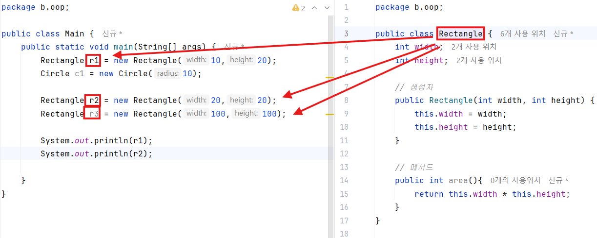
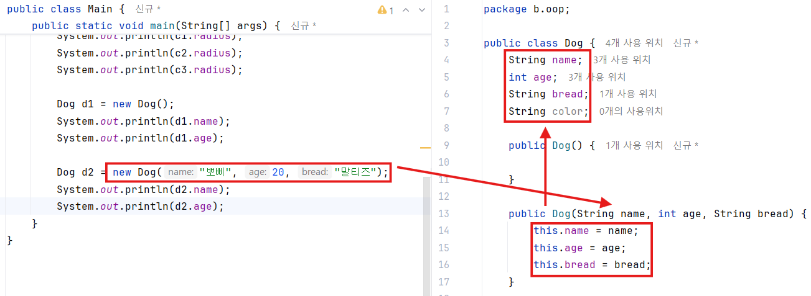

## 🧱 객체지향 프로그래밍 (OOP: Object Oriented Programming)

### 💡 핵심 개념

> OOP(Object Oriented Programming)
>
> → 프로그램을 데이터(속성)와 기능(동작)을 **하나의 객체(Object)** 단위로 묶어 설계하는 프로그래밍 패러다임.

---

### 🎯 OOP의 주요 특징

| 특징                      | 설명                                           | 예시                                                     |
| ------------------------- | ---------------------------------------------- | -------------------------------------------------------- |
| **캡슐화(Encapsulation)** | 데이터(필드)와 기능(메서드)을 하나로 묶는 것   | `class Rectangle { int width; int height; int area(); }` |
| **상속(Inheritance)**     | 기존 클래스를 확장해 새로운 클래스를 만드는 것 | `class Square extends Rectangle`                         |
| **다형성(Polymorphism)**  | 같은 이름의 메서드가 다른 동작을 수행          | `draw()`가 도형마다 다르게 동작                          |
| **추상화(Abstraction)**   | 복잡한 내부 구현은 숨기고, 필요한 부분만 노출  | `Car.start()`는 내부 엔진 구조를 몰라도 사용 가능        |

---

### ⚙️ OOP의 장점

- ✅ **코드의 중복 감소**
- ✅ **유지보수 용이**
- ✅ **확장성(재사용성) 향상**
- ✅ **현실 세계의 개념을 코드로 표현하기 쉬움**

---

## 🧩 클래스(Class)란?

> 클래스는 **비슷한 속성(데이터)**과 **기능(동작)**을 하나로 묶어
>
> 새로운 **사용자 정의 타입**을 만드는 **설계도(blueprint)** 역할을 합니다.

### 클래스 구성 요소

| 구성 요소               | 설명                | 예시                                       |
| ----------------------- | ------------------- | ------------------------------------------ |
| **필드(Field)**         | 객체의 속성(데이터) | `int width;`                               |
| **메서드(Method)**      | 객체의 동작(기능)   | `int calArea() { return width * height; }` |
| **생성자(Constructor)** | 객체 초기화 시 사용 | `Rectangle(int w, int h) { ... }`          |

---

## 🧮 예제 비교: 절차지향 → 객체지향

### ❌ 절차지향 방식 (OOP 이전)

```java
// 각 사각형의 면적을 계산 (중복 발생)
int width1 = 100, height1 = 200;
int area1 = width1 * height1;

int width2 = 10, height2 = 20;
int area2 = width2 * height2;

System.out.println(area1);
System.out.println(area2);
```

➡️ **문제점**:

- 데이터(`width`, `height`)와 기능(`area 계산`)이 분리되어 있음
- 중복 코드 많음
- 관리/수정이 어려움

---

### ✅ 개선 1. 메서드 사용

```java
public class Intro {
    public static void main(String[] args) {
        int rec1 = calArea(10, 10);
        int rec2 = calArea(20, 20);
        int rec3 = calArea(30, 30);

        System.out.println(rec1);
        System.out.println(rec2);
        System.out.println(rec3);
    }

    // 메서드: 클래스 내부의 함수
    public static int calArea(int width, int height) {
        return width * height;
    }
}
```

📌 **장점:** 중복된 계산식 제거

📌 **단점:** 여전히 `width`, `height`가 **객체로 묶이지 않음**

➡️ 데이터와 기능이 분리된 상태 유지

---

### ✅ 개선 2. 클래스(Class) 도입

```java
// 사각형 클래스 정의
class Rectangle {
    int width;   // 속성(필드)
    int height;  // 속성(필드)

    // 생성자: 초기화 메서드
    Rectangle(int width, int height) {
        this.width = width;
        this.height = height;
    }

    // 동작(메서드)
    int calArea() {
        return width * height;
    }
}
```

```java
// 실행 클래스
public class Intro {
    public static void main(String[] args) {
        Rectangle r1 = new Rectangle(10, 10);
        Rectangle r2 = new Rectangle(20, 20);
        Rectangle r3 = new Rectangle(30, 30);

        System.out.println(r1.calArea());
        System.out.println(r2.calArea());
        System.out.println(r3.calArea());
    }
}
```

📌 **장점:**

- 관련된 데이터(`width`, `height`)와 기능(`calArea`)이 한 객체 안에 포함
- `Rectangle`이라는 **새로운 타입** 생성
- 코드 재사용 및 유지보수 용이

---

## 🧩 객체(Object)

- \*클래스(Class)**라는 설계도를 바탕으로 **메모리에 실제로 만들어진 존재\*\*
- 즉, 클래스는 **틀(Template)**, 객체는 **실제 인스턴스(Instance)**

🧠 **비유**

> 클래스 → 붕어빵 틀객체 → 붕어빵



📌 **정리**

| 구분       | 설명                                                  |
| ---------- | ----------------------------------------------------- |
| 클래스     | 객체를 만들기 위한 설계도                             |
| 객체       | 클래스를 바탕으로 생성된 실제 메모리 상의 데이터      |
| 인스턴스화 | 클래스로부터 객체를 생성하는 과정 (`new` 키워드 사용) |

---

## ⚙️ 메서드(Method)

- \*객체의 동작(기능)\*\*을 정의하는 코드 블록
- 클래스 내부에 선언되며, 특정 기능을 수행함
- 매개변수(Parameter)와 반환값(Return value)을 가질 수 있음

📘 **기본 문법**

```java
반환타입 메서드명(매개변수) {
    // 메서드 실행 내용
    return 반환값; // 반환타입이 void가 아닐 경우
}
```

🧩 **예시**

```java
public class Calculator {
    // 덧셈 기능
    public int add(int a, int b) {
        return a + b;
    }
}

// 사용
Calculator cal = new Calculator();
int result = cal.add(10, 20);
System.out.println(result); // 30
```

📌 **정리**

| 구성 요소 | 설명                                                         |
| --------- | ------------------------------------------------------------ |
| 반환타입  | 메서드가 돌려주는 데이터의 타입 (`void`, `int`, `String` 등) |
| 메서드명  | 기능 이름 (동사형 사용 권장)                                 |
| 매개변수  | 외부에서 전달받는 값                                         |
| return    | 반환할 값 (없으면 생략 가능)                                 |

---

## 🧱 생성자(Constructor)

- **객체를 초기화하는 특별한 메서드**
- 객체 생성 시 `new` 키워드와 함께 자동으로 호출됨
- 이름은 클래스명과 **동일**, **반환타입 없음**



📌 **정리**

| 구분        | 설명                        |
| ----------- | --------------------------- |
| 생성자 이름 | 클래스명과 동일             |
| 반환타입    | 없음 (`void`조차 없음)      |
| 역할        | 객체 생성 시 필드 초기화    |
| this 키워드 | 인스턴스 자신의 멤버를 참조 |

---

## 🧠 한눈에 보기 요약

| 개념                    | 역할                        | 예시                     |
| ----------------------- | --------------------------- | ------------------------ |
| **클래스(Class)**       | 설계도                      | `class Car { }`          |
| **객체(Object)**        | 실제 메모리에 만들어진 실체 | `Car myCar = new Car();` |
| **메서드(Method)**      | 객체의 동작 정의            | `myCar.drive();`         |
| **생성자(Constructor)** | 객체 초기화                 | `new Car("Sonata", 0);`  |

---

💬 **한 줄 요약**

> 클래스는 설계도, 객체는 실제 물건,
>
> 메서드는 행동, 생성자는 초기 세팅 담당 💡
