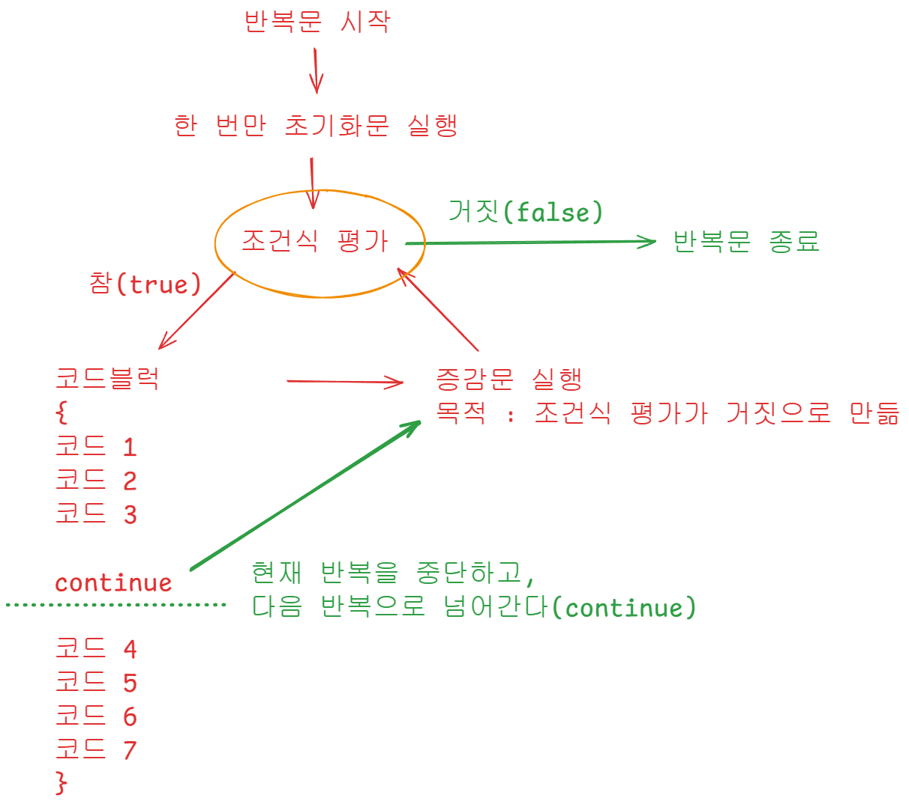

# 📘 자바스크립트 반복문 정리

---

## 🔹 반복문이 없는 코드

반복문 없이 직접 작성해야 하는 경우:

```jsx
let number = 0;
console.log(++number);
console.log(++number);
console.log(++number);
console.log(++number);
console.log(++number);
```

**출력 결과**

```
1
2
3
4
5
```

---

## 🔹 for 반복문 기본 형태

```jsx
// for (초기화; 조건식; 증감식) { 실행할 코드 }
for (let i = 0; i < 5; i++) {
	console.log(i);
}
```

**출력 결과**

```
0
1
2
3
4
```

---

## 🔹 변수 증가시키면서 출력

```jsx
let number = 0;
for (let i = 0; i < 5; i++) {
	console.log(number++);
}
```

**출력 결과**

```
0
1
2
3
4
```

---

## 🔹 초기화 / 조건식 / 증감문 예시

```jsx
for (let number2 = 0; number2 < 3; number2++) {
	console.log(number2);
}
```

**출력 결과**

```
0
1
2
```

---

## 🔹 원하는 횟수(N번) 반복

```jsx
let N = 5;
for (let i = 0; i < N; i++) {
	console.log(`${i + 1}번 실행`);
}
```

**출력 결과**

```
1번 실행
2번 실행
3번 실행
4번 실행
5번 실행
```

---

## 🔹 숫자를 0부터 5까지 출력

```jsx
for (let i = 0; i < 6; i++) {
	console.log(i);
}
```

**출력 결과**

```
0
1
2
3
4
5
```

---

## 🔹 while 반복문

조건식이 **참일 동안** 반복.

```jsx
let i = 0;
while (i < 5) {
	console.log(i);
	i++;
}
```

**출력 결과**

```
0
1
2
3
4
```

---

## 🔹 do...while 반복문

조건과 상관없이 **최소 1번은 실행**.

```jsx
let j = 0;
do {
	console.log(j);
	j++;
} while (j < 5);
```

**출력 결과**

```
0
1
2
3
4
```

---

## 🔹 break 예제

`break` → 반복문 **즉시 종료**.


```jsx
for (let k = 0; k < 10; k++) {
	if (k === 5) {
		break; // k가 5일 때 종료
	}
	console.log(k);
}
```

**출력 결과**

```
0
1
2
3
4
```

---

## 🔹 continue 예제

`continue` → **해당 반복만 건너뛰고** 다음 반복으로 진행.



```jsx
for (let m = 0; m < 10; m++) {
	if (m % 2 === 0) {
		continue; // 짝수일 때 건너뜀
	}
	console.log(m);
}
```

**출력 결과**

```
1
3
5
7
9
```

---

# ✅ 정리

- **for** → **반복 횟수가 정해졌을 때** 주로 사용
- **while** → **조건이 참일 때까지** 반복
- **do...while** → **최소 한 번 실행** 후 조건 검사
- **break** → 반복문 **강제 종료**
- **continue** → 특정 조건에서 **그 회차만 건너뜀**

---

# 📘 함수(function)

- 제어문
- 특정 기능을 수행하기 위해 미리 정의한(모아놓은) 코드 블록

## 우리가 사용해온 함수

- `console.log()`
- `String()` : 문자열 형 변환 함수(도구)
- `Number()` : 숫자형 형 변환 함수(도구)
- `Boolean()` : 불리언 형 변환 함수(도구)

## 함수의 장점

- 코드를 재사용하기에 좋다

## 정의(Define)와 호출(Call)

- 호출 : 함수를 실행
- 정의 : 함수의 이름과 기능(코드)를 정의
