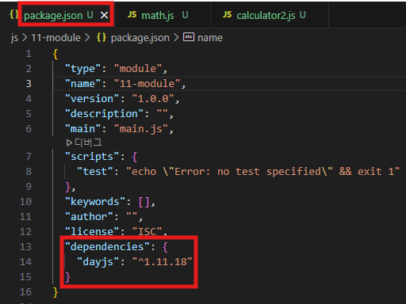
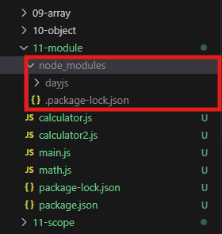
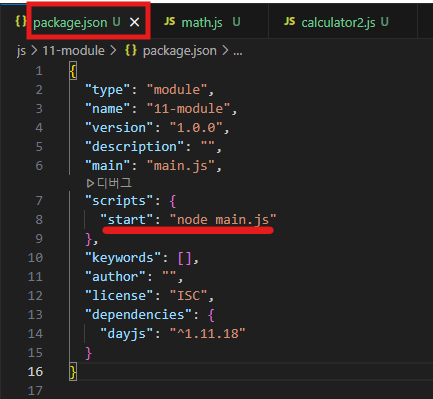

## 📝 모듈(Module)

- 모듈의 시작: 코드 분리 → **재사용성, 유지보수성 향상**
- **JavaScript 모듈 종류**
  - **ES Module (ESM) : `import` / `export`**
  - **CommonJS** : `require` / `module.exports`
- Node.js에서 ESM 사용 시:
  - **`package.json`에 반드시 `"type": "module"` 설정**
  - default export는 CommonJS와 달리 객체나 함수 하나만 export 가능

```json
{
	"type": "module"
}
```


<aside>
💡

**npm(Node Package Manager)**

</aside>

## 📝 npm(Node Package Manager)

- Node.js 패키지 설치/관리 도구
- 명령어 예시:

```bash
npm init -y          # 프로젝트 초기화, package.json 생성
npm install dayjs    # 특정 패키지 설치
npm install          # package.json 기반으로 의존성 자동 설치
```

| | |

- **주의: `node_modules`는 git에 올리지 않고 `.gitignore`에 등록**

```
# .gitignore
node_modules/
```

---

## 🔹 package.json scripts 설정

- 기존 `"test": "echo \"Error: no test specified\" && exit 1"` 삭제
- `"start": "node main.js"` 추가

```json
"scripts": {
  "start": "node main.js"
}
```



- 실행 방법:

```bash
npm start
```

- → `main.js` 실행

---


