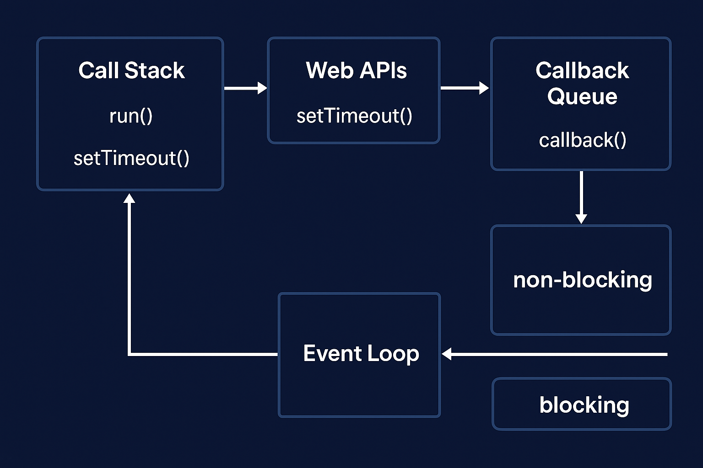

## 📌 JavaScript 실행 구조 정리

### 1. 스레드 (Thread)

- 프로그램의 **작업 처리 단위**
- **JavaScript = 싱글 스레드 구조**
  - 한 번에 하나의 작업만 처리 (동기적 실행)
  - 하지만 **브라우저(Web API)나 Node.js 런타임**이 제공하는 기능 덕분에 **비동기 작업 가능**

## 📌 코드 설명

```jsx
console.log("setTimeout 전 코드");

setTimeout(() => {
	console.log("5000ms 후 실행"); // 5초 후 실행
}, 5000);

console.log("setTimeout 후 코드");
```

---

## 📌 실행 흐름

1. **`console.log("setTimeout 전 코드")` 실행**

   → 바로 출력됨.

2. **`setTimeout(...)` 실행**
   - `setTimeout`은 브라우저(Web API)에게 _"5초 뒤 이 콜백 실행해줘"_ 라고 요청함.
   - 이 시점에서 **콜백 함수는 바로 실행되지 않고 백그라운드로 위임**됨.
3. **`console.log("setTimeout 후 코드")` 실행**

   → `setTimeout`이 끝날 때까지 기다리지 않고 즉시 출력됨.

4. **5초 뒤(Web API → 태스크 큐 → 이벤트 루프 → 콜 스택)**
   - 콜백 함수 `() => console.log("5000ms 후 실행")`이 실행됨.

---

## 📌 출력 결과

```
setTimeout 전 코드
setTimeout 후 코드
5000ms 후 실행
```

---

## 📌 핵심 포인트

- **자바스크립트는 싱글 스레드지만** `setTimeout`, `setInterval`, `fetch` 같은 함수들은 **비동기 API**로 동작.
- `setTimeout`은 *"지연 실행 예약"*이지, 코드 흐름을 멈추는 함수가 아님.
- **이벤트 루프** 덕분에 **5초를 기다리는 동안 다른 코드가 먼저 실행**될 수 있음.



**이벤트 루프(Event Loop) : Call Stack이 비어 있음 ⇒ Callback Queue의 콜백은 Call Stack으로 이동**

```
[Step 0] 코드 실행 시작
Call Stack:
(empty)

[Step 1] console.log("setTimeout 전 코드")
Call Stack:
console.log
→ 출력: "setTimeout 전 코드"
Call Stack 비움

[Step 2] setTimeout(..., 5000)
Call Stack:
setTimeout
→ Web API로 5000ms 타이머 등록
Call Stack 비움

[Step 3] console.log("setTimeout 후 코드")
Call Stack:
console.log
→ 출력: "setTimeout 후 코드"
Call Stack 비움

===============================
🕒 시간이 흐름
===============================

[Step 4] 5000ms 후
Web API:
5000ms 타이머 종료 → 콜백 함수 Callback Queue로 이동

Callback Queue:
() => console.log("5000ms 후 실행")

Event Loop:
Call Stack 비어있음 → 콜백을 Call Stack으로 이동

Call Stack:
console.log("5000ms 후 실행")
→ 출력: "5000ms 후 실행"
Call Stack 비움
```

---

### 2. 처리 방식 비교

| 구분      | 동기적 처리 (Synchronous)                | 비동기적 처리 (Asynchronous)                       |
| --------- | ---------------------------------------- | -------------------------------------------------- |
| 실행 방식 | 하나의 작업이 끝날 때까지 다음 작업 대기 | 오래 걸리는 작업을 백그라운드에서 처리             |
| 특징      | 순차적 처리, 차례대로 실행               | 동시에 여러 작업을 진행하는 것처럼 보임            |
| 단점      | 앞의 작업이 오래 걸리면 전체가 정지      | 복잡한 흐름 제어 필요 (콜백, Promise, async/await) |
| 장점      | 흐름이 단순하고 예측 가능                | 프로그램이 멈추지 않고 계속 실행 가능              |

---

### 3. 블로킹(Blocking) vs 논블로킹(Non-blocking)

| 구분      | 블로킹 (Blocking)                                              | 논블로킹 (Non-blocking)                                      |
| --------- | -------------------------------------------------------------- | ------------------------------------------------------------ |
| 실행 방식 | 작업이 끝날 때까지 **제어권을 반환하지 않음** → 다른 작업 대기 | 작업을 요청하고 **제어권을 즉시 반환** → 다른 작업 계속 수행 |
| 특징      | 요청이 완료될 때까지 멈춤                                      | 요청 후 바로 다음 코드 실행                                  |
| 장점      | 단순하고 직관적                                                | 동시에 여러 작업 진행 가능                                   |
| 단점      | 시간이 오래 걸리면 전체 프로그램 멈춤                          | 코드 복잡도 증가 (콜백, Promise, async/await 필요)           |
| 예시 (JS) | `alert("확인 누르기 전까지 멈춤")`                             | `setTimeout(() => console.log("1초 후 실행"), 1000)`         |

---

### 4. 동기 / 비동기 vs 블로킹 / 논블로킹 관계

- **동기 vs 비동기** → **작업 완료 여부**에 따른 흐름 제어
  - 동기: 작업이 끝날 때까지 기다림
  - 비동기: 작업이 끝나지 않아도 다음 코드 실행
- **블로킹 vs 논블로킹** → **제어권 반환 방식**에 따른 차이
  - 블로킹: 호출된 함수가 끝날 때까지 제어권을 돌려주지 않음
  - 논블로킹: 호출 즉시 제어권을 반환

---

✅ 정리하면

- **동기 + 블로킹** → 기다리면서 순차 실행
- **동기 + 논블로킹** → 기다리진 않지만 순서 보장은 필요
- **비동기 + 블로킹** → 드물게 사용됨
- **비동기 + 논블로킹** → JS에서 가장 많이 쓰이는 패턴 (**콜백, Promise, async/await 기반**)

---

## 1️⃣ 콜백 지옥(Callback Hell) 정의

- **콜백(callback)**: 다른 함수가 완료된 후 실행되는 함수
- **콜백 지옥**: 여러 비동기 작업을 **중첩된 콜백으로 처리**하다 보면
  코드가 **들여쓰기(depth)가 깊어지고**, 읽기 어려워지는 상황

예시:

```jsx
setTimeout(() => {
	setTimeout(() => {
		setTimeout(() => {
			console.log("콜백 지옥 발생!");
		}, 1000);
	}, 2000);
}, 3000);
```

- 위 코드는 **들여쓰기 3단계**, 실행 순서를 추적하기 어렵고 유지보수도 힘듦

---

## 2️⃣ 왜 발생하는가?

- JavaScript는 **싱글 스레드**로 동작
- 비동기 작업(`setTimeout`, `fetch`, `AJAX`, 이벤트 등)을 처리하려면 **콜백 함수를 등록**해야 함
- 여러 작업을 **순차적으로 처리해야 할 때** 콜백을 계속 중첩하다 보면 지옥이 됨

---

## 3️⃣ 문제점

1. **가독성 저하**
   - 들여쓰기(depth)가 깊어 코드 흐름이 한눈에 들어오지 않음
2. **디버깅 어려움**
   - 에러 발생 위치 파악이 힘들고, try/catch로도 처리 어려움
3. **유지보수 어려움**
   - 새로운 기능 추가나 수정 시 구조가 복잡해져 실수 발생 가능
4. **로직 복잡화**
   - 비동기 작업이 많아질수록 콜백이 꼬여서 순서 예측이 힘듦

---

## 4️⃣ 개선 방법

### 1) **Promise 사용**

- 콜백 대신 **`then()` 체인**으로 순차 처리

```jsx
new Promise((resolve) => setTimeout(resolve, 3000))
	.then(() => {
		console.log("3000ms 후 실행");
		return new Promise((resolve) => setTimeout(resolve, 2000));
	})
	.then(() => {
		console.log("2000ms 후 실행");
		return new Promise((resolve) => setTimeout(resolve, 1000));
	})
	.then(() => console.log("1000ms 후 실행"));
```

### 2) **async / await 사용**

- 동기식 코드처럼 깔끔하게 작성 가능

```jsx
async function run() {
	await new Promise((res) => setTimeout(res, 3000));
	console.log("3000ms 후 실행");

	await new Promise((res) => setTimeout(res, 2000));
	console.log("2000ms 후 실행");

	await new Promise((res) => setTimeout(res, 1000));
	console.log("1000ms 후 실행");
}

run();
```

- **장점**: 가독성 ↑, 디버깅 ↑, 유지보수 쉬움

---

## 5️⃣ 핵심 요약

- 콜백 지옥 = 중첩된 비동기 콜백으로 코드 가독성 ↓, 유지보수 힘듦
- **Promise**와 **async/await**로 해결 가능
