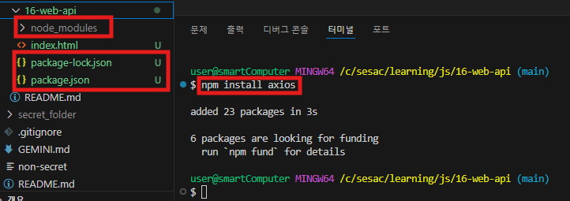
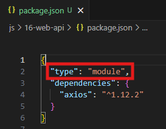

# 📌 API (Application Programming Interface)

- **정의**: 서로 다른 프로그램 간의 **대화를 위한 도구**
- **역할**: 요청과 응답을 주고받는 **규칙과 인터페이스** 제공

---

## 1️⃣ 클라이언트(Client)와 서버(Server)

| 구분                   | 설명                                                                                        | 비유   |
| ---------------------- | ------------------------------------------------------------------------------------------- | ------ |
| **클라이언트(Client)** | 요청(Request)을 보내고 응답(Response)을 받는 프로그램 또는 서비스                           | 손님   |
| **서버(Server)**       | 클라이언트가 보낸 요청(Request)을 받고, 적절한 응답(Response)을 보내는 프로그램 또는 서비스 | 음식점 |

### 동작 흐름

```
클라이언트
   ↓ 요청(Request)
웹 브라우저 → 서버 (ex: google.com)
   ↑ 응답(Response)
클라이언트 화면에 표시
```

- 예: 웹 브라우저(Chrome, Edge 등)에서 `https://www.google.com` 접속 → 서버에서 HTML, CSS, JS 응답 → 화면에 표시

---

## 2️⃣ REST 아키텍처 (Representational State Transfer)

- REST는 **웹 API 설계 규칙** 중 하나
- **HTTP 메서드(Verb)**를 사용하여 자원(Resource)을 처리

| HTTP 메서드 | 역할           |
| ----------- | -------------- |
| **GET**     | 자원 조회      |
| **POST**    | 자원 생성      |
| **PUT**     | 자원 전체 수정 |
| **PATCH**   | 자원 일부 수정 |
| **DELETE**  | 자원 삭제      |

---

## 3️⃣ URL (Uniform Resource Locator)

👉 **인터넷 자원의 위치(주소)를 나타내는 문자열**

---

## ✅ URL 구조

예시:

```
https://www.naver.com/search?query=날씨&location=서울
```

| 부분                        | 이름                                | 설명                                               |
| --------------------------- | ----------------------------------- | -------------------------------------------------- |
| `https://`                  | **스키마(Schema / Protocol)**       | 자원에 접근하는 방식 (HTTP, HTTPS, FTP 등)         |
| `www.naver.com`             | **도메인 이름(Domain Name)**        | 서버의 주소 (IP 주소 대신 사람이 읽기 쉽게 표현)   |
| `/search`                   | **경로(Path Parameters)**           | 서버 내에서 특정 자원(페이지, API 엔드포인트) 지정 |
| `?query=날씨&location=서울` | **쿼리 파라미터(Query Parameters)** | 자원에 추가적인 조건(검색어, 필터, 옵션 등) 전달   |

---

## ✅ 정리 포인트

- **스키마** → 어떤 방식으로 접근할지 (HTTP/HTTPS)
- **도메인** → 어느 서버에 요청할지
- **경로(Path)** → 서버 안에서 어떤 자원을 요청할지
- **쿼리(Query)** → 추가적인 요청 데이터 (key=value 형식)

---

# 🌐 Web API 호출 & JSON 처리 (JavaScript, Axios)

## 1. Web API 예시

- **Chrome Web Store JSON Formatter**

```
https://chromewebstore.google.com/detail/json-formatter/bcjindcccaagfpapjjmafapmmgkkhgoa?hl=ko&utm_source=ext_sidebar
```

- **JSONPlaceholder (테스트용 무료 API)**

```
https://jsonplaceholder.typicode.com/
```

### 주요 API

| 기능                 | URL               |
| -------------------- | ----------------- |
| 게시글 목록 가져오기 | `/posts`          |
| 1번 게시글 가져오기  | `/posts/1`        |
| 사용자 목록 가져오기 | `/users`          |
| 1번 사용자의 게시글  | `/posts?userId=1` |

---

## 2. Axios

- 비동기 HTTP 요청/응답 처리를 위한 JavaScript 라이브러리
- Promise 기반
- fetch API보다 **에러 처리, 인터셉터 등** 다양한 기능 제공

### 설치

```bash
npm install axios
```



`.gitignore`에 `node_modules` 등록



`package.json`에 `"type": "module"` 추가

---

## 3. Axios 사용 예제

### 3.1 기본 GET 요청

```jsx
import axios from "axios";

async function connectTest() {
	const res = await axios.get("https://jsonplaceholder.typicode.com/posts");
	console.log(res);
}

connectTest();
```

---

## 4. DummyJSON API 사용 예제

- **도메인 주소**

```jsx
const BASE_URL = "https://dummyjson.com";
```

### 4.1 테스트 Route

```jsx
const testRoute = async () => {
	const data = await axios.get(`${BASE_URL}/test`);
	console.log(data["data"]);
};
testRoute();
```

### 4.2 전체 상품 조회

```jsx
async function getAllProducts() {
	const response = await axios.get(`${BASE_URL}/products`);
	const products = response.data.products;
	console.log(products);
}
```

### 4.3 특정 상품 검색

```jsx
const searchProducts = async (search) => {
	const queryParams = new URLSearchParams({ q: search });
	const res = await axios.get(`${BASE_URL}/products/search?${queryParams}`);
	const data = res.data;

	console.log(
		data.products.map((product) => ({ [product.title]: product.price }))
	);
};
```

### 4.4 특정 속성 추출

```jsx
const getProductProperty = async (propertyName) => {
	const res = await axios.get(`${BASE_URL}/products`);
	const values = res.data.products.map((product) => product[propertyName]);
	console.log(values);
};
```

### 4.5 여러 속성 추출

```jsx
const getProductProperties = async (propertyNames) => {
	const res = await axios.get(`${BASE_URL}/products`);
	const extractedData = res.data.products.map((product) => {
		const result = {};
		propertyNames.forEach((name) => (result[name] = product[name]));
		return result;
	});
	console.log(extractedData);
};
```

### 4.6 특정 조건 필터링

```jsx
const getFilteredProducts = async (propertyName, value) => {
	const res = await axios.get(`${BASE_URL}/products`);
	const filteredProducts = res.data.products.filter(
		(product) => product[propertyName] < value
	);

	console.log(
		filteredProducts.map((product) => ({ [product.title]: product.stock }))
	);
};

// 예시: 가격이 10 이하인 상품 조회
getFilteredProducts("price", 10);
```
