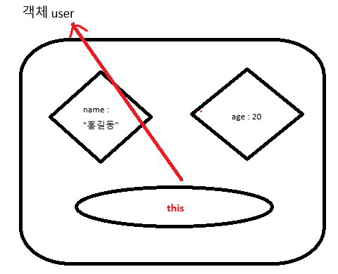
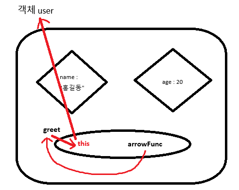

# 📌 JavaScript에서의 `this`

## ✅ 객체와 메서드

- 객체는 **key-value** 구조로 이루어짐.
- **함수도 value가 될 수 있음** → 객체 안의 함수를 **메서드(method)** 라고 부른다.



```jsx
const obj = {
	name: "홍길동",
	age: 20,
	func: function () {
		console.log(this);
		// this는 obj 객체를 가리킨다
	},
};

obj.func();
// 출력: { name: '홍길동', age: 20, func: [Function: func] }
```

---

## ✅ `function` 키워드 메서드의 `this`

- `function` 키워드로 정의된 메서드는 호출한 **객체 자체**를 `this`로 가리킨다.

```jsx
const user = {
	name: "홍길동",
	age: 20,
	greet: function () {
		console.log(`Hello ${this.name}`);
	},
};

user.greet(); // Hello 홍길동
```

---

## ✅ 화살표 함수 메서드의 `this`

- 화살표 함수는 자신만의 `this`를 가지지 않는다.
- 따라서 객체의 메서드를 화살표 함수로 정의하면 **객체를 가리키지 않고 상위 스코프의 this**를 사용한다.

```jsx
const user2 = {
	name: "홍길동",
	age: 20,
	greet: () => {
		console.log(this);
	},
};

user2.greet();
// 출력: {}
// (Node.js 환경에서 최상위 this = 빈 객체)
```

---

## ✅ 화살표 함수와 상위 스코프의 `this`

- 화살표 함수는 **선언된 위치의 상위 스코프**에 있는 `this`를 그대로 따른다.
- 만약 상위 스코프가 객체의 메서드라면, 그 메서드의 `this`(= 객체)를 따라간다.



```jsx
const user3 = {
	name: "홍길동",
	age: 20,
	greet: function () {
		console.log(this);
		// greet 메서드의 this → user3 객체

		const arrowFunc = () => {
			console.log(this);
			// arrowFunc의 this → greet의 this → user3 객체
		};

		arrowFunc();
	},
};

user3.greet();
// greet: { name: '홍길동', age: 20, greet: [Function: greet] }
// arrowFunc: { name: '홍길동', age: 20, greet: [Function: greet] }
```

---

## ✅ 실행 환경에서의 `this`

```jsx
console.log(this);
// Node.js: {}
// 브라우저 전역: window
```

---

## 📎 정리

| 구분                          | this가 가리키는 것                 |
| ----------------------------- | ---------------------------------- |
| **function 메서드**           | 호출한 객체                        |
| **화살표 함수 메서드**        | 상위 스코프의 this (객체 아님)     |
| **화살표 함수 (메서드 내부)** | 그 메서드의 this (즉, 객체)        |
| **전역에서 실행**             | Node.js: `{}` / 브라우저: `window` |

---

# 📌 객체 리터럴 단축 표현 & 계산된 속성명

## ✅ 객체 리터럴 기본

- 객체는 **key: value** 형태로 구성된다.
- `key`에는 문자열, 심볼 등이 올 수 있고, `value`는 어떤 자료형도 가능하다.

```jsx
let name = "홍길동";
let age = 20;

const user = {
	name: name,
	age: age,
};

console.log(user);
// { name: '홍길동', age: 20 }
```

---

## ✅ 단축 속성명 (Property Shorthand)

- key와 변수명이 같을 경우, **변수명만 적어도 됨**.

```jsx
let name = "홍길동";
let age = 20;

const user2 = {
	name, // name: name
	age, // age: age
};

console.log(user2);
// { name: '홍길동', age: 20 }
```

---

## ✅ 문자열 key는 그대로 들어간다

- 객체 리터럴에서 `key`는 문자열로 처리된다.
- 따라서 변수명을 직접 쓰면 "문자열 key"가 됨.

```jsx
let key = "name";

const user = {
	key: "홍길동",
};

console.log(user);
// { key: '홍길동' }  ← 변수 key가 아니라 문자열 "key"
```

---

## ✅ 계산된 속성명 (Computed Property Names)

- 변수를 **객체 key로 쓰고 싶을 때** 대괄호(`[]`)로 감싼다.
- ES6부터 지원.

```jsx
let key = "name";

const user3 = {
	[key]: "홍길동", // name: "홍길동"
};

console.log(user3);
// { name: '홍길동' }
```

---

## 📎 요약

| 문법            | 설명                               | 예제                                 | 결과                          |
| --------------- | ---------------------------------- | ------------------------------------ | ----------------------------- |
| `key: value`    | 일반적인 속성 정의                 | `{ name: "홍길동" }`                 | `{ name: "홍길동" }`          |
| `변수명만 작성` | 단축 속성명, key=변수명 동일       | `{ name, age }`                      | `{ name: "홍길동", age: 20 }` |
| `"key"`         | 문자열 key 그대로 들어감           | `{ key: "홍길동" }`                  | `{ key: "홍길동" }`           |
| `[변수]`        | 계산된 속성명, 변수값을 key로 사용 | `{ [key]: "홍길동" }` (key = "name") | `{ name: "홍길동" }`          |

---

# 📌 스프레드 연산자(Spread Operator)

## ✅ 1. 참조 복사의 문제

- 객체나 배열은 **참조 타입**이다.
- `=` 로 복사하면 실제 값이 아니라 **메모리 주소(참조)**만 복사된다.
- 따라서 하나를 수정하면 원본도 함께 바뀐다.

```jsx
const obj1 = { name: "홍길동", location: "서울" };
const obj2 = obj1; // 같은 주소를 참조
obj2.location = "대구";

console.log(obj1); // { name: '홍길동', location: '대구' }
console.log(obj2); // { name: '홍길동', location: '대구' }
```

---

## ✅ 2. 스프레드 연산자를 활용한 복사

- `...객체` 또는 `...배열`을 사용하면, 해당 데이터를 **펼쳐서 새로운 객체/배열**을 만든다.
- 원본과 독립된 값이 된다.

```jsx
// 객체 복사
const obj3 = { ...obj1 };
obj3.name = "고길동";

console.log(obj1); // { name: '홍길동', location: '대구' }
console.log(obj3); // { name: '고길동', location: '대구' }

// 배열 복사
let arr1 = [1, 2, 3];
let arr2 = [...arr1];
arr2[0] = 0;

console.log(arr1); // [1, 2, 3]
console.log(arr2); // [0, 2, 3]
```

---

## ✅ 3. 복사 + 수정/추가

- 스프레드 연산자는 **복사하면서 동시에 수정/추가**가 가능하다.

```jsx
// 객체 수정 + 속성 추가
let obj5 = { ...obj1, age: 21, planet: "지구" };
console.log(obj5);
// { name: '홍길동', location: '대구', age: 21, planet: '지구' }

// 배열 원소 추가
let arr4 = [...arr1, 4, 5];
console.log(arr4); // [1, 2, 3, 4, 5]
```

---

## ✅ 4. React에서의 활용

리액트에서는 **불변성(immutability) 유지**가 중요하다.

즉, `push`, `splice` 같은 메서드 대신 스프레드 연산자를 많이 쓴다.

```jsx
// 기존 배열
let objectArr = [{ name: "철수", age: 20 }];

// 새로운 객체를 추가한 새 배열 생성
let newObjectArr = [...objectArr, { name: "영희", age: 20 }];

console.log(newObjectArr);
// [ { name: '철수', age: 20 }, { name: '영희', age: 20 } ]
```

👉 React에서는 `setState` 할 때도 원본을 직접 수정하지 않고, **스프레드로 새 배열/객체를 만들어 교체**한다.

---

## 📎 요약

| 상황                    | 잘못된 방식(참조 복사) | 올바른 방식(스프레드 복사)   |
| ----------------------- | ---------------------- | ---------------------------- |
| 객체 복사               | `const obj2 = obj1;`   | `const obj2 = { ...obj1 };`  |
| 배열 복사               | `const arr2 = arr1;`   | `const arr2 = [...arr1];`    |
| 수정 + 추가             | `obj.key = value;`     | `{ ...obj, key: value }`     |
| React에서 상태 업데이트 | `state.push(item)`     | `setState([...state, item])` |

---

# 📌 구조 분해 할당 (Destructuring Assignment)

## ✅ 1. 기본 개념

- 배열이나 객체의 값을 **개별 변수**로 쉽게 꺼내오는 문법.
- ES6(ECMAScript 2015)에서 추가.
- 변수명과 객체의 **속성명(key)** 또는 배열의 **인덱스 순서**가 일치해야 한다.

---

## ✅ 2. 객체 구조 분해 할당

### 🔹 일반 할당

```jsx
const object = { name: "홍길동", age: 20 };

// 일반적인 방식
let name = object["name"];
let age = object["age"];
```

### 🔹 구조 분해 할당

```jsx
// key와 같은 이름의 변수를 선언
let { name, age } = object;

console.log(name); // 홍길동
console.log(age); // 20
```

### 🔹 원하는 속성만 뽑기

```jsx
const product = { id: 1, title: "갤럭시 99", price: 9900 };
const { title, price } = product;

console.log(title); // 갤럭시 99
console.log(price); // 9900
```

---

## ✅ 3. 배열 구조 분해 할당

### 🔹 기본

```jsx
const array = [1, 2, 3, 4, 5];
const [a, b, c, d, e] = array;

console.log(a, b, c, d, e); // 1 2 3 4 5
```

### 🔹 필요 없는 값 건너뛰기

```jsx
const [x, , y] = [10, 20, 30];
console.log(x, y); // 10 30
```

### 🔹 기본값 설정

```jsx
const [m = 1, n = 2] = [];
console.log(m, n); // 1 2
```

---

## ✅ 4. 함수에서 활용

### 🔹 객체를 매개변수로 받을 때

```jsx
function func(user) {
	console.log(`Hello ${user.name}, I'm ${user.age}`);
}

function func2({ name, age }) {
	// 매개변수에서 바로 구조 분해
	console.log(`Hello ${name}, I'm ${age}`);
}

const user = { name: "홍길동", age: 20 };
func(user); // Hello 홍길동, I'm 20
func2(user); // Hello 홍길동, I'm 20
```

👉 `func2` 방식이 더 직관적이고, 필요한 값만 뽑을 수 있음.

---

## ✅ 5. 구조 분해 할당 + 단축 프로퍼티

```jsx
// API 응답 데이터 예시
const comments = [
	{ id: 1, body: "첫 번째 댓글", userId: 10 },
	{ id: 2, body: "두 번째 댓글", userId: 11 },
];

const newComments = comments.map((element) => {
	const { id, body } = element; // 구조 분해
	return { id, body }; // 단축 프로퍼티
});

console.log(newComments);
// [ { id: 1, body: '첫 번째 댓글' }, { id: 2, body: '두 번째 댓글' } ]
```

---

## 📎 요약

| 구분          | 문법                        | 설명                                     |
| ------------- | --------------------------- | ---------------------------------------- |
| 객체          | `const { key } = obj;`      | key 이름이 같은 변수를 자동으로 생성     |
| 배열          | `const [a, b] = arr;`       | 순서(index)에 맞게 변수에 값 할당        |
| 기본값        | `const { key = 값 } = obj;` | 없는 속성에 기본값 지정 가능             |
| 함수 매개변수 | `function f({key}) {}`      | 인자로 전달된 객체에서 필요한 값만 꺼냄  |
| 단축 프로퍼티 | `{ id, body }`              | key와 변수명이 같으면 `id: id` 생략 가능 |
