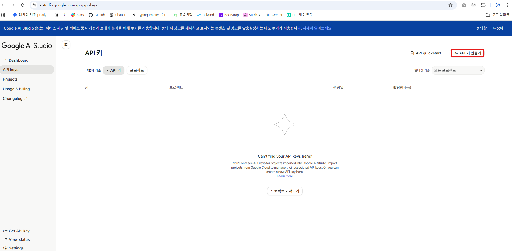
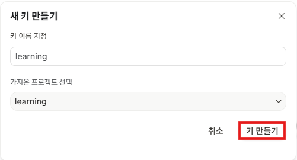
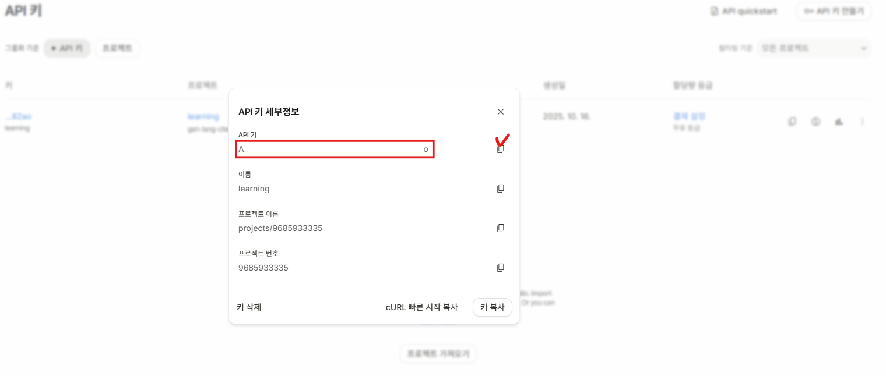
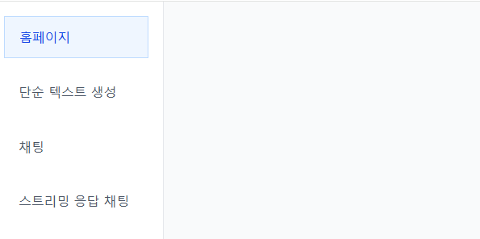
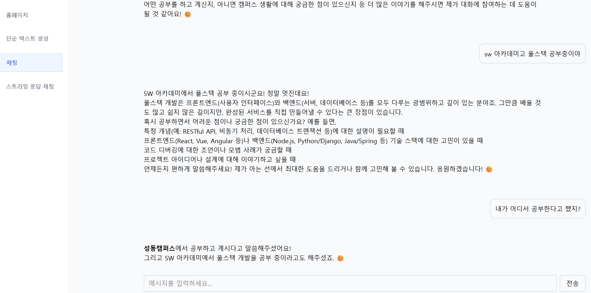

# Gemini API Key 발급 및 환경 설정 가이드

## 1. Gemini API Key 발급 절차

Google의 Gemini API는 AI 기능을 애플리케이션에 통합할 수 있는 AI 모델 API입니다.

(참고: ChatGPT API는 유료이지만 Gemini API는 Google에서 제공)

### 1) Google AI Studio API 키 페이지 접속

- https://aistudio.google.com/app/api-keys 접속

---

### 2) API 키 생성

- 화면에서 `+ API 키 만들기` 버튼 클릭



---

### 3) 키 생성 과정

- 3-1. 키 이름 입력
- 3-2. `+ Create project` 클릭하여 새 프로젝트 생성
  
- 3-3. 프로젝트 이름 지정
- 3-4. 프로젝트 생성 완료

---

### 4) 발급된 API 키 복사 및 보관

- 생성된 API 키를 안전한 곳에 복사해 두기
- 키는 절대 공개 저장소에 올리지 말 것
  

---

## 2. JavaScript 개발 환경 설정

---

### 1) 프로젝트 디렉토리 구조 예시

```
📁 gemini-api/
├── 📝 .gitignore
└── 📝 .env
```

---

### 2) 패키지 설치

- Gemini API용 라이브러리 설치

```bash
npm install @google/genai
```

- 환경변수 관리를 위한 dotenv 설치

```bash
npm install dotenv
```

---

### 3) `.gitignore` 파일 작성

```bash
.env
node_modules
```

- 환경변수 파일과 `node_modules` 폴더는 Git에 커밋하지 않도록 설정

---

### 4) `package.json` 파일 작성 (모듈 타입 설정)

```json
{
	"type": "module"
}
```

- ES 모듈 사용 설정 (import/export 구문 가능)

---

### 5) `.env` 환경 변수 파일 작성

```
GEMINI_API_KEY=발급받은_API_키_여기에_붙여넣기
```

- 실제 발급받은 API 키를 넣고 저장

---

## 요약

| 단계              | 설명                                         |
| ----------------- | -------------------------------------------- |
| 1. API 키 생성    | Google AI Studio에서 API 키 생성             |
| 2. 프로젝트 세팅  | Node.js 프로젝트에 genai, dotenv 설치        |
| 3. 환경 변수 관리 | `.env` 파일에 API 키 저장, `.gitignore` 설정 |
| 4. 모듈 설정      | `package.json`에 `"type": "module"` 추가     |

---

# Gemini API 기반 React AI 챗봇 프로젝트 정리

## 1. 프로젝트 개요

- **목표:** 구글 Gemini API를 활용해 React 기반 AI 챗봇 및 텍스트 생성 앱 개발
- **기능:**
  - 일반 텍스트 생성 (단순 프롬프트 → 텍스트 생성)
  - 채팅형 AI (사용자 입력 → AI 응답)
  - 향후 스트리밍 응답 처리 예정
- **주요 기술:** React, React Router, TailwindCSS, Google Gemini API

---

## 2. 환경 설정 및 프로젝트 생성

**2-1. React 프로젝트 생성**

```bash
npm create vite@latest my-genai-app --template react
cd my-genai-app
npm install
# 폴더 이동
cd chat-bot-app
# 패키지 설치
npm install
# 서버 실행 확인
npm run dev
```

- `react/chat-bot-app/src` 폴더를 아래 폴더로 덮어쓰기

[src.zip](attachment:bb8da79d-dd9d-44ff-b493-6105708a189e:src.zip)

**2-2. 필수 라이브러리 설치**

```bash
npm install react-router-dom tailwindcss @google/genai

# genai관련 패키치 설치
npm install @google/genai
# router 관련 패키치 설치
npm install react-router-dom@^7
# 마크다운 표현 컴포넌트 패키지, GitHub 확장된 마크다운 문법 표현 패키지
npm install react-markdown remark-gfm

## 필요에 따라 아래 패키지 추가 설치
# axios관련 패키치 설치
npm install axios
# redux 관련 패키치 설치
npm install react-redux
npm install @reduxjs/toolkit
# 마크다운 표현 컴포넌트 패키지, GitHub 확장된 마크다운 문법 표현 패키지
npm install react-markdown remark-gfm
```

**2-3. Tailwind CSS 설정**

```bash
# tailwindcss 관련 패키치 설치
npm install tailwindcss @tailwindcss/vite
# vite.config.js 수정
`import { defineConfig } from "vite";
import react from "@vitejs/plugin-react";
import tailwindcss from "@tailwindcss/vite";

export default defineConfig({
  plugins: [react(), tailwindcss()],
});`
# src/index.css에 Tailwind import
`@import "tailwindcss";`
```

`tailwind.config.js` 설정 후, `index.css`에 Tailwind 기본 및 마크다운 스타일 추가

**2-4. 환경변수 등록**

- `.env` 파일에 Gemini API 키 등록
- `.gitignore` 파일에 `.env` 추가

```
VITE_GEMINI_API_KEY=your_gemini_api_key_here
```

---

## 3. Gemini API 기초 이론

- **GoogleGenAI** 클래스: Gemini API와의 통신을 위한 주요 엔트리 포인트
- **ai 객체**: 텍스트 생성 등 일반 AI 모델 호출용
- **chat 객체**: 채팅 전용 AI 모델 호출용 (대화 흐름 관리 가능)
- **모델명**: "gemini-2.5-flash" (예시)
- **시스템 지침(systemInstruction)**: AI에게 특정 역할과 행동 지침 부여
- **응답 스키마(JSON Schema)**: AI가 반환할 JSON 형식 명세로, 응답 일관성 유지

3-1. 파라미터 조절 (Response Control)

AI 모델의 응답 방식을 다양하게 제어하는 핵심 옵션들입니다.

| 파라미터              | 설명                               | 예시 값                           |
| --------------------- | ---------------------------------- | --------------------------------- |
| **temperature**       | 응답의 창의성(무작위성) 조절 (0~1) | 0 (정확한 답변) ~ 1 (창의적 답변) |
| **maxOutputTokens**   | 응답 최대 토큰 수                  | 1000, 500 등                      |
| **stopSequences**     | 응답 중단 기준 문자열              | "\n\n", ".", "STOP"               |
| **systemInstruction** | AI에게 부여하는 역할과 지침        | "당신은 친절한 도우미입니다." 등  |

- **temperature**가 낮으면 모델이 보수적이고 예측 가능한 답변을 생성
- **temperature**가 높으면 더 창의적이고 다양한 답변을 생성
- **maxOutputTokens**로 응답 길이 제한 가능
- **stopSequences**는 AI가 특정 문자를 만나면 답변 생성을 중단하도록 지정
- **systemInstruction**은 AI 역할과 응답 형식을 지정하는 “운영 매뉴얼” 역할

---

## 4. 주요 코드 설명

### 4-1. Gemini API 설정 — `src/utils/genai.js`

```jsx
import { GoogleGenAI } from "@google/genai";

const GEMINI_API_KEY = import.meta.env.VITE_GEMINI_API_KEY;

const ai = new GoogleGenAI({ apiKey: GEMINI_API_KEY });

const chat = ai.chats.create({
	model: "gemini-2.5-flash",
});

const responseSchema = {
	type: "object",
	properties: {
		isMemo: { type: "boolean" },
		content: { type: "string" },
		dueDate: { type: "string" },
		priority: { type: "string", enum: ["높음", "중간", "낮음"] },
		category: { type: "string" },
	},
	required: ["isMemo", "content", "dueDate"],
	additionalProperties: false,
};

const systemInstruction = [
	`오늘 날짜: ${new Date().toISOString().split("T")[0]}`,
	"당신은 할 일 관리 AI입니다. 오직 할 일이나 업무 관련 내용만 처리합니다.",
	"JSON 형식으로 응답합니다.",
	"일반 대화, 인사, 질문은 무시하고 isMemo를 false로 설정합니다.",
];

const config = {
	responseMimeType: "application/json",
	responseJsonSchema: responseSchema,
	systemInstruction: systemInstruction,
};

export { ai, chat, config };
```

- AI와 채팅 모델 생성
- JSON 스키마로 응답 포맷 정의
- 시스템 지침으로 AI 역할 및 응답 형식 제한

---

### 4-2. 단순 텍스트 생성 페이지 — `src/page/CreateContent.jsx`

```jsx
import { useState } from "react";
import MessageList from "../components/MessageList";
import ChatForm from "../components/ChatForm";
import { ai } from "../utils/genai";

export default function CreateContent() {
	const [prompt, setPrompt] = useState("");
	const [message, setMessage] = useState([]);
	const [isLoading, setIsLoading] = useState(false);

	async function handleSubmit(e) {
		e.preventDefault();
		if (isLoading || prompt.trim() === "") return;
		setMessage((prev) => [...prev, { role: "user", content: prompt }]);
		setIsLoading(true);

		try {
			const response = await ai.models.generateContent({
				model: "gemini-2.5-flash",
				contents: prompt,
			});
			setMessage((prev) => [...prev, { role: "ai", content: response.text }]);
		} catch (error) {
			console.error(error);
		} finally {
			setIsLoading(false);
			setPrompt("");
		}
	}

	return (
		<>
			<MessageList messages={message} />
			<ChatForm
				prompt={prompt}
				setPrompt={setPrompt}
				isLoading={isLoading}
				onSubmit={handleSubmit}
			/>
		</>
	);
}
```

- 사용자가 프롬프트 입력
- `generateContent` API 호출 → 텍스트 생성
- 대화형 UI처럼 메시지 리스트에 쌓임



---

### 4-3. 채팅 페이지 — `src/page/Chat.jsx`

```jsx
import { useState } from "react";
import MessageList from "../components/MessageList";
import ChatForm from "../components/ChatForm";
import { chat, config } from "../utils/genai";

export default function Chat() {
	const [prompt, setPrompt] = useState("");
	const [message, setMessage] = useState([]);
	const [isLoading, setIsLoading] = useState(false);

	async function handleSubmit(e) {
		e.preventDefault();
		if (isLoading || prompt.trim() === "") return;

		setMessage((prev) => [...prev, { role: "user", content: prompt }]);
		const currentPrompt = prompt;
		setPrompt("");
		setIsLoading(true);

		try {
			const response = await chat.sendMessage({
				message: currentPrompt,
				config: config,
			});
			setMessage((prev) => [...prev, { role: "ai", content: response.text }]);
		} catch (error) {
			console.error(error);
		} finally {
			setIsLoading(false);
		}
	}

	return (
		<>
			<MessageList messages={message} />
			<ChatForm
				prompt={prompt}
				setPrompt={setPrompt}
				isLoading={isLoading}
				onSubmit={handleSubmit}
			/>
		</>
	);
}
```

- Gemini 채팅 API 호출
- 시스템 지침 기반 대화 진행
- 메시지 역할에 따라 UI 차별화 가능 (오른쪽/왼쪽 배치)



---

### 4-4. 스트리밍 채팅 - `src/components/ChatContainer.js`

```jsx
import { useEffect, useRef, useState } from "react";

import ChatForm from "../components/ChatForm";
// chat 객체 불러오기
import { chat } from "../utils/genai";
import ChatMessage from "./ChatMessage";

export default function ChatContainer() {
	// querySelector 메서드 처럼 요소를 조작(참조)하기 위한 훅
	// querySelector는 React 제어에서 벗어난 방법이기에 useRef 훅을 대신 사용
	const messagesEndRef = useRef(null);
	const [prompt, setPrompt] = useState(""); // 사용자 입력 요소 값
	const [messages, setMessages] = useState([]); // 사용자 - AI 채팅 메시지 내역
	const [isLoading, setIsLoading] = useState(false); // AI 요청 응답 로딩 상태

	//useEffect 훅을 사용해서 메시지 내역 상태(message)가 변경될 때 스크롤 이동
	useEffect(() => {
		messagesEndRef.current.scrollIntoView({ behavior: "smooth" });
	}, [messages]);

	//응답 생성 함수
	async function generateAiResponse() {
		try {
			// AI 응답 생성
			const stream = await chat.sendMessageStream({
				message: prompt,
			});

			// 스트림 응답을 위한 빈 AI 메시지 먼저 추가
			setMessages((prev) => [...prev, { role: "ai", content: "" }]);

			// 청크 누적용 문자열 변수
			let accumulatedResponse = "";

			for await (const chunk of stream) {
				// 스트림 청크 누적
				accumulatedResponse += chunk.text || "";

				// 메시지 상태 변경(함수형 업데이트)
				// prev 매개변수 : 이전 상태 데이터
				setMessages((prev) => {
					// newMessages : 새로운 배열 생성(복사)
					const newMessages = [...prev];

					// lastMessage : 마지막 메시지 메모리 주소 참조
					const lastMessage = newMessages[newMessages.length - 1];

					// AI 메시지인 경우 누적된 청크로 마지막 메세지 변경
					if (lastMessage["role"] === "ai") {
						lastMessage.content = accumulatedResponse;
					}

					// 마지막 메세지만 변경된 새로운 배열 반환
					return newMessages;
				});
			}
		} catch (error) {
			console.error(error);
		}
	}

	//폼 제출 핸들링 함수
	async function handleSubmit(event) {
		event.preventDefault();

		// 프롬프트가 비어있거나 로딩중이면 중지(return)
		if (!prompt.trim() || isLoading) return;

		// 메세지 내역 상태에 사용자 입력 프롬프트 추가(함수형 업데이트)
		setMessages((prev) => [...prev, { role: "user", content: prompt }]);

		setPrompt("");
		setIsLoading(true);

		// AI 응답 생성
		await generateAiResponse();
		setIsLoading(false);
	}

	return (
		<div>
			{/* 메시지 표현 영역 */}
			<div>
				{messages.map((message, index) => (
					<ChatMessage key={index} message={message} />
				))}
				{/* 하단 스크롤 유지를 위한 빈 div */}
				<div ref={messagesEndRef}></div>
			</div>

			{/* 사용자의 프롬프트 작성 폼 컴포넌트 */}
			<ChatForm
				prompt={prompt} // 사용자 입력 값 관리 상태
				setPrompt={setPrompt} //사용자 입력 값 상태 변경 함수
				isLoading={isLoading} // AI 응답 대기 상태
				onSubmit={handleSubmit} // form 요소 제출 이벤트 핸들러 함수
			/>
		</div>
	);
}
```

## 주요 기능 및 역할

- **상태 관리**
  - `prompt`: 사용자가 입력한 현재 메시지 내용
  - `messages`: 사용자와 AI가 주고받은 채팅 메시지 목록
  - `isLoading`: AI 응답을 기다리는 로딩 상태 표시
- **참조(Ref)**
  - `messagesEndRef`: 메시지 목록의 맨 아래 요소를 참조하여 자동으로 스크롤 이동
- **useEffect**
  - `messages` 상태가 바뀔 때마다 스크롤이 자연스럽게 맨 아래로 이동하도록 처리
- **AI 응답 생성 함수 (`generateAiResponse`)**
  - `chat.sendMessageStream` 함수를 호출해 AI 응답을 스트리밍으로 받아옴
  - AI 메시지를 빈 상태로 먼저 추가한 뒤, 도착하는 데이터 청크(chunk)를 실시간으로 합쳐서 메시지를 업데이트
- **폼 제출 처리 함수 (`handleSubmit`)**
  - 입력값이 비어있거나 로딩 중일 경우 제출 방지
  - 사용자 메시지를 `messages` 상태에 추가
  - 입력창 초기화 및 AI 응답 요청 후 로딩 상태 토글
- **렌더링**
  - `messages` 배열을 돌면서 각각 `<ChatMessage>` 컴포넌트로 렌더링
  - 스크롤 자동 유지를 위해 빈 div에 `ref` 부착
  - 입력 폼은 `<ChatForm>` 컴포넌트로 분리해 props로 상태와 핸들러 전달

---

### 4-5. 라우터 설정 — `src/router/index.js`

```jsx
import { createBrowserRouter } from "react-router-dom";
import RootLayout from "../layout/RootLayout";
import Home from "../page/Home";
import CreateContent from "../page/CreateContent";
import Chat from "../page/Chat";
import ChatContainer from "../components/ChatContainer";

const router = createBrowserRouter([
	{
		path: "/",
		Component: RootLayout,
		children: [
			{ path: "/", Component: Home },
			{ path: "/create-content", Component: CreateContent },
			{ path: "/chat", Component: Chat },
			{ path: "/stream-chat", Component: ChatContainer },
		],
	},
]);

export default router;
```

- `RootLayout`에서 공통 레이아웃 처리 (사이드바 등)
- 라우팅으로 페이지 이동 관리

---

### 4-6. 진입점 및 스타일

- `src/main.jsx`

```jsx
import { StrictMode } from "react";
import { createRoot } from "react-dom/client";
import "./index.css";
import { RouterProvider } from "react-router-dom";
import router from "./router";

createRoot(document.getElementById("root")).render(
	<StrictMode>
		<RouterProvider router={router} />
	</StrictMode>
);
```

- React 18 권장방식으로 루트 생성
- Tailwind 및 마크다운 스타일 적용 (`src/index.css`)

---

## 5. UI 컴포넌트 (요약)

- **ChatForm.jsx**: 사용자 입력 폼, 제출 이벤트 전달
- **MessageList.jsx**: 메시지 배열 받아서 렌더링, 자동 스크롤 지원
- **ChatMessage.jsx**: 개별 메시지 역할에 따라 스타일링 (오른쪽/왼쪽, 마크다운 렌더링)
- **ChatContainer.jsx**: 스트리밍 API 호출 및 실시간 메시지 출력
