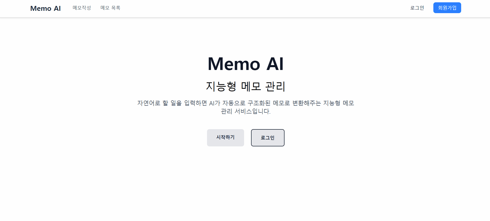

# Memo AI 프로젝트

### 🎬 시연 영상



---

## **1. 기술 스택**

- React
- Google Gemini API
- React Router v7
- Redux Toolkit, Redux Persist
- Supabase
- Tailwind CSS

---

## **2. 페이지 구성**

> 최소 페이지 구성, 필요 시 추가 가능

- **서비스 소개 페이지**: 프로젝트 목적과 기능 소개
- **로그인 페이지**: 사용자 로그인
- **회원가입 페이지**: 사용자 회원가입
- **메모 생성 페이지**: 자연어 입력 → AI 처리 → 메모 생성
- **메모 목록 페이지**: 생성된 메모 확인 및 관리 (완료 상태 변경, 삭제 등)

---

## **3. 기능 요구사항**

### **사용자 인증**

- Supabase 인증 API 활용
- 회원가입 페이지: 이메일, 비밀번호 입력
- 로그인 페이지: 이메일, 비밀번호 입력
- 비로그인 상태에서 메모 관련 페이지 접근 시 로그인 페이지로 리다이렉트

### **전역 상태**

- Redux + Redux Toolkit + Redux Persist
- 사용자 인증 정보 및 애플리케이션 상태 관리

### **메모 데이터**

- 로컬 스토리지에 저장
- Redux Persist로 상태 유지

---

## **4. AI 요구사항**

### **메모 속성 설계**

- 예시: `content`, `category`, `dueDate`, `priority`, `isCompleted`

### **Gemini API 응답 제어**

- 시스템 지침(System Instruction)
- 응답 형식(Schema)
- 파라미터(Parameter)
- JSON 형식으로 구조화된 메모 반환

---

## **5. 상세 요구사항**

### **사용자 인증**

- 회원가입 및 로그인 구현
- 로그인 상태 기반 페이지 접근 제어

### **메모 생성**

- 자연어 입력 → LLM API → 구조화된 데이터 반환
- 사용자 확인 후 메모 생성 또는 취소
- 로컬 스토리지 예시 코드:

```jsx
const memo = {
	id: 1,
	title: "메모 제목",
	content: "메모 내용",
	createdAt: "2025-01-01",
};

// 로컬 스토리지에 저장
localStorage.setItem("memo", JSON.stringify(memo));

// 로컬 스토리지에서 불러오기
const storedMemo = localStorage.getItem("memo");
const parsedMemo = JSON.parse(storedMemo);
console.log(parsedMemo);
```

### **메모 목록**

- 생성된 순서대로 표시, 로컬 스토리지에서 불러오기
- 필터링: 전체 / 미완료 / 완료
- 완료/미완료 상태 변경 → 로컬 스토리지 업데이트
- 삭제 기능 → 로컬 스토리지 업데이트

---

## **6. 권장 구현 순서**

### **1. 프로젝트 초기 설정**

```bash
# 프로젝트 생성
npm create vite@latest memo-ai-app -- --template react
cd memo-ai-app
npm install
npm run dev

# 필수 패키지 설치
npm install @google/genai react-router-dom@^7 axios react-redux @reduxjs/toolkit redux-persist react-markdown remark-gfm jwt-decode
npm install tailwindcss @tailwindcss/vite
```

- `vite.config.js` 설정

```jsx
import { defineConfig } from "vite";
import react from "@vitejs/plugin-react";
import tailwindcss from "@tailwindcss/vite";

export default defineConfig({
	plugins: [react(), tailwindcss()],
});
```

- `src/index.css` Tailwind import

```css
@import "tailwindcss";
```

- 환경 변수 및 gitignore 설정

```
# .env
VITE_SUPABASE_URL="SUPABASE 프로젝트 주소"
VITE_SUPABASE_ANON_KEY="SUPABASE 프로젝트 익명키"
VITE_GEMINI_API_KEY="GEMINI API KEY"
```

---

### **2. 페이지/레이아웃 컴포넌트 구성**

- React Router v7 경로 설정
- 페이지 이동 링크 추가

### **3. 사용자 인증**

- Redux Toolkit + Redux Persist 활용
- 로그인/회원가입 상태 관리

### **4. LLM API 기능 구현**

- 자연어 → 구조화된 JSON 메모
- AI 응답 제어 (System Instruction + Schema + Parameter)

### **5. 메모 생성 및 관리**

- 메모 생성
- 완료/미완료 상태 변경
- 삭제 기능
- 필터 기능 (전체/미완료/완료)

---

## **7. 심화 요구사항**

### **Vercel 배포 & 서버리스**

- Vercel 서비스로 배포
- AI API 호출 서버리스 함수로 구현

### **Supabase 데이터베이스 구축**

- Supabase 프로젝트 생성
- 메모 테이블 설계/구축
- Supabase SDK/API로 CRUD 구현
