# 📌 React란?

**React**는 **사용자 인터페이스(UI)를 만들기 위한 자바스크립트 라이브러리**입니다.

- Facebook에서 개발하고 유지하고 있음.
- 주로 **웹 애플리케이션**에서 사용되지만, React Native를 사용하면 모바일 앱도 개발 가능.

---

## 1️⃣ React의 핵심 개념

### ① 컴포넌트(Component)

- UI를 **작은 단위로 나눈 것**
- 재사용 가능하고 독립적
- 예시: 버튼, 카드, 리스트 등

```jsx
// 컴포넌트 정의
function Button() {
	return <button>클릭!</button>;
}

// 사용
<Button />;
```

---

### ② JSX (JavaScript XML)

- 자바스크립트 안에서 HTML처럼 작성하는 문법
- 브라우저가 이해할 수 있도록 Babel이 **JS 코드로 변환**해줌

```jsx
const element = <h1>Hello, React!</h1>;
```

---

### ③ 상태(State) & props

| 구분  | 설명                                              |
| ----- | ------------------------------------------------- |
| state | 컴포넌트 내부에서 관리되는 값, 변경 가능          |
| props | 부모 컴포넌트에서 자식에게 전달하는 값, 읽기 전용 |

```jsx
function Counter() {
	const [count, setCount] = React.useState(0); // state
	return (
		<div>
			<p>카운트: {count}</p>
			<button onClick={() => setCount(count + 1)}>+</button>
		</div>
	);
}
```

---

### ④ 가상 DOM(Virtual DOM)

- React는 **실제 DOM 변경 최소화**를 위해 가상 DOM 사용
- 변경 사항만 찾아서 효율적으로 업데이트 → 빠른 렌더링

---

### ⑤ 단방향 데이터 흐름

- 데이터는 **부모 → 자식** 방향으로만 흐름
- 상태(state)를 관리하면 UI가 자동으로 갱신됨

---

## 2️⃣ React 특징 정리

- **컴포넌트 기반**: UI를 재사용 가능한 단위로 분리
- **JSX 사용**: JS 안에서 HTML처럼 작성
- **단방향 데이터 흐름**: state → UI
- **SPA (Single Page Application)**
- **가상 DOM**: 빠른 렌더링
- **생태계 풍부**: React Router, Redux 등

---

💡 쉽게 말하면

> React = “UI를 컴포넌트 단위로 만들고, 상태 변화를 효율적으로 화면에 반영해주는 도구”

---

# 🚀 React + Vite 프로젝트 세팅 정리

---

## 💡 프로젝트 생성 및 실행

1. **프로젝트 생성**

   ```bash
   npm create vite@latest my-react-app -- --template react
   ```

   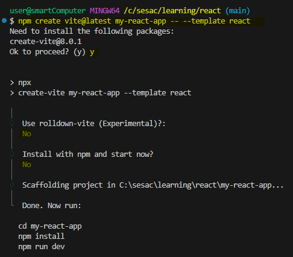

2. **프로젝트 경로 이동**

   ```bash
   cd my-react-app
   ```

3. **패키지 설치**

   ```bash
   npm install
   ```

4. **개발 서버 실행**

   ```bash
   npm run dev
   ```

   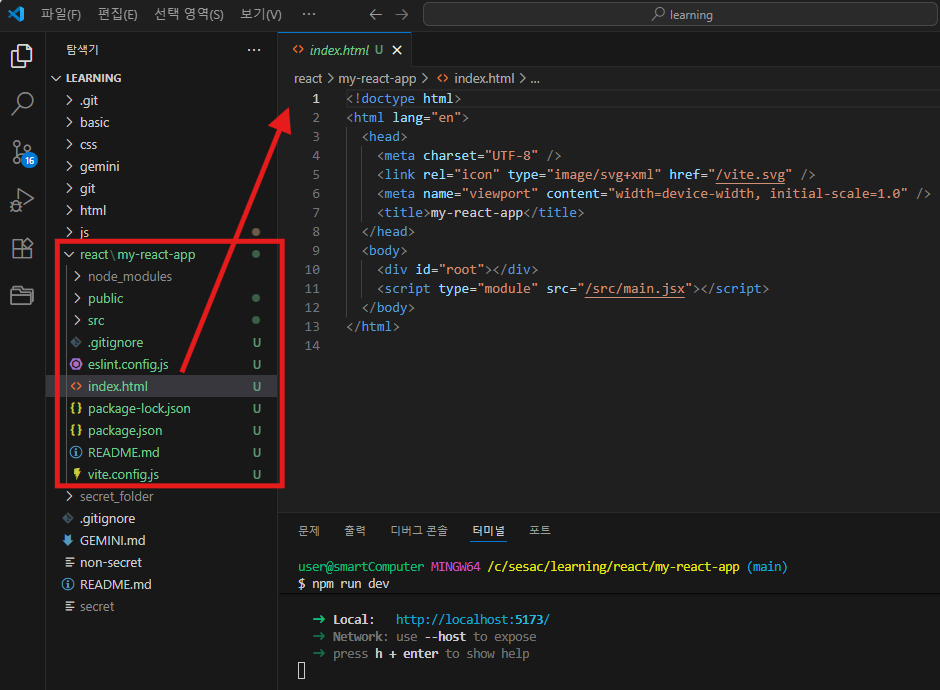

   - 브라우저에서 👉 `http://localhost:5173` 접속
     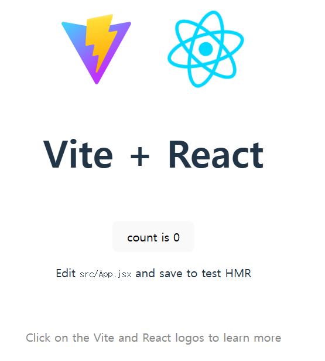

5. **프로덕션 빌드**

   ```bash
   npm run build
   ```

   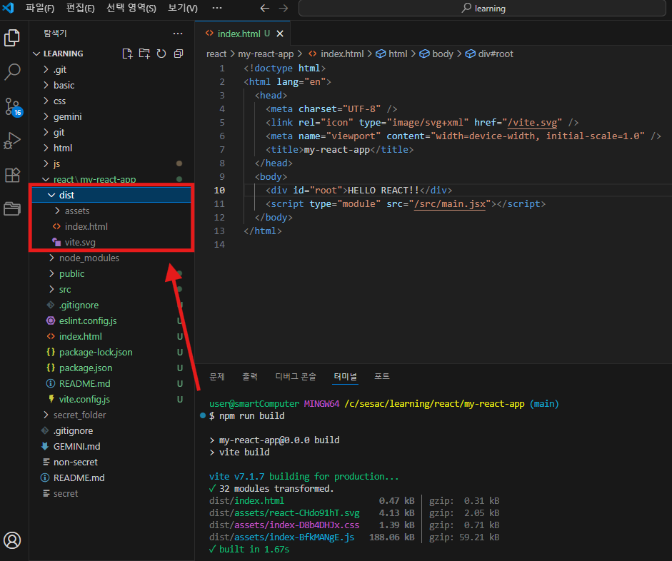

   - 빌드된 결과물은 `dist/` 폴더에 생성됨

6. **개발 서버 종료**

   ```bash
   Ctrl + C
   ```

---

## 📌 번들링(Bundling)

- **여러 개의 자바스크립트 파일을 하나(또는 몇 개)로 합치는 과정**
- 주요 목적
  1. 네트워크 요청 최소화 → 로딩 속도 개선
  2. 모듈 간 의존성 관리
  3. 최신 문법(ES6+, JSX, TS 등)을 브라우저가 이해할 수 있도록 변환
- ⚠️ `public/` 폴더 내 파일은 빌드 시 번들링 제외됨 (그대로 복사됨)

---

## 📂 폴더 및 파일 설명

- **public/** → 빌드 제외 폴더 (이미지, 정적 자원 보관)
- **eslint.config** → 문법 검사 설정
- **package.json** → 프로젝트 정보 및 패키지 목록
  - `dependencies` : 실행 시 필요한 라이브러리
  - `devDependencies` : 개발 환경에서만 필요한 라이브러리
- **package-lock.json** → 의존성 패키지 버전 고정 (오류 방지)
- **index.html** → 진입점 (최초 로딩되는 HTML 파일)
- **src/**
  - `App.jsx` : 최상위 메인 컴포넌트
  - `assets/` : 이미지, 오디오, 폰트 등
  - `App.module.css` : 모듈화된 CSS
    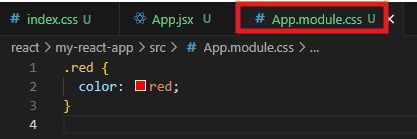
  - `App.jsx` 에 `App.module.css` 불러오기
    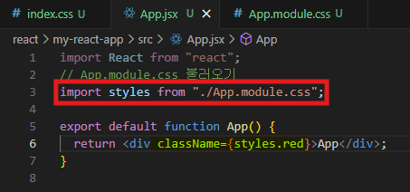
  - `npm run dev`
    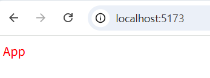

---

## 🛠 개발 편의 설정

1. **확장 프로그램 설치**
   - VS Code → `ES7+ React/Redux/React-Native snippets`
     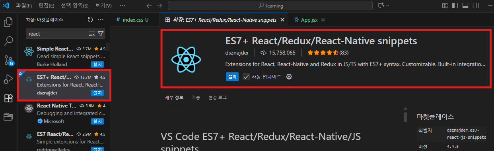
   - icon → `Material Icon Theme`
     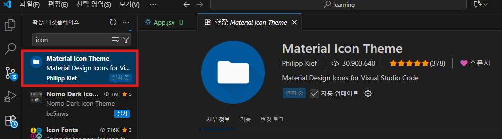
2. **기본 파일 정리**
   - `src/App.css` → 삭제
   - `src/index.css` → 초기화 후 직접 설정
   - `src/App.jsx` → 내용 삭제 후 **`rfc`** 입력하여 컴포넌트 생성

---

## 🎨 Tailwind CSS 설정

1. **설치 (반드시 서버 종료 후)**

   ```bash
   npm install tailwindcss @tailwindcss/vite
   ```

2. **vite.config.js 수정**

   ```jsx
   import { defineConfig } from "vite";
   import react from "@vitejs/plugin-react";
   import tailwindcss from "@tailwindcss/vite";

   export default defineConfig({
   	plugins: [react(), tailwindcss()],
   });
   ```

3. **src/index.css 수정**

   ```css
   @import "tailwindcss";
   ```

   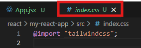

4. **적용 확인**

   ```jsx
   // App.jsx
   import React from "react";

   export default function App() {
   	return <div className="font-bold text-red-900">App</div>;
   }
   ```

   → 실행 시 빨간색 굵은 글씨로 `App` 표시 확인 ✅

   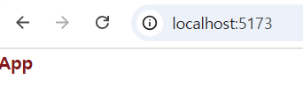

---

👉 이렇게 하면 **React + Vite + Tailwind CSS 개발환경 세팅**이 끝납니다!

# 📂 React 실습 규칙 정리

## 1️⃣ 폴더 구조 유지

- 모든 JSX 실습용 컴포넌트는 👉
  **`react/my-react-app/src/components/JSX`** 폴더에 저장
- 예시:
  ```
  └── src
      └── components
  		    ├── Header.jsx
          ├── Footer.jsx
          └── JSX
              ├── Rule.jsx
              ├── InterPlation.jsx
              ├── Counter.jsx
              └── ...
  ```

---

## 2️⃣ App.jsx에서 불러오기(import)

- 새로운 컴포넌트를 만들면 **항상 App.jsx에 import 후 실행**

```jsx
import React from "react";
import Header from "./components/Header";
import Footer from "./components/Footer";
import Rule from "./components/JSX/Rule";
import Hello from "./components/JSX/Hello";

export default function App() {
	return (
		<div>
			<Rule />
			<Hello />
		</div>
	);
}
```

---

## 3️⃣ 컴포넌트 네이밍 규칙

⚡ **파일명, 함수명 모두 대문자로 시작해야 함**

✅ 올바른 예시

```jsx
// Hello.jsx
export default function Hello() {
	return <h1>Hello Component</h1>;
}
```

❌ 잘못된 예시

```jsx
// hello.jsx
export default function hello() {
	return <h1>Hello Component</h1>;
}
```

---

📌 **정리하면**

- 📂 JSX 폴더에 저장
- 📥 App.jsx에서 import
- 🔠 대문자로 시작하는 네이밍 (파스칼 케이스)

---

# 📘 JSX 규칙 정리 (React)

---

## 1️⃣ 컴포넌트 생성

📂 경로 :

`react/my-react-app/src/components/JSX/Rule.jsx`

```jsx
import React from "react";

// export default : 모듈 기본 내보내기
// function : 함수형 컴포넌트 정의
// return : JSX 요소(Element)를 반환

// 하나의 파일 당 하나의 대표 컴포넌트 작성
// 컴포넌트 함수는 HTML 요소를 반환한다
export default function Rule() {
	// DOM API 방식
	// const element = document.createElement("div");
	// element.textContent = "APP";

	// 규칙 1. 1개의 태그만 반환해야 한다
	// ❌ 오류 : return (<div>1</div><div>2</div>);
	// ✅ 해결 : Fragment(<></>)로 감싸기
	return (
		<>
			<div>1</div>
			<div>2</div>
			<div>3</div>

			{/* 규칙 2. 모든 태그는 반드시 닫아야 한다 */}
			{/* <input> (X) → <input /> (O) */}
			<input />

			{/* 규칙 3. 속성명은 카멜케이스로 작성해야 한다 */}
			{/* onclick → onClick, onsubmit → onSubmit */}
			{/* class → className */}
			<p className="font-bold text-5xl text-red-700">p 태그 {1 + 0}</p>

			{/* 규칙 4. style 속성은 객체로 작성 */}
			<p style={{ fontSize: "3rem", color: "blue" }}>p 태그 2 + 0</p>
		</>
	);
}
```

---

## 2️⃣ App.jsx에서 컴포넌트 사용

📂 경로 :

`react/my-react-app/src/App.jsx`

```jsx
import React from "react";
import Rule from "./components/JSX/Rule";

export default function App() {
	return (
		<div>
			{/* Rule 컴포넌트 불러오기 */}
			<Rule />
		</div>
	);
}
```

---

## ✅ JSX 규칙 요약

1. **1개의 최상위 태그만 반환**해야 한다
   - 여러 태그 반환 시 반드시 `Fragment(<> </>)`로 감싸야 함
2. **모든 태그는 반드시 닫아야 한다**
   - 예: `<input />`, `` (Self-closing 태그)
3. **속성명은 카멜케이스로 작성**
   - `class → className`
   - `onclick → onClick`
   - `onsubmit → onSubmit`
4. **style 속성은 객체 형태로 작성**
   - 예: `<p style={{ fontSize: "2rem", color: "blue" }}>텍스트</p>`
