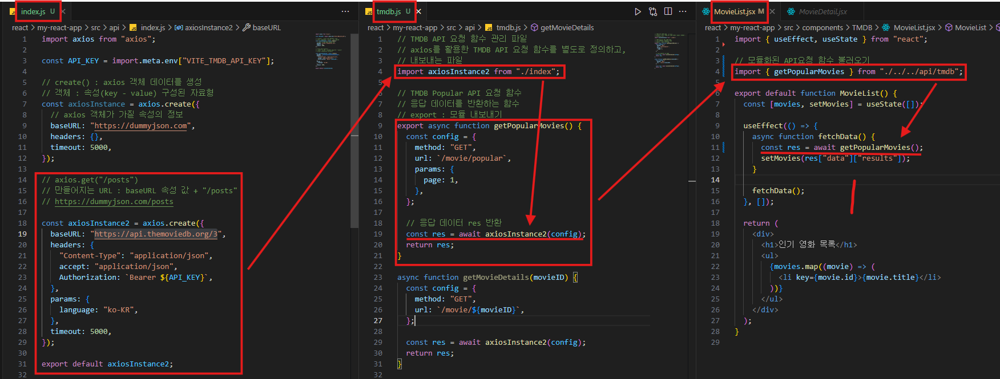
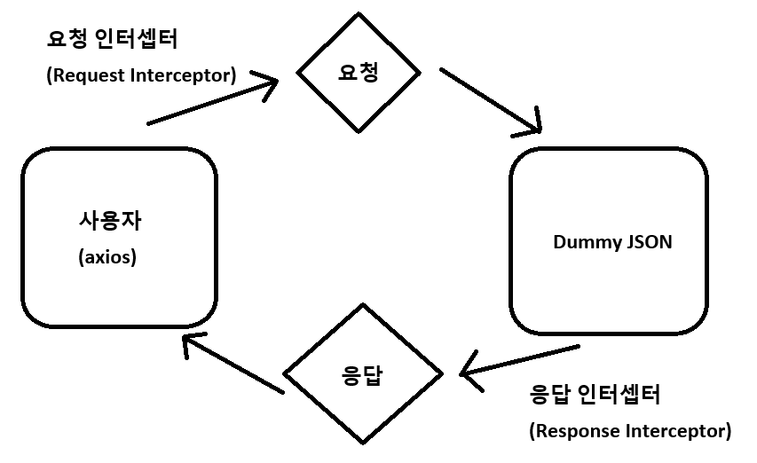

# 📌 Axios 인스턴스와 요청 함수 분리

## 1️⃣ 왜 분리할까?

처음에는 컴포넌트 안에서 직접 `axios.get()`을 사용합니다.

하지만 이렇게 하면

- 매번 `baseURL`, `headers`, `토큰` 같은 **공통 설정을 반복**해야 하고
- **API 요청 로직**과 **UI 렌더링 로직**이 섞여서 코드가 복잡해집니다.

👉 따라서 **Axios 인스턴스**와 **요청 함수**를 분리하면 훨씬 깔끔해집니다.

---

## 2️⃣ 분리 방법

### (1) Axios 인스턴스 만들기 (`api/index.js`)

공통 설정을 담은 `axios` 객체를 생성합니다.

```jsx
import axios from "axios";

const API_KEY = import.meta.env["VITE_TMDB_API_KEY"];

// create() : axios 객체 데이터를 생성
// 객체 : 속성(key - value) 구성된 자료형
const axiosInstance = axios.create({
	// axios 객체가 가질 속성의 정보
	baseURL: "https://dummyjson.com",
	headers: {},
	timeout: 5000,
});

// axios.get("/posts")
// 만들어지는 URL : baseURL 속성 값 + "/posts"
// https://dummyjson.com/posts

**const axiosInstance2 = axios.create({
	baseURL: "https://api.themoviedb.org/3",
	headers: {
		"Content-Type": "application/json",
		accept: "application/json",
		Authorization: `Bearer ${API_KEY}`,
	},
	params: {
		language: "ko-KR",
	},
	timeout: 5000,
});**

**export default axiosInstance2;**
```

👉 이제 이 인스턴스를 사용하면, 매번 URL이나 헤더를 새로 쓰지 않아도 됩니다.

---

### (2) 요청 함수 정의하기 (`api/tmdb.js`)

API 호출 로직을 함수로 만들어 관리합니다.

```jsx
// TMDB API 요청 함수 관리 파일
// axios를 활용한 TMDB API 요청 함수를 별도로 정의하고,
// 내보내는 파일
import axiosInstance2 from "./index";

// TMDB Popular API 요청 함수
// 응답 데이터를 반환하는 함수
// export : 모듈 내보내기
export async function **getPopularMovies**() {
	const config = {
		method: "GET",
		url: `/movie/popular`,
		params: {
			page: 1,
		},
	};

	// 응답 데이터 res 반환
	const res = await axiosInstance2(config);
	return res;
}

async function getMovieDetails(movieID) {
	const config = {
		method: "GET",
		url: `/movie/${movieID}`,
	};

	const res = await axiosInstance2(config);
	return res;
}

```

👉 이제 `getPopularMovies()` 를 호출하면 바로 데이터를 가져올 수 있습니다.

---

### (3) 컴포넌트에서 사용하기 (`components/MovieList.jsx`)

컴포넌트는 UI와 상태 관리에만 집중합니다.

```jsx
import { useEffect, useState } from "react";

// 모듈화된 API요청 함수 불러오기
import { **getPopularMovies** } from "./../../api/tmdb";

export default function MovieList() {
	const [movies, setMovies] = useState([]);

	useEffect(() => {
		async function fetchData() {
			const res = **await getPopularMovies();**
			setMovies(res["data"]["results"]);
		}

		fetchData();
	}, []);

	return (
		<div>
			<h1>인기 영화 목록</h1>
			<ul>
				{movies.map((movie) => (
					<li key={movie.id}>{movie.title}</li>
				))}
			</ul>
		</div>
	);
}
```

👉 컴포넌트는 **데이터 가져오기**만 알고,

세부적인 API 호출 방식은 몰라도 됩니다.

---

## 폴더 구조 예시

```
src/
 ┣ api/
 ┃ ┣ index.js        # axios 인스턴스
 ┃ ┗ tmdb.js     # 요청 함수 모음
 ┣ components/
 ┃ ┗ MovieList.jsx   # UI 컴포넌트
```

---

## 4️⃣ 정리

- **Axios 인스턴스**: 공통 설정을 한 곳에서 관리
- **요청 함수**: API별 요청을 함수로 분리
- **컴포넌트**: UI 렌더링 + 요청 함수 호출만 담당



👉 이렇게 분리하면 코드가 **깔끔하고 유지보수에 강한 구조**가 됩니다.

---

# 📌 Axios 인터셉터 (Interceptor)

Axios 인터셉터는 **요청(request)** 이 서버로 가기 전,

또는 **응답(response)** 이 서버에서 돌아온 후에

**중간에서 가로채서 공통 로직을 처리**하는 기능입니다.

---

## 1️⃣ 요청 인터셉터 (Request Interceptor)

👉 **사용자의 요청을 서버로 보내기 전에 실행**됩니다.

공통적으로 처리해야 하는 작업을 자동화할 수 있습니다.

### ✨ 주로 하는 일

- **인증 토큰(Access Token) 자동 추가**
- **공통 헤더 설정** (예: `Content-Type`, `Accept`)
- **로깅(logging)** (요청 정보를 콘솔에 출력 등)

### 💻 예시

```jsx
import axios from "axios";

const api = axios.create({
	baseURL: "https://api.example.com",
});

// 요청 인터셉터 추가
api.interceptors.request.use(
	(config) => {
		// 요청 전 공통 처리
		const token = localStorage.getItem("accessToken");
		if (token) {
			config.headers.Authorization = `Bearer ${token}`;
		}
		console.log("요청 정보:", config);
		return config;
	},
	(error) => {
		// 요청 에러 처리
		return Promise.reject(error);
	}
);
```

---

## 2️⃣ 응답 인터셉터 (Response Interceptor)

👉 **서버로부터 응답을 받은 직후 실행**됩니다.

공통적인 응답 처리나 에러 처리를 자동으로 수행할 수 있습니다.

### ✨ 주로 하는 일

- **응답 데이터 가공** (필요한 데이터만 뽑아내기)
- **에러 처리** (예: 토큰 만료 시 로그인 페이지로 이동)
- **공통 메시지 처리** (성공/실패 알림 등)

### 💻 예시

```jsx
// 응답 인터셉터 추가
api.interceptors.response.use(
	(response) => {
		// 응답 성공 시 공통 처리
		console.log("응답 데이터:", response.data);
		return response.data; // data만 리턴
	},
	(error) => {
		// 응답 에러 시 공통 처리
		if (error.response && error.response.status === 401) {
			alert("로그인이 필요합니다.");
			window.location.href = "/login";
		}
		return Promise.reject(error);
	}
);
```

### 💻 예시 2

```jsx
// 응답 인터셉터 : 서버가 사용자에게 돌려주는 응답 데이터를 가로채서 추가 작업을 수행한다
axiosInstance2["interceptors"]["response"].use(
	// 2개의 함수 전달
	// 통신(요청-응답)이 성공했을 때의 화살표 함수
	// 매개변수 response
	(response) => {
		console.log("통신 성공 응답 인터셉터");

		// 응답 데이터 반환(return)
		// 서버의 실제 응답 데이터를 반환
		return response["data"];
	},

	// 통신(요청-응답)이 실패했을 때의 화살표 함수
	// 매개변수 error
	(error) => {
		if (error.response) {
			// 401: 인증 오류(API 키, 인증 토큰 문제)
			// 테스트 시 캐시 초기화(Ctrl + Shift + R) 필수
			if (error.response.status === 401) {
				alert("인증에 문제가 있습니다.");
			}

			// 404 : Not Found(없는 주소 요청)
			if (error.response.status === 404) {
				alert("Not Found");
			}
		}

		// Promise : 3가지(성공/실패/대기중) 상태를 가진다
		return Promise.reject(error);
	}
);
```

---

## 3️⃣ 흐름도 (요청/응답 시점)



- 요청 인터셉터 : 토큰 추가, 헤더 설정 등
- 응답 인터셉터 : 데이터 가공, 에러 처리 등

---

## ✅ 정리

- **요청 인터셉터** → 요청 전에 공통 작업 (토큰 추가, 헤더 설정)
- **응답 인터셉터** → 응답 후 공통 작업 (데이터 가공, 에러 처리)

👉 인터셉터를 사용하면 **반복 코드를 줄이고**, 프로젝트 전반에서 **일관된 처리**를 할 수 있습니다.
