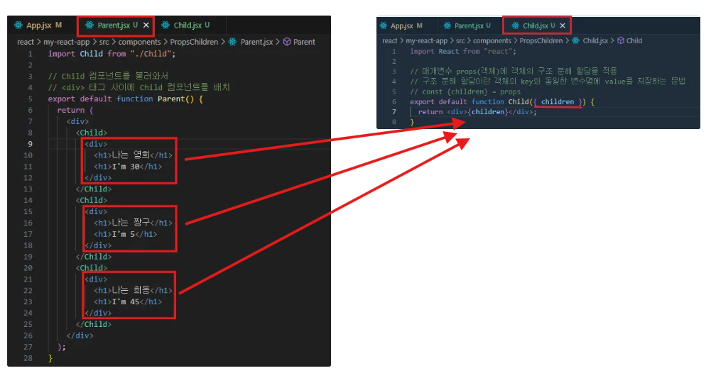

# 💡 Children Props

React 팀이 정한 **특수한 prop 이름**입니다.

- 열리는 태그 안에 들어가는 **자식 요소(child elements)**를 담는 용도로 예약되어 있어요.
- 다른 prop 이름으로 전달할 수도 있지만, `children`을 사용하면 **컴포넌트가 유연하게 중첩된 내용을 받을 수 있음**을 의미합니다.



```
#출력 결과

나는 영희
I'm 30
나는 짱구
I'm 5
나는 희동
I'm 45
```

---

# 💡조건부 렌더링**(Conditional Rendering)**

- JSX 내부에서는 **`if` 문은 바로 사용 불가**
- **대신 `삼항 연산자`**와 **`논리 연산자` 사용**

  - 삼항 연산자 (삼항연산자 문법 : 조건식 ? "참일 때 요소" : "거짓일 떄 요소”)
    

    ```
    # 출력

    로그인 상태 : 로그인 상태
    로그아웃
    홍길동님 환영합니다

    로그인 상태 : 비 로그인 상태
    로그인
    로그인 해주세요
    ```

  - 논리 연산자 ( 조건 && 참일 때 요소 )
    

    ```
    # 출력

    관리자
    관리 페이지 이동
    일반 사용자
    ```
