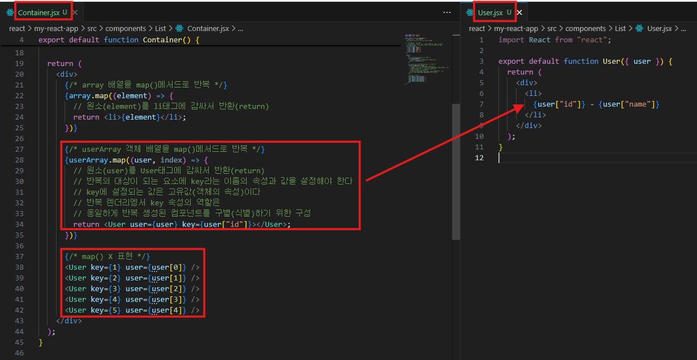

# 💡**리스트 렌더링(List Rendering)**

- 배열 데이터의 원소를 화면에 반복적으로 렌더링
- `map()` 로 JSX 요소(Element)를 반복적으로 생성
- JSX 안에서는 **중괄호 `{}` 내부에 표현식(expression)만 사용 가능**
  → `if`, `for`, `while` 같은 문(statement)은 직접 사용 불가
  
  ※ map()을 사용하지 않을 경우 key를 설정하여 컴포넌트를 식별할 수 있게 한다

  ```
  #출력

  1 - 우영
  2 - 길동
  3 - 철수
  4 - 짱구
  5 - 영희
  ```
