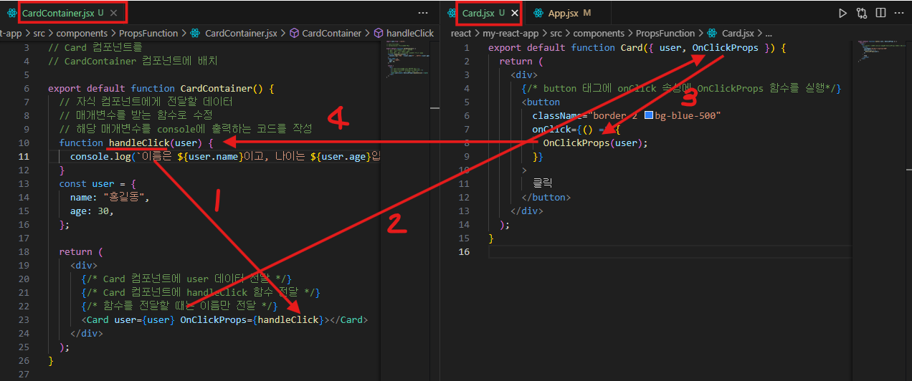

# 💡 React Props 함수 전달 흐름 (부모 → 자식 → 부모)



## 1️⃣ 부모 → 자식으로 props 전달

- **부모 컴포넌트(CardContainer)**
    - `user` 객체와 `handleClick` 함수를 정의
    - 자식 컴포넌트(Card)로 props로 전달

```jsx
<Card user={user} OnClickProps={handleClick} />
```

👉 여기서 `handleClick` 함수는 이름만 전달합니다. (`handleClick()`처럼 실행하지 않음)

---

## 2️⃣ 자식 컴포넌트(Card)에서 props 받기

- **Card 컴포넌트**
    - `user`와 `OnClickProps`를 props로 받음
    - 버튼 클릭 시 → `OnClickProps(user)` 실행

```jsx
<button
  onClick={() => {
    OnClickProps(user); // 부모에서 받은 함수 호출하면서 user 전달
  }}
>
  클릭
</button>
```

---

## 3️⃣ 부모의 함수 실행

- 부모의 `handleClick(user)` 실행됨
- `user`가 매개변수로 넘어와서 콘솔 출력

```jsx
function handleClick(user) {
  console.log(`이름은 ${user.name}이고, 나이는 ${user.age}입니다.`);
}
```

---

## 🔄 전체 데이터/이벤트 흐름 다이어그램

```
CardContainer (부모)
 ├─ user 객체 생성 { name: "홍길동", age: 30 }
 ├─ handleClick(user) 함수 정의
 └─ <Card user={user} OnClickProps={handleClick} />

        ↓ props 전달

Card (자식)
 └─ 버튼 클릭 시 OnClickProps(user) 실행

        ↓ 함수 호출

CardContainer (부모)
 └─ handleClick(user) 실행
      → "이름은 홍길동이고, 나이는 30입니다." 출력

```