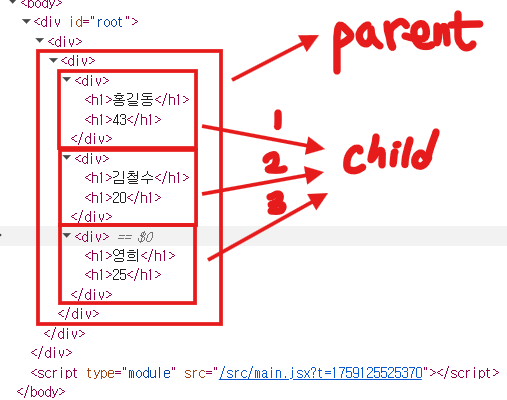
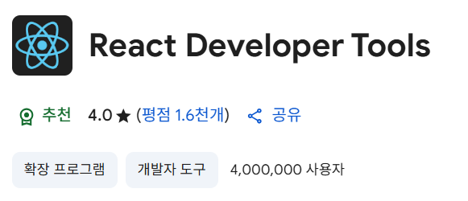

# 💡 React Props 정리

## 1️⃣ Props란?

- **Props(properties)** : 컴포넌트에 데이터를 전달하기 위한 속성
- 동작 방식
  - **Parent(부모)** 가 데이터(props)를 **자식 컴포넌트**에 전달
  - **Child(자식)** 는 함수의 **매개변수(props)** 로 데이터 수신
  - 동일한 구조의 컴포넌트를 **재활용**할 수 있게 해줌
    

📌 React Developer Tools 설치 시 props 구조를 쉽게 확인 가능

- Chrome 상단 퍼즐 아이콘 클릭 → 확장 프로그램 관리 → Chrome 웹 스토어 → **React Developer Tools 설치**
  

---

## 2️⃣ 기본 props 전달 (문자, 숫자, 불리언)

```jsx
// Profile.jsx
export default function Profile(props) {
	return (
		<div>
			저는 {props.name}이고, {props.age}세 이며,{" "}
			{props.isAdmin ? "관리자 입니다." : "관리자가 아닙니다."}
		</div>
	);
}

// ProfileContainer.jsx
export default function ProfileContainer() {
	return (
		<div>
			<Profile name="현우" age={22} isAdmin={true} />
			<Profile name="수진" age={21} isAdmin={false} />
		</div>
	);
}
```

📌 출력 결과

```
저는 현우이고, 22세 이며, 관리자 입니다.
저는 수진이고, 21세 이며, 관리자가 아닙니다.
```

---

## 3️⃣ 변수 활용한 props 전달

```jsx
// ProfileContainer.jsx
export default function ProfileContainer() {
	const name = "주영";
	const age = 30;
	const isAdmin = true;

	return <Profile name={name} age={age} isAdmin={isAdmin} />;
}
```

📌 장점 → 부모의 상태/변수를 바꾸면 자식 컴포넌트도 자동 반영됨

---

## 4️⃣ 객체 형태로 props 전달

```jsx
// Profile.jsx
export default function Profile(props) {
	return (
		<div>
			저는 {props.user.name}이고, {props.user.age}세 이며,{" "}
			{props.user.isAdmin ? "관리자 입니다." : "관리자가 아닙니다."}
		</div>
	);
}

// ProfileContainer.jsx
export default function ProfileContainer() {
	return (
		<div>
			<Profile user={{ name: "동원", age: 30, isAdmin: true }} />
			<Profile user={{ name: "경식", age: 26, isAdmin: false }} />
		</div>
	);
}
```

---

## 5️⃣ props 구조 분해 할당 (Destructuring)

```jsx
// Profile.jsx
export default function Profile({ name, age, isAdmin }) {
	return (
		<div>
			저는 {name}이고, {age}세 이며,{" "}
			{isAdmin ? "관리자 입니다." : "관리자가 아닙니다."}
		</div>
	);
}
```

📌 객체 props도 구조 분해 가능

```jsx
export default function Profile({ user: { name, age, isAdmin } }) {
	return (
		<div>
			저는 {name}이고, {age}세 이며,{" "}
			{isAdmin ? "관리자 입니다." : "관리자가 아닙니다."}
		</div>
	);
}
```

---

## 6️⃣ 요약 표

| 형태             | 예시 코드                                                     | 설명                |
| ---------------- | ------------------------------------------------------------- | ------------------- |
| 문자/숫자/불리언 | `<Profile name="현우" age={22} isAdmin={true} />`             | 기본 데이터 전달    |
| 변수 전달        | `<Profile name={name} age={age} isAdmin={isAdmin} />`         | 부모 변수 활용      |
| 객체 전달        | `<Profile user={{ name: "동원", age: 30, isAdmin: true }} />` | 객체를 통째로 전달  |
| 구조 분해 할당   | `function Profile({ name, age, isAdmin }) {}`                 | props를 간단히 분해 |
