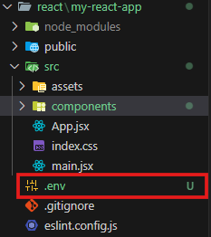
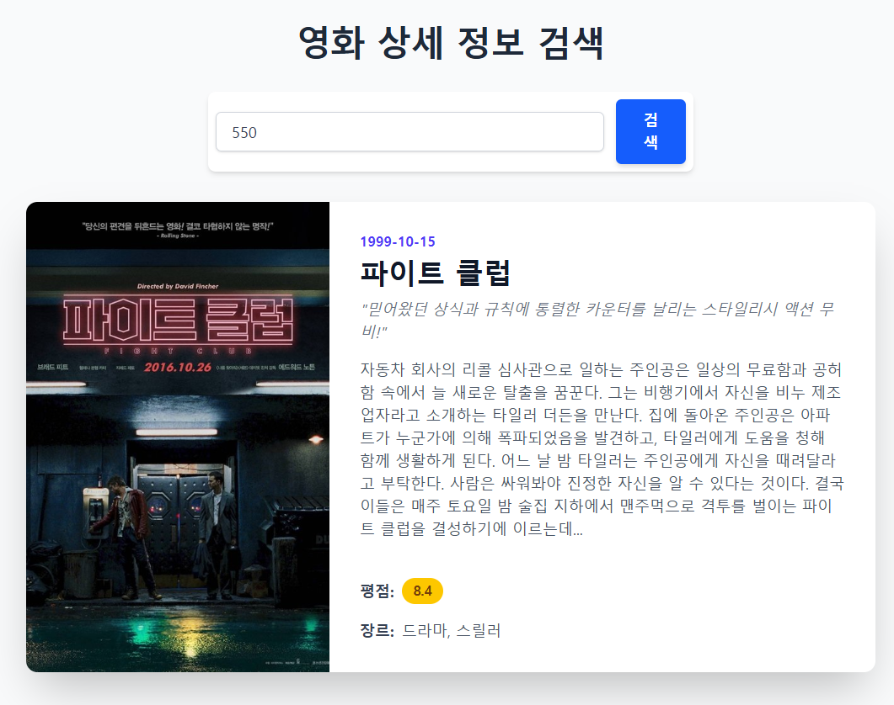

# 🎬 TMDB API 사용 가이드

## 1. TMDB API 키 발급하기

1. [TMDB 공식 사이트](https://www.themoviedb.org/) 접속
2. 회원가입 및 로그인 진행
3. [API 키 발급 페이지](https://www.themoviedb.org/settings/api) 이동
4. **API 키 신청 절차**
   - **어플리케이션 이름**: 원하는 이름 입력 (예: Test)
   - **어플리케이션 URL**: 임시로 [http://test.com](http://test.com/) 입력 가능
   - **어플리케이션 개요**: 일정 길이 이상 작성 필요
     - 예시: _"API 호출 학습을 위해 TMDB API Key 발급 신청"_
   - **이름 및 성**: 반드시 영문으로 입력
   - 나머지 정보는 적당히 작성 후 제출
5. 승인 후 [API 키 확인 페이지](https://www.themoviedb.org/settings/api)에서 확인 가능
   - `API Key (v3 auth)`
   - `API Read Access Token (v4 auth)`

---

## 2. 환경 변수(.env) 설정

1. 프로젝트 루트 디렉토리에 `.env` 파일 생성

   

2. `.gitignore` 파일에 `.env` 추가 (보안상 GitHub 등에 노출 방지)
3. `.env` 파일에 키 등록

   ```
   VITE_TMDB_API_KEY=발급받은_API_KEY
   ```

4. 코드에서 불러오기

   ```jsx
   const TMDB_API_KEY = import.meta.env.VITE_TMDB_API_KEY;
   ```

---

## 3. API 요청 예시

### 📌 Axios 설치

```bash
npm install axios
```

### 📌 TMDB API 호출 예제

```jsx
import { useEffect, useState } from "react";
import axios from "axios";

const BASE_URL = `https://api.themoviedb.org/3`;
**const API_KEY = import.meta.env["VITE_TMDB_API_KEY"];**
const IMAGE_BASE_URL = "https://image.tmdb.org/t/p/w500";

export default function MovieDetail() {
	// 리액트의 상태(state) : 화면을 결정한다. 화면에 보여질 데이터를 관리한다
	// movie : 상태 데이터를 저장하고 있는 변수
	// setMovies : 상태 데이터를 바꾸는 함수
	const [movie, setMovie] = useState(null);
	const [movieID, setMovieID] = useState(550); // 'Fight Club' ID for a good default example
	const [loading, setLoading] = useState(false);
	const [error, setError] = useState(null);

	// Fetch on initial load with a default ID
	useEffect(() => {
		fetchData();
	}, []);

	async function fetchData() {
		if (!movieID) {
			setError("영화 ID를 입력해주세요.");
			setMovie(null);
			return;
		}
		setLoading(true);
		setError(null);
		// Keep previous movie data while loading new one for better UX
		// setMovie(null);

		const config = {
			method: "GET",
			url: `${BASE_URL}/movie/${movieID}`,
			headers: {
				accept: "application/json",
				**Authorization: `Bearer ${API_KEY}`,**
			},
			params: {
				language: "ko-KR",
			},
		};

		try {
			const res = await axios(config);
			// setMovie(data) : 상태 변수 movies에 저장된 데이터가 data로 변경된다
			setMovie(res.data);
		} catch (err) {
			setError(`'${movieID}' ID에 해당하는 영화를 찾을 수 없습니다.`);
			setMovie(null);
		} finally {
			setLoading(false);
		}
	}

	return (
		<div className="container mx-auto p-4 md:p-8 bg-gray-50 min-h-screen font-sans">
			<h1 className="text-3xl md:text-4xl font-bold text-center text-gray-800 mb-8">
				영화 상세 정보 검색
			</h1>
			<div className="max-w-lg mx-auto mb-8">
				<div className="flex flex-col sm:flex-row items-center gap-3 p-2 bg-white rounded-lg shadow-md">
					<label htmlFor="movieID" className="sr-only">
						영화 번호
					</label>
					<input
						type="number"
						id="movieID"
						name="movieID"
						placeholder="영화 ID를 입력하세요 (예: 550)"
						value={movieID}
						className="flex-grow w-full px-4 py-2 text-base text-gray-700 border border-gray-300 rounded-md shadow-sm focus:outline-none focus:ring-2 focus:ring-blue-500 transition-shadow"
						onChange={(e) => setMovieID(e.target.value)}
						onKeyDown={(e) => {
							if (e.key === "Enter") fetchData();
						}}
					/>
					<button
						className="w-full sm:w-auto px-6 py-2.5 text-base font-semibold text-white bg-blue-600 rounded-md shadow-md hover:bg-blue-700 focus:outline-none focus:ring-2 focus:ring-offset-2 focus:ring-blue-500 transition-all duration-200 ease-in-out transform hover:scale-105 disabled:bg-gray-400 disabled:scale-100"
						onClick={fetchData}
						disabled={loading}
					>
						{loading ? "검색 중..." : "검색"}
					</button>
				</div>
			</div>

			{/* Loading Spinner */}
			{loading && (
				<div className="flex justify-center items-center">
					<div className="animate-spin rounded-full h-16 w-16 border-t-4 border-b-4 border-blue-500"></div>
				</div>
			)}

			{/* Error Message */}
			{error && !loading && (
				<div
					className="max-w-2xl mx-auto p-4 bg-red-100 text-red-800 border-l-4 border-red-500 rounded-md shadow-lg"
					role="alert"
				>
					<p className="font-bold">오류</p>
					<p>{error}</p>
				</div>
			)}

			{/* Movie Card */}
			{movie && !loading && (
				<div className="max-w-4xl mx-auto bg-white rounded-xl shadow-2xl overflow-hidden md:flex transition-opacity duration-500 ease-in-out opacity-100">
					<div className="md:flex-shrink-0">
						
					</div>
					<div className="p-8 flex flex-col justify-between">
						<div>
							<div className="uppercase tracking-wide text-sm text-indigo-600 font-semibold">
								{movie.release_date}
							</div>
							<h2 className="block mt-1 text-3xl leading-tight font-extrabold text-gray-900">
								{movie.title}
							</h2>
							{movie.tagline && (
								<p className="mt-2 text-gray-500 italic">"{movie.tagline}"</p>
							)}
							<p className="mt-4 text-gray-600 text-base">{movie.overview}</p>
						</div>

						<div className="mt-6">
							<div className="flex items-center mt-4">
								<span className="font-bold text-gray-700">평점:</span>
								<span className="ml-2 px-3 py-1 bg-yellow-400 text-yellow-900 rounded-full text-sm font-bold">
									{movie.vote_average ? movie.vote_average.toFixed(1) : "N/A"}
								</span>
							</div>

							<div className="mt-4">
								<span className="font-bold text-gray-700">장르:</span>
								<span className="ml-2 text-gray-600">
									{movie.genres && movie.genres.length > 0
										? movie.genres.map((genre) => genre.name).join(", ")
										: "정보 없음"}
								</span>
							</div>
						</div>
					</div>
				</div>
			)}
		</div>
	);
}

```

### 📌 호출 결과



---

## ✅ 요약

1. **TMDB 회원가입 → API 키 발급**
2. **`.env` 파일에 API 키 저장 & `.gitignore` 처리**
3. **Axios 등으로 API 호출**
4. **React 등에서 데이터 활용**
