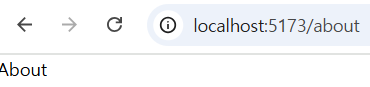
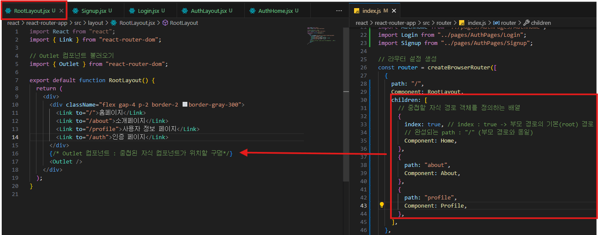

# 🚦 React Router v7 기본 정리

## 💡 개념 정리

| 용어                 | 설명                                                                                                                                                                             |
| -------------------- | -------------------------------------------------------------------------------------------------------------------------------------------------------------------------------- |
| **라우팅 (Routing)** | 사용자가 웹 서비스에서 다른 주소(URL)로 이동할 때, 해당 주소에 맞는 콘텐츠를 화면에 표시하는 전반적인 과정                                                                       |
| **라우터 (Router)**  | 라우팅을 구현하고 관리하는 도구. React에서는 **React Router** 패키지를 사용                                                                                                      |
| **React Router**     | React에서 **동적 라우팅(Dynamic Routing)** 을 구현하기 위한 대표 라이브러리. <br/>SPA(Single Page Application)의 한계를 보완하여, URL 변경 시 화면이 새로고침 없이 변경되도록 함 |

---

## ⚙️ 정적 라우팅 vs 동적 라우팅

| 구분     | 정적 라우팅                                                           | 동적 라우팅                                                                                         |
| -------- | --------------------------------------------------------------------- | --------------------------------------------------------------------------------------------------- |
| **설명** | 서버에서 미리 정의된 경로에 따라 실제 파일을 전송하는 방식            | 클라이언트 측에서 JavaScript 코드로 경로에 맞는 컴포넌트를 렌더링하는 방식                          |
| **특징** | 요청된 URL에 해당하는 실제 파일이 존재해야 함                         | 하나의 `index.html` 안에서 컴포넌트만 동적으로 교체                                                 |
| **예시** | `/index.html` → index.html 파일 <br/> `/about.html` → about.html 파일 | `/` → `<Home />` <br/> `/about` → `<About />` <br/> `/profile/john` → `<Profile username="john" />` |

---

## 💡 React Router 설치

> ✅ React Router v7 버전 기준

```bash
npm install react-router-dom@^7
```

> ⚠️ BrowserRouter를 직접 사용하는 코드는 이전 버전 (v6 이하) 문법입니다.
>
> v7에서는 `createBrowserRouter()`와 `RouterProvider`를 사용합니다.

---

## 📂 디렉토리 기본 구조

```
📁 src/
├── 📁 pages/       # 페이지 컴포넌트 관리
│   ├── ⚛️ Home.jsx
│   └── ⚛️ About.jsx
├── 📁 router/      # 라우터 설정 관리
│   └── 🚦 index.js
└── ⚛️ main.jsx     # 애플리케이션 진입점
```

> 🧹 App.jsx는 사용하지 않으므로 삭제해도 됩니다.

---

## 🚦 router/index.js

```jsx
// src/router/index.js

// 페이지 컴포넌트
import Home from "../pages/Home";
import About from "../pages/About";

**// React Router의 createBrowserRouter 불러오기
import { createBrowserRouter } from "react-router-dom";**

// 라우터 설정 생성
const router = createBrowserRouter([
	{
		path: "/", // 주소(URL)
		Component: Home, // 해당 경로에 매핑할 컴포넌트
	},
	{
		path: "/about",
		//Component: About,
		element: <About />, //Component 속성과 동일한 기능을 하지만 컴포넌트 이름이 아닌 태그를 설정(구버전)
	},
]);

export default router;
```

---

## ⚛️ main.jsx

```jsx
// src/main.jsx
import { StrictMode } from "react";
import { createRoot } from "react-dom/client";
import "./index.css";

**// 라우터 설정 불러오기
import router from "./router";

// 라우터 설정을 애플리케이션에 적용할 Provider
import { RouterProvider } from "react-router-dom";**

createRoot(document.getElementById("root")).render(
	<StrictMode>
		{/* RouterProvider 배치 */}
		{/* router 속성: 어떤 라우터 설정을 사용할지 지정 */}
		**<RouterProvider router={router} />**
	</StrictMode>
);
```

---

## ✅ 결과

- `path: "/"` → **Home 컴포넌트** 렌더링

  

- `path: "/about"` → **About 컴포넌트** 렌더링

  

| URL      | 출력 결과       |
| -------- | --------------- |
| `/`      | 🏠 Home 페이지  |
| `/about` | ℹ️ About 페이지 |

---

## 🧠 핵심 요약

| 항목                    | 설명                                                          |
| ----------------------- | ------------------------------------------------------------- |
| `createBrowserRouter()` | 경로(URL)와 컴포넌트를 매핑하여 라우터 객체 생성              |
| `RouterProvider`        | 생성된 라우터를 실제 애플리케이션에 적용                      |
| `Component` 속성        | React Router v7에서 새로 도입된 문법 (`element` 대신 사용)    |
| \*SPA에서의 동적 라우팅 | 새로고침 없이 컴포넌트를 교체하여 “페이지 이동”처럼 보이게 함 |

\*SPA : Single Page Application

<aside>
💡

**React Router 네비게이션**

</aside>

# 🚗 React Router 네비게이션 (Navigation)

## 💡 개념 정리

> 네비게이션(Navigation)
>
> 사용자가 웹 페이지 내에서 **다른 주소(URL)** 로 이동할 수 있도록 돕는 기능
>
> React Router는 SPA 방식으로 **페이지 새로고침 없이** 부드럽게 화면 전환을 처리한다.

---

## 🔹 React Router의 주요 네비게이션 방법

| 방법            | 설명                                                                          |
| --------------- | ----------------------------------------------------------------------------- |
| `<Link>`        | `<a>` 태그를 대체하는 컴포넌트. 새로고침 없이 페이지 이동                     |
| `<NavLink>`     | 현재 경로와 일치하는 링크에 스타일을 자동 적용할 수 있는 `<Link>`의 확장 버전 |
| `<Navigate>`    | 컴포넌트 렌더링 시 즉시 특정 경로로 이동(리다이렉트)                          |
| `useNavigate()` | 이벤트 핸들러나 훅 내부에서 JS 코드로 페이지 이동을 제어할 때 사용            |

---

## ⚛️ 1. `<Link>` 컴포넌트

- `<a>` 태그와 유사하지만, **페이지 새로고침 없이 SPA 방식으로 이동**
- `to` 속성에 이동할 경로를 지정

```jsx
// 📄 Home.jsx
import { Link } from "react-router-dom";

export default function Home() {
	return (
		<div>
			{/* to : 이동할 경로 */}
			<Link to="/">홈</Link>
			<br />
			<Link to="/about">소개</Link>
			<br />

			{/* 외부 사이트 이동 시에는 a 태그 사용 */}
			<a href="https://naver.com" target="_blank" rel="noreferrer">
				외부 서비스 이동
			</a>
		</div>
	);
}
```

---

## ⚛️ 2. `<NavLink>` 컴포넌트

- `<Link>`의 확장 버전
- 현재 URL과 `to` 속성이 일치하면 자동으로 **활성(active)** 상태로 스타일 적용 가능

```jsx
// 📄 About.jsx
import { NavLink } from "react-router-dom";

export default function About() {
	return (
		<div>
			<h1 className="font-bold text-4xl">소개 페이지</h1>

			{/* 현재 주소가 "/"이면 활성화 X */}
			<NavLink to="/">홈</NavLink>
			<br />

			{/* 현재 주소가 "/about"이면 스타일 적용 */}
			<NavLinkto="/about"
				className={({ isActive }) =>
					isActive ? "text-red-900 font-bold text-5xl" : ""
				}
			>
				소개
			</NavLink>
			<br />

			{/* 추가 페이지 이동 */}
			<NavLink to="/profile">사용자 정보</NavLink>
		</div>
	);
}
```

> 💡 className={({ isActive }) => ...} 형태로
>
> 현재 경로와 일치할 때의 스타일을 지정할 수 있다.

---

## ⚛️ 3. `<Navigate>` 컴포넌트

- 컴포넌트 렌더링 시 **즉시 다른 경로로 리다이렉트**할 때 사용
- `to` 속성: 이동할 경로 지정
- `replace` 속성: 이동 기록을 남기지 않음 (뒤로 가기 불가)

```jsx
// 📄 Profile.jsx
import { Navigate } from "react-router-dom";

export default function Profile() {
	// 로그인 여부를 가정한 변수
	const isLogin = false;

	// 로그인하지 않았다면 "/"로 리다이렉트
	if (!isLogin) {
		return <Navigate to="/" replace />;
	}

	return <div>사용자 정보</div>;
}
```

> ⚠️ <Navigate>는 반드시 return 내부에서 JSX로 렌더링되어야 합니다.

---

## ⚛️ 4. `useNavigate()` 훅

- **JS 로직 내에서 동적으로 페이지 이동**할 때 사용
- 버튼 클릭, 이벤트, `useEffect` 등 내부에서 호출 가능
- `navigate("/경로")` 형태로 이동

  ```jsx
  // 📄 Profile.jsx
  import { useNavigate, Navigate } from "react-router-dom";

  export default function Profile() {
  	const isLogin = true;

  	// 로그인하지 않았다면 리다이렉트
  	if (!isLogin) {
  		return <Navigate to="/" replace />;
  	}

  	// useNavigate 훅 사용
  	const navigate = useNavigate();

  	return (
  		<div>
  			<p>사용자 정보 페이지</p>
  			<buttonclassName="border p-2"
  				onClick={() => {
  					alert("홈페이지로 이동합니다.");
  					// 특정 로직 수행 후 이동
  					navigate("/");
  				}}
  			>
  				홈페이지로 이동
  			</button>
  		</div>
  	);
  }
  ```

- 다양한 페이지 이동 방법
  - `navigate(url)` : 특정 페이지로 이동
  - `navigate(-1)` : 이전 페이지로 이동
  - `navigate(1)` : 다음 페이지로 이동
  - `navigate(url, {replace: true})` : 히스토리에 남기지 않는다
- 조건부 리다이렉트

  - 조건문을 사용해서 사용자를 다른 페이지로 리다이렉트(redirect)한다
  - 예를 들어, 로그인 상태가 아닌 경우 로그인 페이지로 리다이렉트한다

    ```jsx
    import { useNavigate, useEffect } from "react-router-dom";

    export default function ProtectedPage() {
    	const navigate = useNavigate();
    	const isLoggedIn = false; // 로그인 상태

    	useEffect(() => {
    		if (!isLoggedIn) {
    			navigate("/login", { replace: true });
    		}
    	}, [isLoggedIn, navigate]);

    	return <div>...</div>;
    }
    ```

---

## 🧭 요약 정리

| 컴포넌트 / 훅   | 주요 용도                 | 새로고침 여부 | 비고                  |
| --------------- | ------------------------- | ------------- | --------------------- |
| `<Link>`        | 일반 페이지 이동          | ❌ 없음       | `a` 태그 대체         |
| `<NavLink>`     | 현재 경로에 따라 스타일링 | ❌ 없음       | 활성 메뉴 표시용      |
| `<Navigate>`    | 즉시 리다이렉트           | ❌ 없음       | 로그인 등 조건부 이동 |
| `useNavigate()` | JS 코드 내에서 이동 제어  | ❌ 없음       | 버튼 클릭, 이벤트 등  |

<aside>

**💡중첩 router**

</aside>

- 중첩 라우팅(Nested Routing)

  - 경로 안에 경로를 중첩하는 방식

  - 공통 레이아웃을 유지하면서 페이지의 일부 영역은 자식 컴포넌트를 배치

- `<Outlet>` 컴포넌트 : 부모 페이지 컴포넌트에서 자식 경로(Routing) 컴포넌트를 배치할 위치를 지정
  
- `createBrowserRouter()` 함수의 `children` 속성
  - 부모 경로에 중첩할 자식 경로를 설정
  - 자식 경로의 컴포넌트는 부모 경로의 `<Outlet>` 컴포넌트 위치에 배치
- 자식 경로(Route)의 `path` 속성 규칙
  - `/`로 시작하지 않는 상대 경로로 작성
    - `"about"`, `”contact”` , `"login"`
  - `path` 가 빈 문자열이면 부모 경로(Route)와 동일한 경로를 의미
  - `index: true` : 부모 경로의 기본 경로 페이지

<aside>

**💡React Router 파라미터**

</aside>

### 1. **경로 파라미터**(Path Parameters)**란?**

- 주소(URL)의 일부를 변수로 사용하는 방식
- 동적 데이터를 URL에 포함시켜 컴포넌트에서 활용
- 라우터 설정
  - `:{paramName}` : 파라미터 키(Key)
  - 예: `/posts/:postId` → `:postId`가 변수

---

### 2. **라우터 설정 예시**

```jsx
import { createBrowserRouter } from "react-router-dom";

// 레이아웃 컴포넌트
import RootLayout from "../layout/RootLayout";
import AuthLayout from "../layout/AuthLayout";
import ProtectedLayout from "../layout/ProtectedLayout";

// 페이지 컴포넌트
import Home from "../pages/RootPages/Home";
import About from "../pages/RootPages/About";
import Profile from "../pages/RootPages/Profile";
import PostList from "../pages/RootPages/PostList";
import PostDetail from "../pages/RootPages/PostDetail";
import AuthHome from "../pages/AuthPages/AuthHome";
import Login from "../pages/AuthPages/Login";
import Signup from "../pages/AuthPages/Signup";

const router = createBrowserRouter([
	{
		path: "/",
		Component: RootLayout,
		children: [
			{ index: true, Component: Home }, // "/" 접속 시 Home 렌더링
			{ path: "about", Component: About },
			{ path: "posts", Component: PostList },
			{ path: "posts/:postId", Component: PostDetail }, // 경로 파라미터
			{
				Component: ProtectedLayout, // 보호된 레이아웃
				children: [{ path: "profile", Component: Profile }],
			},
		],
	},
	{
		path: "/auth",
		Component: AuthLayout,
		children: [
			{ index: true, Component: AuthHome },
			{ path: "login", Component: Login },
			{ path: "signup", Component: Signup },
		],
	},
]);

export default router;
```

---

### 3. **PostList.jsx – 링크로 파라미터 전달**

```jsx
import { useState, useEffect } from "react";
import { Link } from "react-router-dom";
import axios from "axios";

export default function PostList() {
	const [posts, setPosts] = useState([]);

	useEffect(() => {
		async function getPosts() {
			const res = await axios.get("https://dummyjson.com/posts");
			setPosts(res.data.posts);
		}
		getPosts();
	}, []);

	return (
		<ul>
			{posts.map((post) => (
				<li key={post.id}>
					<Link to={`/posts/${post.id}`}>
						No.{post.id} - {post.title}
					</Link>
				</li>
			))}
		</ul>
	);
}
```

- 각 게시글 클릭 시 URL: `/posts/1`, `/posts/2` …
- `:postId`에 해당 값이 전달됨

---

### 4. **PostDetail.jsx – 경로 파라미터 사용**

```jsx
import { useParams } from "react-router-dom";
import { useState, useEffect } from "react";
import axios from "axios";

export default function PostDetail() {
	const { postId } = useParams(); // URL 파라미터 불러오기
	const [post, setPost] = useState({});

	useEffect(() => {
		async function getAPostById() {
			const res = await axios.get(`https://dummyjson.com/posts/${postId}`);
			setPost(res.data);
		}
		getAPostById();
	}, [postId]);

	return (
		<ul>
			<li>No. {post.id}</li>
			<li>Title: {post.title}</li>
			<li>Body: {post.body}</li>
			<li>Views: {post.views}</li>
		</ul>
	);
}
```

- `useParams()` 훅으로 URL에 있는 변수(`postId`)를 가져옴
- `axios`를 통해 해당 게시글 데이터 요청

---

### ✅ 핵심 정리

1. **라우터 경로 파라미터**
   - `path: "posts/:postId"` → `:postId`가 변수
2. **Link에서 파라미터 전달**
   - `to={`/posts/${post.id}`}`
3. **컴포넌트에서 파라미터 읽기**
   - `const { postId } = useParams()`
4. **중첩 라우팅 활용**
   - 보호된 페이지는 `ProtectedLayout` 안에서 `children`으로 중첩
   - 공통 레이아웃 유지 가능
