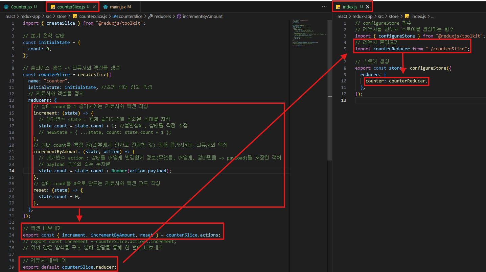
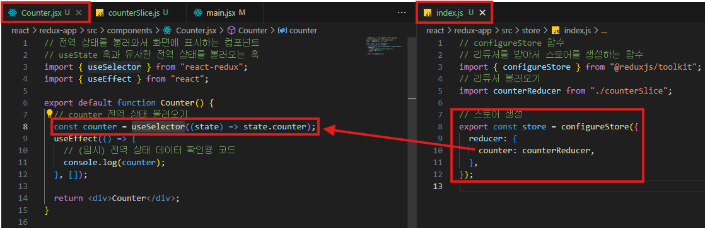
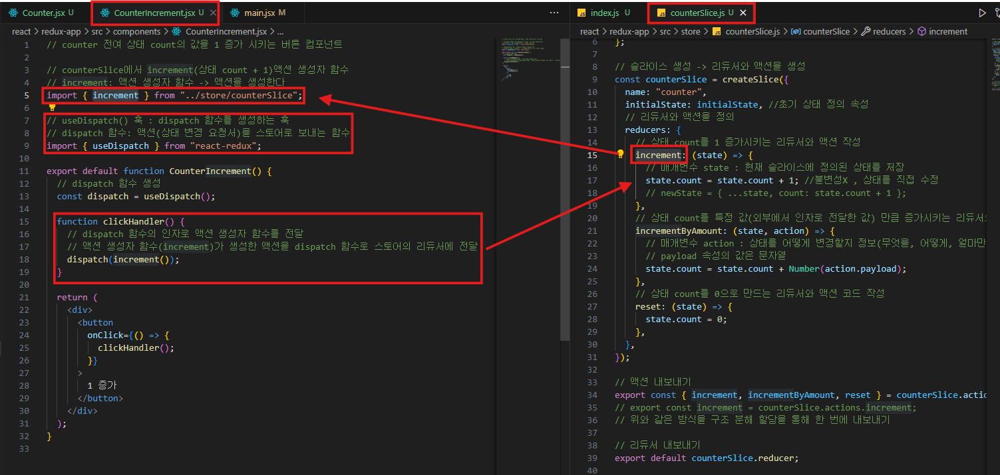
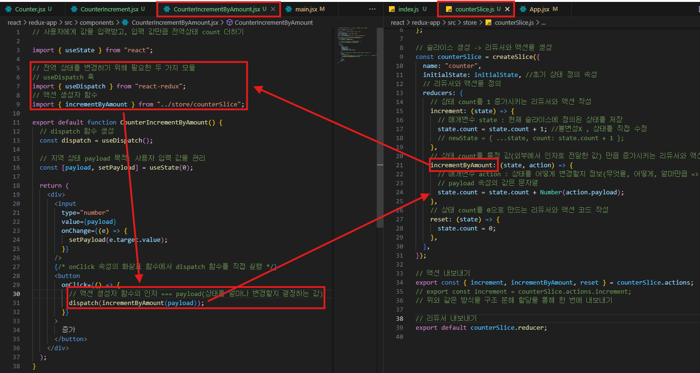
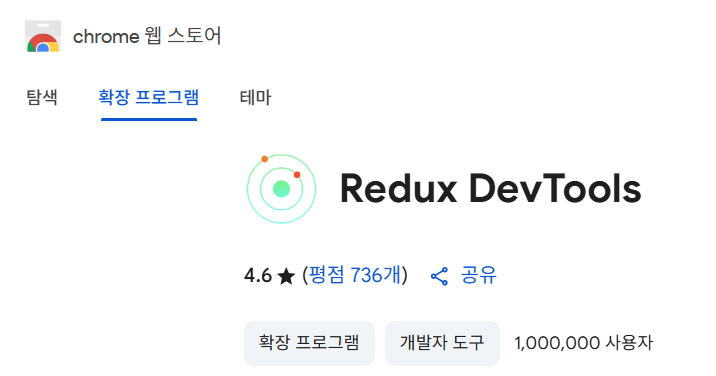
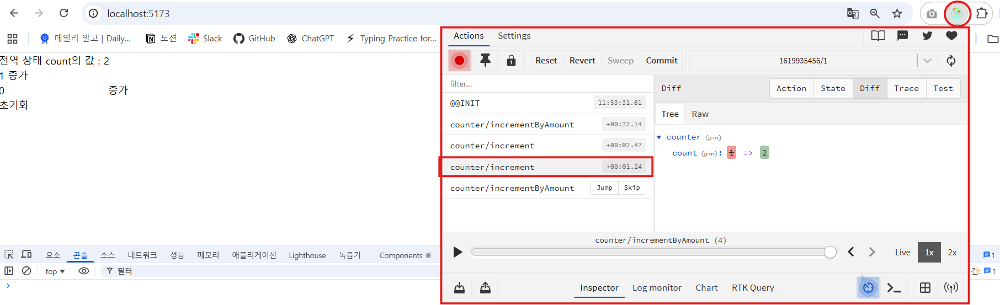
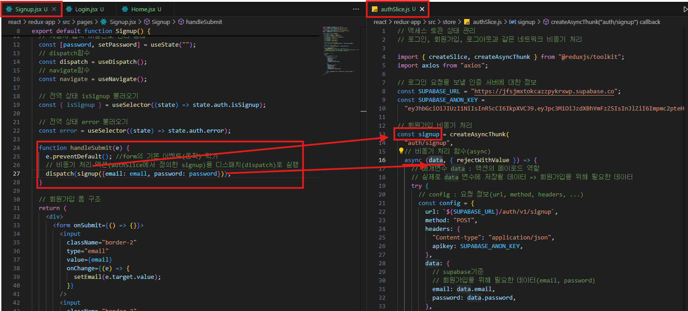

# 📦 Redux 쉽게 정리

## 💡 Redux란?

> 리액트 앱에서 전역 상태를 효율적으로 관리해주는 라이브러리

---

## 🎯 왜 Redux를 쓰는가?

### ✅ 전역 상태 관리

- 단일 컴포넌트가 아닌 **앱 전체에서 공유되는 상태**를 관리

### ❌ 지역 상태 관리의 한계

1. **Props Drilling**
   - 컴포넌트 깊이가 깊을수록 props를 계속 전달해야 함
2. **상태 동기화 문제**
   - 여러 컴포넌트가 같은 상태를 공유할 때, 동기화가 어려움
3. **디버깅 어려움**
   - 상태가 언제, 왜 바뀌었는지 추적하기 어려움

---

## 🧩 Redux의 주요 구성 요소

| 구성 요소            | 설명                                               |
| -------------------- | -------------------------------------------------- |
| **Action (액션)**    | 상태를 **어떻게 바꿔야 하는지**를 설명하는 객체    |
| **Reducer (리듀서)** | 액션을 받아서 **새로운 상태를 반환하는 순수 함수** |
| **Store (스토어)**   | 전역 상태(state)를 보관하는 **중앙 저장소**        |

### 🎯 용어 설명

- **액션 객체**:
  ```jsx
  { type: 'INCREMENT', payload: 1 }
  ```
  - `type`: 어떤 일이 일어났는지
  - `payload`: 필요한 데이터 (선택적)
- **순수 함수란?**
  - 같은 입력(state + action)에 대해 **항상 같은 출력(state)**
  - 외부 상태를 변경하지 않음 (불변성 유지)
  - **비동기 작업은 포함 X**

---

## 🔄 상태 흐름 요약

```
컴포넌트 → 액션 디스패치 → 리듀서 → 새 상태 생성 → 스토어 → UI 업데이트
```

1. 컴포넌트에서 **액션 디스패치(dispatch)**
2. 리듀서가 액션을 보고 상태를 업데이트
3. 새로운 상태가 스토어에 저장됨
4. 상태를 사용하는 컴포넌트는 자동으로 리렌더링

---

## 🧪 주요 Hook

| Hook          | 설명                            |
| ------------- | ------------------------------- |
| `useSelector` | 스토어에서 상태를 꺼내오는 함수 |
| `useDispatch` | 액션을 스토어에 전달하는 함수   |

---

## 🛠 Redux Toolkit

> Redux를 더 쉽고 간단하게 사용하도록 도와주는 공식 툴킷
>
> **Redux 팀도 권장함**

### ✅ 장점

- 복잡한 설정 없이 **더 간단한 문법**
- 액션, 리듀서를 **자동으로 생성**
- 내장된 **Immer** 라이브러리로 상태 불변성 자동 처리

### 주요 구성 요소

| 구성 요소        | 설명                                         |
| ---------------- | -------------------------------------------- |
| `createSlice`    | 액션 + 리듀서를 한 번에 만들 수 있는 함수    |
| `configureStore` | 여러 slice들을 합쳐서 스토어를 생성하는 함수 |

---

## 📁 Redux Toolkit 예시 (간단 카운터)

```jsx
// 1. Slice 만들기
import { createSlice } from "@reduxjs/toolkit";

const counterSlice = createSlice({
	name: "counter",
	initialState: { value: 0 },
	reducers: {
		increment: (state) => {
			state.value += 1;
		}, // Immer가 불변성 자동 유지
		decrement: (state) => {
			state.value -= 1;
		},
	},
});

export const { increment, decrement } = counterSlice.actions;
export default counterSlice.reducer;
```

```jsx
// 2. Store 설정
import { configureStore } from "@reduxjs/toolkit";
import counterReducer from "./counterSlice";

const store = configureStore({
	reducer: {
		counter: counterReducer,
	},
});

export default store;
```

```jsx
// 3. 컴포넌트에서 사용
import { useSelector, useDispatch } from "react-redux";
import { increment, decrement } from "./counterSlice";

function Counter() {
	const count = useSelector((state) => state.counter.value);
	const dispatch = useDispatch();

	return (
		<div>
			<button onClick={() => dispatch(decrement())}>-</button>
			{count}
			<button onClick={() => dispatch(increment())}>+</button>
		</div>
	);
}
```

```jsx
//src/main.jsx
import { StrictMode } from "react";
import { createRoot } from "react-dom/client";
import "./index.css";
import App from "./App.jsx";

// Provider 컴포넌트 불러오기
// Redux 스토어 설정을 주입(제공)하는 컴포넌트
import { Provider } from "react-redux";
// 스토어 설정
import { store } from "./store";

createRoot(document.getElementById("root")).render(
	<StrictMode>
		<Provider store={store}>
			<App />
		</Provider>
	</StrictMode>
);
```

---

## ✅ 정리 요약

| 개념          | 설명                                                  |
| ------------- | ----------------------------------------------------- |
| Redux         | 전역 상태 관리 라이브러리                             |
| 문제 해결     | props 드릴링, 상태 동기화, 디버깅 문제                |
| 핵심 구성     | Action, Reducer, Store                                |
| 흐름          | dispatch → reducer → store 업데이트                   |
| Redux Toolkit | Redux를 더 쉽게 쓰기 위한 공식 도구                   |
| 주요 기능     | createSlice, configureStore, useSelector, useDispatch |

---

# 🚀 Redux 프로젝트 생성 & Redux Toolkit 설치 가이드

## 1️⃣ 프로젝트 생성 (Vite + React)

```bash
npm create vite@latest redux-app -- --template react
```

- `redux-app`: 프로젝트 폴더 이름
- `-template react`: Vite로 React 프로젝트 생성

### 👉 결과

Vite + React 기반의 빠르고 가벼운 React 프로젝트 생성됨

---

## 2️⃣ 프로젝트 폴더 이동

```bash
cd redux-app
```

---

## 3️⃣ 의존성 설치

```bash
npm install
```

- Vite, React 관련 기본 패키지 설치

---

## 4️⃣ Redux 관련 패키지 설치

```bash
npm install react-redux
npm install @reduxjs/toolkit
```

### 설치된 주요 패키지

| 패키지             | 설명                                              |
| ------------------ | ------------------------------------------------- |
| `react-redux`      | React에서 Redux를 사용할 수 있게 해주는 연결 도구 |
| `@reduxjs/toolkit` | Redux 사용을 간편하게 만들어주는 공식 툴킷        |

---

### 🚀 `Slice 생성` \*\*\*\*

1. toolkit에서 `createSlice` 불러오기
2. Slice 생성
3. 생성한 action과 reducer 내보내기
4. toolkit를 통해 `configureStore` 불러오기
5. `configureStore`로 `reducer` 연결하기



### **🚀 `useSelector(읽기)`**

1. `useSelector` 훅을 통해 store의 정보 불러오기
   - `useSelector`는 Redux store의 상태에서 필요한 **값만 꺼내오는 훅**입니다.
   - 위 코드에서 `state`는 **Redux 전체 store의 상태 트리**를 의미합니다.
   - `state.counter`는 **`configureStore()`에서 등록한 리듀서 이름**입니다.
   - `state.counter.value`는 `counter` 슬라이스의 현재 숫자 값입니다.
2. state.counter는 `state.counter`는 오른쪽 `store/index.js`에서 `counter`라는 이름으로 등록한 **슬라이스 리듀서**를 의미



### 🚀 `useDispatch(쓰기)`

1. `useDispatch` 훅을 통해 store의 액션을 실행할 준비
2. counterSlice의 `increment` 액션을 import하고 dispatch로 실행

- 내부 값으로 count 증가
  
- 외부 값(payload) 값 만큼 count 증가
  

### 확장 프로그램 설치

[Redux DevTools](https://chromewebstore.google.com/detail/redux-devtools/lmhkpmbekcpmknklioeibfkpmmfibljd?hl=ko)

Action의 상태 확인 가능



---

# 🔐 Redux 비동기 처리 & 사용자 인증 시스템 정리

## ✅ 1. 사용자 인증(Authentication) 기본 개념

### 💡 HTTP는 Stateless(무상태)

- 서버는 클라이언트의 **로그인 상태를 기억하지 못함**
- 매 요청마다 "내가 누구인지" 증명해야 함

---

### 💡 해결 방법: **토큰 기반 인증 (JWT)**

1. 사용자가 로그인
2. 서버가 **토큰(Token)** 생성해서 응답
3. 클라이언트는 토큰을 **localStorage 등에 저장**
4. 다음 요청 시 **토큰을 같이 보내서** 인증

---

## ✅ 2. JWT (JSON Web Token)

- 로그인 인증 시 서버가 발급하는 **토큰 형식**
- 구조: `Header.Payload.Signature`
  | 구성 | 설명 |
  | --------- | ------------------------------------- |
  | Header | 토큰 타입(JWT), 알고리즘 |
  | Payload | 사용자 정보 (ID, 권한 등) |
  | Signature | 위 데이터를 암호화한 서명 (변조 방지) |
- JWT Debugger
  - https://www.jwt.io/
    
    

---

### 🔍 jwt-decode 라이브러리로 디코딩

```bash
npm install jwt-decode
```

```jsx
import { decode } from "jwt-decode";

const token = "..."; // 받은 JWT
const decoded = decode(token);
console.log(decoded); // payload 정보 확인
```

---

## ✅ 3. Redux Toolkit에서 **비동기 인증 처리**

### 🧩 왜 Redux로 관리할까?

- 로그인 상태는 **앱 전체에서 공유되는 전역 상태**
- 로그인 API 요청은 **비동기 처리 필요**

---

### 🔧 사용하는 기능

| 기능                            | 설명                                                      |
| ------------------------------- | --------------------------------------------------------- |
| `createAsyncThunk`              | 비동기 요청 처리 (pending, fulfilled, rejected 자동 생성) |
| `createSlice` + `extraReducers` | 비동기 액션에 따른 상태 변경 관리                         |

---

### 예시 흐름

1. 로그인 버튼 클릭
2. Redux 비동기 액션(`createAsyncThunk`) 실행
3. 서버 응답 → 토큰 저장 + 상태 변경

---

## ✅ 4. Redux Persist로 로그인 상태 유지

> 새로고침하면 Redux 상태가 초기화됨 → Redux Persist로 복원 가능

### 🧩 핵심 구성 요소

| 요소             | 역할                                      |
| ---------------- | ----------------------------------------- |
| `persistReducer` | 기존 리듀서를 감싸서 로컬스토리지와 연동  |
| `persistStore`   | 실제로 저장/복원 처리                     |
| `storage`        | 어디에 저장할지 설정 (기본: localStorage) |
| `PersistGate`    | 복원될 때까지 로딩 처리 가능              |

### 예시 코드

```jsx
const persistConfig = {
	key: "root",
	storage,
	whitelist: ["auth"], // 저장할 slice 선택
};

const persistedReducer = persistReducer(persistConfig, authReducer);
```

```jsx
<PersistGate loading={null} persistor={persistor}>
	<App />
</PersistGate>
```

---

## ✅ 5. 인증 시스템 구조 (예시 디렉토리)

```
📁 src/
├── pages/
│   ├── Signup.jsx     // 회원가입 폼
│   ├── Login.jsx      // 로그인 폼
│   └── Profile.jsx    // 사용자 정보 + 로그아웃 버튼
├── store/
│   ├── index.js       // Redux store 설정
│   └── authSlice.js   // 인증 관련 상태/비동기 로직
├── router/
│   └── index.js
├── App.jsx
└── main.jsx
```

- `store/authSlice.js`

  ```jsx
  // 액세스 토큰 상태 관리
  // 로그인, 회원가입, 로그아웃과 같은 네트워크 비동기 처리

  import { createSlice, createAsyncThunk } from "@reduxjs/toolkit";
  import axios from "axios";

  // 로그인 요청을 보낼 인증 서버에 대한 정보
  const SUPABASE_URL = import.meta.env.VITE_SUPABASE_URL;
  const SUPABASE_ANON_KEY = import.meta.env.VITE_SUPABASE_ANON_KEY;

  // 회원가입 비동기 처리
  const signup = createAsyncThunk(
  	"auth/signup",
  	// 비동기 처리 함수(async)
  	async (data, { rejectWithValue }) => {
  		// 매개변수 data : 액션의 페이로드 역할
  		// 실제로 data 변수에 저장될 데이터 => 회원가입을 위해 필요한 데이터
  		try {
  			// config : 요청 정보(url, method, headers, ...)
  			const config = {
  				url: `${SUPABASE_URL}/auth/v1/signup`,
  				method: "POST",
  				headers: {
  					"Content-type": "application/json",
  					apikey: SUPABASE_ANON_KEY,
  				},
  				data: {
  					// supabase기준
  					// 회원가입을 위해 필요한 데이터(email, password)
  					email: data.email,
  					password: data.password,
  				},
  			};

  			const res = await axios(config);
  			// 비동기처리를 성공했을 때의 데이터
  			return res["data"];
  		} catch (error) {
  			// 비동기처리를 실패했을 때의 데이터
  			return rejectWithValue(error.res.data);
  		}
  	}
  );

  // 비동기 처리 3개의 상태: 대기, 성공, 실패(거절)
  ```

- `router/index.js`

  ```jsx
  import { createBrowserRouter } from "react-router-dom";
  import Home from "../pages/Home";
  import Login from "../pages/Login";
  import Signup from "../pages/Signup";

  const router = createBrowserRouter([
  	{
  		path: "/",
  		Component: Home,
  	},
  	{
  		path: "/login",
  		Component: Login,
  	},
  	{
  		path: "/signup",
  		Component: Signup,
  	},
  ]);
  export default router;
  ```

---

## ✅ 6. 환경 변수 설정

- `.env` 파일에 **Supabase API 주소 & 키** 저장
- `.env.example` 파일이 `.env` 파일에 대한 템플릿

```bash
#.env.example
# 환경 변수 파일(.env) 템플릿
# 필요한 환경 변수 이름과 목적, 역할 등등
VITE_SUPABASE_URL="SUPABASE 프로젝트 주소"
VITE_SUPABASE_ANON_KEY="SUPABASE 프로젝트 익명키"
```

- https://supabase.com/

```bash
# .env
VITE_SUPABASE_URL=...
VITE_SUPABASE_ANON_KEY=...
```

- `.gitignore`에 `.env` 추가해서 Git에 올라가지 않게 함

---

## 🧠 요약

| 개념              | 설명                                        |
| ----------------- | ------------------------------------------- |
| Stateless         | HTTP는 로그인 상태 기억 안 함               |
| JWT               | 사용자 정보가 담긴 토큰, 로그인 인증에 사용 |
| Redux 비동기 처리 | `createAsyncThunk`, `extraReducers` 사용    |
| Redux Persist     | 로그인 상태를 새로고침 후에도 유지          |
| Supabase          | 인증 서버 (API 요청 시 토큰 사용)           |

---

## 🔗 전체 인증 흐름 요약

```
[로그인 요청]
 → 서버에서 JWT 토큰 발급
 → 클라이언트에서 Redux로 저장 + localStorage 저장
 → 이후 모든 요청 시 토큰 포함
 → 새로고침 시 Redux Persist로 로그인 상태 복원
```



- `pages/Home.jsx`

  ```jsx
  import React from "react";
  import { Link } from "react-router-dom";

  export default function Home() {
  	return (
  		<div>
  			<Link to="/signup">회원가입 페이지</Link>
  			<Link to="/login">로그인 페이지</Link>
  		</div>
  	);
  }
  ```

- `pages/Login.jsx`

  ```jsx
  import { useState, useEffect } from "react";
  import { useSelector, useDispatch } from "react-redux";
  // signup 액션: 회원가입 비동기 네트워트 처리 액션
  // resetIsSignup 액션: isSignup 상태 초기화(false)액션
  import { login } from "../store/authSlice";
  import { useNavigate } from "react-router-dom";

  export default function Login() {
  	// 사용자 입력 이메일 관리 상태
  	const [email, setEmail] = useState("");
  	// 사용자 입력 비밀번호 관리 상태
  	const [password, setPassword] = useState("");
  	// dispatch함수
  	const dispatch = useDispatch();
  	// navigate함수
  	const navigate = useNavigate();
  	//token 상태는 로그인을 성공하면 값이 존재
  	// 로그인을 안했다면 값이 null
  	const token = useSelector((state) => state.auth.token);

  	useEffect(() => {
  		if (token) {
  			alert("로그인 상태입니다.");
  			console.log(token);
  			navigate("/");
  		}
  	});

  	function handleSubmit(e) {
  		e.preventDefault(); //form의 기본 이벤트(동작) 막기
  		// 비동기 처리 액션(authSlice에서 정의한 signup)을 디스패치(dispatch)로 실행
  		console.log(`email:${email}, pwd: ${password}`);
  		dispatch(login({ email: email, password: password }));
  	}

  	return (
  		<div>
  			<form
  				onSubmit={(e) => {
  					handleSubmit(e);
  				}}
  			>
  				<input
  					className="border-2"
  					type="email"
  					value={email}
  					onChange={(e) => {
  						setEmail(e.target.value);
  					}}
  				/>
  				<input
  					className="border-2"
  					type="password"
  					value={password}
  					onChange={(e) => {
  						setPassword(e.target.value);
  					}}
  				/>
  				<input className="border-2" type="submit" value="로그인" />
  			</form>
  		</div>
  	);
  }
  ```

- `pages/Signup.jsx`

  ```jsx
  import { useState, useEffect } from "react";
  import { useSelector, useDispatch } from "react-redux";
  // signup 액션: 회원가입 비동기 네트워트 처리 액션
  // resetIsSignup 액션: isSignup 상태 초기화(false)액션
  import { signup, resetIsSignup } from "../store/authSlice";
  import { useNavigate } from "react-router-dom";

  export default function Signup() {
  	// 사용자 입력 이메일 관리 상태
  	const [email, setEmail] = useState("");
  	// 사용자 입력 비밀번호 관리 상태
  	const [password, setPassword] = useState("");
  	// dispatch함수
  	const dispatch = useDispatch();
  	// navigate함수
  	const navigate = useNavigate();

  	// 전역 상태 isSignup 불러오기
  	const isSignup = useSelector((state) => state.auth.isSignup);

  	// 전역 상태 error 불러오기
  	const error = useSelector((state) => state.auth.error);

  	function handleSubmit(e) {
  		e.preventDefault(); //form의 기본 이벤트(동작) 막기
  		// 비동기 처리 액션(authSlice에서 정의한 signup)을 디스패치(dispatch)로 실행
  		dispatch(signup({ email: email, password: password }));
  	}

  	// 회원가입이 성공했을 때 알림창을 띄우고
  	// useEffect를 활용해서 홈페이지로 이동 시키는 코드
  	useEffect(() => {
  		// 회원가입을 성공 했다면
  		if (isSignup === true) {
  			alert("회원가입을 성공했습니다. 메일함을 확인해 주세요.");
  			dispatch(resetIsSignup);
  			navigate("/");
  		}
  	}, [isSignup, dispatch]);

  	// 회원가입 폼 구조
  	return (
  		<div>
  			<form
  				onSubmit={(e) => {
  					handleSubmit(e);
  				}}
  			>
  				<input
  					className="border-2"
  					type="email"
  					value={email}
  					onChange={(e) => {
  						setEmail(e.target.value);
  					}}
  				/>
  				<input
  					className="border-2"
  					type="password"
  					value={password}
  					onChange={(e) => {
  						setPassword(e.target.value);
  					}}
  				/>
  				<input className="border-2" type="submit" value="회원가입" />
  			</form>
  		</div>
  	);
  }
  ```

- `router/index.js`

  ```jsx
  import { createBrowserRouter } from "react-router-dom";
  import Home from "../pages/Home";
  import Login from "../pages/Login";
  import Signup from "../pages/Signup";

  const router = createBrowserRouter([
  	{
  		path: "/",
  		Component: Home,
  	},
  	{
  		path: "/login",
  		Component: Login,
  	},
  	{
  		path: "/signup",
  		Component: Signup,
  	},
  ]);
  export default router;
  ```

- `store/authSlice.js`

  ```jsx
  // 액세스 토큰 상태 관리
  // 로그인, 회원가입, 로그아웃과 같은 네트워크 비동기 처리

  import { createSlice, createAsyncThunk } from "@reduxjs/toolkit";
  import axios from "axios";
  import { act } from "react";

  // 로그인 요청을 보낼 인증 서버에 대한 정보
  const SUPABASE_URL = import.meta.env.VITE_SUPABASE_URL;
  const SUPABASE_ANON_KEY = import.meta.env.VITE_SUPABASE_ANON_KEY;

  // 회원가입 비동기 처리
  const signup = createAsyncThunk(
  	"auth/signup",
  	// 비동기 처리 함수(async)
  	async (data, { rejectWithValue }) => {
  		// 매개변수 data : 액션의 페이로드 역할
  		// 실제로 data 변수에 저장될 데이터 => 회원가입을 위해 필요한 데이터
  		try {
  			// config : 요청 정보(url, method, headers, ...)
  			const config = {
  				url: `${SUPABASE_URL}/auth/v1/signup`,
  				method: "POST",
  				headers: {
  					"Content-type": "application/json",
  					apikey: SUPABASE_ANON_KEY,
  				},
  				data: {
  					// supabase기준
  					// 회원가입을 위해 필요한 데이터(email, password)
  					email: data.email,
  					password: data.password,
  				},
  			};

  			const res = await axios(config);
  			// 비동기처리를 성공했을 때의 데이터
  			console.log(res.data);
  			return res["data"];
  		} catch (error) {
  			// 비동기처리를 실패했을 때의 데이터
  			console.log("signup error:", error.res.data);
  			return rejectWithValue(error.res.data);
  		}
  	}
  );

  // 로그인 비동기 처리 액션
  const login = createAsyncThunk(
  	"auth/login",
  	// 비동기 처리 함수
  	async (data, { rejectWithValue }) => {
  		// 로그인 로직 코드
  		try {
  			const config = {
  				url: `${SUPABASE_URL}/auth/v1/token?grant_type=password`,
  				method: "POST",
  				headers: {
  					"Content-type": "application/json",
  					apikey: SUPABASE_ANON_KEY,
  				},
  				data: {
  					// 로그인 정보
  					email: data.email,
  					password: data.password,
  				},
  			};
  			const res = await axios(config);
  			console.log(res.data);
  			return res.data;
  		} catch (error) {
  			console.log("login error:", error.res.data);
  			return rejectWithValue(error.res.data);
  		}
  	}
  );

  // 비동기 처리 3개의 상태: 대기, 성공, 실패(거절)

  // 초기 상태
  const initialState = {
  	token: null, //액세스 토큰 관리 상태
  	error: null, //에러 여부 관리 상태
  	isSignup: false, //회원가입 성공 여부 관리 상태
  };

  // 슬라이스(reducer + action) 생성
  const authSlice = createSlice({
  	name: "auth",
  	initialState: initialState,
  	reducers: {
  		// 회원가입 성공 여부를 초기화(false)
  		resetIsSignup: (state) => {
  			state.isSignup = false;
  		},
  	},
  	// 위에서 정의한 비동기 처리 함수(액션)를 처리할 reducer
  	extraReducers: (builder) => {
  		// 각 비동기처리에 대한
  		// 대기(pending)/ 성공(fulfilled) /실패(reject)
  		// 처리 로직
  		builder
  			.addCase(signup.fulfilled, (state) => {
  				// signup 비동기 처리가 성공(fullfilled)일 때 실행되는 콜백 함수
  				state.isSignup = true;
  			})
  			.addCase(signup.rejected, (state, action) => {
  				// action.payload는 어디서 왔을까?
  				// return rejectWithValue(error.res.data);
  				state.error = action.payload.error;
  			})
  			.addCase(login.fulfilled, (state, action) => {
  				// login 비동기 처리가 성공(fullfilled)일 때 실행되는 콜백 함수
  				state.token = action.payload.access_token;
  			});
  	},
  });

  // 액션과 리듀서, 비동기 처리 액션 내보내기
  export const { resetIsSignup } = authSlice.actions;
  export default authSlice.reducer;
  export { signup, login };
  ```

- `store/index.js`

  ```jsx
  // configureStore 함수
  // 리듀서를 받아서 스토어를 생성하는 함수
  import { configureStore } from "@reduxjs/toolkit";
  // 리듀서 불러오기
  import counterReducer from "./counterSlice";
  // 인증 리듀서 불러오기
  import authReducer from "./authSlice";

  // 스토어 생성
  export const store = configureStore({
  	reducer: {
  		counter: counterReducer,
  		auth: authReducer,
  	},
  });
  ```

- `main.jsx`

  ```jsx
  import { StrictMode } from "react";
  import { createRoot } from "react-dom/client";
  import "./index.css";
  // Provider 컴포넌트 불러오기
  // Redux 스토어 설정을 주입(제공)하는 컴포넌트
  import { Provider } from "react-redux";
  // 스토어(store) 설정
  import { store } from "./store";

  import { RouterProvider } from "react-router-dom";
  import router from "./router";
  createRoot(document.getElementById("root")).render(
  	<StrictMode>
  		<Provider store={store}>
  			<RouterProvider router={router}></RouterProvider>
  		</Provider>
  	</StrictMode>
  );
  ```

# ✅ Redux 비동기 처리 & 사용자 인증 (정리)

## 🧠 1. 인증 시스템 구성 개요

| 기능               | 설명                                                         |
| ------------------ | ------------------------------------------------------------ |
| 🔐 **회원가입**    | 이메일/비밀번호로 계정 생성 (Supabase API)                   |
| 🔑 **로그인**      | 로그인 요청 → JWT 토큰 수신                                  |
| 📦 **토큰 저장**   | Redux 상태(`token`)에 저장 + 로컬스토리지에 persist          |
| 👤 **프로필**      | 저장된 토큰 디코딩해 사용자 정보 표시                        |
| 🔓 **로그아웃**    | Supabase에 로그아웃 요청 + 토큰 삭제                         |
| 🚪 **라우팅 제어** | 로그인 여부에 따라 접근 가능/차단 처리 (Private/Auth Layout) |

---

## ⚙️ 2. 기술 스택 및 주요 라이브러리

| 라이브러리         | 역할                                                 |
| ------------------ | ---------------------------------------------------- |
| `redux-toolkit`    | 상태 관리 및 비동기 액션 처리                        |
| `redux-persist`    | 상태(특히 token) 영속화 (브라우저 새로고침에도 유지) |
| `react-router-dom` | 페이지 이동 및 보호 라우팅                           |
| `jwt-decode`       | 토큰 복호화해 사용자 정보 확인                       |

---

## 🔁 3. 인증 흐름 요약

### ✅ 회원가입

1. `dispatch(signup({ email, password }))`
2. 서버에 요청 후, 응답 받으면 `isSignup = true`
3. 회원가입 완료 → Alert → 메인으로 이동 (`navigate("/")`)

---

### ✅ 로그인

1. `dispatch(login({ email, password }))`
2. 서버로부터 JWT `access_token` 응답 받음
3. Redux의 `token` 상태에 저장 + `redux-persist`로 로컬 스토리지에 저장

---

### ✅ 로그아웃

1. `dispatch(logout())`
2. Supabase에 로그아웃 요청
3. `token = null`로 초기화 → 로그인 상태 해제

---

## 🔐 4. 인증 레이아웃 (라우팅 보호)

| 레이아웃        | 설명                                                  |
| --------------- | ----------------------------------------------------- |
| `PrivateLayout` | 로그인된 사용자만 접근 가능 (예: `/profile`)          |
| `AuthLayout`    | 비로그인 사용자만 접근 가능 (예: `/login`, `/signup`) |

```jsx
// PrivateLayout.jsx
if (!token) return <Navigate to="/login" />;
return <Outlet />;
```

```jsx
// AuthLayout.jsx
if (token) return <Navigate to="/profile" />;
return <Outlet />;
```

---

## 📦 5. 토큰 디코딩 (`jwt-decode`)

```bash
npm install jwt-decode
```

```jsx
import jwtDecode from "jwt-decode";

const decoded = jwtDecode(token);
console.log(decoded.email); // 사용자 이메일 등 확인
```

---

## 💾 6. Redux Persist 설정

### 설치

```bash
npm install redux-persist
```

### store/index.js

```jsx
import { persistStore, persistReducer } from "redux-persist";
import storage from "redux-persist/lib/storage";

// 토큰만 저장
const authPersistConfig = {
	key: "auth",
	storage,
	whitelist: ["token"],
};

// persist reducer로 감싼 authReducer
const persistAuthReducer = persistReducer(authPersistConfig, authReducer);

// store 생성
export const store = configureStore({
	reducer: {
		auth: persistAuthReducer,
		// 다른 리듀서들
	},
	middleware: (getDefaultMiddleware) =>
		getDefaultMiddleware({
			serializableCheck: {
				// persist 관련 액션 예외 처리
				ignoredActions: [FLUSH, REHYDRATE, PAUSE, PERSIST, PURGE, REGISTER],
			},
		}),
});

export const persistor = persistStore(store);
```

### main.jsx

```jsx
<Provider store={store}>
	<PersistGate persistor={persistor}>
		<RouterProvider router={router} />
	</PersistGate>
</Provider>
```

---

## 🛠 7. 에러: Non-serializable value warning

**문제:**

Redux Persist 내부 액션은 함수 같은 비직렬화 값 포함

```jsx
//에러 메시지
A non-serializable value was detected in an action, in the path: `register`. Value: ƒ register2(key) {
    _pStore.dispatch({
      type: REGISTER,
      key
    });
  }
```

**해결:**

```jsx
serializableCheck: {
  ignoredActions: [FLUSH, REHYDRATE, PAUSE, PERSIST, PURGE, REGISTER],
},
```

이 설정을 `configureStore()` 안 `middleware`에 추가하면 경고 해결됨 ✅

---

## ✅ 8. 상태 요약 (authSlice)

| 상태       | 설명                            |
| ---------- | ------------------------------- |
| `token`    | 로그인 성공 시 받은 JWT 토큰    |
| `isSignup` | 회원가입 성공 여부 (true/false) |
| `error`    | 인증 관련 에러 메시지 저장      |

---

## 🧪 9. 예외처리 & UX 개선 팁

| 개선 포인트                | 설명                                                         |
| -------------------------- | ------------------------------------------------------------ |
| ✅ `resetIsSignup()`       | 함수형 액션 → 반드시 `dispatch(resetIsSignup())` 사용해야 함 |
| ✅ 로그인 후 자동 이동     | `navigate("/profile")` 추가 추천                             |
| ⚠️ `jwtDecode()` 예외 처리 | `try-catch`로 잘못된 토큰 방어                               |
| ⚠️ 에러 메시지 표시        | UI에 로그인/회원가입 에러 안내 추가 필요                     |
| ✅ 로그아웃 후 이동        | `navigate("/")`로 UX 자연스럽게 개선                         |

---

## 📚 전체 폴더 구조 예시

```
src/
├── pages/
│   ├── Home.jsx
│   ├── Login.jsx
│   ├── Signup.jsx
│   └── Profile.jsx
├── layouts/
│   ├── PrivateLayout.jsx
│   └── AuthLayout.jsx
├── store/
│   ├── index.js
│   └── authSlice.js
├── router/
│   └── index.jsx
├── main.jsx
└── index.css
```

---

## 📚 전체 폴더 소스 예시

- `layouts/AuthLayout.jsx`

  ```jsx
  // 인증 관련 페이지 관리 레이아웃
  // 로그인 사용자의 접근을 막는다

  import React from "react";
  import { useSelector } from "react-redux";
  import { Outlet, Navigate } from "react-router-dom";

  export default function AuthLayout() {
  	const token = useSelector((state) => state.auth.token);
  	if (token) {
  		// 로그인 사용자라면 프로필 페이지로 이동
  		return <Navigate to="/profile"></Navigate>;
  	} else {
  		return <Outlet></Outlet>;
  	}
  }
  ```

- `layouts/PrivateLayout.jsx`

  ```jsx
  // 이 레이아웃은 로그인 사용자만 접근가능한 레이아웃
  import { Navigate, Outlet } from "react-router-dom";
  import { useSelector } from "react-redux";

  export default function PrivateLayout() {
  	// 전역 상태 token 불러오기
  	const token = useSelector((state) => state.auth.token);

  	// 토큰이 없으면 즉, 로그인을 안했으면
  	if (!token) {
  		// 로그인 경로로 이동
  		return <Navigate to="/login" replace></Navigate>;
  	} else {
  		// 중첩된 자식 컴포넌트 렌더링
  		return <Outlet />;
  	}
  }
  ```

- `pages/Home.jsx`

  ```jsx
  import React from "react";
  import { Link } from "react-router-dom";

  export default function Home() {
  	return (
  		<div>
  			<Link to="/signup">회원가입 페이지</Link>
  			<Link to="/login">로그인 페이지</Link>
  			<Link to="/profile">프로필 페이지</Link>
  		</div>
  	);
  }
  ```

- `pages/Login.jsx`

  ```jsx
  import { useState, useEffect } from "react";
  import { useSelector, useDispatch } from "react-redux";
  // signup 액션: 회원가입 비동기 네트워트 처리 액션
  // resetIsSignup 액션: isSignup 상태 초기화(false)액션
  import { login } from "../store/authSlice";
  import { useNavigate } from "react-router-dom";

  export default function Login() {
  	// 사용자 입력 이메일 관리 상태
  	const [email, setEmail] = useState("");
  	// 사용자 입력 비밀번호 관리 상태
  	const [password, setPassword] = useState("");
  	// dispatch함수
  	const dispatch = useDispatch();
  	// navigate함수
  	const navigate = useNavigate();
  	//token 상태는 로그인을 성공하면 값이 존재
  	// 로그인을 안했다면 값이 null
  	const token = useSelector((state) => state.auth.token);

  	useEffect(() => {
  		if (token) {
  			alert("로그인 상태입니다.");
  			console.log(token);
  			//navigate("/profile");
  		}
  	}, [token]);

  	function handleSubmit(e) {
  		e.preventDefault(); //form의 기본 이벤트(동작) 막기
  		// 비동기 처리 액션(authSlice에서 정의한 signup)을 디스패치(dispatch)로 실행
  		console.log(`email:${email}, pwd: ${password}`);
  		dispatch(login({ email: email, password: password }));
  	}

  	return (
  		<div>
  			<form
  				onSubmit={(e) => {
  					handleSubmit(e);
  				}}
  			>
  				<input
  					className="border-2"
  					type="email"
  					value={email}
  					onChange={(e) => {
  						setEmail(e.target.value);
  					}}
  				/>
  				<input
  					className="border-2"
  					type="password"
  					value={password}
  					onChange={(e) => {
  						setPassword(e.target.value);
  					}}
  				/>
  				<input className="border-2" type="submit" value="로그인" />
  			</form>
  		</div>
  	);
  }
  ```

- `pages/Profile.jsx`

  ```jsx
  // 로그아웃 버틈
  // 로그인을 한 상태라면 사용자 정보를 출력
  // (정상적으로 로그인 했을 경우)사용자 정보는 전역 상태 token에 저장된 상태

  import { useDispatch, useSelector } from "react-redux";
  import { Link, useNavigate } from "react-router-dom";

  import { jwtDecode } from "jwt-decode";
  import { useEffect, useState } from "react";
  import { logout } from "../store/authSlice";

  export default function Profile() {
  	// 전역상태 token
  	const token = useSelector((state) => state.auth.token);
  	const navigate = useNavigate();
  	const dispatch = useDispatch();

  	// 로그인 검증 로직
  	// 사용자 정보 관리 상태
  	const [decodeToken, setDecodeToken] = useState(null);
  	useEffect(() => {
  		if (token) {
  			setDecodeToken(jwtDecode(token));
  		}
  	}, [token]);

  	function handleLogout() {
  		console.log("handleLogout시작");
  		dispatch(logout());
  	}

  	return (
  		<div>
  			이메일 :
  			{decodeToken ? (
  				`이메일: ${decodeToken.email}`
  			) : (
  				<Link to="/login">로그인</Link>
  			)}
  			<div>
  				<button
  					className="border-2"
  					onClick={() => {
  						handleLogout();
  					}}
  				>
  					로그아웃
  				</button>
  			</div>
  		</div>
  	);
  }
  ```

- `pages/Signup.jsx`

  ```jsx
  import { useState, useEffect } from "react";
  import { useSelector, useDispatch } from "react-redux";
  // signup 액션: 회원가입 비동기 네트워트 처리 액션
  // resetIsSignup 액션: isSignup 상태 초기화(false)액션
  import { signup, resetIsSignup } from "../store/authSlice";
  import { useNavigate } from "react-router-dom";

  export default function Signup() {
  	// 사용자 입력 이메일 관리 상태
  	const [email, setEmail] = useState("");
  	// 사용자 입력 비밀번호 관리 상태
  	const [password, setPassword] = useState("");
  	// dispatch함수
  	const dispatch = useDispatch();
  	// navigate함수
  	const navigate = useNavigate();

  	// 전역 상태 isSignup 불러오기
  	const isSignup = useSelector((state) => state.auth.isSignup);

  	// 전역 상태 error 불러오기
  	const error = useSelector((state) => state.auth.error);

  	function handleSubmit(e) {
  		e.preventDefault(); //form의 기본 이벤트(동작) 막기
  		// 비동기 처리 액션(authSlice에서 정의한 signup)을 디스패치(dispatch)로 실행
  		dispatch(signup({ email: email, password: password }));
  	}

  	// 회원가입이 성공했을 때 알림창을 띄우고
  	// useEffect를 활용해서 홈페이지로 이동 시키는 코드
  	useEffect(() => {
  		// 회원가입을 성공 했다면
  		if (isSignup === true) {
  			alert("회원가입을 성공했습니다. 메일함을 확인해 주세요.");
  			dispatch(resetIsSignup);
  			navigate("/");
  		}
  	}, [isSignup, dispatch]);

  	// 회원가입 폼 구조
  	return (
  		<div>
  			<form
  				onSubmit={(e) => {
  					handleSubmit(e);
  				}}
  			>
  				<input
  					className="border-2"
  					type="email"
  					value={email}
  					onChange={(e) => {
  						setEmail(e.target.value);
  					}}
  				/>
  				<input
  					className="border-2"
  					type="password"
  					value={password}
  					onChange={(e) => {
  						setPassword(e.target.value);
  					}}
  				/>
  				<input className="border-2" type="submit" value="회원가입" />
  			</form>
  		</div>
  	);
  }
  ```

- `router/index.jsx`

  ```jsx
  import { createBrowserRouter } from "react-router-dom";
  import Home from "../pages/Home";
  import Login from "../pages/Login";
  import Signup from "../pages/Signup";
  import Profile from "../pages/Profile";

  // PrivateLayout(로그인),AuthLayout(비로그인) 불러오기
  import PrivateLayout from "./../layouts/PrivateLayout";
  import AuthLayout from "../layouts/AuthLayout";

  const router = createBrowserRouter([
  	{
  		path: "/",
  		Component: Home,
  	},
  	// PrivateLayout 적용
  	{
  		Component: PrivateLayout,
  		children: [
  			{
  				path: "/profile",
  				Component: Profile,
  			},
  		],
  	},
  	// 비로그인 사용자만 접근
  	{
  		Component: AuthLayout,
  		children: [
  			{
  				path: "/login",
  				Component: Login,
  			},
  			{
  				path: "/signup",
  				Component: Signup,
  			},
  		],
  	},
  ]);
  export default router;
  ```

- `store/authSlice.js`

  ```jsx
  // 액세스 토큰 상태 관리
  // 로그인, 회원가입, 로그아웃과 같은 네트워크 비동기 처리

  import { createSlice, createAsyncThunk } from "@reduxjs/toolkit";
  import axios from "axios";

  // 로그인 요청을 보낼 인증 서버에 대한 정보
  const SUPABASE_URL = import.meta.env.VITE_SUPABASE_URL;
  const SUPABASE_ANON_KEY = import.meta.env.VITE_SUPABASE_ANON_KEY;

  // 회원가입 비동기 처리
  const signup = createAsyncThunk(
  	"auth/signup",
  	// 비동기 처리 함수(async)
  	async (data, { rejectWithValue }) => {
  		// 매개변수 data : 액션의 페이로드 역할
  		// 실제로 data 변수에 저장될 데이터 => 회원가입을 위해 필요한 데이터
  		try {
  			// config : 요청 정보(url, method, headers, ...)
  			const config = {
  				url: `${SUPABASE_URL}/auth/v1/signup`,
  				method: "POST",
  				headers: {
  					"Content-type": "application/json",
  					apikey: SUPABASE_ANON_KEY,
  				},
  				data: {
  					// supabase기준
  					// 회원가입을 위해 필요한 데이터(email, password)
  					email: data.email,
  					password: data.password,
  				},
  			};

  			const res = await axios(config);
  			// 비동기처리를 성공했을 때의 데이터
  			console.log(res.data);
  			return res["data"];
  		} catch (error) {
  			// 비동기처리를 실패했을 때의 데이터
  			console.log("signup error:", error.res.data);
  			return rejectWithValue(error.response.data);
  		}
  	}
  );

  // 로그인 비동기 처리 액션
  const login = createAsyncThunk(
  	"auth/login",
  	// 비동기 처리 함수
  	async (data, { rejectWithValue }) => {
  		// 로그인 로직 코드
  		try {
  			const config = {
  				url: `${SUPABASE_URL}/auth/v1/token?grant_type=password`,
  				method: "POST",
  				headers: {
  					"Content-type": "application/json",
  					apikey: SUPABASE_ANON_KEY,
  				},
  				data: {
  					// 로그인 정보
  					email: data.email,
  					password: data.password,
  				},
  			};
  			const res = await axios(config);
  			console.log(res.data);
  			return res.data;
  		} catch (error) {
  			console.log("login error:", error.res.data);
  			return rejectWithValue(error.response.data);
  		}
  	}
  );

  // 로그아웃 비동기 처리 액션
  const logout = createAsyncThunk(
  	"auth/logout",
  	async (_, { rejectWithValue, getState }) => {
  		try {
  			// axios 요청 설정(config)
  			const config = {
  				url: `${SUPABASE_URL}/auth/v1/logout`,
  				method: "POST",
  				headers: {
  					"Content-type": "application/json",
  					apikey: SUPABASE_ANON_KEY,
  					// 사용자 인증 정보(토큰)를 함께 전송
  					// 로그아웃 : 누가 로그아웃을 하는지에 대한 정보(토큰)가 필요
  					Authorization: `Bearer ${getState().auth.token}`,
  				},
  			};
  			const response = await axios(config);
  			console.log("로그아웃 성공");
  			return response.data;
  		} catch (error) {
  			console.error(error); // (임시) 디버깅용 코드
  			return rejectWithValue(error["response"]["data"]);
  		}
  	}
  );

  // 비동기 처리 3개의 상태: 대기, 성공, 실패(거절)

  // 초기 상태
  const initialState = {
  	token: null, //액세스 토큰 관리 상태
  	error: null, //에러 여부 관리 상태
  	isSignup: false, //회원가입 성공 여부 관리 상태
  };

  // 슬라이스(reducer + action) 생성
  const authSlice = createSlice({
  	name: "auth",
  	initialState: initialState,
  	reducers: {
  		// 회원가입 성공 여부를 초기화(false)
  		resetIsSignup: (state) => {
  			state.isSignup = false;
  		},
  	},
  	// 위에서 정의한 비동기 처리 함수(액션)를 처리할 reducer
  	extraReducers: (builder) => {
  		// 각 비동기처리에 대한
  		// 대기(pending)/ 성공(fulfilled) /실패(reject)
  		// 처리 로직
  		builder
  			.addCase(signup.fulfilled, (state) => {
  				// signup 비동기 처리가 성공(fullfilled)일 때 실행되는 콜백 함수
  				state.isSignup = true;
  			})
  			.addCase(signup.rejected, (state, action) => {
  				// action.payload는 어디서 왔을까?
  				// return rejectWithValue(error.res.data);
  				state.error = action.payload.error;
  			})
  			.addCase(login.fulfilled, (state, action) => {
  				// login 비동기 처리가 성공(fullfilled)일 때 실행되는 콜백 함수
  				state.token = action.payload.access_token;
  			})
  			.addCase(logout.fulfilled, (state) => {
  				// logout 비동기 처리가 성공일 때
  				// token 상태 초기화
  				console.log("로그아웃 성공");
  				state.token = null;
  			});
  	},
  });

  // 액션과 리듀서, 비동기 처리 액션 내보내기
  export const { resetIsSignup } = authSlice.actions;
  export default authSlice.reducer;
  export { signup, login, logout };
  ```

- `store/index.js`

  ```jsx
  // configureStore 함수
  // 리듀서를 받아서 스토어를 생성하는 함수
  import { configureStore } from "@reduxjs/toolkit";
  // 리듀서 불러오기
  import counterReducer from "./counterSlice";
  // 인증 리듀서 불러오기
  import authReducer from "./authSlice";
  // Redux Persist 모듈
  import { persistStore, persistReducer } from "redux-persist";
  // 로컬 스토리지
  import storage from "redux-persist/lib/storage";
  // Redux Persist 모듈 불러오기
  import {
  	FLUSH,
  	REHYDRATE,
  	PAUSE,
  	PERSIST,
  	PURGE,
  	REGISTER,
  } from "redux-persist";

  // Persist Reducer 설정 변수
  const authPersistConfig = {
  	key: "auth", //로컬 스토리지 내 속성명(식별자)
  	storage: storage, //어떤 웹 저장소를 사용할 것인가? 로컬스토리지
  	whitelist: ["token"], //어떤 상태를 저장할 것인가? token 상태만 저장
  };

  // Persist Reducer 생성
  // PersistReducer: 지속가능한 리듀서를 생성하는 함수
  // authPersistConfig: 설정
  // authReducer: 원본 리듀서
  const persistAuthReducer = persistReducer(authPersistConfig, authReducer);

  // 스토어 생성
  export const store = configureStore({
  	reducer: {
  		counter: counterReducer,
  		auth: persistAuthReducer,
  	},
  	// middleware 속성 추가
  	middleware: (getDefaultMiddleware) =>
  		getDefaultMiddleware({
  			serializableCheck: {
  				ignoredActions: [FLUSH, REHYDRATE, PAUSE, PERSIST, PURGE, REGISTER],
  			},
  		}),
  });

  // Persist 스토어 생성 및 내보내기
  export const persistor = persistStore(store);
  ```

- `main.jsx`

  ```jsx
  import { StrictMode } from "react";
  import { createRoot } from "react-dom/client";
  import "./index.css";
  // Provider 컴포넌트 불러오기
  // Redux 스토어 설정을 주입(제공)하는 컴포넌트
  import { Provider } from "react-redux";
  // 스토어(store) 설정
  import { store } from "./store";
  import { RouterProvider } from "react-router-dom";
  import router from "./router";
  // persist 스토어 적용
  import { PersistGate } from "redux-persist/integration/react";
  import { persistor } from "./store";

  createRoot(document.getElementById("root")).render(
  	<StrictMode>
  		<Provider store={store}>
  			{/* Persist Gate 적용 */}
  			<PersistGate persistor={persistor}>
  				{/* Router는 반드시 Persist Gate 사이에 추가할 것 */}
  				<RouterProvider router={router}></RouterProvider>
  			</PersistGate>
  		</Provider>
  	</StrictMode>
  );
  ```

---

## ✅ 결론: 이 구조의 강점

- 🔒 **보안성**: 인증 토큰을 안전하게 관리
- 🔁 **새로고침 유지**: `redux-persist`로 로그인 유지 가능
- 🧼 **분리된 구조**: 레이아웃, 페이지, 스토어 명확 분리
- 🔧 **확장성**: 사용자 정보 저장, 프로필 수정 등 기능 확장 용이

---

## ✅ Axios 인스턴스 및 요청 인터셉터 정리

### 📌 1. axios 인스턴스 파일 생성

**`src/api/index.js`**

```jsx
import axios from "axios";

const axiosInstance = axios.create({
	baseURL: import.meta.env.VITE_SUPABASE_URL, // .env에서 가져옴
	headers: {
		"Content-Type": "application/json",
		apikey: import.meta.env.VITE_SUPABASE_ANON_KEY,
	},
	withCredentials: false, // Supabase 인증 요청 시 쿠키 필요 없으면 false
});

export default axiosInstance;
```

- ✅ baseURL 설정 → 각 요청마다 전체 URL 작성 필요 없음
- ✅ apikey와 Content-Type → 반복하지 않아도 됨
- ✅ `Authorization`은 **인터셉터** 또는 각 요청 시 설정 가능

---

### 📌 2. 인증 API 함수 리팩토링

**`src/api/auth.js`**

### ✅ 회원가입 요청

```jsx
import axiosInstance from "./index";
import { createAsyncThunk } from "@reduxjs/toolkit";

export const signup = createAsyncThunk(
	"auth/signup",
	async (data, { rejectWithValue }) => {
		try {
			const config = {
				url: "/auth/v1/signup",
				method: "POST",
				data: {
					email: data.email,
					password: data.password,
				},
			};
			const response = await axiosInstance(config);
			return response.data;
		} catch (error) {
			return rejectWithValue(error.response.data);
		}
	}
);
```

---

### ✅ 로그인 요청

```jsx
export const login = createAsyncThunk(
	"auth/login",
	async (data, { rejectWithValue }) => {
		try {
			const config = {
				url: "/auth/v1/token?grant_type=password",
				method: "POST",
				data: {
					email: data.email,
					password: data.password,
				},
			};
			const response = await axiosInstance(config);
			return response.data;
		} catch (error) {
			return rejectWithValue(error.response.data);
		}
	}
);
```

---

### ✅ 로그아웃 요청

```jsx
export const logout = createAsyncThunk(
	"auth/logout",
	async (_, { rejectWithValue }) => {
		try {
			const config = {
				url: "/auth/v1/logout",
				method: "POST",
			};
			const response = await axiosInstance(config);
			return response.data;
		} catch (error) {
			return rejectWithValue(error.response.data);
		}
	}
);
```

---

## 🧠 Axios 인스턴스 적용의 장점

| 항목         | 기존 방식             | 인스턴스 적용                  |
| ------------ | --------------------- | ------------------------------ |
| ✅ API URL   | 각 요청마다 전체 작성 | `baseURL`로 생략 가능          |
| ✅ 공통 헤더 | 중복 작성 필요        | 한 번만 설정                   |
| ✅ 코드량    | 많음                  | 간결해짐                       |
| ✅ 유지보수  | 불편                  | **변경점 1곳에서만 관리 가능** |

---

## ⚠️ 추가 팁: Authorization 헤더 처리

로그인된 사용자의 토큰을 자동으로 붙이려면 **인터셉터 사용** 권장합니다:

```jsx
import store from "../store"; // redux 스토어 import

axiosInstance.interceptors.request.use((config) => {
	const token = store.getState().auth.token;
	if (token) {
		config.headers.Authorization = `Bearer ${token}`;
	}
	return config;
});
```

이 코드를 `src/api/index.js` 하단에 추가하면, `logout` 요청처럼 Authorization 필요 시 자동으로 적용됩니다.

## 🔄 인터셉터 = 미들웨어처럼 작동

- 요청이 **서버에 전달되기 전에 가로채서(Intercept)** 필요한 설정을 자동으로 붙임
- 이를 통해 코드가 **더 깔끔하고 안정적**이 됨
- 특히 로그인 후 토큰을 Redux에 저장해놓고, **자동으로 헤더에 붙여야 하는 앱에 적합**

---

## 🧪 예시 시나리오 흐름

| 동작     | 요청 경로                            | 헤더 구성              | 인스턴스 활용     |
| -------- | ------------------------------------ | ---------------------- | ----------------- |
| 회원가입 | `/auth/v1/signup`                    | apikey 포함            | O                 |
| 로그인   | `/auth/v1/token?grant_type=password` | apikey 포함            | O                 |
| 로그아웃 | `/auth/v1/logout`                    | apikey + Authorization | O (인터셉터 추천) |

---

## 📦 최종 폴더 구조 예시

```
src/
├── api/
│   ├── index.js         ← axios 인스턴스 설정
│   └── auth.js          ← 인증 API 함수 모음
├── store/
│   └── authSlice.js     ← createAsyncThunk 사용

```
