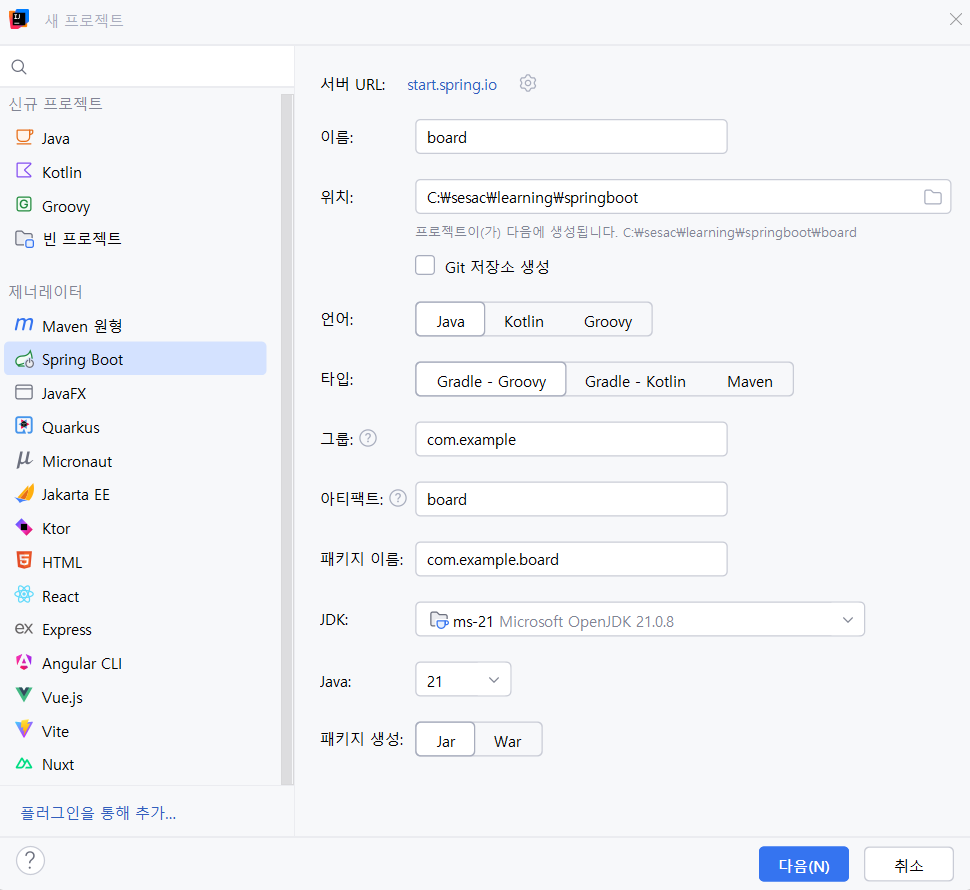

# 📘 **JPA - 게시판 프로젝트 (JDBC → JPA + JPQL 전환 학습)**

---

## 📌 **1. 프로젝트 생성 및 설정**

### 📦 **프로젝트 전체 구성**

```html
board/
 ├── src/main/java/com/example/board
 │    ├── BoardApplication.java
 │    ├── dto
 │    │    └── PostDTO.java
 │    ├── entity
 │    │    └── Post.java -> JPA방식 구현 시 사용
 │    ├── repository
 │    │    └── PostRepository.java
 │    ├── service
 │    │    └── PostService.java -> JPA방식 구현 시 사용
 │    └── controller
 │         └── PostController.java
 ├── src/main/resources
 │    ├── application.properties
 │    ├── schema.sql -> JDBC방식 구현 시 사용(테이블)
 │    ├── data.sql -> JDBC방식 구현 시 사용(샘플데이터)
 │    └── templates/posts
 │         ├── list.html
 │         ├── detail.html
 │         └── form.html
 └── build.gradle
```

### ✅ 프로젝트 생성



### ✅ Dependency 추가

- Spring Web
- Spring JDBC
- H2 Database
- Lombok
- 🔄 **JPA 전환 시: Spring Data JPA 추가 (`build.gradle` > 스타터 추가)**
    
    
    

### ✅ `application.properties` (JDBC 단계)

```
spring.application.name=board

spring.datasource.url=jdbc:h2:mem:testdb
spring.datasource.driver-class-name=org.h2.Driver
spring.datasource.username=sa
spring.datasource.password=

spring.h2.console.enabled=true
spring.h2.console.path=/h2-console

spring.sql.init.mode=always
logging.level.org.springframework.jdbc.core=DEBUG
```

---

## 📌 **2. H2 DB 설정**

### schema.sql (테이블)

```sql
CREATE TABLE post(
    id BIGINT AUTO_INCREMENT PRIMARY KEY,
    title VARCHAR(200) NOT NULL,
    content TEXT NOT NULL,
    created_at TIMESTAMP DEFAULT CURRENT_TIMESTAMP
);
```

### data.sql (샘플 데이터)

```sql
INSERT INTO post (title, content) VALUES ('첫번째 게시물', 'hello');
INSERT INTO post (title, content) VALUES ('두번째 게시물', 'hi');
INSERT INTO post (title, content) VALUES ('세번째 게시물', 'lucky');
```

[`http://localhost:8080/h2-console`](http://localhost:8080/h2-console) 접속


---

# 📘 **3. JDBC 기반 CRUD 구현**

---

## ✔ DTO

```java
@Data // getter, setter 자동 생성
@NoArgsConstructor // 기본 생성자 자동 생성
@AllArgsConstructor // 모든 필드를 매개 변수로 사용한 생성자 자동 생성
public class PostDTO {
    private Long id;
    private String title;
    private String content;
    private LocalDateTime createdAt;
}
```

---

## ✔ Repository (JdbcTemplate 사용)

```java
@Repository
@RequiredArgsConstructor // final과 같은 필수 인자를 갖는 생성자
public class PostRepository {

    private final JdbcTemplate jdbcTemplate;

    private final RowMapper<PostDTO> rowMapper = (rs, rowNum) -> new PostDTO(
            rs.getLong("id"),
            rs.getString("title"),
            rs.getString("content"),
            rs.getTimestamp("created_at").toLocalDateTime()
    );

    public List<PostDTO> findAll(){
        return jdbcTemplate.query("SELECT * FROM post", rowMapper);
    }

    public PostDTO findById(Long id){
        return jdbcTemplate.queryForObject("SELECT * FROM post WHERE id = ?", rowMapper, id);
    }

    public void save(PostDTO post){
        jdbcTemplate.update("INSERT INTO post (title, content) VALUES (?, ?)",
                post.getTitle(), post.getContent());
    }

    public void update(Long id, PostDTO post){
        jdbcTemplate.update("UPDATE post SET title = ?, content = ? WHERE id = ?",
                post.getTitle(), post.getContent(), id);
    }

    public void deleteById(Long id){
        jdbcTemplate.update("DELETE FROM post WHERE id = ?", id);
    }
}
```

---

## ✔ Controller (JDBC)

CRUD + 목록 + 상세 + 생성 + 삭제 + 수정

```java
@Controller
@RequestMapping("/posts")
@RequiredArgsConstructor
public class PostController {

    private final PostRepository postRepository;

    @GetMapping
    public String findAll(Model model){
        model.addAttribute("posts", postRepository.findAll());
        return "posts/list";
    }

    @GetMapping("/{id}")
    public String detail(@PathVariable Long id, Model model){
        model.addAttribute("post", postRepository.findById(id));
        return "posts/detail";
    }

    @GetMapping("/new")
    public String newPost(Model model){
        model.addAttribute("post", new PostDTO());
        return "posts/form";
    }

    @PostMapping
    public String create(@ModelAttribute PostDTO post){
        postRepository.save(post);
        return "redirect:/posts";
    }

    @GetMapping("/{id}/edit")
    public String edit(@PathVariable Long id, Model model){
        model.addAttribute("post", postRepository.findById(id));
        return "posts/form";
    }

    @PostMapping("/{id}")
    public String update(@PathVariable Long id, @ModelAttribute PostDTO post){
        postRepository.update(id, post);
        return "redirect:/posts/" + id;
    }

    @PostMapping("/{id}/delete")
    public String delete(@PathVariable Long id){
        postRepository.deleteById(id);
        return "redirect:/posts";
    }
}
```

서버 실행하고 [`localhost:8080/posts`](http://localhost:8080/posts) 접속


---

# 📘 **4. JPA 기반 CRUD 구현**

---

## ✔ 1) 엔티티 생성

```java
// JPA를 사용해 테이블 생성
@Entity
@Table
@Getter @Setter
@NoArgsConstructor
public class Post {

    @Id @GeneratedValue(strategy = GenerationType.IDENTITY)
    private Long id;

    @Column(nullable=false, length=100)
    private String title;

    @Column(nullable=false, columnDefinition="TEXT")
    private String content;

    @Column(name="created_at", updatable=false)
    private LocalDateTime createdAt;

    @PrePersist
    public void prePersist(){
        this.createdAt = LocalDateTime.now();
    }
}
```

---

## ✔ 2) JPA 설정 (`application.properties`)

```
#JDBC방식 사용 시 사용했던 것, 주석 처리할 것
#spring.sql.init.mode=always
#logging.level.org.springframework.jdbc.core=DEBUG

# JPA 추가
spring.jpa.hibernate.ddl-auto=create
spring.jpa.show-sql=true
spring.jpa.properties.hibernate.format_sql=true
```

---

## ✔ 3) JPA Repository (EntityManager 사용)

**EntityManager** : 엔티티를 관리하고 **DB와의 모든 작업을 담당하는 JPA의 핵심 관리자** 객체

### **1. 엔티티를 DB와 연결해서 관리하는 관리자**

- 엔티티를 **저장(persist)**
- 엔티티를 **조회(find)**
- 엔티티를 **삭제(remove)**
- 엔티티를 **수정(값만 바꾸면 자동 적용 — Dirty Checking)**

### **2. 영속성 컨텍스트를 생성하고 관리**

- 1차 캐시
- 쓰기 지연
- 변경 감지(Dirty Checking)
- 동일성 보장(같은 트랜잭션 내 같은 객체)

### **3. JPQL 실행**

- `createQuery()`로 JPQL 실행
    
    → 테이블이 아니라 **엔티티 기준 쿼리**
    

```java
@Repository
public class PostRepository {

    @PersistenceContext
    private EntityManager em;

    public Post save(Post post){
        em.persist(post);
        return post;
    }

    public Post findById(Long id){
        return em.find(Post.class, id);
    }

    public List<Post> findAll(){
        return em.createQuery("SELECT p FROM Post p", Post.class).getResultList();
    }

    public Post update(Post post){
        return em.merge(post);
    }

    public void delete(Post post){
        em.remove(post);
    }
}
```

---

## ✔ 4) Service 계층 (트랜잭션 분리)

### ▪ readOnly 옵션 정리

| 옵션 | 스냅샷 저장 | Dirty Checking | DB 반영 |
| --- | --- | --- | --- |
| `readOnly = false` | O | O | O |
| `readOnly = true` | X | X | X |

### Service 코드

```java
@Service
@RequiredArgsConstructor
@Transactional(readOnly = true)
public class PostService {

    private final PostRepository postRepository;

    @Transactional
    public Post createPost(Post post){
        return postRepository.save(post);
    }

    public Post getPostById(Long id){
        return postRepository.findById(id);
    }

    public List<Post> getAllPosts(){
        return postRepository.findAll();
    }

    @Transactional
    public Post updatePost(Long id, Post updated){
        Post post = getPostById(id);
        post.setTitle(updated.getTitle());
        post.setContent(updated.getContent());
        return postRepository.update(post);
    }

    @Transactional
    public void deletePost(Long id){
        Post post = getPostById(id);
        postRepository.delete(post);
    }
}
```

---

## ✔ 5) Controller 수정 (Service 사용)

- JDBC 방식(PostDTO를 사용했다면, JPA는 **Post엔티티**를 사용)

```java
@Controller
@RequestMapping("/posts")
@RequiredArgsConstructor
public class PostController {

    private final PostService postService;

    @GetMapping
    public String findAll(Model model){
        model.addAttribute("posts", postService.getAllPosts());
        return "posts/list";
    }

    @GetMapping("/{id}")
    public String detail(@PathVariable Long id, Model model){
        model.addAttribute("post", postService.getPostById(id));
        return "posts/detail";
    }

    @GetMapping("/new")
    public String newPost(Model model){
        model.addAttribute("post", new Post());
        return "posts/form";
    }

    @PostMapping
    public String create(@ModelAttribute Post post){
        postService.createPost(post);
        return "redirect:/posts";
    }

    @GetMapping("/{id}/edit")
    public String edit(@PathVariable Long id, Model model){
        model.addAttribute("post", postService.getPostById(id));
        return "posts/form";
    }

    @PostMapping("/{id}")
    public String update(@PathVariable Long id, @ModelAttribute Post post){
        postService.updatePost(id, post);
        return "redirect:/posts/" + id;
    }

    @PostMapping("/{id}/delete")
    public String delete(@PathVariable Long id){
        postService.deletePost(id);
        return "redirect:/posts";
    }
}
```

---

# 📘 **5. JPA 엔티티 상태 (Lifecycle)**

| 상태 | 설명 | 관련 메서드 |
| --- | --- | --- |
| 비영속(Transient) | DB와 무관한 단순 객체 | `new Post()` |
| 영속(Persistent) | 영속성 컨텍스트에서 관리 | `em.persist()` |
| 준영속(Detached) | 관리가 끊긴 상태 | `em.detach()`, 트랜잭션 종료 |
| 삭제(Removed) | 삭제 대기 상태 | `em.remove()` |

---

# 📘 **6. 영속성 컨텍스트 기능 테스트**

---

## ✔ 1) 1차 캐시

```java
@Transactional
public void testFirstLevelCache() {
    Post p1 = postRepository.findById(1L);
    Post p2 = postRepository.findById(1L);

    System.out.println(p1 == p2); // true
}
```

- 첫 조회 → DB
- 두 번째 조회 → 1차 캐시
- 동일 트랜잭션 → 동일 객체

---

## ✔ 2) 쓰기 지연(Write-Behind)

```java
@Transactional
public void testWriteBehind() {
    Post post = postRepository.findById(1L);
    post.setTitle("hello!");
    post.setTitle("hi!");
    post.setTitle("bye!");
}
```

- UPDATE SQL 바로 실행 ❌
- 트랜잭션 종료 시 한 번에 실행
- 마지막 변경만 반영됨

---

## ✔ 3) Dirty Checking

```java
@Transactional
public void testDirtyChecking() {
    Post post = postRepository.findById(1L);
    post.setTitle("hello!");
}
```

- 엔티티 변경 감지
- 스냅샷과 비교해 UPDATE 자동 발생

---

# 📘 **7. JPQL 검색 기능 추가**

---

## ✔ Repository

```java
public List<Post> findByTitleContaining(String keyword){
    String jpql = "SELECT p FROM Post p WHERE p.title LIKE :keyword";
    return em.createQuery(jpql, Post.class)
             .setParameter("keyword", "%" + keyword + "%")
             .getResultList();
}
```

---

## ✔ Service

```java
public List<Post> searchPosts(String keyword){
    return postRepository.findByTitleContaining(keyword);
}
```

---

## ✔ Controller

```java
@GetMapping("/search")
public String search(@RequestParam String keyword, Model model){
    model.addAttribute("posts", postService.searchPosts(keyword));
    return "posts/list";
}
```

---

## ✔ View (검색 폼)

```html
<form action="/posts/search">
    <input type="text" name="keyword">
    <input type="submit">
</form>
```

