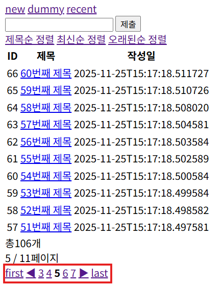

# 6. JPA - board(Data JPA, 페이지, Slice)

# 📘 Spring Data JPA — 쿼리메서드·JPQL·Native·페이징(Page/Slice) 완전 정리

---

# ✅ 1. Repository 생성 및 구조

Spring Data JPA에서는 Repository 구현 없이 **인터페이스 선언만으로 기능이 동작**한다.

```java
@Repository
public interface PostRepository extends JpaRepository<Post, Long> {

    // LIKE %keyword%
    List<Post> findByTitleContaining(String keyword);

    // LIKE keyword%
    List<Post> findByTitleStartingWith(String keyword);

    // >
    List<Post> findByIdGreaterThan(Long id);

    // ORDER BY id DESC
    List<Post> findAllByOrderByIdDesc();
}
```

---

# ✅ 2. Repository 상속 구조

```
JpaRepository
    ↑
PagingAndSortingRepository
    ↑
CrudRepository
    ↑
Repository
```

## 각 인터페이스 역할

| 인터페이스 | 역할 |
| --- | --- |
| **Repository** | 마커 인터페이스, 쿼리메서드 기능 제공 |
| **CrudRepository** | 기본 CRUD 제공 |
| **PagingAndSortingRepository** | 페이징·정렬 기능 제공 |
| **JpaRepository** | JPA 확장 기능 추가 |

---

# ✅ 3. CrudRepository 제공 메서드

| 메서드 | 설명 |
| --- | --- |
| save() | 저장(update/create) |
| findById() | 단건 조회 |
| findAll() | 전체 조회 |
| existsById() | 존재 여부 확인 |
| delete(), deleteById() | 삭제 |
| count() | 개수 조회 |

---

# ✅ 4. PagingAndSortingRepository 메서드

| 메서드 | 설명 |
| --- | --- |
| findAll(Sort sort) | 정렬 조회 |
| findAll(Pageable pageable) | 페이징 조회 |

---

# ✅ 5. JpaRepository 메서드

| 메서드 | 설명 |
| --- | --- |
| findAll() | 리스트 반환 |
| saveAll() | 여러 개 저장 |
| flush(), saveAndFlush() | flush 기능 |
| deleteAllInBatch() | batch delete |

---

# ✅ 6. 쿼리메서드(Query Method)

메서드 이름을 분석해 자동으로 JPQL 생성.

```
findBy + 필드명 + 조건
```

| 메서드 | JPQL |
| --- | --- |
| findByTitleContaining | title LIKE %keyword% |
| findByIdGreaterThan | id > ? |
| findAllByOrderByIdDesc | ORDER BY id DESC |

➡️ **짧고 빠르지만 복잡한 쿼리는 한계가 있음**

---

# ✅ 7. JPQL / Native SQL / @Query 방식

### JPQL (Java Persistence Query Language)

- JPA **엔티티(Entity)를 대상**으로 쿼리를 작성하는 **객체 지향 쿼리 언어**

```java
@Query("""
    SELECT p FROM Post p
    WHERE p.title LIKE %:keyword% OR p.content LIKE %:keyword%
""")
List<Post> searchByKeyword(@Param("keyword") String keyword);
```

### Native SQL

```java
@Query(value = """
    SELECT * FROM post
    WHERE title LIKE %:keyword%
    ORDER BY id DESC
""", nativeQuery = true)
List<Post> searchByTitleNative(@Param("keyword") String keyword);
```

### 장단점

| 방식 | 장점 | 단점 |
| --- | --- | --- |
| Query Method | 가장 간단 | 복잡한 검색에 부적합 |
| JPQL | JPA 문법 지원 | 문법 오류 컴파일에서 못 잡음 |
| Native | 복잡 SQL 가능 | DB 종속적 |

---

# ✅ 8. 페이징처리 (Page vs Slice)

## ✔ Page 특징

- totalElements(전체 개수)
- totalPages(전체 페이지)
- count 쿼리 추가 실행됨
- **게시판 UI에 적합**

---

## ✔ Slice 특징

- 다음 페이지 여부(hasNext)만 존재
- count 쿼리 없음 → 성능 좋음
- **더보기 / infinite scroll에 적합**

---

# ✔ 9. Page 방식 — 전체 페이징 UI 표시

---




## 9-1. Repository

```java
Page<Post> findAll(Pageable pageable);
Page<Post> findByTitleContaining(Pageable pageable, String keyword);
```

---

## 9-2. Service

```java
public Page<Post> getPostPage(Pageable pageable) {
    return postRepository.findAll(pageable);
}

public Page<Post> searchPostsPage(Pageable pageable, String keyword) {
    return postRepository.findByTitleContaining(pageable, keyword);
}
```

---

## 9-3. Controller

```java
@GetMapping
public String findAll(
        **@PageableDefault(sort = "id", direction = Sort.Direction.DESC)
        Pageable pageable**,
        Model model){

    Page<Post> postPage = postService.getPostPage(pageable);
    int currentPage = postPage.getNumber();
    int totalPages = postPage.getTotalPages();

		//페이지 표시 제한
    int displayPages = 5;
    int startPage = Math.max(0, currentPage - displayPages / 2);
    int endPage = Math.min(totalPages - 1, startPage + displayPages - 1);
    //끝에서 페이지 5개 유지 가능
    startPage = Math.max(0, endPage - displayPages + 1);

    model.addAttribute("startPage", startPage);
    model.addAttribute("endPage", endPage);
    model.addAttribute("postPage", postPage);

    return "posts/list";
}
```

---

## 9-4. View (list.html)

```html
<div>
        총<span th:text="${postPage.getTotalElements()}"></span>개<br>
        <span th:text="${postPage.number+1}"></span> / <span th:text="${postPage.getTotalPages()}"></span>페이지
    </div>

    <!-- 페이지 네비게이션 -->
    <div>
		    <!--시작 페이지-->
        <a th:href="@{/posts(page=0)}">first</a>
        
        <!--이전-->
        <a th:if="${postPage.hasPrevious()}" 
        th:href="@{/posts(page=${postPage.number-1})}">◀</a>
        
        **<!--페이지-->
        <span th:each="i : ${#numbers.sequence(startPage,endPage)}"><!--thymeleaf 문법-->
            <a th:if="${i != postPage.number}" 
            th:href="@{/posts(page=${i})}" 
            th:text="${i+1}"></a>
            <strong th:if="${i == postPage.number}" th:text="${i+1}"></strong>
        </span>**
        
        <!--다음-->
        <a th:if="${postPage.hasNext()}" 
        th:href="@{/posts(page=${postPage.number+1})}">▶</a>
        
        <!--마지막 페이지-->
        <a th:href="@{/posts(page=${postPage.totalPages})}">last</a>
    </div>
```

전체 페이지 UI가 포함된 화면.

---

# ✔ 10. Slice 방식 — 더보기 버튼 UI (무한 스크롤)

---


## 10-1. Repository

```java
Slice<Post> findAllBy(Pageable pageable);
```

---

## 10-2. Service

```java
public Slice<Post> getPostSlice(Pageable pageable) {
    return postRepository.findAllBy(pageable);
}
```

---

## 10-3. Controller

```java
@GetMapping("/more")
public String more(
        @PageableDefault(sort = "id", direction = Sort.Direction.DESC)
        Pageable pageable,
        Model model){

    Slice<Post> postSlice = postService.getPostSlice(pageable);
    model.addAttribute("postSlice", postSlice);
    return "posts/list-more";
}
```

---

## 10-4. View (list-more.html)

```html
<a th:href="@{/posts/more(page=${postSlice.number+1})}"
   th:if="${postSlice.hasNext()}">더보기</a>

<p th:unless="${postSlice.hasNext()}">마지막 페이지입니다.</p>
```

➡️ 더보기 버튼만 있는 간단한 UI

---

# 🎯 최종 요약

| 항목 | 핵심 내용 |
| --- | --- |
| Repository | 인터페이스만 선언하면 구현 자동 생성 |
| CrudRepository | CRUD 제공 |
| PagingAndSortingRepository | 페이징 & 정렬 |
| JpaRepository | 가장 확장된 형태 |
| Query Method | 메서드 이름 → JPQL 자동 생성 |
| JPQL | 엔티티 기반 쿼리 |
| Native SQL | DB 직접 SQL |
| Page | 전체 페이지 포함 / 게시판에 적합 |
| Slice | 다음 페이지 여부만 / 더보기 UI 최적 |