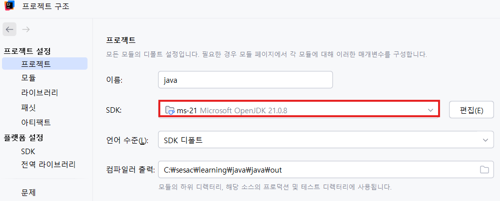

# 1. Spring Boot

# 🌱 Spring Framework & Spring Boot 정리

## 1. Spring Framework

- **Java 기반 웹 서버 프레임워크**
- 공식 사이트 : [https://spring.io/](https://spring.io/)
- **Spring Boot** : 최소 설정으로 Spring 프로젝트를 빠르게 실행할 수 있게 해주는 경량화된 버전
    
    (예: Spring Boot **3.5.7**)
    

---

# 2. Spring 프로젝트 생성 과정

## ✔ 2-1. JDK 설치 및 환경 변수 설정

- 기존 JDK 17 → JDK 21로 버전 업 (예: IntelliJ에서 설치)
- **시스템 환경 변수 설정**
    - `JAVA_HOME` 생성
    - `Path`에 `%JAVA_HOME%\bin` 추가
        
        
        
        
        
        
        
        
        
        
        
        

## ✔ 2-2. VS Code Java 설정 (선택)

- VS Code 실행 → Java extension 설치
- Git Bash 등에서 Java 경로를 설정하여 Java 프로젝트 사용 가능
    
    
    
    
    

---

# 3. Spring Initializr로 프로젝트 생성

사이트 : [https://start.spring.io/](https://start.spring.io/)

- 필요한 설정 선택(Group, Artifact, Boot 버전 등)
- 생성 후 ZIP 다운로드 → 압축 해제 → IntelliJ로 프로젝트 오픈
    
    
    

### 예시 코드 (`DemoApplication.java`)

```java
package com.example.demo;

import org.springframework.boot.SpringApplication;
import org.springframework.boot.autoconfigure.SpringBootApplication;
import org.springframework.web.bind.annotation.GetMapping;
import org.springframework.web.bind.annotation.RequestParam;
import org.springframework.web.bind.annotation.RestController;

@SpringBootApplication
@RestController
public class DemoApplication {

    public static void main(String[] args) {
        SpringApplication.run(DemoApplication.class, args);
    }

    @GetMapping("/hello")
    public String hello(@RequestParam(value = "name", defaultValue = "World") String name) {
        return String.format("Hello %s", name);
    }
}
```

- 실행 후 확인 URL
    
    👉 `http://localhost:8080/hello`
    

### 🖥 터미널에서 실행

프로젝트 폴더 이동 후:

```
.\gradlew.bat bootRun
```

---

# 4. IntelliJ에서 프로젝트 생성

- IntelliJ의 **New Project** 사용
- GroupId는 보통 회사 도메인을 뒤집어 작성(ex: `com.company`)
- 필요할 경우 **`build.gradle`** 에 dependency 추가 가능

예시:

```
dependencies {
    implementation 'org.springframework.boot:spring-boot-starter-web'
}
```


추후 **`build.gradle`** 에 `dependency` 추가 가능


---

# 5. MVC 패턴 정리

참고 : https://ko.wikipedia.org/wiki/모델-뷰-컨트롤러

### 🧩 MVC 구성 요소

| 구성 요소 | 역할 |
| --- | --- |
| **Controller (중간 역할)** | 모델과 뷰의 중간 역할, 요청 처리, 모델 업데이트, 뷰 선택 |
| **Model (데이터)** | 데이터 상태 저장 및 CRUD 처리 |
| **View (화면)** | 사용자에게 보여지는 화면, 모델 데이터를 기반으로 결과 표시 |

---

# 6. 간단한 Spring MVC 구조 만들기

### ✔ 폴더 구조

```
src
 └─ main
     ├─ java
     │   └─ controller   ← 컨트롤러 패키지 생성
     └─ resources
         └─ templates    ← 뷰(html) 파일 저장
             └─ home.html
	           └─ hello.html
	           └─ fruits.html ← 반복
	           └─ grade.html ← 조건
```

### HelloContoller 예시

```java
package com.example.firstapp.controller;

import org.springframework.stereotype.Controller;
import org.springframework.ui.Model;
import org.springframework.web.bind.annotation.GetMapping;

@Controller
public class HomeController {

    @GetMapping("/")
    public String home(){
        return "home";//home.html
    }

    **//model에 속성을 담아서 hello.html에 전달**
    @GetMapping("/hello")
    public String hello(Model model){
        String name = "gildong";
        **model.addAttribute("name", name);**
        return "hello";//hello.html
    }
}
```

### hello.html 예시 ( `! + Tab` 자동완성)

- html 태그에 **`thymeleaf(템플릿 엔진)`** 사용을 위한 **`xmlns:th="https://www.thymeleaf.org"` 추가**

```html
<!doctype html>
<html lang="en" **xmlns:th="https://www.thymeleaf.org"**>
<head>
    <meta charset="UTF-8">
    <meta name="viewport"
          content="width=device-width, user-scalable=no, initial-scale=1.0, maximum-scale=1.0, minimum-scale=1.0">
    <meta http-equiv="X-UA-Compatible" content="ie=edge">
    <title>Hello</title>
</head>
<body>
    <h1>hello!</h1>
    **<!--  HomeController의 home메서드의 Model에 담긴 name을 가져옴  -->
    <h1 th:text="${name}"></h1>**
</body>
</html>
```

- 템플릿 생성
    
    파일 > 설정 > 에디터 > 라이브 템플릿 > + > 그룹(Thymeleaf) 생성 > + > 라이브 템플릿 생성
    
    
    
    ```java
    <!doctype html>
    <html lang="en" xmlns:th="https://www.thymeleaf.org">
    <head>
        <meta charset="UTF-8">
        <meta name="viewport"
              content="width=device-width, user-scalable=no, initial-scale=1.0, maximum-scale=1.0, minimum-scale=1.0">
        <meta http-equiv="X-UA-Compatible" content="ie=edge">
        <title>$TITLE$</title>
    </head>
    <body>
        $END$
    </body>
    </html>
    ```
    

- **반복문 (foreach)**
    
    ### Contoller 예시
    
    ```java
    package com.example.firstapp.controller;
    
    import org.springframework.stereotype.Controller;
    import org.springframework.ui.Model;
    import org.springframework.web.bind.annotation.GetMapping;
    
    @Controller
    public class HomeController {
    
        @GetMapping("/fruits")
        public String fruits(Model model){
            List<String> fruitList = new ArrayList<>();
            fruitList.add("apple");
            fruitList.add("banana");
            fruitList.add("cherry");
            fruitList.add("lemon");
            fruitList.add("kiwi");
    
            model.addAttribute("fruits", fruitList);
            return "fruits";
        }
    }
    ```
    
    ### fruits.html 예시 ( `thhtml + tab` 자동완성)
    
    ```html
    <!doctype html>
    <html lang="en" xmlns:th="https://www.thymeleaf.org">
    <head>
        <meta charset="UTF-8">
        <meta name="viewport"
              content="width=device-width, user-scalable=no, initial-scale=1.0, maximum-scale=1.0, minimum-scale=1.0">
        <meta http-equiv="X-UA-Compatible" content="ie=edge">
        <title>fruits</title>
    </head>
    <body>
        <h1>fruits list</h1>
        <ul>
    <!--        <li th:text="${fruits[0]}"></li>-->
    <!--        <li th:text="${fruits[1]}"></li>-->
    <!--        <li th:text="${fruits[2]}"></li>-->
            **<li th:each="fruit: ${fruits}" th:text="${fruit}"></li>**
        </ul>
    </body>
    </html>
    ```
    

- 조건문(if)
    
    ### Contoller 예시
    
    ```java
    package com.example.firstapp.controller;
    
    import org.springframework.stereotype.Controller;
    import org.springframework.ui.Model;
    import org.springframework.web.bind.annotation.GetMapping;
    
    @Controller
    public class HomeController {
    
        @GetMapping("/grade")
        public String grade(Model model){
            int score = 90;
            model.addAttribute("score", score);
            return "grade";
        }
    }
    ```
    
    ### grade.html 예시 ( `thhtml + tab` 자동완성)
    
    ```html
    <!doctype html>
    <html lang="en" xmlns:th="https://www.thymeleaf.org">
    <head>
        <meta charset="UTF-8">
        <meta name="viewport"
              content="width=device-width, user-scalable=no, initial-scale=1.0, maximum-scale=1.0, minimum-scale=1.0">
        <meta http-equiv="X-UA-Compatible" content="ie=edge">
        <title>grade</title>
    </head>
    <body>
        <h1>grade</h1>
        <p th:text="${score}"></p>
        <p th:if="${score > 90}">1등급</p>
        <p th:if="${score > 80 && score <= 90}">2등급</p>
        <p th:if="${score <= 80}">탈락</p>
    </body>
    </html>
    ```