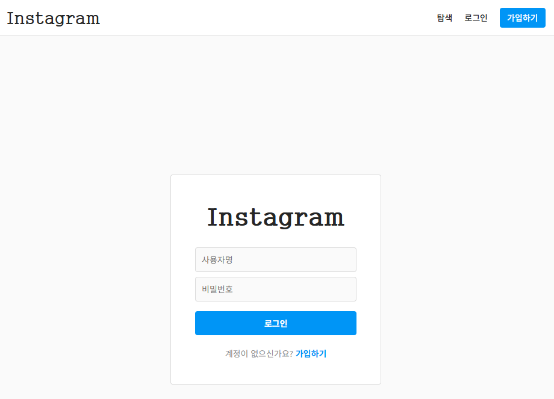

# 3. Instagram REST API

## **1. Git & 프로젝트 세팅**

# **Git – Front 작업 기준**

**클론 받기**

```bash
git clone https://github.com/SESAC-SD3/insta-front.git
cd insta-front
```

### Frontend (React)

```bash
cd insta-front
npm install
npm start
# 브라우저: http://localhost:3000
```



### Backend (Spring Boot)

- Swagger/OpenAPI 적용

```
// build.gradle
implementation 'org.springdoc:springdoc-openapi-starter-webmvc-ui:2.8.3'
```

- SwaggerConfig


```java
@Configuration
public class SwaggerConfig {

    @Bean
    public OpenAPI openAPI() {
        String securitySchemeName = "bearerAuth";

        return new OpenAPI()
                .info(new Info()
                        .title("Instagram Clone API")
                        .description("인스타그램 클론 REST API")
                        .version("v1.0.0"))
                .servers(List.of(
                        new Server()
                                .url("http://localhost:8080")
                                .description("Local Server")
                ))
                .addSecurityItem(new SecurityRequirement()
                        .addList(securitySchemeName))
                .components(new Components()
                        .addSecuritySchemes(securitySchemeName,
                                new SecurityScheme()
                                        .type(SecurityScheme.Type.HTTP)
                                        .scheme("bearer")
                                        .bearerFormat("JWT")
                                        .description("JWT 토큰을 입력하세요 (Bearer 없이)")));
    }
}
```

- 회원가입/로그인 후 발급 토큰 Swagger Authorize에 등록 가능

---

## **2. 게시물(Post) 기능**

### Entity

```java
@Entity
@Table(name = "posts")
@Getter
@NoArgsConstructor
public class Post extends BaseTimeEntity {
    @Id @GeneratedValue(strategy = GenerationType.IDENTITY)
    private Long id;
    @Column(nullable = false, length = 2000) private String content;
    private String imageUrl;

    @ManyToOne(fetch = FetchType.LAZY) @JoinColumn(name = "user_id", nullable = false)
    private User user;

    @OneToMany(mappedBy = "post", cascade = CascadeType.REMOVE)
    private List<Comment> comments = new ArrayList<>();
    @OneToMany(mappedBy = "post", cascade = CascadeType.REMOVE)
    private List<PostLike> likes = new ArrayList<>();

    @Builder
    public Post(String content, String imageUrl, User user) {
        this.content = content; this.imageUrl = imageUrl; this.user = user;
    }
}
```

### Repository

```java
public interface PostRepository extends JpaRepository<Post, Long> {
    //전체 게시물 조회
    @Query("SELECT p FROM Post p JOIN FETCH p.user ORDER BY p.createdAt DESC")
    List<Post> findAllWithUser();

		// 특정 게시물 조회
    @Query("SELECT p FROM Post p JOIN FETCH p.user WHERE p.id = :postId")
    Optional<Post> findByIdWithUser(@Param("postId") long id);

		//특정 사용자가 작성한 게시물(사용자 프로필)
    @Query("SELECT p FROM Post p JOIN FETCH p.user WHERE p.user.id = :userId ORDER BY p.createdAt DESC")
    List<Post> findByUserIdWithUser(@Param("userId") Long userId);

    long countByUserId(Long userId);
}
```

### Service

```java
@Service @Transactional(readOnly = true) @RequiredArgsConstructor
public class PostService {
    private final PostRepository postRepository;
    private final UserRepository userRepository;
    private final PostLikeRepository postLikeRepository;

    @Transactional
    public PostResponse create(Long userId, PostCreateRequest req){
        User user = userRepository.findById(userId).orElseThrow(() -> new CustomException(ErrorCode.USER_NOT_FOUND));
        Post post = Post.builder().content(req.getContent()).imageUrl(req.getImageUrl()).user(user).build();
        postRepository.save(post);
        return PostResponse.from(post);
    }

    public List<PostResponse> findAll() {
        return postRepository.findAllWithUser().stream()
                .map(post -> toPostResponseWithStatus(post, null)).toList();
    }

    public PostResponse findById(Long postId) {
        Post post = postRepository.findByIdWithUser(postId).orElseThrow(() -> new CustomException(ErrorCode.POST_NOT_FOUND));
        return toPostResponseWithStatus(post, null);
    }

    @Transactional
    public void delete(Long postId, Long userId){
        Post post = postRepository.findById(postId).orElseThrow(() -> new CustomException(ErrorCode.POST_NOT_FOUND));
        if(!post.getUser().getId().equals(userId)) throw new CustomException(ErrorCode.NOT_POST_OWNER);
        postRepository.delete(post);
    }

    private PostResponse toPostResponseWithStatus(Post post, Long currentUserId){
        boolean liked = currentUserId != null && postLikeRepository.existsByUserIdAndPostId(currentUserId, post.getId());
        long likeCount = postLikeRepository.countByPostId(post.getId());
        long commentCount = post.getComments().size();
        return PostResponse.from(post, liked, likeCount, commentCount);
    }
}
```

### Controller

```java
@RestController
@RequestMapping("/api/posts")
@RequiredArgsConstructor
public class PostController {
    private final PostService postService;
    private final CommentService commentService;
    private final PostLikeService postLikeService;

    @PostMapping public ResponseEntity<ApiResponse<PostResponse>> create(@AuthenticationPrincipal CustomUserDetails userDetails, @Valid @RequestBody PostCreateRequest request){
        return ResponseEntity.status(HttpStatus.CREATED).body(ApiResponse.success(postService.create(userDetails.getId(), request)));
    }

    @GetMapping public ResponseEntity<ApiResponse<List<PostResponse>>> findAll(){
        return ResponseEntity.ok(ApiResponse.success(postService.findAll()));
    }

    @GetMapping("/{id}") public ResponseEntity<ApiResponse<PostResponse>> findById(@PathVariable Long id){
        return ResponseEntity.ok(ApiResponse.success(postService.findById(id)));
    }

    @DeleteMapping("/{id}") public ResponseEntity<Void> delete(@PathVariable Long id, @AuthenticationPrincipal CustomUserDetails userDetails){
        postService.delete(id, userDetails.getId());
        return ResponseEntity.noContent().build();
    }
}
```

[Swagger - 게시물 생성]


[사용자 프로필 페이지]


[게시물 상세 페이지]


[게시글 삭제] ⇒ 게시물을 작성한 사용자가 아니라면 삭제할 수 없음


---

## **3. 댓글(Comment) 기능**

### Entity

```java
@Entity
@Table(name = "comments")
@Getter
@NoArgsConstructor
public class Comment extends BaseTimeEntity {
    @Id @GeneratedValue(strategy = GenerationType.IDENTITY) private Long id;
    private String content;
    @ManyToOne(fetch = FetchType.LAZY) @JoinColumn(name = "user_id", nullable = false) private User user;
    @ManyToOne(fetch = FetchType.LAZY) @JoinColumn(name = "post_id", nullable = false) private Post post;

    @Builder public Comment(String content, User user, Post post){ this.content = content; this.user = user; this.post = post; }
}
```

### Service

```java
@Service @RequiredArgsConstructor @Transactional(readOnly = true)
public class CommentService {
    private final CommentRepository commentRepository;
    private final PostRepository postRepository;
    private final UserRepository userRepository;

    @Transactional
    public CommentResponse create(Long postId, Long userId, CommentCreateRequest req){
        Post post = postRepository.findById(postId).orElseThrow(() -> new CustomException(ErrorCode.POST_NOT_FOUND));
        User user = userRepository.findById(userId).orElseThrow(() -> new CustomException(ErrorCode.USER_NOT_FOUND));
        Comment comment = Comment.builder().content(req.getContent()).user(user).post(post).build();
        commentRepository.save(comment);
        return CommentResponse.from(comment);
    }

    public List<CommentResponse> findbyPostId(Long postId){
        if(!postRepository.existsById(postId)) throw new CustomException(ErrorCode.POST_NOT_FOUND);
        return commentRepository.findByPostIdWithUser(postId).stream().map(CommentResponse::from).toList();
    }

    @Transactional
    public void delete(Long commentId, Long userId){
        Comment comment = commentRepository.findById(commentId).orElseThrow(() -> new CustomException(ErrorCode.COMMENT_NOT_FOUND));
        if(!comment.getUser().getId().equals(userId)) throw new CustomException(ErrorCode.NOT_COMMENT_OWNER);
        commentRepository.delete(comment);
    }
}
```

---

## **4. 좋아요(Like) 기능**

### Entity

```java
@Entity
@Table(name = "post_likes")
@Getter
@NoArgsConstructor
public class PostLike extends BaseTimeEntity {
    @Id @GeneratedValue(strategy = GenerationType.IDENTITY) private Long id;
    @ManyToOne(fetch = FetchType.LAZY) @JoinColumn(name = "user_id", nullable = false) private User user;
    @ManyToOne(fetch = FetchType.LAZY) @JoinColumn(name = "post_id", nullable = false) private Post post;
    @Builder public PostLike(User user, Post post){ this.user = user; this.post = post; }
}
```

### Service

```java
@Service @RequiredArgsConstructor @Transactional(readOnly = true)
public class PostLikeService {
    private final PostLikeRepository postLikeRepository;
    private final PostRepository postRepository;
    private final UserRepository userRepository;

    @Transactional
    public LikeResponse like(Long userId, Long postId){
        User user = userRepository.findById(userId).orElseThrow(() -> new CustomException(ErrorCode.USER_NOT_FOUND));
        Post post = postRepository.findById(postId).orElseThrow(() -> new CustomException(ErrorCode.POST_NOT_FOUND));
        if(postLikeRepository.existsByUserIdAndPostId(userId, postId)) throw new CustomException(ErrorCode.ALREADY_LIKED);

        postLikeRepository.save(PostLike.builder().user(user).post(post).build());
        return LikeResponse.of(true, postLikeRepository.countByPostId(postId));
    }

    @Transactional
    public LikeResponse unlike(Long userId, Long postId){
        PostLike postLike = postLikeRepository.findByUserIdAndPostId(userId, postId).orElseThrow(() -> new CustomException(ErrorCode.NOT_LIKED));
        postLikeRepository.delete(postLike);
        return LikeResponse.of(false, postLikeRepository.countByPostId(postId));
    }

    public LikeResponse getLikeStatus(Long postId, Long userId){
        boolean liked = userId != null && postLikeRepository.existsByUserIdAndPostId(userId, postId);
        long likeCount = postLikeRepository.countByPostId(postId);
        return LikeResponse.of(liked, likeCount);
    }
}
```

[댓글 및 좋아요]


---

## **5. 핵심 포인트**

1. **Post**
    - CRUD, 작성자 권한 체크, 댓글/좋아요 연관관계
2. **Comment**
    - 게시물별 CRUD, 작성자만 삭제 가능
3. **Like**
    - 좋아요/취소/상태 조회, 중복 방지
4. **Swagger**
    - JWT 인증 가능, Controller `@Tag`, `@Operation`으로 API 문구 커스터마이징
5. **Front**
    - React 기반, `/api/posts` 등 REST API와 연동, `npm start`로 실행