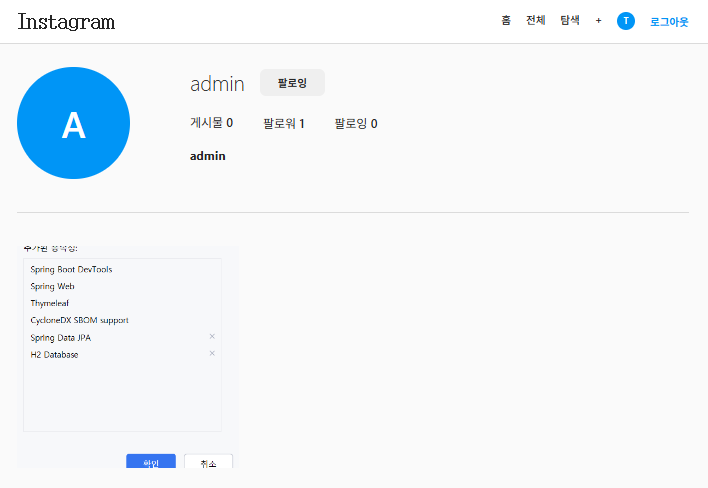

# 2. 팔로우, 무한스크롤, OAUTH(카카오)

## 1️⃣ 팔로우(Follow) 기능

### Follow 엔티티

```java
@Entity
@Table(name = "follows")
@Getter
@NoArgsConstructor
public class Follow extends BaseTimeEntity {

    @Id
    @GeneratedValue(strategy = GenerationType.IDENTITY)
    private Long id;

    // 팔로우하는 사람 (follower)
    @ManyToOne(fetch = FetchType.LAZY)
    @JoinColumn(name = "follower_id", nullable = false)
    private User follower;

    // 팔로우 당하는 사람 (following)
    @ManyToOne(fetch = FetchType.LAZY)
    @JoinColumn(name = "following_id", nullable = false)
    private User following;

    @Builder
    public Follow(User following, User follower) {
        this.following = following;
        this.follower = follower;
    }
}
```

> 🔹 팔로우 관계를 나타내는 테이블.
> 
> 
> 🔹 `follower → following` 구조로, 자기 자신 팔로우 방지는 서비스에서 처리.
> 

---

### FollowRepository

```java
public interface FollowRepository extends JpaRepository<Follow, Long> {

    Optional<Follow> findByFollowerIdAndFollowingId(Long followerId, Long followingId);

    boolean existsByFollowerIdAndFollowingId(Long followerId, Long followingId);

    long countByFollowingId(Long followingId); // 팔로워 수
    long countByFollowerId(Long followerId);   // 팔로잉 수

    @Query("SELECT f.following.id FROM Follow f WHERE f.follower.id = :userId")
    List<Long> findFollowingIdsByFollowerId(@Param("userId") Long userId);

    @Query("SELECT f FROM Follow f JOIN FETCH f.following WHERE f.following.id = :userId")
    List<Follow> findFollowersByFollowingId(@Param("userId") Long userId);

    @Query("SELECT f FROM Follow f JOIN FETCH f.follower WHERE f.follower.id = :userId")
    List<Follow> findFollowingsByFollowerId(@Param("userId") Long userId);
}
```

> 🔹 팔로우 상태 조회, 팔로워/팔로잉 목록 조회, ID 리스트 조회 등 다양한 기능 제공.
> 

---

### FollowResponse DTO

```java
@Getter
@Builder
public class FollowResponse {
    private boolean following;   // 로그인한 사용자가 해당 유저를 팔로우 중인지
    private long followerCount;  // 팔로워 수
    private long followingCount; // 팔로잉 수

    public static FollowResponse of(boolean following, long followerCount, long followingCount){
        return FollowResponse.builder()
                .following(following)
                .followerCount(followerCount)
                .followingCount(followingCount)
                .build();
    }
}
```

---

### FollowService

```java
@Service
@RequiredArgsConstructor
@Transactional(readOnly = true)
public class FollowService {
    private final FollowRepository followRepository;
    private final UserRepository userRepository;

    // 팔로워/팔로잉 수 조회
    private FollowResponse getFollowCounts(Long userId, boolean isFollowing) {
        long followerCount = followRepository.countByFollowingId(userId); // 나를 팔로우하는 수
        long followingCount = followRepository.countByFollowerId(userId); // 내가 팔로우하는 수
        return FollowResponse.of(isFollowing, followerCount, followingCount);
    }

    // 팔로우
    @Transactional
    public FollowResponse follow(String username, Long followerId){
        User following = userRepository.findByUsername(username)
                .orElseThrow(() -> new CustomException(ErrorCode.USER_NOT_FOUND));
        User follower = userRepository.findById(followerId)
                .orElseThrow(() -> new CustomException(ErrorCode.USER_NOT_FOUND));

        if(following.getId().equals(follower.getId())){
            throw new CustomException(ErrorCode.CANNOT_FOLLOW_SELF);
        }

        if(followRepository.existsByFollowerIdAndFollowingId(follower.getId(), following.getId())){
            throw new CustomException(ErrorCode.ALREADY_FOLLOWING);
        }

        Follow follow = Follow.builder()
                .follower(follower)
                .following(following)
                .build();
        followRepository.save(follow);

        return getFollowCounts(following.getId(), true);
    }

    // 언팔로우
    @Transactional
    public FollowResponse unfollow(String username, Long followerId){
        User following = userRepository.findByUsername(username)
                .orElseThrow(() -> new CustomException(ErrorCode.USER_NOT_FOUND));

        Follow follow = followRepository.findByFollowerIdAndFollowingId(followerId, following.getId())
                .orElseThrow(() -> new CustomException(ErrorCode.NOT_FOLLOWING));

        followRepository.delete(follow);
        return getFollowCounts(following.getId(), false);
    }

    // 팔로워 목록 조회
    public List<UserResponse> getFollowers(String username){
        User user = userRepository.findByUsername(username)
                .orElseThrow(() -> new CustomException(ErrorCode.USER_NOT_FOUND));

        return followRepository.findFollowersByFollowingId(user.getId()).stream()
                .map(follow -> UserResponse.from(follow.getFollower()))
                .toList();
    }

    // 팔로잉 목록 조회
    public List<UserResponse> getFollowings(String username){
        User user = userRepository.findByUsername(username)
                .orElseThrow(() -> new CustomException(ErrorCode.USER_NOT_FOUND));

        return followRepository.findFollowingsByFollowerId(user.getId()).stream()
                .map(follow -> UserResponse.from(follow.getFollowing()))
                .toList();
    }
}
```

---

### UserController (팔로우 관련 API)

```java
@PostMapping("{username}/follow")
public ResponseEntity<ApiResponse<FollowResponse>> follow(
        @PathVariable String username,
        @AuthenticationPrincipal CustomUserDetails userDetails){
    FollowResponse response = followService.follow(username, userDetails.getId());
    return ResponseEntity.ok(ApiResponse.success(response));
}

@DeleteMapping("{username}/follow")
public ResponseEntity<ApiResponse<FollowResponse>> unfollow(
        @PathVariable String username,
        @AuthenticationPrincipal CustomUserDetails userDetails){
    FollowResponse response = followService.unfollow(username, userDetails.getId());
    return ResponseEntity.ok(ApiResponse.success(response));
}

@GetMapping("{username}/followers")
public ResponseEntity<ApiResponse<List<UserResponse>>> getFollowers(
        @PathVariable String username){
    List<UserResponse> response = followService.getFollowers(username);
    return ResponseEntity.ok(ApiResponse.success(response));
}

@GetMapping("{username}/following")
public ResponseEntity<ApiResponse<List<UserResponse>>> getFollowings(
        @PathVariable String username){
    List<UserResponse> response = followService.getFollowings(username);
    return ResponseEntity.ok(ApiResponse.success(response));
}
```

> 🔹 팔로우/언팔로우 + 팔로워/팔로잉 목록 조회 가능
> 

🔹 팔로우 (test[1] → admin[2])




🔹 언팔로우 (test[1]  —/→ admin[2])


🔹 팔로워목록 :  admin을 팔로우하는 사용자


🔹 팔로잉목록  :  test가 팔로우하는 사용자


🔹 사용자 프로필 정보


---

## 2️⃣ 무한 스크롤 & 피드 기능

### SliceResponse

```java
@Getter
@Builder
public class SliceResponse<T> {
    private List<T> content;
    private boolean hasNext;
    private int page;
    private int size;

    public static <T> SliceResponse<T> from(Slice<?> slice, List<T> content){
        return SliceResponse.<T>builder()
                .content(content)
                .hasNext(slice.hasNext())
                .page(slice.getNumber())
                .size(slice.getSize())
                .build();
    }
}
```

> 🔹 Spring Data Slice 기반으로 페이징 처리, 다음 페이지 존재 여부 반환 가능.
> 

---

### PostRepository (페이징 쿼리)

```java
// 팔로잉 + 내 게시물 피드
@Query("SELECT p FROM Post p JOIN FETCH p.user WHERE p.user.id IN :userIds ORDER BY p.createdAt DESC")
Slice<Post> findByUserIdsWithUserPaging(@Param("userIds") List<Long> userIds, Pageable pageable);

// 전체 탐색 게시물
@Query("SELECT p FROM Post p JOIN FETCH p.user ORDER BY p.createdAt DESC")
Slice<Post> findAllWithUserPaging(Pageable pageable);
```

---

### FeedService

```java
@Service
@RequiredArgsConstructor
@Transactional(readOnly = true)
public class FeedService {
    private final PostRepository postRepository;
    private final FollowRepository followRepository;
    private final PostLikeRepository postLikeRepository;
    private final CommentRepository commentRepository;

    private PostResponse toPostResponseWithStatus(Post post, Long currentUserId){
        boolean liked = currentUserId != null
                && postLikeRepository.existsByUserIdAndPostId(currentUserId, post.getId());
        long likeCount = postLikeRepository.countByPostId(post.getId());
        long commentCount = post.getComments().size();
        return PostResponse.from(post, liked, likeCount, commentCount);
    }

    **// 피드 (팔로잉 + 내 게시물)**
    public SliceResponse<PostResponse> getFeed(Long userId, Pageable pageable){
        List<Long> followingIds = followRepository.findFollowingIdsByFollowerId(userId);
        followingIds.add(userId); // 본인 포함

        Slice<Post> posts = postRepository.findByUserIdsWithUserPaging(followingIds, pageable);
        List<PostResponse> content = posts.stream()
                .map(post -> toPostResponseWithStatus(post, userId))
                .toList();

        return SliceResponse.from(posts, content);
    }

    // 탐색 (전체 게시물)
    public SliceResponse<PostResponse> getExplore(Long userId, Pageable pageable){
        Slice<Post> posts = postRepository.findAllWithUserPaging(pageable);
        List<PostResponse> content = posts.stream()
                .map(post -> toPostResponseWithStatus(post, userId))
                .toList();

        return SliceResponse.from(posts, content);
    }
}
```

---

### FeedController

```java
@GetMapping("/feed")
public ResponseEntity<ApiResponse<SliceResponse<PostResponse>>> getFeed(
        @AuthenticationPrincipal CustomUserDetails userDetails,
        @RequestParam int page,
        @RequestParam int size){
    Pageable pageable = PageRequest.of(page, size);
    SliceResponse response = feedService.getFeed(userDetails.getId(), pageable);
    return ResponseEntity.ok(ApiResponse.success(response));
}

@GetMapping("/explore")
public ResponseEntity<ApiResponse<SliceResponse<PostResponse>>> getExplore(
        @AuthenticationPrincipal CustomUserDetails userDetails,
        @RequestParam int page,
        @RequestParam int size){
    Pageable pageable = PageRequest.of(page, size);
    SliceResponse response = feedService.getExplore(userDetails.getId(), pageable);
    return ResponseEntity.ok(ApiResponse.success(response));
}
```

> 🔹 피드(내가 팔로우하는 사용자의 게시물 및 내 게시물), 탐색(전체 게시물), 무한스크롤
> 

🔹 피드(내가 팔로우하는 사용자의 게시물 및 내 게시물)


🔹 탐색(전체 게시물) , 무한스크롤(더 보기) 


---

## 3️⃣ 카카오 OAUTH 로그인

1. [https://developers.kakao.com/](https://developers.kakao.com/) (회원가입 및 로그인)
2. 앱 > +앱 생성 (instagram)
    
    
    
3. 앱 > 플랫폼 키 > REST API 키 
    
    
    
    키 이름: `test`
    
    카카오 로그인 리다이렉션URL : `http://localhost:3000/oauth/kakao/callback`
    
    저장
    
4. 제품 설정 > 카카오 로그인 > 일반 > 활성화
    
    
    
5. 동의 항목 > 넥네임(필수), 프로필(선택)
    
    
    
6. REACT 에서 `.env` 파일 생성
    
    ```java
    REACT_APP_API_URL=http://localhost:8080
    REACT_APP_KAKAO_CLIENT_ID=[발급받은 REST API KEY]
    REACT_APP_KAKAO_REDIRECT_URI=http://localhost:3000/oauth/kakao/callback
    ```
    
7. 로그인 ([https://developers.kakao.com/docs/latest/ko/kakaologin/rest-api](https://developers.kakao.com/docs/latest/ko/kakaologin/rest-api))
    
    
    
    [프론트] 로그인 클릭
    → [카카오 로그인 페이지로 이동]
    → [카카오] Authorization Code 전달
    → [프론트] Authorization Code 수신
    → [프론트 → 백엔드] Authorization Code 전달
    → [백엔드 → 카카오] AccessToken 요청
    → [카카오 → 백엔드] AccessToken 발급
    → [백엔드] 사용자 정보 조회
    → [백엔드 → 프론트] JWT 발급
    

1. 백엔드 구현
    
    **`build.gradle`** 에 **`Spring Reactive Web`** 추가
    
    `application.properties`
    
    ```java
    oauth.kakao.client-id=${KAKAO_CLIENT_ID}
    oauth.kakao.client-secret=${KAKAO_CLIENT_SECRET}
    oauth.kakao.redirect-uri=http://localhost:3000/oauth/kakao/callback
    oauth.kakao.token-uri=https://kauth.kakao.com/oauth/token
    oauth.kakao.user-info-uri=https://kapi.kakao.com/v2/user/me
    ```
    
    **환경변수 등록**
    
    Intellij 오른쪽 상단 …버튼 > 편집
    
    
    
    **옵션 수정 > 환경 변수 활성화**
    
    
    
    ※ 발급받은 키 값을 추가할 것
    
    KAKAO_CLIENT_ID : REST API 키
    
    KAKAO_CLIENT_SECRET: 앱 > 플랫폼 키 > 클라이언트 시크릿 키
    
    확인 > 적용
    
    
    
    
    
    
    
    ### KakaoTokenResponse
    
    ```java
    @Getter
    @NoArgsConstructor
    @JsonIgnoreProperties(ignoreUnknown = true)
    public class KakaoTokenResponse {
        @JsonProperty("access_token")
        private String accessToken;
    }
    ```
    
    ### KakaoUserResponse
    
    ```java
    @Getter
    @NoArgsConstructor
    @JsonIgnoreProperties(ignoreUnknown = true)
    public class KakaoUserResponse {
        private Long id;
    
        @JsonProperty("kakao_account")
        private KakaoAccount kakaoAccount;
    
        @Getter
        @NoArgsConstructor
        @JsonIgnoreProperties(ignoreUnknown = true)
        public static class KakaoAccount{
            private String email;
            private Profile profile;
    
            @Getter
            @NoArgsConstructor
            @JsonIgnoreProperties(ignoreUnknown = true)
            public static class Profile{
                private String nickname;
                @JsonProperty("profile_image_url")
                private String profileImageUrl;
            }
        }
    }
    ```
    
    ---
    
    ### KakaoOauthService
    
    ```java
    @Service
    public class KakaoOauthService {
    		//application.properties에서 설정한 값을 가져옴
        @Value("${oauth.kakao.client-id}")
        private String clientId;
        @Value("${oauth.kakao.client-secret}")
        private String clientSecret;
        @Value("${oauth.kakao.redirect-uri}")
        private String redirectUri;
        @Value("${oauth.kakao.token-uri}")
        private String tokenUri;
        @Value("${oauth.kakao.user-info-uri}")
        private String userInfoUri;
    
        private final WebClient webClient = WebClient.create();
    
        // 1. Authorization Code → Access Token
        public KakaoTokenResponse getToken(String code) {
            try {
                MultiValueMap<String, String> formData = new LinkedMultiValueMap<>();
                formData.add("grant_type", "authorization_code");
                formData.add("client_id", clientId);
                formData.add("redirect_uri", redirectUri);
                formData.add("code", code);
                formData.add("client_secret", clientSecret);
    
                return webClient.post()
                        .uri(tokenUri)
                        .accept(MediaType.APPLICATION_FORM_URLENCODED)
                        .bodyValue(formData)
                        .retrieve()
                        .bodyToMono(KakaoTokenResponse.class)
                        .block();
            } catch (Exception e) {
                throw new CustomException(ErrorCode.OAUTH_TOKEN_FAILED);
            }
        }
    
        // 2. Access Token → 사용자 정보 조회
        public KakaoUserResponse getUserInfo(String accessToken) {
            try {
                return webClient.get()
                        .uri(userInfoUri)
                        .header("Authorization", "Bearer " + accessToken)
                        .accept(MediaType.APPLICATION_FORM_URLENCODED)
                        .retrieve()
                        .bodyToMono(KakaoUserResponse.class)
                        .block();
            } catch (Exception e) {
                throw new CustomException(ErrorCode.OAUTH_USER_INFO_FAILED);
            }
        }
    }
    ```
    
    ---
    
    ### User(사용자 엔티티)
    
    ```java
    @Entity
    @Table(name = "users")
    @Getter
    @NoArgsConstructor(access = AccessLevel.PROTECTED)
    public class User extends BaseTimeEntity {
    
        @Id
        @GeneratedValue(strategy = GenerationType.IDENTITY)
        private Long id;
    
        @Column(nullable = false, unique = true, length = 30)
        private String username;
    
        @Column(nullable = true, unique = true)//카카오 로그인 임시구현으로 null허용
        private String email;
    
        @Column(nullable = false)
        private String password;
    
        @Column(length = 100)
        private String name;
    
        @Column(length = 500)
        private String bio;
    
        private String profileImageUrl;
    
        //어느 사이트를 통해 회원가입하였는지
        @Column(nullable = false)
        private AuthProvider provider = AuthProvider.LOCAL;
    
        private String providerId;
    
        @Builder
        public User(String username, String email, String password, String name, AuthProvider provider, String providerId) {
            this.username = username;
            this.email = email;
            this.password = password;
            this.name = name;
            this.provider = provider != null ? provider : AuthProvider.LOCAL;
            this.providerId = providerId;
        }
    
        public void updateProfile(String name, String bio, String profileImageUrl) {
            if (name != null) this.name = name;
            if (bio != null) this.bio = bio;
            if (profileImageUrl != null) this.profileImageUrl = profileImageUrl;
        }
    
        public void updateOAuthProfile(String name, String profileImageUrl) {
            if (name != null) this.name = name;
            if (profileImageUrl != null) this.profileImageUrl = profileImageUrl;
        }
    }
    ```
    
    ---
    
    ### UserRepository
    
    ```java
    //소셜 로그인 사용자 조회
        Optional<User> findByProviderAndProviderId(AuthProvider provider, String providerId);
    ```
    
    ---
    
    ### AuthService (카카오 로그인)
    
    ```java
    @Transactional
    public TokenResponse kakaoLogin(String code) {
        KakaoTokenResponse tokenResponse = kakaoOauthService.getToken(code);
        KakaoUserResponse userInfo = kakaoOauthService.getUserInfo(tokenResponse.getAccessToken());
    
        // 기존 사용자 조회, 없으면 신규 생성
        User user = userRepository.findByProviderAndProviderId(
                AuthProvider.KAKAO, String.valueOf(userInfo.getId()))
                .orElseGet(() -> createKakaoUser(userInfo));
    
        // 프로필 정보 업데이트
        user.updateOAuthProfile(
                userInfo.getKakaoAccount().getProfile().getNickname(),
                userInfo.getKakaoAccount().getProfile().getProfileImageUrl()
        );
    
        // JWT 발급
        String token = jwtProvider.createToken(user.getUsername());
        return TokenResponse.builder()
                .accessToken(token)
                .tokenType("Bearer")
                .build();
    }
    
    // 신규 카카오 사용자 생성
    private User createKakaoUser(KakaoUserResponse userInfo) {
        String username = "kakao_" + userInfo.getId();
    
        User user = User.builder()
                .username(username)
                .password(passwordEncoder.encode(username))
                .name(userInfo.getKakaoAccount().getProfile().getNickname())
                .provider(AuthProvider.KAKAO)
                .providerId(String.valueOf(userInfo.getId()))
                .build();
    
        userRepository.save(user);
        return user;
    }
    ```
    
    ---
    
    ### AuthController
    
    ```java
    @PostMapping("/kakao")
    public ResponseEntity<ApiResponse<TokenResponse>> kakaoLogin(
            @Valid @RequestBody KakaoLoginRequest request){
        TokenResponse response = authService.kakaoLogin(request.getCode());
        return ResponseEntity.ok(ApiResponse.success(response));
    }
    ```
    
    > 🔹 **/api/auth/kakao** 경로는 **`SecurityConfig`**에서 반드시 permitAll() 처리 필요
    > 
    > 
    > 🔹 카카오 로그인: 프론트에서 Auth Code → 백엔드 전달 → 토큰 발급 → JWT 발급
    > 
    
    
    
    
    

---

💡 **핵심 요약**

1. **팔로우/언팔로우**
    - `Follow` 엔티티: `follower → following`
    - 팔로워/팔로잉 수, 목록 조회 지원
    - 자기 자신 팔로우 방지 및 중복 팔로우 방지
2. **무한 스크롤 & 피드**
    - `Slice` 기반 페이징
    - 팔로잉 + 내 게시물, 전체 탐색 게시물 지원
    - 좋아요/댓글 상태 포함
3. **카카오 OAUTH**
    - Authorization Code → Access Token → 사용자 정보
    - 신규 사용자 자동 가입, 기존 사용자 정보 업데이트
    - JWT 발급 후 프론트 전달