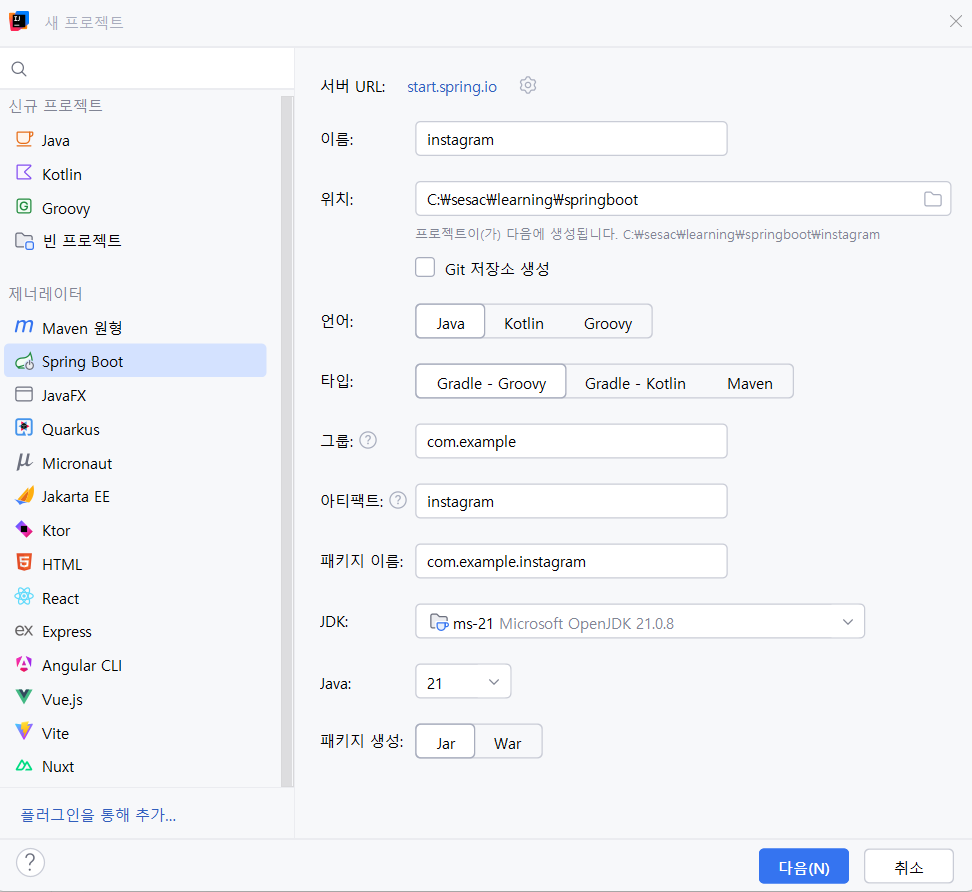

# 11. 인스타그램 - 로그인/회원가입

# 📘 Instagram Clone 정리본 — 로그인/ 회원가입

---

# 1. 📁 프로젝트 생성

Spring Initializr에서 다음과 같이 생성



---

# 2. 📦 프로젝트 종속성(build.gradle)

Thymeleaf Security + layout dialect 포함

```
dependencies {
    implementation 'org.springframework.boot:spring-boot-starter-data-jpa'
    implementation 'org.springframework.boot:spring-boot-starter-security'
    implementation 'org.springframework.boot:spring-boot-starter-thymeleaf'
    implementation 'org.springframework.boot:spring-boot-starter-validation'
    implementation 'org.springframework.boot:spring-boot-starter-web'
    implementation 'org.thymeleaf.extras:thymeleaf-extras-springsecurity6'
    compileOnly 'org.projectlombok:lombok'
    developmentOnly 'org.springframework.boot:spring-boot-devtools'
    runtimeOnly 'com.mysql:mysql-connector-j'
    annotationProcessor 'org.projectlombok:lombok'
    testImplementation 'org.springframework.boot:spring-boot-starter-test'
    testImplementation 'org.springframework.security:spring-security-test'
    testRuntimeOnly 'org.junit.platform:junit-platform-launcher'
    implementation 'nz.net.ultraq.thymeleaf:thymeleaf-layout-dialect'
}
```

---

# 3. 🛢 MySQL 연결 및 DB 생성

Tool은 IntelliJ / DBeaver / Workbench 모두 사용 가능

연결 과정:

1. 데이터베이스 탭 → `+` → `Data Source` → `MySQL`
    
    
    
2. 드라이버 없으면 설치
3. id / pw 입력 → **연결 테스트**
    
    
    

DB 생성:

```sql
CREATE DATABASE **instagram**
DEFAULT CHARACTER SET utf8mb4
COLLATE utf8mb4_unicode_ci;
```


---

# 4. 📡 GitHub Repository 연결

```bash
rm -rf .git   # 기존 git 삭제
git init
git remote add origin https://github.com/qqqkyj/Instagram.git
git add .
git commit -m "project init"
git push origin main
```

---

# 5. ⚙ application.properties 설정

```
spring.application.name=instagram

# MySQL
spring.datasource.url=jdbc:mysql://localhost:3306/instagram?useSSL=false&serverTimezone=Asia/Seoul&characterEncoding=UTF-8&allowPublicKeyRetrieval=true
spring.datasource.username=root
spring.datasource.password=본인비밀번호
spring.datasource.driver-class-name=com.mysql.cj.jdbc.Driver

# JPA
spring.jpa.hibernate.ddl-auto=update
spring.jpa.show-sql=true
spring.jpa.properties.hibernate.format_sql=true
spring.jpa.properties.hibernate.dialect=org.hibernate.dialect.MySQLDialect

# file upload
spring.servlet.multipart.max-file-size=10MB
spring.servlet.multipart.max-request-size=10MB

# upload path
app.upload.dir=uploads
```

---

# 6. 📁 디렉토리 구조 (main 중심)

```
src/main/java/com/example/instagram
├── config
│     └── SecurityConfig.java
├── controller
│     └── AuthController.java
├── dto
│     └── request
│            └── SignUpRequest.java
├── entity
│     ├── BaseEntity.java
│     ├── User.java
│     └── Role.java
├── repository
│     └── UserRepository.java
├── security
│     ├── CustomUserDetails.java
│     └── CustomUserDetailsService.java
└── service
      ├── UserService.java
      └── UserServiceImpl.java
```

📁 **resources/templates**

- layout.html
    
    ```html
    <!DOCTYPE html>
    <html xmlns:th="http://www.thymeleaf.org"
          xmlns:sec="http://www.thymeleaf.org/extras/spring-security"
          xmlns:layout="http://www.ultraq.net.nz/thymeleaf/layout">
    <head>
        <meta charset="UTF-8">
        <meta name="viewport" content="width=device-width, initial-scale=1">
        <title>Instagram</title>
        <link href="https://cdn.jsdelivr.net/npm/bootstrap@5.3.8/dist/css/bootstrap.min.css" rel="stylesheet" integrity="sha384-sRIl4kxILFvY47J16cr9ZwB07vP4J8+LH7qKQnuqkuIAvNWLzeN8tE5YBujZqJLB" crossorigin="anonymous">
        <link rel="stylesheet" href="https://cdn.jsdelivr.net/npm/bootstrap-icons@1.13.1/font/bootstrap-icons.min.css">
    </head>
    <body class="pt-5">
    <!-- 네비게이션 바 -->
    <nav class="navbar navbar-expand-lg navbar-light bg-white border-bottom fixed-top">
        <div class="container">
            <a class="navbar-brand" href="/">Instagram</a>
    
            <div class="d-flex align-items-center">
                <!-- 로그인한 경우 -->
                <div sec:authorize="isAuthenticated()">
                    <a href="/" class="btn btn-outline-secondary me-2">
                        <i class="bi bi-house"></i>
                    </a>
                    <a href="/posts/new" class="btn btn-outline-secondary me-2">
                        <i class="bi bi-plus-square"></i>
                    </a>
                    <a th:href="@{'/users/' + ${#authentication.name}}" class="btn btn-outline-secondary">
                        <i class="bi bi-person"></i>
                    </a>
                </div>
    
                <!-- 로그인하지 않은 경우 -->
                <div sec:authorize="!isAuthenticated()">
                    <a href="/auth/login" class="btn btn-primary me-2">로그인</a>
                    <a href="/auth/signup" class="btn btn-outline-primary">회원가입</a>
                </div>
            </div>
        </div>
    </nav>
    
    <!-- 메인 컨텐츠 -->
    <main class="container mt-4">
        <div layout:fragment="content"></div>
    </main>
    
    <script src="https://cdn.jsdelivr.net/npm/bootstrap@5.3.8/dist/js/bootstrap.bundle.min.js" integrity="sha384-FKyoEForCGlyvwx9Hj09JcYn3nv7wiPVlz7YYwJrWVcXK/BmnVDxM+D2scQbITxI" crossorigin="anonymous"></script>
    </body>
    </html>
    ```
    
- login.html
    
    ```html
    <!DOCTYPE html>
    <html xmlns:th="http://www.thymeleaf.org"
          xmlns:layout="http://www.ultraq.net.nz/thymeleaf/layout"
          layout:decorate="~{layout/layout}">
    <head>
        <title>로그인</title>
    </head>
    <body>
    <div layout:fragment="content">
        <div class="row justify-content-center">
            <div class="col-md-4">
                <div class="card">
                    <div class="card-body">
                        <h3 class="card-title text-center mb-4">Instagram</h3>
    
                        <div th:if="${param.error}" class="alert alert-danger">
                            아이디 또는 비밀번호가 올바르지 않습니다.
                        </div>
    
                        <form th:action="@{/auth/login}" method="post">
                            <div class="mb-3">
                                <input type="text" name="username" class="form-control"
                                       placeholder="사용자명" required>
                            </div>
                            <div class="mb-3">
                                <input type="password" name="password" class="form-control"
                                       placeholder="비밀번호" required>
                            </div>
                            <button type="submit" class="btn btn-primary w-100">로그인</button>
                        </form>
                    </div>
                </div>
    
                <div class="card mt-3">
                    <div class="card-body text-center">
                        계정이 없으신가요? <a href="/auth/signup">회원가입</a>
                    </div>
                </div>
            </div>
        </div>
    </div>
    </body>
    </html>
    ```
    
- signup.html
    
    ```html
    <!DOCTYPE html>
    <html xmlns:th="http://www.thymeleaf.org"
          xmlns:layout="http://www.ultraq.net.nz/thymeleaf/layout"
          layout:decorate="~{layout/layout}">
    <head>
        <title>회원가입</title>
    </head>
    <body>
    <div layout:fragment="content">
        <div class="row justify-content-center">
            <div class="col-md-4">
                <div class="card">
                    <div class="card-body">
                        <h3 class="card-title text-center mb-4">Instagram</h3>
                        <p class="text-center text-muted mb-4">친구들의 사진과 동영상을 보려면 가입하세요.</p>
    
                        <form th:action="@{/auth/signup}" th:object="${signUpRequest}" method="post">
                            <div th:if="${#fields.hasGlobalErrors()}" class="alert alert-danger">
                                <p th:each="err : ${#fields.globalErrors()}" th:text="${err}"></p>
                            </div>
    
                            <div class="mb-3">
                                <input type="email" th:field="*{email}" class="form-control"
                                       placeholder="이메일"
                                       th:classappend="${#fields.hasErrors('email')} ? 'is-invalid'">
                                <div class="invalid-feedback" th:if="${#fields.hasErrors('email')}"
                                     th:errors="*{email}"></div>
                            </div>
                            <div class="mb-3">
                                <input type="text" th:field="*{name}" class="form-control"
                                       placeholder="성명">
                            </div>
                            <div class="mb-3">
                                <input type="text" th:field="*{username}" class="form-control"
                                       placeholder="사용자명"
                                       th:classappend="${#fields.hasErrors('username')} ? 'is-invalid'">
                                <div class="invalid-feedback" th:if="${#fields.hasErrors('username')}"
                                     th:errors="*{username}"></div>
                            </div>
                            <div class="mb-3">
                                <input type="password" th:field="*{password}" class="form-control"
                                       placeholder="비밀번호"
                                       th:classappend="${#fields.hasErrors('password')} ? 'is-invalid'">
                                <div class="invalid-feedback" th:if="${#fields.hasErrors('password')}"
                                     th:errors="*{password}"></div>
                            </div>
                            <button type="submit" class="btn btn-primary w-100">회원가입</button>
                        </form>
                    </div>
                </div>
    
                <div class="card mt-3">
                    <div class="card-body text-center">
                        계정이 있으신가요? <a href="/auth/login">로그인</a>
                    </div>
                </div>
            </div>
        </div>
    </div>
    </body>
    </html>
    ```
    
- home.html
    
    ```html
    <!DOCTYPE html>
    <html xmlns:th="http://www.thymeleaf.org"
          xmlns:sec="http://www.thymeleaf.org/extras/spring-security"
          xmlns:layout="http://www.ultraq.net.nz/thymeleaf/layout"
          layout:decorate="~{layout/layout}">
    <head>
        <title>홈</title>
    </head>
    <body>
    <div layout:fragment="content">
        <!-- 로그인하지 않은 경우 -->
        <div sec:authorize="!isAuthenticated()" class="text-center">
            <h1>Instagram Clone</h1>
            <p class="lead">친구들의 사진과 동영상을 보려면 가입하세요.</p>
            <a href="/auth/signup" class="btn btn-primary btn-lg">회원가입</a>
        </div>
    
        <!-- 로그인한 경우 -->
        <div sec:authorize="isAuthenticated()">
            <div class="row">
                <div class="col-md-8">
                    <div class="card">
                        <div class="card-body text-center text-muted">
                            <p>아직 게시물이 없습니다.</p>
                            <p>팔로우한 사람들의 게시물이 여기에 표시됩니다.</p>
                            <a href="/posts/new" class="btn btn-primary">첫 게시물 작성하기</a>
                        </div>
                    </div>
                </div>
                <div class="col-md-4">
                    <div class="card">
                        <div class="card-body">
                            <h6>환영합니다!</h6>
                            <p class="text-muted mb-0">
                                <span sec:authentication="name"></span>님
                            </p>
                        </div>
                    </div>
                </div>
            </div>
        </div>
    </div>
    </body>
    </html>
    ```
    

```
templates
├── layout
│     └── layout.html
├── auth
│     ├── login.html
│     └── signup.html
└── home.html
```

---

# 7. 🛡 SecurityConfig

```java
@Configuration
@EnableWebSecurity
public class SecurityConfig {

    @Bean
    public SecurityFilterChain securityFilterChain(HttpSecurity http) throws Exception {
        http
            .authorizeHttpRequests(auth -> auth
                    .requestMatchers("/", "/auth/**", "/css/**", "/js/**").permitAll()
                    .anyRequest().authenticated()
            )
            .formLogin(form -> form
                    .loginPage("/auth/login")
                    .loginProcessingUrl("/auth/login")
                    .defaultSuccessUrl("/", true)
                    .failureUrl("/auth/login?error=true")
            )
            .logout(logout -> logout
                    .logoutUrl("/auth/logout")
                    .logoutSuccessUrl("/")
                    .permitAll()
            );

        return http.build();
    }

    @Bean
    public PasswordEncoder passwordEncoder() {
        return new BCryptPasswordEncoder();
    }
}
```

---

# 8. 🧱 공통 레이아웃 (layout.html)

→ **Bootstrap + Thymeleaf Layout Dialect + Spring Security 템플릿**

(전문 그대로 삽입)

*(생략 없이 그대로 유지)*

---

# 9. 📝 회원가입 페이지 (signup.html)

→ Thymeleaf 기반 form + 검증 메시지 표시

(전체 코드 그대로 유지)

---

# 10. ⚙ Thymeleaf Security & Layout Dialect 추가

```
implementation 'org.thymeleaf.extras:thymeleaf-extras-springsecurity6'
implementation 'nz.net.ultraq.thymeleaf:thymeleaf-layout-dialect'
```

---

# 11. 🧩 Entity 구성

## 📌 Role

```java
public enum Role {
    USER, ADMIN
}
```

## 📌 BaseEntity

→ 생성/수정 시간 자동 기록

```java
@Getter
@MappedSuperclass
@EntityListeners(AuditingEntityListener.class)
public class BaseEntity {

    @CreatedDate
    @Column(updatable = false)
    private LocalDateTime createdAt;

    @LastModifiedDate
    private LocalDateTime updatedAt;
}
```

# 📌 @EnableJpaAuditing이 제공하는 대표 기능

| 기능 | 설명 |
| --- | --- |
| @CreatedDate | 엔티티 **처음 저장될 때** 시간 기록 |
| @LastModifiedDate | 엔티티 **update 될 때** 시간 기록 |
| @CreatedBy | 엔티티 생성한 사용자 기록 |
| @LastModifiedBy | 엔티티 수정한 사용자 기록 |
| AuditingEntityListener | 상태 변화 감지 리스너 |

**정리하면:**

👉 "**@EnableJpaAuditing** = 엔티티의 생성·수정 정보 '자동 기록 시스템'을 활성화하는 기능"

→ 생성/수정 시간 자동 기록

```java
@SpringBootApplication
**@EnableJpaAuditing// 해당 어노테이션을 작성하지 않으면 생성, 수정 시간이 null로 들어감** 
public class InstagramApplication {
    public static void main(String[] args) {
        SpringApplication.run(InstagramApplication.class, args);
    }
}
```

## 📌 User Entity

```java
@Getter @Setter
@Entity
@NoArgsConstructor
@Table(name = "users")
public class User extends BaseEntity {

    @Id
    @GeneratedValue(strategy = GenerationType.IDENTITY)
    private long id;

    @Column(nullable = false, unique = true, length = 30)
    private String username;

    @Column(nullable = false, length = 30)
    private String name;

    @Column(nullable = false)
    private String password;

    @Column(nullable = false)
    private String email;

    @Column(nullable = false)
    private Role role;

    @Column(length = 200)
    private String bio;

    @Builder
    public User(String username, String password, String email, Role role, String bio, String name) {
        this.username = username;
        this.password = password;
        this.email = email;
        this.role = role != null ? role : Role.USER;
        this.bio = bio;
        this.name = name;
    }
}
```

---

# 12. 📨 SignUpRequest DTO

```java
@Getter @Setter
public class SignUpRequest {

    @NotBlank(message = "사용자명을 입력해 주세요.")
    @Size(min = 3, max = 20, message = "사용자명은 3 ~20글자까지 가능합니다.")
    private String username;

    @NotBlank(message = "비밀번호를 입력해 주세요.")
    @Size(min = 4, message = "최소 4글자 이상 입력해 주세요.")
    private String password;

    @NotBlank(message = "이메일을 입력해 주세요.")
    @Email
    private String email;

    @NotBlank(message = "이름을 입력해 주세요.")
    private String name;
}
```

---

# 13. 🧭 AuthController

```java
@Controller
@RequestMapping("/auth")
@RequiredArgsConstructor
public class AuthController {

    private final UserService userService;

    @GetMapping("/login")
    public String login() {
        return "auth/login";
    }

    @GetMapping("/signup")
    public String signupForm(Model model) {
        model.addAttribute("signUpRequest", new SignUpRequest());
        return "auth/signup";
    }

    @PostMapping("/signup")
    public String signup(@Valid @ModelAttribute SignUpRequest signUpRequest,
                         BindingResult bindingResult) {

        if (bindingResult.hasErrors()) {
            return "auth/signup";
        }

        // 아이디 중복 검증
        if (userService.existsByUsername(signUpRequest.getUsername())) {
            bindingResult.rejectValue("username", "duplicate", "이미 사용중인 아이디입니다.");
            return "auth/signup";
        }

        userService.register(signUpRequest);
        return "redirect:/auth/login";
    }
}
```

---

# 14. 🧰 UserService & 구현

```java
public interface UserService {
    User register(SignUpRequest signUpRequest);
    boolean existsByUsername(String username);
}
```

### ServiceImpl

```java
@Service
@RequiredArgsConstructor
public class UserServiceImpl implements UserService {

    private final UserRepository userRepository;
    private final PasswordEncoder passwordEncoder;

    @Transactional
    @Override
    public User register(SignUpRequest signUpRequest) {
        User user = User.builder()
                .username(signUpRequest.getUsername())
                .password(passwordEncoder.encode(signUpRequest.getPassword()))
                .email(signUpRequest.getEmail())
                .role(Role.USER)
                .name(signUpRequest.getName())
                .build();

        return userRepository.save(user);
    }

    @Override
    public boolean existsByUsername(String username) {
        return userRepository.findByUsername(username).isPresent();
    }
}
```

---

# 15. 🗂 UserRepository

```java
public interface UserRepository extends JpaRepository<User, Long> {
    Optional<User> findByUsername(String username);
}
```

---

# 16. 🔐 Spring Security — UserDetails & Service

## CustomUserDetails

```java
@RequiredArgsConstructor
public class CustomUserDetails implements UserDetails {

    private final User user;

    @Override
    public Collection<? extends GrantedAuthority> getAuthorities() {
        return List.of(new SimpleGrantedAuthority("ROLE_" + user.getRole()));
    }

    @Override
    public String getPassword() { return user.getPassword(); }

    @Override
    public String getUsername() { return user.getUsername(); }

    @Override
    public boolean isAccountNonExpired() { return true; }

    @Override
    public boolean isAccountNonLocked() { return true; }

    @Override
    public boolean isCredentialsNonExpired() { return true; }

    @Override
    public boolean isEnabled() { return true; }
}
```

## CustomUserDetailsService

```java
@Service
@RequiredArgsConstructor
public class CustomUserDetailsService implements UserDetailsService {

    private final UserRepository userRepository;

    @Override
    public UserDetails loadUserByUsername(String username)
            throws UsernameNotFoundException {

        User user = userRepository.findByUsername(username)
                .orElseThrow(() -> new UsernameNotFoundException(username));

        return new CustomUserDetails(user);
    }
}
```

---

# 17. 🏠 홈 화면 (home.html)

→ 로그인 / 비로그인 상태에 따른 렌더링 분기

(전체 코드 유지)

---

# 18. ✔ 결과 화면

### 🔹 회원가입 폼


### 🔹 동일 아이디(사용자명)로 회원가입


### 🔹 로그인 폼


### 🔹 비로그인 상태 홈 화면


### 🔹 로그인 성공 시 홈 화면

