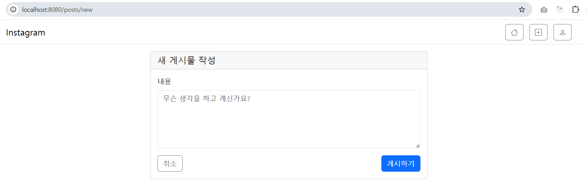

# 12. 인스타그램 - 게시글 생성 및 조회

# ✅ 1. 게시물 작성(POST Create)

## 🔹 **요청 흐름**

```
GET /posts/new → 작성 폼
POST /posts → 게시물 저장
```

---

## 🔹 **1) 게시물 작성 폼 (Thymeleaf)**

✔ `th:object` 로 DTO 바인딩

✔ `th:field`로 값 매핑 + 검증 에러 출력

```html
<form th:action="@{/posts}" th:object="${postCreateRequest}" method="post">
    <textarea th:field="*{content}" ... ></textarea>
    <div th:errors="*{content}"></div>
</form>
```

---

## 🔹 **2) Controller – 폼 제공**

```java
@GetMapping("/new")
public String createForm(Model model) {
    model.addAttribute("postCreateRequest", new PostCreateRequest());
    return "post/form";
}
```



---

## 🔹 **3) DTO – 유효성 검사**

✔ 1~1000자 제한

✔ 빈 값 방지

```java
public class PostCreateRequest {
    @NotBlank(message = "내용을 입력해주세요.")
    @Size(min = 1, max = 1000)
    private String content;
}
```


---

## 🔹 **4) 게시글 저장**

✔ 유효성 실패 시 다시 폼 반환

✔ 로그인 사용자 정보는 `@AuthenticationPrincipal` 로 가져옴

```java
@PostMapping
public String create(@Valid @ModelAttribute PostCreateRequest request,
                     BindingResult bindingResult,
                     @AuthenticationPrincipal CustomUserDetails userDetails) {

    if (bindingResult.hasErrors()) {
        return "post/form";
    }

    postService.create(request, userDetails.getId());
    return "redirect:/";
}
```

---

## 🔹 **5) Service – 엔티티 저장**

```java
@Transactional
public PostResponse create(PostCreateRequest dto, Long userId) {
    User user = userService.findById(userId);

    Post post = Post.builder()
            .content(dto.getContent())
            .user(user)
            .build();

    Post saved = postRepository.save(post);
    return PostResponse.from(saved);
}
```

---

## 🔹 **6) Post 엔티티**

```java
@Entity
@Table(name = "posts")
public class Post extends BaseEntity {
    @Id @GeneratedValue(strategy = GenerationType.IDENTITY)
    private Long id;

    @Column(nullable = false, length = 1000)
    private String content;

    @ManyToOne
    @JoinColumn(name = "user_id", nullable = false)
    private User user;
}
```


---

# ✅ 2. 게시물 상세 조회(POST Detail)

요청 흐름:

```
GET /posts/{id}
```

---

## 🔹 **1) Controller**

```java
@GetMapping("/{id}")
public String detail(@PathVariable Long id, Model model) {
    PostResponse post = postService.getPostById(id);
    model.addAttribute("post", post);
    return "post/detail";
}
```

---

## 🔹 **2) Service**

```java
public PostResponse getPostById(Long id) {
    Post post = postRepository.findById(id)
            .orElseThrow(() -> new IllegalArgumentException("post not found"));
    return PostResponse.from(post);
}
```

---

## 🔹 **3) View – 상세 페이지**

✔ 작성자 표시

✔ 작성 시간 출력

✔ 본인 게시물일 경우만 삭제 버튼 표시

```html
<p th:text="${post.content}"></p>
<p th:text="${#temporals.format(post.createdAt, 'yyyy년 MM월 dd일 HH:mm')}"></p>

<div th:if="${isOwner}">
    <form th:action="@{'/posts/' + ${post.id} + '/delete'}" method="post">
        <button class="btn btn-danger btn-sm">삭제</button>
    </form>
</div>
```


---

# ✅ 3. 전체 게시물 조회(POST List)

요청 흐름:

```
GET /
```

---

## 🔹 **1) HomeController**

```java
@GetMapping("/")
public String home(Model model) {
    List<PostResponse> posts = postService.getAllPosts();
    model.addAttribute("posts", posts);
    return "home";
}
```

---

## 🔹 **2) Service**

```java
public List<PostResponse> getAllPosts() {
    return postRepository.findAllByOrderByCreatedAtDesc()
            .stream()
            .map(PostResponse::from)
            .toList();
}
```

---

## 🔹 **3) Repository**

```java
List<Post> findAllByOrderByCreatedAtDesc();
```

---

## 🔹 **4) View – 홈 피드**

✔ 게시물이 없을 경우 안내

✔ 최신순 출력

✔ 상세 페이지 이동 버튼

```html
<div th:each="post : ${posts}" class="card">
    <a th:text="${post.username}"></a>
    <p th:text="${post.content}"></p>
    <a th:href="@{'/posts/' + ${post.id}}">자세히 보기</a>
</div>
```


---

# 🎯 핵심 요약

| 기능 | 핵심 포인트 |
| --- | --- |
| **게시물 작성** | DTO 검증, 로그인 사용자 ID로 저장 |
| **상세 조회** | PostResponse DTO 변환으로 view 분리 |
| **전체 조회** | 엔티티 리스트 → DTO 리스트 변환 |
| **Thymeleaf** | `th:object`, `th:field`, 에러 출력, Security 태그 사용 |
| **Service 계층 분리** | 컨트롤러는 요청/응답만 담당, 비즈니스 로직은 서비스에서 수행 |