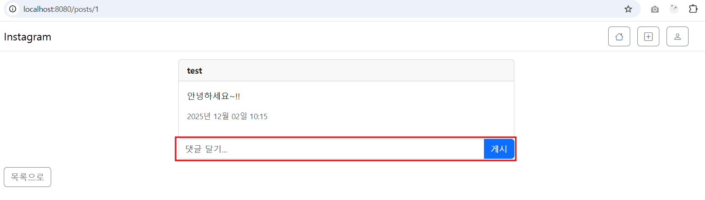

# 3. 인스타그램 - 댓글, 좋아요, 팔로우

# 1. 📄 게시물 상세페이지 — 댓글 기능

## ✅ 1) 댓글 입력 폼 생성



### ✔ detail.html에 댓글 입력 UI 추가

- 로그인한 사용자일 때만 댓글 입력 가능
- `th:object="commentRequest"` 로 바인딩
- 유효성 검증 실패 시 `is-invalid` 처리

📌 **중요 포인트**

- **댓글 입력 검증(@NotBlank, @Size) → 실패 시 기존 화면 유지 필요**
- **BindingResult 오류가 있을 경우 redirect를 하면 안됨 (에러 메시지/입력값 유지 안 됨)**

### ✔ CommentCreateRequest

```java
@Getter @Setter
public class CommentCreateRequest{
    @NotBlank(message = "댓글을 입력해 주세요")
    @Size(max = 500, message = "댓글은 500자 이내로 작성해 주세요")
    private String content;
}
```

### ✔ PostController(detail 페이지)

```java
		//상세페이지
    @GetMapping("/{id}")
    public String detail(@PathVariable Long id, Model model,
                         //현재 로그인한 사용자의 정보
                         @AuthenticationPrincipal CustomUserDetails userDetails) {
        PostResponse post = postService.getPostById(id);
        List<CommentResponse> comments = commentService.getAllCommentsByPostId(id);
        model.addAttribute("post", post);
        model.addAttribute("commentRequest", new CommentCreateRequest());
        model.addAttribute("comments", comments);
        model.addAttribute("liked", likeService.isLiked(id,userDetails.getId()));
        model.addAttribute("likeCount", likeService.getLikeCount(id));
        return "post/detail";
    }
```

---

## ✅ 2) 댓글 생성


### ✔ PostController

```java
@PostMapping("/{postId}/comments")
    public String createComment(@PathVariable Long postId,
                                @Valid @ModelAttribute("commentRequest") CommentCreateRequest commentCreateRequest,
                                BindingResult bindingResult,
                                //세션을 통해 현재 로그인한 사용자 정보
                                @AuthenticationPrincipal CustomUserDetails userDetails,
                                Model model) {
        // 오류 발생시 redirection을 하지 않고 model에 담는 이유
        //오류가 있는 상태에서는 validation 메시지나 사용자가 입력한 값이 Model에 남음
        //redirect: 하면 새 요청이 되므로 BindingResult 정보가 모두 사라짐.
        if (bindingResult.hasErrors()) {
            PostResponse post = postService.getPostById(postId);
            List<CommentResponse> comments=commentService.getAllCommentsByPostId(postId);
            model.addAttribute("post", post);
            model.addAttribute("comments", comments);
            return "post/detail";
        }

        commentService.create(postId, commentCreateRequest, userDetails.getId());
        return "redirect:/posts/"+postId;
    }
```

📌 **중요 포인트**

- **유효성 오류 발생 시 redirect ❌ → 같은 detail 페이지 다시 렌더링해야 함**
- 오류 시 post, comments 다시 Model에 담아줘야 함

### ✔ CommentServiceImpl

- post, user 조회 후 Comment 생성 → 저장
- CommentResponse 로 DTO 변환

---

## ✅ 3) 댓글 목록 조회


### ✔ CommentServiceImpl

```java
		//댓글 전체 조회
    @Override
    public List<CommentResponse> getAllCommentsByPostId(Long postId) {
        return commentRepository.findAllByPostIdOrderByCreatedAtDesc(postId)
                .stream()
                .map(CommentResponse::from)
                .toList();
    }
```

📌 **최신 댓글이 위로 오도록 정렬**

### ✔ PostController(detail)

```java
List<CommentResponse> comments = commentService.getAllCommentsByPostId(id);
```

---

# 2. ❤️ 좋아요 기능


## ✔ UI(detail.html)

- 좋아요 버튼: heart-fill / heart 아이콘 토글
- 좋아요 개수 표시

📌 **중요 포인트**

- 좋아요 여부 변수: `liked`
- 좋아요 개수 변수: `likeCount`
- 로그인하지 않은 경우 좋아요 버튼 숨김

---

## ✔ PostController — 좋아요 토글

```java
		//좋아요 기능
    @PostMapping("/{id}/like")
    public String toggleLike(@PathVariable Long id,
                             @AuthenticationPrincipal CustomUserDetails userDetails) {
        likeService.toggleLike(id, userDetails.getId());
        return "redirect:/posts/"+id;
    }
```

## ✔ LikeServiceImpl

📌 **핵심 로직**

- `existsByPostIdAndUserId` 로 좋아요 여부 확인
- 존재하면 → 삭제
- 없으면 → 생성

---

## ✔ LikeRepository

```java
public interface LikeRepository extends JpaRepository<Like, Long> {
    Optional<Like> findByPostIdAndUserId(Long postId, Long userId);
    boolean existsByPostIdAndUserId(Long postId, Long userId);
    long countByPostId(Long postId);
}
```

📌 **중요 포인트**

- 좋아요는 단순 토글 형태
- **별도의 DTO 없이 엔티티로 처리 가능**

---

# 3. 🚪 로그아웃 기능


## ✔ layout.html

```html
								<!--로그아웃-->
                <form th:action="@{/auth/logout}" method="post" class="d-inline">
                    <button type="submit" class="btn btn-outline-secondary">
                        <i class="bi bi-box-arrow-right"></i>
                    </button>
                </form>
```

📌 **Spring Security는 GET 로그아웃을 허용하지 않으므로 POST로 처리해야 함**

---

# 4. 👤 사용자 프로필 페이지


## ✔ profile.html 구성 요소

- 사용자 정보(프로필 사진 / 이름 / bio)
- 게시물 목록
- 팔로우/팔로잉/게시물 수
- 다른 사용자면 “팔로우/언팔로우” 버튼

---

## ✔ UserController

```java
		//사용자 프로필
    @GetMapping("/{username}")
    public String profile(@PathVariable String username,//내가 팔로우 하려는 사용자
                          Model model,
                          //나(현재 로그인한 사용자)
                          @AuthenticationPrincipal CustomUserDetails userDetails) {
        ProfileResponse profile = userService.getProfile(username);
        List<PostResponse> posts = postService.getPostsByUsername(username);
        boolean isFollowing = followService.isFollowing(
	        userDetails.getId(), profile.getId()
	       );

        model.addAttribute("profile", profile);
        model.addAttribute("posts", posts);
        model.addAttribute("isFollowing", isFollowing);
        return "user/profile";
    }
```

📌 **현재 로그인한 사용자와 프로필 사용자가 같은지 판단 필요(isOwner)**

📌 **팔로우 여부를 서비스에서 조회하여 isFollowing 전달**

---

## ✔ ProfileResponse

- 사용자 정보
- 게시물 수
- 팔로워 수
- 팔로잉 수

---

## ✔ UserServiceImpl

프로필 조회 시 통계 포함:

```java
		//private final PostService postService; //순환 참조 오류 발생
		//private final FollowService followService; //순환 참조 오류 발생
    private final FollowRepository followRepository;
    private final PostRepository postRepository;
    
		@Override
    public ProfileResponse getProfile(String username) {
        User user = userRepository.findByUsername(username)
	        .orElseThrow(() -> new IllegalArgumentException("User not found"));
        long postCount = postRepository.countByUserId(user.getId());
        long followerCount = followRepository.countByFollowerId(user.getId());
        long followingCount = followRepository.countByFollowingId(user.getId());
        return ProfileResponse.from(user, postCount, followerCount, followingCount);
    }
```

📌 **중요 포인트**

- count 조회를 위해 PostService/FollowService 사용 시 **순환 참조 발생 → Repository 직접 주입**
- 순환 참조는 구조적으로 흔히 발생하는 문제 → Repository 사용으로 해결 가능

---

# 5. ➕ 사용자 팔로우 기능


## ✔ FollowController

```java
		//팔로우
    @PostMapping("/{username}/follow")
    public String toggleFollow(@PathVariable String username,//following
                               //현재 로그인한 사용자(follower)
                               @AuthenticationPrincipal CustomUserDetails userDetails){

        followService.toggleFollow(userDetails.getId(), username);
        return "redirect:/users/" + username;
    }
```

## ✔ Follow 엔티티

- follower(나를 팔로우 하는 사람)
- following(내가 팔로우 당하는 사람)

---

## ✔ FollowServiceImpl — 토글 구현

📌 **핵심 포인트**

```java
		@Transactional
    @Override
    public void toggleFollow(Long followerId, String followingUsername) {
        User follower = userService.findById(followerId);
        User following = userService.findByUsername(followingUsername);
        //자기 자신 팔로우 방지
        if(follower.getId() == following.getId()){
            throw new RuntimeException("자기 자신은 팔로우 할 수 없습니다.");
        }
        //팔로우 토글
        Optional<Follow> existingFollow = followRepository
                .findByFollowerIdAndFollowingId(follower.getId(), following.getId());
        if(existingFollow.isPresent()){
            followRepository.delete(existingFollow.get());
        }
        else{
            Follow follow = Follow.builder()
                    .follower(follower)
                    .following(following)
                    .build();
            followRepository.save(follow);
        }
    }
    
    @Override
    public boolean isFollowing(Long followerId, Long followingId) {
        return followRepository.existsByFollowerIdAndFollowingId(
        followerId, followingId);
    }

    @Override
    public long countByFollowerId(Long followerId) {
        return followRepository.countByFollowerId(followerId);
    }

    @Override
    public long countByFollowingId(Long followingId) {
        return followRepository.countByFollowingId(followingId);
    }
```

📌 **자기 자신 팔로우 방지 로직 포함**

---

## ✔ FollowRepository

```java
public interface FollowRepository extends JpaRepository<Follow, Long> {
    Optional<Follow> findByFollowerIdAndFollowingId(Long followerId, Long followingId);
    boolean existsByFollowerIdAndFollowingId(Long followerId, Long followingId);
    long countByFollowerId(Long followerId);
    long countByFollowingId(Long followingId);
}
```

---

# 🔥 핵심 요약(진짜 중요한 부분만)

### ✅ 댓글

- **Validation 실패 시 redirect 금지 → Model 다시 채워서 같은 페이지 렌더링**
- 댓글 목록/생성/삭제 전체 기능 구현

### ✅ 좋아요

- **좋아요 토글 = 존재여부 체크 후 생성/삭제**
- 좋아요 여부/개수는 Controller에서 전달

### ✅ 프로필

- 자신의 프로필인지 여부 체크
- 게시물/팔로워/팔로잉 카운트 표시
- **순환 참조 해결 → Repository 직접 주입**

### ✅ 팔로우

- **토글 방식 구현**
- 자기 자신 팔로우 방지
- 프로필 화면에서 "팔로우/팔로잉" 표시

### ✅ 로그인 / 로그아웃

- 로그아웃은 반드시 **POST 요청**