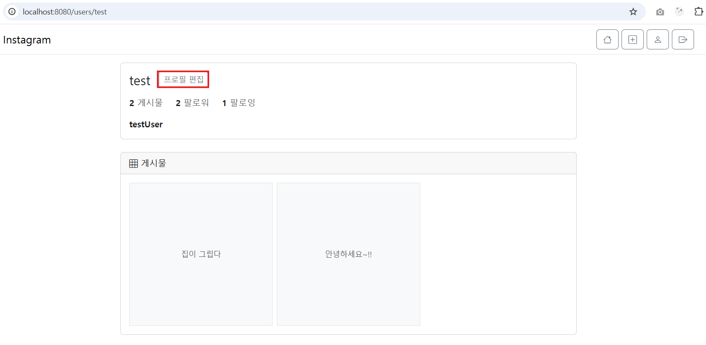

# 4. 인스타그램 - 프로필, 파일 업로드

# 📌 프로필 조회, 프로필 수정, 1+N 문제, 파일 업로드

---

# 1. 📍 팔로워 / 팔로잉 로직 정리

### ✔ 프로필 조회 서비스 (`UserService.getProfile`)

```java
@Override
public ProfileResponse getProfile(String username) {
    User user = userRepository.findByUsername(username)
            .orElseThrow(() -> new IllegalArgumentException("User not found"));

    long postCount = postRepository.countByUserId(user.getId());
    long followerCount = followRepository.countByFollowingId(user.getId()); // 나를 팔로우하는 사람 수
    long followingCount = followRepository.countByFollowerId(user.getId()); // 내가 팔로우하는 사람 수

    return ProfileResponse.from(user, postCount, followerCount, followingCount);
}
```

### 🧾 용어 설명

- **follower** : 나를 팔로우하는 사람들
- **following** : 내가 팔로우한 사람들

---

# 2. 📍 1+N 문제 해결 — `@EntityGraph` + `FetchType.LAZY`

### 문제점

Post 조회 시 User까지 필요하지 않으면 굳이 즉시 로딩할 필요 없음 → `LAZY`

하지만 화면에서 User 정보가 필요할 때는 N+1 발생.

### 해결

`@EntityGraph`를 사용해 **특정 메서드에서만 필요한 경우에 조인하기**

```java
@EntityGraph(attributePaths = {"user"})
List<Post> findAllByOrderByCreatedAtDesc();
```

→ Post 조회하면서 user도 한 번에 조인해 가져옴 (쿼리 최적화)

---

# 3. 📍 프로필 수정 (자기 프로필일 경우만)



### `UserController`에서 owner 여부 판별

```java
boolean isOwner = userDetails.getUsername().equals(username);
```

→ 본인 프로필이면 "프로필 편집" 버튼 활성화.

---

# 4. 📍 프로필 수정 폼 구성


### 👉 `UserResponse` DTO

```java
@Getter
@Builder
public class UserResponse {
    private Long id;
    private String name;
    private String email;
    private String bio;
    private String username;
    private String profileImageUrl;

    public static UserResponse from(User user) {
        return UserResponse.builder()
                .id(user.getId())
                .name(user.getName())
                .username(user.getUsername())
                .email(user.getEmail())
                .bio(user.getBio())
                .profileImageUrl(user.getProfileImageUrl())
                .build();
    }
}
```

### 👉 `ProfileUpdateRequest` DTO

```java
@Getter @Setter
@NoArgsConstructor
public class ProfileUpdateRequest {
    @Size(max = 50)
    private String name;

    @Size(max = 200)
    private String bio;
}
```

---

### 👉 GET /profile/edit

```java
@GetMapping("/edit")
public String editForm(Model model, @AuthenticationPrincipal CustomUserDetails userDetails) {
    UserResponse currentUser = userService.getUserById(userDetails.getId());

    ProfileUpdateRequest form = new ProfileUpdateRequest();
    form.setBio(currentUser.getBio());
    form.setName(currentUser.getName());

    model.addAttribute("profileUpdateRequest", form);
    model.addAttribute("currentUser", currentUser);
    return "profile/edit";
}
```

---

### 👉 POST /profile/edit (유효성 포함)

```java
@PostMapping("/edit")
public String edit(@Valid @ModelAttribute ProfileUpdateRequest profileUpdateRequest,
                   BindingResult bindingResult,
                   @AuthenticationPrincipal CustomUserDetails userDetails,
                   Model model) {

    if(bindingResult.hasErrors()){
        model.addAttribute("currentUser",
                userService.getUserById(userDetails.getId()));
        return "profile/edit";
    }

    userService.updateProfile(userDetails.getId(), profileUpdateRequest);
    return "redirect:/users/" + userDetails.getUsername();
}
```

⚠ **중요**

**`BindingResult`는 반드시 `@Valid` 바로 뒤에 위치해야 한다.**

---

### 👉 실제 서비스 로직

```java
@Override
@Transactional
public void updateProfile(Long id, ProfileUpdateRequest profileUpdateRequest) {
    User user = findById(id);
    user.updateProfile(
        profileUpdateRequest.getName(),
        profileUpdateRequest.getBio()
    );
    userRepository.save(user);
}
```

---

# 5. 📍 홈 화면 — 좋아요/댓글 count 표시


### ✔ 컨트롤러

```java
@GetMapping("/")
public String home(Model model) {
    List<PostResponse> posts = postService.getAllPostsWithStats();
    model.addAttribute("posts", posts);
    return "home";
}
```

### ✔ 서비스

```java
@Override
public List<PostResponse> getAllPostsWithStats() {
    return postRepository.findAllByOrderByCreatedAtDesc().stream()
            .map(post -> {
                long likeCount = likeRepository.countByPostId(post.getId());
                long commentCount = commentRepository.countByPostId(post.getId());
                return PostResponse.from(post, commentCount, likeCount);
            })
            .toList();
}
```

---

---

# 6. 🚨 문제 발생 — 다량의 쿼리(1+N) 실행

대량의 게시글 조회 → 게시글마다 User 조회 → 좋아요 count 조회 → 댓글 count 조회

👉 **쿼리가 너무 많이 실행됨**

### 해결

- `@EntityGraph`로 User 조인
- 좋아요/댓글 조회는 repository에서 count 쿼리 1번만

---

# 7. 📸 파일 업로드 기능 (핵심 정리)

이 부분 오늘의 핵심!

전체 흐름은 다음과 같다.

### 📌 **파일 업로드 전체 흐름**

1. HTML `<form enctype="multipart/form-data">` 설정
2. Controller에서 `MultipartFile` 받기
3. FileService에서 실제 파일 저장
4. 저장된 파일명으로 DB에 URL 저장
5. WebConfig에서 업로드 폴더를 정적 리소스로 매핑
6. 화면에서 이미지 출력


---

## ✔ 1) application.properties 설정

```
spring.servlet.multipart.max-file-size=10MB
spring.servlet.multipart.max-request-size=10MB

file.upload-dir=uploads
```

---

## ✔ 2) HTML Form 설정 — 사진 업로드 Field 추가

```html
<form enctype="multipart/form-data"
      th:action="@{/posts}"
      th:object="${postCreateRequest}"
      method="post">

    <div class="mb-3">
        <label for="image">이미지</label>
        <input type="file" id="image" name="image"
               class="form-control" accept="image/*">
    </div>
</form>
```

---

## ✔ 3) PostController — MultipartFile 받기

```java
@PostMapping
public String create(@Valid @ModelAttribute PostCreateRequest postCreateRequest,
                     BindingResult bindingResult,
                     @AuthenticationPrincipal CustomUserDetails userDetails,
                     @RequestParam(value = "image", required = false) MultipartFile image) {

    if (bindingResult.hasErrors()) {
        return "post/form";
    }

    postService.create(postCreateRequest, image, userDetails.getId());
    return "redirect:/";
}
```

---

## ✔ 4) FileService — 실제 파일 저장 로직

```java
public class FileServiceImpl implements FileService {

    @Value("${file.upload-dir}")
    private String uploadDir;

    private static final List<String> ALLOWED = Arrays.asList("jpg","jpeg","png","gif","bmp");

    @Override
    public String saveFile(MultipartFile file) {
        try {
            if (file == null || file.isEmpty()) {
                return null;
            }

            String originalName = file.getOriginalFilename();
            String extension = getExt(originalName);

            if(!ALLOWED.contains(extension.toLowerCase())) {
                throw new RuntimeException("Invalid file extension");
            }

            Path uploadPath = Paths.get(uploadDir);

            if(Files.notExists(uploadPath)) {
                Files.createDirectories(uploadPath);
            }

            String savedFileName = UUID.randomUUID() + "." + extension;
            Path filePath = uploadPath.resolve(savedFileName);

            Files.copy(file.getInputStream(), filePath);

            return savedFileName;

        } catch (IOException e) {
            throw new RuntimeException("파일 저장 실패: " + e.getMessage());
        }
    }

    private String getExt(String fileName) {
        return fileName.substring(fileName.lastIndexOf(".") + 1);
    }
}
```

---

## ✔ 5) WebConfig — 업로드 폴더 static 리소스 등록

```java
@Configuration
public class WebConfig implements WebMvcConfigurer {

    @Value("${file.upload-dir}")
    private String uploadDir;

    @Override
    public void addResourceHandlers(ResourceHandlerRegistry registry) {
        String path = Paths.get(uploadDir).toAbsolutePath().toUri().toString();
        registry.addResourceHandler("/" + uploadDir + "/**")
                .addResourceLocations(path);
    }
}
```

---

## ✔ 6) SecurityConfig — 업로드 폴더 접근 허용

```java
.requestMatchers("/", "/auth/**","/css/**","/js/**","/" + uploadDir + "/**").permitAll()
```

---

## ✔ 7) Post 엔티티에 imageUrl 추가

```java
@Column(name="image_url")
private String imageUrl;
```

---

## ✔ 8) PostService — DB 저장 시 이미지 URL 저장

```java
@Override
@Transactional
public PostResponse create(PostCreateRequest request,
                           MultipartFile image,
                           Long userId) {

    User user = userService.findById(userId);

    String imageUrl = null;
    if(image != null && !image.isEmpty()) {
        String fileName = fileService.saveFile(image);
        imageUrl = "/" + uploadDir + "/" + fileName;
    }

    Post post = Post.builder()
            .content(request.getContent())
            .user(user)
            .imageUrl(imageUrl)
            .build();

    Post saved = postRepository.save(post);
    return PostResponse.from(saved);
}
```

---

## ✔ 9) .gitignore — uploads 제외

```
uploads/
```

---

---

# 8. ✔ 화면에 이미지 출력

### home.html


```html

```

### user.profile.html


```html

```

---

# 📌 마무리 요약

| 기능 | 핵심 포인트 |
| --- | --- |
| 프로필 조회 | follower / following count 정확히 구분 |
| 1+N 문제 | `@EntityGraph`로 필요한 시점에만 조인 |
| 프로필 수정 | GET 폼 + POST 유효성 검증 + updateProfile 메서드 |
| 홈 화면 | 좋아요/댓글 count 표시 (count 쿼리 사용) |
| 파일 업로드 | multipart 설정 → FileService 저장 → DB URL 저장 → WebConfig 매핑 → HTML 출력 |