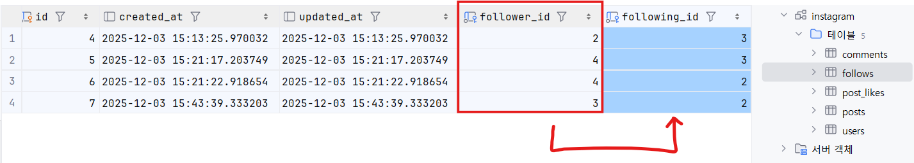

# 5. 인스타그램 - 무한스크롤, 검색, 예외처리

# 📌 무한 스크롤, REST API, 피드/탐색/검색, 예외 처리

---

# 1. 📍 무한 스크롤 구현 (Slice 활용)

## ✔ PostRepository – 무한 스크롤 주요 쿼리

```java
// 피드 조회 (내가 팔로우한 사용자)
@Query("""
    SELECT p
    FROM Post p
    JOIN FETCH p.user
    WHERE p.user.id IN :userIds
    ORDER BY p.createdAt DESC""")
Slice<Post> findFeedPostsByUserIds(@Param("userIds") List<Long> userIds, Pageable pageable);

// 전체 게시물 조회
@Query("SELECT p FROM Post p JOIN FETCH p.user ORDER BY p.createdAt DESC")
Slice<Post> findAllWithUserPaging(Pageable pageable);
```



## ✔ FollowRepository – 팔로우 목록 조회

```java
@Query("SELECT f.following.id FROM Follow f WHERE f.follower.id = :followerId")
List<Long> findFollowingIdsByFollowerId(@Param("followerId") Long followerId);
```

## ✔ PostServiceImpl – Slice 기반 페이징 처리

### 🔹 피드 조회

```java
@Override
public Slice<PostResponse> getFeedPosts(Long userId, Pageable pageable) {
    List<Long> followingIds = followRepository.findFollowingIdsByFollowerId(userId);
    Slice<Post> posts = postRepository.findFeedPostsByUserIds(followingIds, pageable);

    List<PostResponse> content = posts.getContent().stream()
            .map(post -> {
                long likeCount = likeRepository.countByPostId(post.getId());
                long commentCount = commentRepository.countByPostId(post.getId());
                return PostResponse.from(post, commentCount, likeCount);
            })
            .toList();

    return new SliceImpl<>(content, pageable, posts.hasNext());
}
```

내가 팔로우하는 사용자들의 게시물만 피드에 표시


팔로우하는 사용자가 없는 경우


### 🔹 전체 게시물 페이징

```java
@Override
public Slice<PostResponse> getAllPostsPaging(Pageable pageable) {
    Slice<Post> posts = postRepository.findAllWithUserPaging(pageable);

    List<PostResponse> content = posts.getContent().stream()
            .map(post -> {
                long likeCount = likeRepository.countByPostId(post.getId());
                long commentCount = commentRepository.countByPostId(post.getId());
                return PostResponse.from(post, commentCount, likeCount);
            })
            .toList();

    return new SliceImpl<>(content, pageable, posts.hasNext());
}
```

---

# 2. 📍 REST API

## ✔ PostApiController

```java
@RestController
@RequestMapping("/api")
@RequiredArgsConstructor
public class PostApiController {

    private final PostService postService;

    @GetMapping("/feed") //피드 조회
    public Slice<PostResponse> getFeed(@AuthenticationPrincipal CustomUserDetails userDetails,
                                       @PageableDefault(size = 5) Pageable pageable){
        return postService.getFeedPosts(userDetails.getId(), pageable);
    }

    @GetMapping("/explore") //피드 탐색(전체 게시물 조회)
    public Slice<PostResponse> getExplore(@PageableDefault(size = 12) Pageable pageable){
        return postService.getAllPostsPaging(pageable);
    }
}
```

---

# 3. 📍 홈 화면 (home.html)

- 로그인 여부에 따라 **피드 노출 / 안내 메시지** 분기
- 무한스크롤을 위한 `IntersectionObserver` 사용
- 좋아요 토글 기능 포함

### 🔥 핵심: 무한스크롤 로직

```jsx
const observer = new IntersectionObserver((entries) => {
    entries.forEach(entry => {
        if (entry.isIntersecting) {
            loadPosts();
        }
    });
}, { rootMargin: '100px' });

observer.observe(scrollTrigger);
loadPosts();
```

*(전체 HTML은 노션에서 접을 수 있게 “코드 블록”으로 넣기 추천)*

---

# 4. 📍 Explore 페이지 (explore.html)


- 전체 게시물을 3열 그리드로 노출
- Slice 기반 무한스크롤

### 🔥 핵심: 게시물 로딩

```jsx
const response = await fetch(`/api/explore?page=${currentPage}&size=12`);
const data = await response.json();

data.content.forEach(post => {
    container.insertAdjacentHTML('beforeend', createPostHTML(post));
});
```

---

# 5. 📍 검색 기능 (사용자 + 게시물)


## ✔ SearchApiController

```java
@RestController
@RequestMapping("/api/search")
@RequiredArgsConstructor
public class SearchApiController {

    private final UserService userService;
    private final PostService postService;

    @GetMapping("/users")
    public List<UserResponse> searchUsers(@RequestParam String q){
        return userService.searchUsers(q.trim());
    }

    @GetMapping("/posts")
    public Slice<PostResponse> searchPosts(@RequestParam String q,
                                           @PageableDefault(size = 12) Pageable pageable){
        return postService.searchPosts(q.trim(), pageable);
    }
}
```

## ✔ UserRepository – 사용자 검색


```java
@Query("SELECT u FROM User u WHERE u.username LIKE %:keyword% OR u.name LIKE %:keyword%")
List<User> searchByKeyword(@Param("keyword") String keyword);
```

## ✔ PostRepository – 게시물 검색


```java
@Query("""
    SELECT p FROM Post p
    JOIN FETCH p.user
    WHERE p.content LIKE %:keyword%
    ORDER BY p.createdAt DESC
""")
Slice<Post> searchByKeyword(@Param("keyword") String keyword, Pageable pageable);
```

## ✔ Search – 클라이언트 무한스크롤

```jsx
postsObserver = new IntersectionObserver((entries) => {
    entries.forEach(entry => {
        if (entry.isIntersecting && postsTab.style.display !== 'none') {
            loadPosts();
        }
    });
}, { rootMargin: '100px' });

postsObserver.observe(postsScrollTrigger);
```

---

# 6. 📍 예외 처리 (BusinessException 기반)

## ✔ ErrorCode (enum)

```java
@Getter
@RequiredArgsConstructor
public enum ErrorCode {
    SELF_FOLLOW(HttpStatus.BAD_REQUEST, "자기 자신은 팔로우 할 수 없습니다."),
    INVALID_FILE_TYPE(HttpStatus.BAD_REQUEST, "허용되지 않는 파일 형식입니다."),
    USER_NOT_FOUND(HttpStatus.NOT_FOUND, "사용자를 찾을수 없습니다."),
    POST_NOT_FOUND(HttpStatus.NOT_FOUND, "게시물을 찾을수 없습니다.");

    private final HttpStatus httpStatus;
    private final String message;
}
```

## ✔ BusinessException

```java
@Getter
public class BusinessException extends Exception {
    private final ErrorCode errorCode;

    public BusinessException(ErrorCode errorCode) {
        super(errorCode.getMessage());
        this.errorCode = errorCode;
    }
}
```

## ✔ GlobalExceptionHandler

```java
@ExceptionHandler(BusinessException.class)
public String handleBusinessException(BusinessException ex, Model model) {
    ErrorCode errorCode = ex.getErrorCode();
    model.addAttribute("message", errorCode.getMessage());

    return switch (errorCode.getHttpStatus()) {
        case NOT_FOUND -> "error/404";
        case BAD_REQUEST -> "error/400";
        default -> "error/500";
    };
}

@ExceptionHandler(MaxUploadSizeExceededException.class)
public String handleMaxUploadSizeExceededException(MaxUploadSizeExceededException ex, Model model) {
    model.addAttribute("message", "파일크기가 10MB를 초과했습니다.");
    return "error/400";
}
```

## ✔ Service 계층에서의 예외 적용

```java
// UserServiceImpl
public User findById(Long id) {
    return userRepository.findById(id)
        .orElseThrow(() -> new BusinessException(ErrorCode.USER_NOT_FOUND));
}

// FollowServiceImpl
if (follower.getId() == following.getId()) {
    throw new BusinessException(ErrorCode.SELF_FOLLOW);
}

// PostServiceImpl
Post post = postRepository.findById(id)
    .orElseThrow(() -> new BusinessException(ErrorCode.POST_NOT_FOUND));

// FileServiceImpl
if (!ALLOWED_EXTENSIONS.contains(extension.toLowerCase())) {
    throw new BusinessException(ErrorCode.INVALID_FILE_TYPE);
}
```

---

# 7. 📍 에러 페이지(400/404/500)

- `error/400.html`
    
    
    
- `error/404.html`
    
    
    
- `error/500.html`
    
    
    

각 페이지는 Bootstrap 기반으로 구성

(*필요 시 전체 코드 그대로 붙여넣을 수 있게 모두 포함되어 있음*)

SecurityConfig에서

```
"/error/**" → permitAll()
```

추가 필요.

---

# ✔ 오늘 구현한 주요 기능 총정리

| 기능 | 구현 포인트 | 기술 |
| --- | --- | --- |
| 무한스크롤 피드 | Slice + IntersectionObserver | Spring Data JPA, JS |
| 전체 게시물 탐색 | 3열 그리드 무한스크롤 | Slice |
| 검색 기능 | 사용자 + 게시물 검색, 게시물 검색은 무한스크롤 | Pageable |
| 비즈니스 예외 처리 | BusinessException + ErrorCode | GlobalExceptionHandler |
| HTTP 에러 페이지 | 400/404/500 페이지 커스터마이징 | Spring MVC |