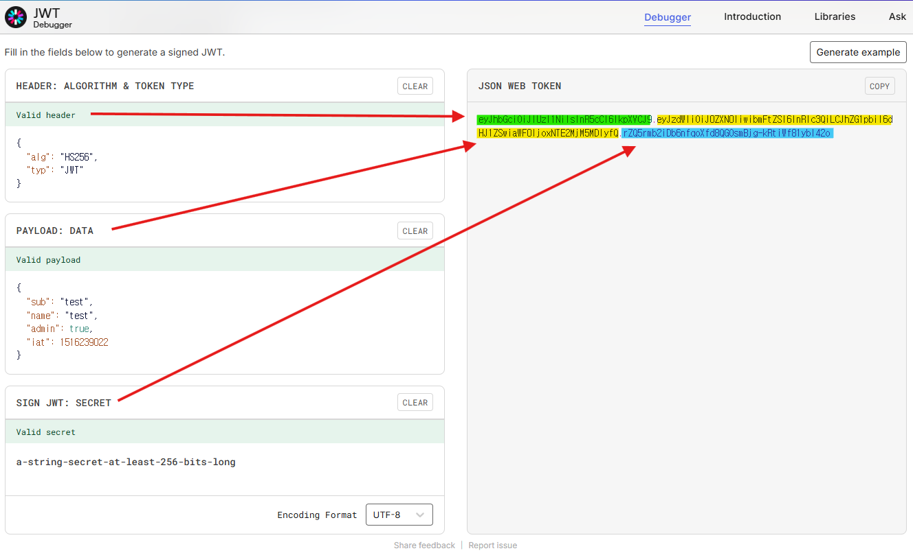

# 1. REST API - JWT(회원가입/로그인)

# ✅ 1. 세션(Session) 방식 vs JWT 방식

## 🔹 세션(Session) 인증 방식

### ✔ 흐름

1. 클라이언트가 `ID/PW` 전송
2. 서버가 DB에서 사용자 확인
3. 서버가 **세션 생성 후 서버 측 저장**
4. 브라우저에는 **세션 ID(cookie)** 만 전달
5. 요청마다 서버가 쿠키에 담긴 세션 ID를 검증 → 로그인 상태 판단

### ✔ 특징

- 서버가 세션을 직접 보관해야 함(메모리/Redis)
- 서버 확장 시 Sticky Session 또는 세션 공유 필요

---

## 🔹 JWT(Json Web Token) 인증 방식

### ✔ 흐름

1. 클라이언트가 `ID/PW` 전송
2. 서버에서 사용자 확인 후 **JWT 발급**
3. JWT는 **서버에 저장하지 않음**, 클라이언트 보관
4. 요청 시 헤더에 `Authorization: Bearer <token>`
5. 서버는 signature 검증만 수행 → 인증 완료

### ✔ JWT 구조

```
header.payload.signature
```

- `header` + `payload`는 **BASE64 인코딩 → 복호화 가능**
- 민감 정보 금지
- `signature` 검증(SECRET KEY)으로 위변조 판별

[https://www.jwt.io/](https://www.jwt.io/) [참고 사이트]



### ✔ 장점

- 서버 상태 저장 X → 확장에 유리
- 분산 환경(마이크로서비스) 적합

---

# ✅ 2. JJWT 설정

### 📌 build.gradle

```java
implementation 'io.jsonwebtoken:jjwt-api:0.13.0'
runtimeOnly 'io.jsonwebtoken:jjwt-impl:0.13.0'
runtimeOnly 'io.jsonwebtoken:jjwt-jackson:0.13.0'
```

### 📌 application.properties

```
# JWT config
jwt.secret=b80633f4769d5e6886b91284965c3902e4ed837b801bfdd0e5f7ca0377176358
jwt.expiration=86400000  # 24시간
```

SECRET는 **256bits 이상** 권장 → [https://jwtsecrets.com/](https://jwtsecrets.com/)

---

# ✅ 3. JwtProvider — 토큰 생성 & 검증 핵심 로직

- postman 사용
- Variables > base_url | [http://localhost:8080/api](http://localhost:8080/api) 등록


```java
@Component
public class JwtProvider {

    @Value("${jwt.secret}")
    private String secretString;

    @Value("${jwt.expiration}")
    private long expiration;

    private SecretKey secretKey;

    // Bean 초기화 시점에 secretString을 SecretKey 객체로 변환
    @PostConstruct
    public void init() {
        this.secretKey = hmacShaKeyFor(secretString.getBytes());
    }

    /**
     * JWT 생성
     * - payload에 username(sub) 저장
     * - iat(발급시간) / exp(만료시간) 자동 포함
     */
    public String createToken(String username) {
        Date now = new Date();
        return Jwts.builder()
                .subject(username)
                .issuedAt(now)
                .expiration(new Date(now.getTime() + expiration))
                .signWith(secretKey) // HS256 서명
                .compact();
    }

    /**
     * 내부적으로 Claims 파싱
     * - Signature 검증 포함
     */
    private Claims getClaims(String token) {
        return Jwts.parser()
                .verifyWith(secretKey)
                .build()
                .parseSignedClaims(token)
                .getPayload();
    }

    // JWT에서 username(sub) 추출
    public String getUsername(String token) {
        return getClaims(token).getSubject();
    }

    /**
     * 토큰 유효성 검증
     * - Expired / Malformed / Signature invalid 등 처리
     */
    public boolean validateToken(String token) {
        try {
            getClaims(token);
            return true;
        } catch (JwtException | IllegalArgumentException e) {
            return false;
        }
    }
}

```

---

# ✅ 4. JWT 필터 — 요청 시 토큰 인증 처리

## JwtAuthenticationFilter

```java
@Component
@RequiredArgsConstructor
public class JwtAuthenticationFilter extends OncePerRequestFilter {

    private final JwtProvider jwtProvider;
    private final UserDetailsService userDetailsService;

    /**
     * 모든 요청 전에 실행되는 필터
     * → 요청 헤더에서 JWT 확인 및 인증 수행
     */
    @Override
    protected void doFilterInternal(
            HttpServletRequest request,
            HttpServletResponse response,
            FilterChain filterChain
    ) throws ServletException, IOException {

        try {
            // 1. Authorization 헤더에서 JWT 추출
            String token = resolveToken(request);

            // 2. 토큰 유효성 검사
            if (StringUtils.hasText(token) && jwtProvider.validateToken(token)) {

                // 3. 토큰에서 username(sub) 추출
                String username = jwtProvider.getUsername(token);

                // 4. DB(or UserDetailsService)에서 사용자 정보 조회
                UserDetails userDetails = userDetailsService.loadUserByUsername(username);

                // 5. 인증 객체 생성 (principal = userDetails)
                UsernamePasswordAuthenticationToken authentication =
                        new UsernamePasswordAuthenticationToken(
                                userDetails, null, userDetails.getAuthorities());

                // 6. SecurityContext에 인증 객체 저장 → 인증 완료
                SecurityContextHolder.getContext().setAuthentication(authentication);
            }

        } catch (Exception e) {
            System.out.println("JWT 인증 실패: " + e.getMessage());
        }

        // 다음 필터 또는 Controller로 요청 전달
        filterChain.doFilter(request, response);
    }

    /**
     * Authorization: Bearer <JWT> 에서 토큰만 추출
     */
    private String resolveToken(HttpServletRequest request) {
        String header = request.getHeader("Authorization");

        if (StringUtils.hasText(header) && header.startsWith("Bearer ")) {
            return header.substring(7);
        }
        return null;
    }
}
```

---

# ✅ 5. Spring Security 연동 — UserDetails / UserDetailsService

## CustomUserDetails

```java
@RequiredArgsConstructor
public class CustomUserDetails implements UserDetails {

    private final User user;

    // 권한 정보
    @Override
    public Collection<? extends GrantedAuthority> getAuthorities() {
        return List.of(new SimpleGrantedAuthority("ROLE_USER"));
    }

    // User 엔티티 값 반환
    @Override public String getPassword() { return user.getPassword(); }
    @Override public String getUsername() { return user.getUsername(); }

    // 아래 값들은 기본 true로 처리
    @Override public boolean isAccountNonExpired() { return true; }
    @Override public boolean isAccountNonLocked() { return true; }
    @Override public boolean isCredentialsNonExpired() { return true; }
    @Override public boolean isEnabled() { return true; }
}
```

## CustomUserDetailsService

```java
@Service
@RequiredArgsConstructor
public class CustomUserDetailsService implements UserDetailsService {

    private final UserRepository userRepository;

    /**
     * JWT 필터가 username을 추출 후 호출하는 메서드
     * → DB에서 User 조회 후 UserDetails로 변환
     */
    @Override
    public UserDetails loadUserByUsername(String username)
            throws UsernameNotFoundException {

        User user = userRepository.findByUsername(username)
                .orElseThrow(() -> new UsernameNotFoundException(username));

        return new CustomUserDetails(user);
    }
}
```

---

# ✅ 6. AuthService — 회원가입 / 로그인 / 토큰 발급

```java
@Service
@Transactional(readOnly = true)
@RequiredArgsConstructor
public class AuthServiceImpl implements AuthService {

    private final UserRepository userRepository;
    private final PasswordEncoder passwordEncoder;
    private final JwtProvider jwtProvider;

    /**
     * 회원가입
     * - username 중복 검사
     * - 비밀번호 암호화
     */
    @Override
    @Transactional
    public UserResponse signUp(SignupRequest req) {

        if (userRepository.existsByUsername(req.getUsername())) {
            throw new CustomException(ErrorCode.DUPLICATE_USERNAME);
        }

        User user = User.builder()
                .username(req.getUsername())
                .password(passwordEncoder.encode(req.getPassword())) // BCrypt 암호화
                .email(req.getEmail())
                .name(req.getName())
                .build();

        userRepository.save(user);
        return UserResponse.from(user);
    }

    /**
     * 로그인
     * - 비밀번호 검증
     * - 성공 시 JWT 발급
     */
    @Override
    public TokenResponse login(LoginRequest req) {

        User user = userRepository.findByUsername(req.getUsername())
                .orElseThrow(() -> new CustomException(ErrorCode.USER_NOT_FOUND));

        if (!passwordEncoder.matches(req.getPassword(), user.getPassword())) {
            throw new CustomException(ErrorCode.INVALID_PASSWORD);
        }

        // 로그인 성공 → JWT 발급
        String token = jwtProvider.createToken(user.getUsername());

        return TokenResponse.of(token);
    }
}
```

---

# ✅ 7. AuthController — Signup / Login

Signup api 호출 (test, test2 사용자 생성)


Login api 호출 ( test, test2 사용자 각각의 accessToken 발급)


### ✅ Todo 생성 시 JWT 토큰과 사용자 매핑 정리

Todo를 생성할 때 **Authorization 헤더에 사용자의 Access Token(Bearer 토큰)을 담아 요청**한다.

Spring Security의 JWT 필터가 이 토큰을 검증하고, 토큰 안에 포함된 **username(사용자 정보)** 를 꺼낸 뒤 인증 정보로 등록한다.

따라서:

- **사용자 A의 토큰**으로 Todo를 생성하면
    
    → Todo.user 에 **A 사용자**가 저장됨
    
- **사용자 B의 토큰**으로 Todo를 생성하면
    
    → Todo.user 에 **B 사용자**가 저장됨
    

즉, **각 사용자가 발급받은 토큰에 포함된 사용자 정보(sub)** 가 자동으로 Todo와 연결되기 때문에

요청을 보낸 사용자에 따라 서로 다른 Todo가 생성된다.


```java
@RestController
@RequiredArgsConstructor
@RequestMapping("/api/auth")
public class AuthController {

    private final AuthService authService;

    @PostMapping("/signup")
    public ResponseEntity<ApiResponse<UserResponse>> signup(
            @Valid @RequestBody SignupRequest request
    ) {
        return ResponseEntity.status(HttpStatus.CREATED)
                .body(ApiResponse.success(authService.signUp(request)));
    }

    @PostMapping("/login")
    public ResponseEntity<ApiResponse<TokenResponse>> login(
            @Valid @RequestBody LoginRequest request
    ) {
        return ResponseEntity.ok(ApiResponse.success(authService.login(request)));
    }
}
```

---

# ✅ 8. Todo CRUD — JWT 인증 사용자와 연동

## Todo 엔티티

```java
@Entity
@Getter
@NoArgsConstructor
public class Todo {

    @Id @GeneratedValue(strategy = GenerationType.IDENTITY)
    private Long id;

    @Column(nullable = false)
    private String title;

    private String content;

    private boolean completed;
    private LocalDateTime createdAt;

    @ManyToOne
    @JoinColumn(name = "user_id", nullable = false)
    private User user;

    @Builder
    public Todo(String title, String content, User user) {
        this.title = title;
        this.content = content;
        this.completed = false;
        this.createdAt = LocalDateTime.now();
        this.user = user;
    }

    public void update(String title, String content) {
        this.title = title;
        this.content = content;
    }
}
```

---

# TodoServiceImpl (JWT → username을 받아 Todo 생성)

```java
@Service
@RequiredArgsConstructor
@Transactional(readOnly = true)
public class TodoServiceImpl implements TodoService {

    private final TodoRepository todoRepository;
    private final UserRepository userRepository;

    /**
     * Todo 생성
     * - JWT 토큰에서 username을 받아 해당 User 엔티티 조회
     * - Todo.user 에 매핑하여 저장
     */
    @Override
    @Transactional
    public TodoResponse create(TodoCreateRequest req, String username) {

        // 요청한 사용자 정보 조회
        User user = userRepository.findByUsername(username)
                .orElseThrow(() -> new CustomException(ErrorCode.USER_NOT_FOUND));

        // Todo 생성 (작성자 포함)
        Todo todo = Todo.builder()
                .title(req.getTitle())
                .content(req.getContent())
                **.user(user)  // ⭐ JWT로 로그인한 사용자 저장**
                .build();

        Todo saved = todoRepository.save(todo);

        return TodoResponse.from(saved);
    }
}
```

---

# TodoController — JWT 인증된 유저 정보로 Todo 생성

```java
@RestController
@RequestMapping("/api/todos")
@RequiredArgsConstructor
public class TodoController {

    private final TodoService todoService;

    /**
     * Todo 생성
     * - @AuthenticationPrincipal 로 현재 인증된 사용자 정보 받음
     * - JWT 필터에서 SecurityContext에 저장된 정보가 여기로 전달됨
     */
    @PostMapping
    public ResponseEntity<ApiResponse<TodoResponse>> create(
            @Valid @RequestBody TodoCreateRequest request,
            **@AuthenticationPrincipal CustomUserDetails userDetails**
    ) {
        // userDetails.getUsername() = JWT에서 추출된 username
        TodoResponse response =
                todoService.create(request, **userDetails.getUsername()**);

        return ResponseEntity.status(HttpStatus.CREATED)
                .body(ApiResponse.success(response));
    }
}
```

---

# 🔥 최종 핵심 요약

### ✔ 세션 vs JWT

- **세션** = 서버에 상태 저장
- **JWT** = 서버 상태 없음(stateless), 확장 용이

### ✔ JWT 핵심 구성

- Header / Payload / Signature
- Payload는 암호화가 아닌 BASE64 → 민감 정보 금지
- Signature로 위변조 검사

### ✔ Spring Security + JWT 흐름

1. 로그인 성공 → `JwtProvider`에서 토큰 생성
2. 클라이언트는 토큰을 Authorization 헤더로 전송
3. `JwtAuthenticationFilter`가 토큰 검증
4. SecurityContext에 인증 정보 저장
5. `@AuthenticationPrincipal`로 사용자 정보 접근 가능
6. Todo 생성 시 로그인된 사용자(username)를 기반으로 user 매핑

### ✔ 결과

각 사용자 로그인 시 생성되는 토큰이 다르며, 토큰에 담긴 사용자명(sub)이 Todo 생성 시 자동 연결됨 → 멀티유저 Todo 서비스 완성