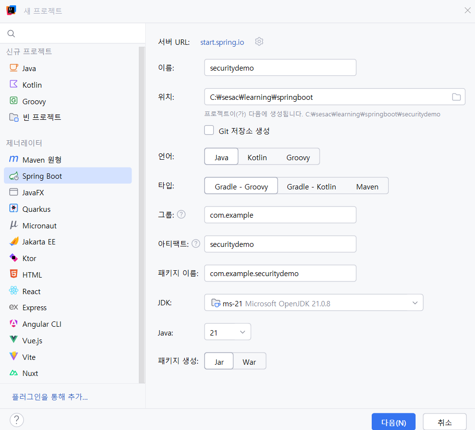

# 9. Spring Security

# 📘 Spring Security 기본 인증/인가 구현 정리

## 1. 프로젝트 생성 및 의존성 추가

- Spring Boot Web + Thymeleaf + Spring Security
    
    
    
- 정적 리소스는 templates 사용
- 추가 의존성:
    - thymeleaf-extras-springsecurity6 (권한 표현용)
        
        
        
    

---

# 2. 기본 라우팅 구성 (HomeController)

```java
@GetMapping("/")
public String home() { return "home"; }

@GetMapping("/info")
public String info() { return "info"; }
```

Spring Security 기본 설정 때문에

`/`, `/info` 에도 인증되지 않았으면 자동으로 `/login` 으로 리다이렉트됨.


---

# 3. SecurityConfig 설정

```java
@Configuration
@EnableWebSecurity
public class SecurityConfig {

    @Bean
    public SecurityFilterChain filterChain(HttpSecurity http) throws Exception {

        http.authorizeHttpRequests(auth -> auth
                .requestMatchers("/", "/info", "/login").permitAll()
                .requestMatchers("/admin/**").hasRole("ADMIN")
                .requestMatchers("/user/**").hasAnyRole("USER","ADMIN")
                .anyRequest().authenticated()
        )
        .formLogin(form -> form
                .loginPage("/login")
                .defaultSuccessUrl("/dashboard", true)
                .failureUrl("/login") //커스텀 login페이지로 이동 가능
                .permitAll()
        )
        .logout(logout -> logout
                .logoutSuccessUrl("/login")
                .permitAll()
        )
        .exceptionHandling(ex -> ex
                .accessDeniedPage("/access-denied")
        );

        return http.build();
    }
}
```

### ✔️ 주요 동작

- 인증 필요 → 로그인 페이지로 자동 Redirect
- 로그인 성공 → `/dashboard`
- 권한 부족 → `/access-denied`
- 로그아웃 → `/login`

---

# 4. AuthController 및 커스텀 로그인 페이지

## AuthController

```java
@Controller
public class AuthController {
    @GetMapping("/login") public String login() { return "login"; }
    @GetMapping("/dashboard") public String dashboard() { return "dashboard"; }
}
```

## login.html (폼 로그인)

Spring Security가 자동으로 CSRF 토큰을 hidden 필드에 삽입함.

```html
<form th:action="@{/login}" method="post">
    <input type="text" name="username">
    <input type="password" name="password">
    <input type="submit">
</form>
```


id는 default가 **`user` , password는 터미널**에서 확인 가능


로그인 성공 → 세션 아이디 발급(브라우저 쿠키에 저장)

## dashboard.html

로그인 성공 후 접근 가능.

로그아웃 요청도 POST 로 처리됨.


---

# 5. In-Memory UserDetailsService (임시 로그인 정보)

```java
@Bean
public UserDetailsService userDetailsService(){
    UserDetails user = User.builder()
            .username("user") // USER ID
            .password("{noop}1234") // USER PWD
            .roles("USER")
            .build();

    UserDetails admin = User.builder()
            .username("admin") // ADMIN ID
            .password("{noop}admin") // ADMIN PWD
            .roles("USER","ADMIN")
            .build();

    return new InMemoryUserDetailsManager(user, admin);
}
```

✔️ `{noop}` → 비밀번호 평문 사용(암호화 X)

✔️ user / admin 계정으로 로그인 가능

post요청 시 아래처럼 form태그 안에 hidden으로 **`_csrf` 토큰**이 들어있다

CSRF토큰 : **교차 사이트 요청 위조(Cross-Site Request Forgery) 공격을 막기 위한 보안 수단**


브라우저 > 네트워크 > payload에서 토큰 확인 가능

---

# 6. Thymeleaf + Spring Security 연동

[https://github.com/thymeleaf/thymeleaf-extras-springsecurity](https://github.com/thymeleaf/thymeleaf-extras-springsecurity)

### 의존성

```
implementation 'org.thymeleaf.extras:thymeleaf-extras-springsecurity6'
```

### home.html에서 로그인 상태 표시

```html
<div sec:authorize="!isAuthenticated()">…</div>
<div sec:authorize="isAuthenticated()">
    <p sec:authentication="name"></p>
    <p sec:authentication="authorities"></p>
</div>
```

### dashboard.html에서 권한별 표시

```html
<div sec:authorize="hasRole('USER')">일반 사용자</div>
<div sec:authorize="hasRole('ADMIN')">관리자</div>
```


---

# 7. Controller에서 인증 정보 사용

```java
@GetMapping("/dashboard")
public String dashboard(@AuthenticationPrincipal UserDetails userDetails, Model model){
    model.addAttribute("username", userDetails.getUsername());
    model.addAttribute("roles", userDetails.getAuthorities());
    return "dashboard";
}
```

---

# 8. Admin 전용 페이지

```java
@Controller
@RequestMapping("/admin")
public class AdminController {
    @GetMapping public String adminHome() { return "admin/home"; }
    @GetMapping("/users") public String users() { return "admin/users"; }
}
```

→ `/admin/**`는 ADMIN만 접근 가능.


---

# 9. 권한 부족 시 에러 페이지

```java
@Controller
public class ErrorController {
    @GetMapping("/access-denied")
    public String accessDenied() {
        return "access-denied";
    }
}
```


---

# 10. **JPA 기반 사용자 엔티티 구성**

# 1️⃣ **User 엔티티**

```java
@Entity
@Table(name = "users")
@NoArgsConstructor
@Getter @Setter
public class User {

    @Id @GeneratedValue(strategy = GenerationType.IDENTITY)
    private Long id;

    @Column(nullable=false, unique=true)
    private String username;

    @Column(nullable=false)
    private String password;

    @Column(nullable=false)
    private String role;

    @Builder
    public User(String username, String password, String role){
        this.username = username;
        this.password = password;
        this.role = role;
    }
}
```

✔ 실제 DB에 저장되는 사용자 정보

✔ role 예시 → `"ROLE_USER"`, `"ROLE_ADMIN"`

---

# 2️⃣ **CustomUserDetails (UserDetails 구현체)**

Spring Security가 "인증된 사용자"를 표현하는 객체.

```java
@RequiredArgsConstructor
public class CustomUserDetails implements UserDetails {

    private final User user;

    @Override
    public Collection<? extends GrantedAuthority> getAuthorities() {
        return List.of(new SimpleGrantedAuthority(user.getRole()));
    }

    @Override public String getPassword() { return user.getPassword(); }
    @Override public String getUsername() { return user.getUsername(); }

    @Override public boolean isAccountNonExpired() { return true; }
    @Override public boolean isAccountNonLocked() { return true; }
    @Override public boolean isCredentialsNonExpired() { return true; }
    @Override public boolean isEnabled() { return true; }
}
```

✔ DB User → Security가 이해할 수 있는 UserDetails로 변환

✔ SecurityContext에 저장되는 사용자 정보

---

# 3️⃣ **CustomUserDetailsService (UserDetailsService 구현체)**

Spring Security 로그인 과정에서 *반드시* 실행됨.

```java
@Service
@RequiredArgsConstructor
public class CustomUserDetailService implements UserDetailsService {

    private final UserRepository userRepository;

    @Override
    public UserDetails loadUserByUsername(String username)
            throws UsernameNotFoundException {

        User user = userRepository.findByUsername(username)
                .orElseThrow(() -> new IllegalArgumentException(username));

        return new CustomUserDetails(user);
    }
}
```

✔ `/login` 요청 시 → DB에서 username으로 조회

✔ UserDetails로 감싸서 Security에게 반환

✔ **인증의 핵심 클래스**

---

# 4️⃣ **UserRepository**

```java
@Repository
public interface UserRepository extends JpaRepository<User, Long> {
    Optional<User> findByUsername(String username);
    boolean existsByUsername(String username);
}
```

✔ DB에서 사용자 찾기 위한 Repository

✔ Spring Security 인증에서 반드시 필요

---

# 5️⃣ **UserService / UserServiceImpl (선택적 – 도메인 로직용)**

```java
public interface UserService {
    Optional<User> findByUsername(String username);
    Optional<User> findById(Long id);
    boolean existByUsername(String username);
}
```

```java
@Service
@Transactional(readOnly = true)
@RequiredArgsConstructor
public class UserServiceImpl implements UserService {

    private final UserRepository userRepository;

    @Override
    public Optional<User> findByUsername(String username) {
        return userRepository.findByUsername(username);
    }

    @Override
    public Optional<User> findById(Long id) {
        return userRepository.findById(id);
    }

    @Override
    public boolean existByUsername(String username) {
        return userRepository.existsByUsername(username);
    }
}
```

✔ Controller에서 DB 접근하지 않기 위해 사용

✔ 인증에는 직접 필요 없음

---

# 6️⃣ **SecurityConfig**

```java
@Configuration
@EnableWebSecurity
public class SecurityConfig {

    @Bean
    public SecurityFilterChain filterChain(HttpSecurity http) throws Exception {

        http.authorizeHttpRequests(auth -> auth
                .requestMatchers("/", "/info", "/login"**, "/h2-console/**"**).permitAll()
                .requestMatchers("/admin/**").hasRole("ADMIN")
                .requestMatchers("/user/**").hasAnyRole("USER","ADMIN")
                .anyRequest().authenticated()
        )
        .formLogin(form -> form
                .loginPage("/login")
                .defaultSuccessUrl("/dashboard", true)
                .failureUrl("/login")
                .permitAll()
        )
        .logout(logout -> logout
                .logoutSuccessUrl("/login")
                .permitAll()
        )
        .exceptionHandling(ex -> ex
                .accessDeniedPage("/access-denied")
        );

        **// H2 콘솔용 설정
        http.csrf(csrf -> csrf.ignoringRequestMatchers("/h2-console/**"));
        http.headers(headers -> headers.frameOptions(frame -> frame.sameOrigin()));**

        return http.build();
    }

    **@Bean
    public PasswordEncoder passwordEncoder() {
        return new BCryptPasswordEncoder();
    }**
}
```

✔ URL별 권한 설정

✔ 로그인 페이지 커스텀

✔ **H2 콘솔 접근 허용**

✔ **BCryptPasswordEncoder 적용**

✔ 로그인/로그아웃 경로 설정

---

# 7️⃣ **application.properties**

```
spring.application.name=securitydemo

spring.datasource.url=jdbc:h2:mem:testdb
spring.datasource.driver-class-name=org.h2.Driver
spring.datasource.username=sa

spring.h2.console.enabled=true
spring.h2.console.path=/h2-console

spring.jpa.hibernate.ddl-auto=create
spring.jpa.show-sql=true
spring.jpa.properties.hibernate.format_sql=true
```

✔ H2 메모리 DB

✔ JPA DDL 자동 생성(`create`)

✔ SQL 로그 출력

✔ H2 콘솔 접근 허용

---

# 8️⃣ **초기 데이터 삽입 (선택) – DataInitializer**

```java
@Component
@RequiredArgsConstructor
public class DataInitializer implements CommandLineRunner {

    private final UserRepository userRepository;
    private final PasswordEncoder passwordEncoder;

    @Override
    public void run(String... args) throws Exception {
        User user = User.builder()
                .username("user")
                .password(passwordEncoder.encode("1234"))
                .role("ROLE_USER")
                .build();
                
        User admin = User.builder()
                .username("admin")
                .password(passwordEncoder.encode("1234"))
                .role("ROLE_ADMIN")
                .build();
                
        userRepository.save(user);
        userRepository.save(admin);
    }
}
```

✔ 앱 실행 시 사용자 데이터를 자동 Insert

✔ 테스트 계정 생성에 유용


# 🔐 BCrypt 해싱 초간단 요약

- BCrypt는 **단방향 해싱**이라 **복호화 불가능**
- Spring Security가 해싱할 때 **매번 랜덤 salt 자동 추가**
    
    → **같은 비밀번호라도 해시값이 항상 다름**
    
- 해싱 작업을 **2¹⁰(=1024)번 반복**해 공격을 어렵게 함
    
    → 이 숫자를 **cost**라고 부름 (기본값 = 10)
    
- 로그인 시에는 복호화가 아니라
    
    **입력한 비번을 같은 방식으로 다시 해싱해서 비교**
    

---

# 🎉 최종 요약 (가장 중요한 핵심)

### 🔥 Spring Security가 DB에서 사용자 인증하는 전체 흐름

1. 브라우저가 `/login` POST 요청
2. Spring Security가 필터로 요청 가로챔
3. → **`CustomUserDetailsService.loadUserByUsername()` 호출**
4. → UserRepository 통해 **DB에서 사용자 조회**
5. → **`CustomUserDetails` 로 감싸서 Security에 제공**
6. → **비밀번호 비교 (BCryptPasswordEncoder)**
7. → **성공** → SecurityContext + 세션 생성
8. → 이후 인증된 사용자로 권한 검증

---

- 세션 정보 DB 저장 (확인만 하고 아래 소스는 복원)

security 동작 원리 → 세션을 디비에 저장해 보겠음

`build.gradle` (spring session jdbc)

```c
implementation 'org.springframework.session:spring-session-jdbc'
```

`application.properties`

```c
spring.session.store-type=jdbc
spring.session.jdbc.initialize-schema=always
# session timeout
server.servlet.session.timeout=30m
```

User

```c
public class User **implements Serializable** {

    **private static final long serialVersionUID = 1L;**
```

CustomUserDetailsService

```c
public class CustomUserDetailService implements UserDetailsService**, Serializable** {

    **private static final long serialVersionUID = 1L;**
```


DB에 저장된 값 = SESSION 쿠키 ID를 SHA-256 해시한 값