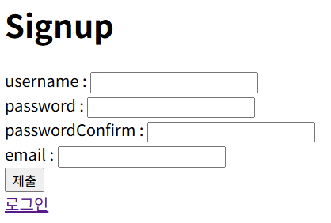

# 10. Spring Security - 회원가입

# 회원가입

## 1. 의존성 추가

`build.gradle`에 **Validation** 의존성 추가:

```
implementation 'org.springframework.boot:spring-boot-starter-validation'
```

---

## 2. DTO 생성

### `SignupDto.java`

```java
package com.example.securitydemo.dto;

import jakarta.validation.constraints.Email;
import jakarta.validation.constraints.NotBlank;
import jakarta.validation.constraints.Size;
import lombok.Getter;
import lombok.Setter;

@Getter @Setter
public class SignupDto {
    @NotBlank(message = "사용자명을 입력해 주세요.")
    @Size(min = 3, max = 20, message = "사용자명을 3~20자 입니다.")
    private String username;

    @NotBlank(message = "비밀번호를 입력해 주세요.")
    @Size(min = 4, max = 20, message = "비밀번호는 4~20자 입니다.")
    private String password;

    @NotBlank(message = "비밀번호 확인을 입력해 주세요.")
    private String passwordConfirm;

    @NotBlank(message = "이메일을 입력해 주세요.")
    @Email(message = "올바른 이메일 형식이 아닙니다.")
    private String email;
}
```

---

## 3. Repository

### `UserRepository.java`

```java
public interface UserRepository extends JpaRepository<User, Long> {
    boolean existsByUsername(String username);
    boolean existsByEmail(String email);
}
```

---

## 4. Service

### `UserService.java`

```java
public interface UserService {
    boolean existByUsername(String username);
    boolean existByEmail(String email);
    User register(SignupDto signupDto);
}
```

### `UserServiceImpl.java`

```java
@Service
@RequiredArgsConstructor
public class UserServiceImpl implements UserService {

    private final UserRepository userRepository;
    private final PasswordEncoder passwordEncoder;

    @Override
    public boolean existByUsername(String username) {
        return userRepository.existsByUsername(username);
    }

    @Override
    public boolean existByEmail(String email){
        return userRepository.existsByEmail(email);
    }

    @Override
    public User register(SignupDto signupDto){
        User user = User.builder()
                .username(signupDto.getUsername())
                .password(passwordEncoder.encode(signupDto.getPassword()))
                .email(signupDto.getEmail())
                .role("ROLE_USER")
                .build();
        return userRepository.save(user);
    }
}
```

---

## 5. 엔티티 수정

`User` 엔티티에 이메일 컬럼 추가:

```java
@Column(nullable = false)
private String email;
```

---

## 6. Controller

### `AuthController.java`

```java
@Controller
@RequiredArgsConstructor
public class AuthController {

    private final UserService userService;

    @GetMapping("/signup")
    public String signupForm(Model model){
        model.addAttribute("signupDto", new SignupDto());
        return "signup";
    }

    @PostMapping("/signup")
    public String signup(@Valid @ModelAttribute("signupDto") SignupDto signupDto,
                         BindingResult bindingResult) {

        // 비밀번호 일치 여부 검증
        if (!signupDto.getPassword().equals(signupDto.getPasswordConfirm())) {
            bindingResult.rejectValue(
                    "passwordConfirm",
                    "password_mismatch",
                    "비밀번호가 일치하지 않습니다."
            );
        }

        // 검증 실패 시
        if (bindingResult.hasErrors()) {
            return "signup";
        }

        // DB 조회를 통한 추가 검증
        if (userService.existByUsername(signupDto.getUsername())) {
            bindingResult.rejectValue("username", "duplicate", "이미 사용중인 아이디입니다.");
            return "signup";
        }

        if (userService.existByEmail(signupDto.getEmail())) {
            bindingResult.rejectValue("email", "duplicate", "이미 사용중인 이메일입니다.");
            return "signup";
        }

        // 회원가입 처리
        userService.register(signupDto);
        return "redirect:/login";
    }
}
```

---

## 7. View

### `signup.html` (Thymeleaf)

```html
<body>
    <h1>Signup</h1>
    <form th:action="@{/signup}" method="post" th:object="${signupDto}">
        <div>
            <label for="username">username : </label>
            <input type="text" th:field="*{username}" id="username" required>
            <p th:if="${#fields.hasErrors('username')}" th:errors="*{username}"></p>
        </div>
        <div>
            <label for="password">password : </label>
            <input type="password" th:field="*{password}" id="password" required>
            <p th:if="${#fields.hasErrors('password')}" th:errors="*{password}"></p>
        </div>
        <div>
            <label for="passwordConfirm">passwordConfirm : </label>
            <input type="password" th:field="*{passwordConfirm}" id="passwordConfirm" required>
            <p th:if="${#fields.hasErrors('passwordConfirm')}" th:errors="*{passwordConfirm}"></p>
        </div>
        <div>
            <label for="email">email : </label>
            <input type="email" th:field="*{email}" id="email" required>
            <p th:if="${#fields.hasErrors('email')}" th:errors="*{email}"></p>
        </div>

        <input type="submit">
    </form>

    <a href="/login">로그인</a>
</body>
```

---

## 8. Security 설정

`SecurityConfig`에서 `/signup` 경로는 인증 없이 접근 가능하도록 설정:

```java
.requestMatchers("/signup").permitAll()
```

---

## 9. 현재 상황 및 주의 사항

- **문제 원인**: 로그인 시 `SecurityContext` 직렬화 과정에서 오류 발생.
- **임시 해결**: `build.gradle`에서 `spring-session-jdbc` 의존성 주석 처리.
- **결과**: 서버 메모리(HttpSession) 사용 시 정상 동작.
- **주의**:
    - MySQL 등 외부 DB 세션 사용 시 `UserDetails` 객체 직렬화 필요.
    - 운영 환경에서는 `UserDetails`를 `Serializable`로 구현하거나, 세션 직렬화 설정 필요.

---



회원가입 성공 시 로그인 페이지로 리다이렉션

