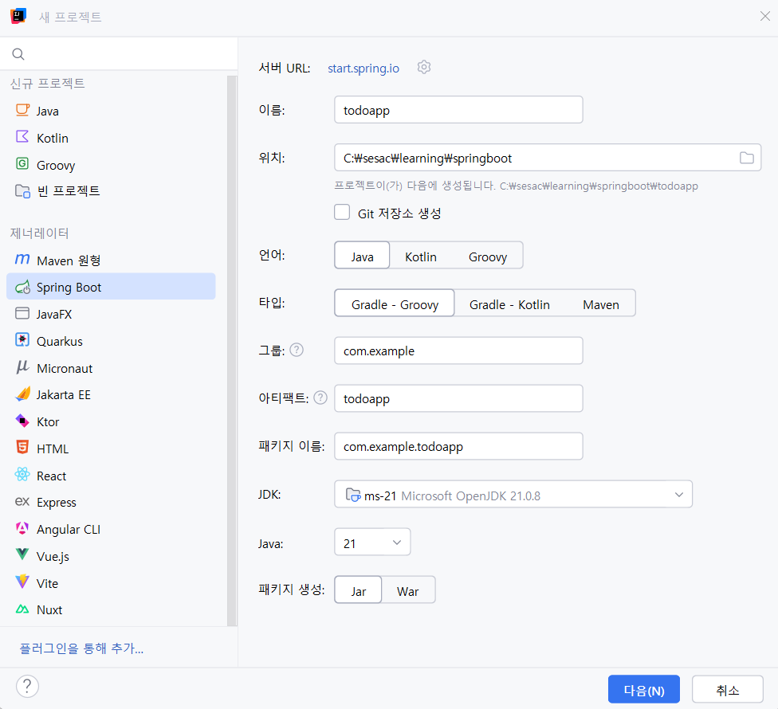

# 2. CRUD

# 📝 Spring Boot TodoApp 학습 정리

---

## 1️⃣ 프로젝트 생성

- **Git 저장소 생성 체크**: `git init` 여부 선택
    
    
    
    
    
- **패키지 구조**
    - `controller` → Controller: Model과 View 중간 역할, 요청 처리
    - `dto` → Data Transfer Object
    - `repository` → 데이터 저장소
        
        
        

---

## 2️⃣ 기본 프로젝트 구조

```
src
 └─ main
     ├─ java
     │   └─ com.example.todoapp
     │       ├─ controller
     │       │   └─ TodoController.java
     │       ├─ dto
     │       │   └─ TodoDto.java
     │       ├─ repository
     │       │   └─ TodoRepository.java
     │       └─ TodoappApplication.java
     └─ resources
         └─ templates
             ├─ todos.html
             ├─ new.html
             ├─ detail.html
             └─ edit.html
```

---

## 3️⃣ 핵심 스프링 애노테이션

| 애노테이션 | 역할 |
| --- | --- |
| `@Controller` | 웹 요청 처리 클래스 표시. 스프링이 자동으로 빈 등록, URL 매핑 처리 |
| `@Repository` | 저장소 역할 클래스 표시. 예외 변환 지원, 스프링 빈 자동 등록, DAO/DDD Repository 명확화 |
| `@Bean` (특히 BFPP 반환) | BeanFactoryPostProcessor 반환 시 **static**으로 선언해야 스프링 초기화 충돌 방지 |

---

## 4️⃣ 주요 클래스

### 4-1. `TodoDto` (Data Transfer Object)

```java
public class TodoDto {
    private Long id;
    private String title;
    private String content;
    private boolean completed;

    public TodoDto(Long id, String title, String content, boolean completed) {
        this.id = id;
        this.title = title;
        this.content = content;
        this.completed = completed;
    }

    // Getter / Setter
    public Long getId() { return id; }
    public void setId(Long id) { this.id = id; }
    public String getTitle() { return title; }
    public void setTitle(String title) { this.title = title; }
    public String getContent() { return content; }
    public void setContent(String content) { this.content = content; }
    public boolean isCompleted() { return completed; }
    public void setCompleted(boolean completed) { this.completed = completed; }
}
```

---

### 4-2. `TodoRepository` (저장소)

```java
@Repository
public class TodoRepository {
    private final Map<Long, TodoDto> storage = new ConcurrentHashMap<>();
    private Long nextId = 1L;

    public TodoDto save(TodoDto todo) {
        if (todo.getId() == null) {
            todo.setId(nextId++);
        }
        storage.put(todo.getId(), todo);
        return todo;
    }

    public List<TodoDto> findAll() {
        return new ArrayList<>(storage.values());
    }

    public TodoDto findById(Long id) {
        return storage.get(id);
    }

    public void deleteById(Long id) {
        storage.remove(id);
    }
}
```

---

### 4-3. `TodoController` (웹 요청 처리)

```java
@Controller
public class TodoController {
    private final TodoRepository todoRepository;

    public TodoController(TodoRepository todoRepository) {
        this.todoRepository = todoRepository;
    }

    @GetMapping("/todos")
    public String todos(Model model) {
        model.addAttribute("todos", todoRepository.findAll());
        return "todos";
    }

    @GetMapping("/todos/new")
    public String newTodo() { return "new"; }

    @GetMapping("/todos/create")
    public String create(@RequestParam String title, @RequestParam String content) {
        todoRepository.save(new TodoDto(null, title, content, false));
        return "redirect:/todos";
    }

    @GetMapping("/todos/{id}")
    public String detail(@PathVariable Long id, Model model) {
        model.addAttribute("todo", todoRepository.findById(id));
        return "detail";
    }

    @GetMapping("/todos/{id}/delete")
    public String delete(@PathVariable Long id) {
        todoRepository.deleteById(id);
        return "redirect:/todos";
    }

    @GetMapping("/todos/{id}/edit")
    public String edit(@PathVariable Long id, Model model) {
        model.addAttribute("todo", todoRepository.findById(id));
        return "edit";
    }

    @GetMapping("/todos/{id}/update")
    public String update(@PathVariable Long id,
                         @RequestParam String title,
                         @RequestParam String content,
                         @RequestParam(defaultValue = "false") Boolean completed) {
        TodoDto dto = todoRepository.findById(id);
        dto.setTitle(title);
        dto.setContent(content);
        dto.setCompleted(completed);
        todoRepository.save(dto);
        return "redirect:/todos/" + id;
    }
}
```

---

### 4-4. `TodoappApplication` (스프링 부트 시작점 + 샘플 데이터)

```java
@SpringBootApplication
public class TodoappApplication {

    public static void main(String[] args) {
        SpringApplication.run(TodoappApplication.class, args);
    }

    // 샘플 데이터
    @Bean
    public CommandLineRunner init(TodoRepository todoRepository) {
        return args -> {
            todoRepository.save(new TodoDto(null, "Study", "Java", false));
            todoRepository.save(new TodoDto(null, "Cook", "kimbob", false));
            todoRepository.save(new TodoDto(null, "Workout", "Run", false));
        };
    }
}
```

---

## 5️⃣ Thymeleaf HTML 파일

### 5-1. `todos.html` (할 일 목록)

```html
<h1>할 일 목록</h1>
<a href="/todos/new">new</a>
<hr>
<div th:each="todo : ${todos}">
    <a th:href="@{/todos/{id}(id=${todo.id})}">
        <h3 th:text="${todo.title}"></h3>
    </a>
</div>
```

---

### 5-2. `new.html` (할 일 생성)

```html
<h1>할 일 생성</h1>
<form action="/todos/create">
    <input type="text" name="title">
    <input type="text" name="content">
    <input type="submit">
</form>
```

---

### 5-3. `detail.html` (할 일 상세)

```html
<h1>detail</h1>
<ul>
    <li th:text="${todo.title}"></li>
    <li th:text="${todo.content}"></li>
    <li th:text="${todo.completed ? '완료' : '미완료'}"></li>
</ul>
<hr>
<a th:href="@{/todos/{id}/delete(id=${todo.id})}">delete</a><br>
<a href="/todos">home</a><br>
<a th:href="@{/todos/{id}/edit(id=${todo.id})}">edit</a>
```

---

### 5-4. `edit.html` (할 일 수정)

```html
<h1>edit</h1>
<form th:action="@{/todos/{id}/update(id=${todo.id})}">
    <input type="text" name="title" th:value="${todo.title}">
    <input type="text" name="content" th:value="${todo.content}">
    <input type="checkbox" name="completed" value="true" th:checked="${todo.completed}">
    <input type="submit">
</form>
```

---

### ✅ 핵심 포인트 정리

1. **패키지 역할**
    - Controller → 요청 처리
    - DTO → 데이터 전달용 객체
    - Repository → 데이터 저장소
2. **Spring 애노테이션**
    - `@Controller`, `@Repository`, `@Bean`
3. **Thymeleaf**
    - `${todo.title}` → DTO getter 자동 호출
    - URL 매핑 → `@{/todos/{id}(id=${todo.id})}`
4. **Repository 주의**
    - `id`는 `Long`으로 정의 → null 체크 가능
    - `ConcurrentHashMap` 사용 → 멀티스레드 안전
5. **샘플 데이터**
    - `CommandLineRunner` + `@Bean` → 앱 시작 시 자동 추가