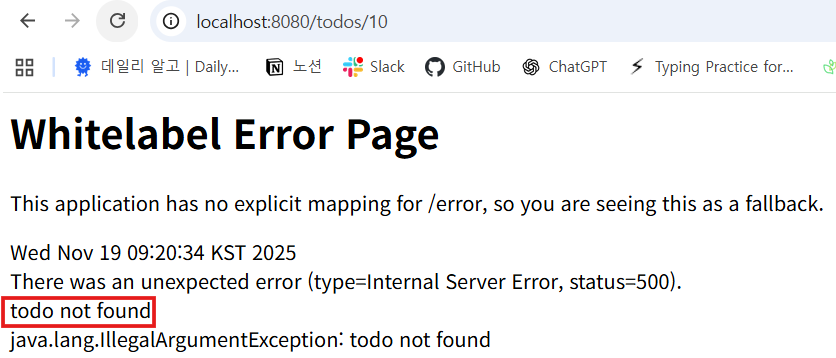

# 3. CRUD2

# 📝 Spring Boot TodoApp 학습 정리2

## 1. 🟦 Optional 적용

### ✔️ 문제 상황

`/todos/{id}` 로 접근 시,

URL의 `{id}`가 존재하지 않으면 `null` 반환 → NullPointer 가능

→ 이를 `Optional` 로 감싸 null-safe 하게 처리

### ✔️ Repository 코드

```java
public Optional<TodoDto> findById(Long id) {
    return Optional.ofNullable(storage.get(id)); // TodoDto 또는 null
}
```

### ✔️ Controller 코드

`orElseThrow()` 를 사용해 **id가 없을 경우 예외 발생**

```java
@GetMapping("/todos/{id}")
public String detail(@PathVariable Long id, Model model) {
    model.addAttribute("todo", todoRepository.findById(id)
            .orElseThrow(() -> new IllegalArgumentException("todo not found")));
    return "detail";
}
```

➡️ 존재하지 않는 id 접근 시 Error Page 에 `"todo not found"` 표시됨



### ✔️ 예외 처리 후 /todos 로 리다이렉션

```java
@GetMapping("/todos/{id}")
public String detail(@PathVariable Long id, Model model) {
    try {
        model.addAttribute("todo", todoRepository.findById(id)
                .orElseThrow(() -> new IllegalArgumentException("todo not found")));
    } catch (IllegalArgumentException e) {
        return "redirect:/todos";
    }
    return "detail";
}
```

---

## 2. 🟩 검색 기능

### ✔️ View (`todos.html`)


```html
<form action="/todos/search">
    <input type="text" name="keyword">
    <input type="submit" value="검색">
</form>

<div th:each="todo : ${todos}">
    <a th:href="@{/todos/{id}(id=${todo.getId()})}">
        <h3 th:text="${todo.getTitle()}"></h3>
    </a>
</div>
```

---

### ✔️ Repository

```java
public List<TodoDto> findByTitleContaining(String keyword) {
    return storage.values().stream()
            .filter(todo -> todo.getTitle().toLowerCase().contains(keyword.toLowerCase()))
            .toList();
}
```

---

### ✔️ Controller

```java
@GetMapping("/todos/search")
public String search(@RequestParam String keyword, Model model) {
    model.addAttribute("todos", todoRepository.findByTitleContaining(keyword));
    return "/todos";
}
```

---

## 3. 🟨 완료 / 비완료 기능


### ✔️ 사용자가 선택할 수 있는 상태 필터 추가

`todos.html` 내에 다음과 같이 추가:

```html
<a href="/todos?status=active">active</a>
<a href="/todos?status=completed">completed</a>
```

---

### ✔️ Repository

```java
public List<TodoDto> findByCompleted(boolean isCompleted){
        return storage.values().stream()
                .filter((todo) -> todo.isCompleted() == isCompleted)
                .toList();
    }
```

---

### ✔️ Controller

```java
		@GetMapping("/todos/active")
    public String active(Model model){
        model.addAttribute("todos", todoRepository.findByCompleted(false));
        return "/todos";
    }

    @GetMapping("/todos/completed")
    public String completed(Model model){
        model.addAttribute("todos", todoRepository.findByCompleted(true));
        return "/todos";
    }
```

---

## 4. 🧩 Thymeleaf Layout Dialect + Bootstrap 적용

### ✔ Thymeleaf Layout Dialect 추가

https://ultraq.github.io/thymeleaf-layout-dialect/getting-started/

### 📌 `build.gradle`

```
implementation 'nz.net.ultraq.thymeleaf:thymeleaf-layout-dialect'
```


**Gradle 동기화(코끼리 버튼 클릭).**

예시 이미지


---

## ✔ HTML 설정

페이지에서 레이아웃 적용:

```html
xmlns:layout="http://www.ultraq.net.nz/thymeleaf/layout"
layout:decorate="~{layout/default}"
```

여러 페이지에서 공통 레이아웃을 사용 가능!


---

## ✔ Bootstrap 적용

https://getbootstrap.com/


### 📌 `<head>` 에 CSS

```html
<link href="https://cdn.jsdelivr.net/npm/bootstrap@5.3.8/dist/css/bootstrap.min.css" rel="stylesheet">
```

### 📌 `<body>` 마지막에 JS

```html
<script src="https://cdn.jsdelivr.net/npm/bootstrap@5.3.8/dist/js/bootstrap.bundle.min.js"></script>
```


---

# 5. 🧱 레이아웃 구성: `layout/default.html`

아래는 최종 예시 전체 코드:

```html
<!doctype html>
<html lang="en"
      xmlns:th="https://www.thymeleaf.org"
      xmlns:layout="http://www.ultraq.net.nz/thymeleaf/layout">
<head>
    <meta charset="UTF-8">
    <title></title>
    <link href="https://cdn.jsdelivr.net/npm/bootstrap@5.3.8/dist/css/bootstrap.min.css" rel="stylesheet">
</head>
<body>

<!-- Navbar -->
<nav class="navbar navbar-expand-lg bg-body-tertiary">
    <div class="container-fluid">
        <a class="navbar-brand" href="/todos">Home</a>

        <div class="collapse navbar-collapse">
            <div class="navbar-nav">
                <a class="nav-link" href="/todos/active">active</a>
                <a class="nav-link" href="/todos/completed">completed</a>
                <a class="nav-link" href="/todos/new">new</a>

                <!-- 검색 -->
                <form action="/todos/search" class="d-flex">
                    <input type="text" name="keyword" class="form-control">
                    <input type="submit" value="검색" class="btn btn-outline-success">
                </form>
            </div>
        </div>
    </div>
</nav>

<!-- Content -->
<div class="container">
    <div layout:fragment="content"></div>
</div>

<script src="https://cdn.jsdelivr.net/npm/bootstrap@5.3.8/dist/js/bootstrap.bundle.min.js"></script>
</body>
</html>
```

`todos.html` 을 content라는 이름으로 컴포넌트화 하고 `layout/default.html` 안에 들어갈 수 있도록 설정

`todos.html` 의 html 태그에 `layout:decorate="~{layout/default}"` 추가

다른 페이지도 동일하게 적용


[`http://localhost:8080/todos`](http://localhost:8080/todos) 로 접속하면 화면이 변경된 것 확인 가능


`layout/default.html` 에 Navbar 적용


---

# 6. 📄 각 페이지

---

## ✔ `todos.html` — 전체 목록 + 테이블 디자인

```html
<!doctype html>
<html lang="en"
      xmlns:th="https://www.thymeleaf.org"
      xmlns:layout="http://www.ultraq.net.nz/thymeleaf/layout"
      layout:decorate="~{layout/default}">
<head>
    <meta charset="UTF-8">
    <title>Todos</title>
</head>
<body>
<div layout:fragment="content">

    <table class="table table-striped">
        <thead>
            <th>ID</th>
            <th>Title</th>
            <th>Completed</th>
            <th>Detail</th>
        </thead>
        <tbody>
            <tr th:each="todo : ${todos}">
                <td th:text="${todo.id}"></td>
                <td th:text="${todo.title}"></td>
                <td>
                    <span th:if="${todo.completed}" class="badge bg-success">완료</span>
                    <span th:if="${!todo.completed}" class="badge bg-warning">진행중</span>
                </td>
                <td>
                    <a th:href="@{/todos/{id}(id=${todo.id})}" class="btn btn-sm btn-primary">보기</a>
                </td>
            </tr>
        </tbody>
    </table>

</div>
</body>
</html>
```


---

## ✔ `detail.html`

```html
<!doctype html>
<html lang="en"
      xmlns:th="https://www.thymeleaf.org"
      xmlns:layout="http://www.ultraq.net.nz/thymeleaf/layout"
      layout:decorate="~{layout/default}">
<head>
    <meta charset="UTF-8">
    <title>detail</title>
</head>
<body>
<div layout:fragment="content">

    <h1>detail</h1>

    <div class="card">
        <div class="card-body">
            <h5 class="card-title" th:text="${todo.title}"></h5>
            <p class="card-text" th:text="${todo.content}"></p>
            <p>
                <span th:if="${todo.completed}" class="badge bg-success">완료</span>
                <span th:if="${!todo.completed}" class="badge bg-warning">진행중</span>
            </p>
        </div>
    </div>

    <a th:href="@{/todos/{id}/toggle(id=${todo.id})}" class="btn btn-primary">toggle</a>
    <a th:href="@{/todos/{id}/edit(id=${todo.id})}" class="btn btn-warning">edit</a>
    <a th:href="@{/todos/{id}/delete(id=${todo.id})}" class="btn btn-danger">delete</a>

</div>
</body>
</html>
```


---

## ✔ `edit.html`

```html
<!doctype html>
<html lang="en"
      xmlns:th="https://www.thymeleaf.org"
      xmlns:layout="http://www.ultraq.net.nz/thymeleaf/layout"
      layout:decorate="~{layout/default}">
<head>
    <meta charset="UTF-8">
    <title>edit</title>
</head>
<body>
<div layout:fragment="content">

    <h1>edit</h1>

    <form th:action="@{/todos/{id}/update(id=${todo.id})}">
        <label class="form-label">Title</label>
        <input type="text" name="title" th:value="${todo.title}" class="form-control">

        <label class="form-label">Content</label>
        <input type="text" name="content" th:value="${todo.content}" class="form-control">

        <input type="checkbox" name="completed" value="true"
               th:checked="${todo.completed}" class="form-check-input mt-0">

        <input type="submit" class="btn btn-primary">
    </form>

</div>
</body>
</html>
```


---

# 7. 🔄 Toggle 기능 (완료 ↔ 진행중)

```java
@GetMapping("/todos/{id}/toggle")
public String toggle(@PathVariable Long id) {
    try {
        TodoDto todo = todoRepository.findById(id)
                .orElseThrow(() -> new IllegalArgumentException("todo not found"));

        todo.setCompleted(!todo.isCompleted());
        todoRepository.save(todo);

        return "redirect:/todos/" + id;
    } catch (IllegalArgumentException e) {
        return "redirect:/todos";
    }
}
```

---

# 📝 **8. RESTful & Form POST 적용**

# 1. 🟦 `@RequestMapping("/todos")` 적용

`TodoController` 클래스 상단에 공통 URL을 지정:

```java
@RequestMapping("/todos")
public class TodoController { ... }
```

➡ 모든 메서드는 `/todos/...` 경로에서 실행됨

➡ 깔끔하고 RESTful 한 URL 구조 유지

---

# 2. 🟩 REST(Representational State Transfer) 정리

| HTTP Method | 의미 | 사용 목적 |
| --- | --- | --- |
| **GET** | Read | 데이터 조회 |
| **POST** | Create | 새로운 리소스 생성 |
| **PUT** | Update (전체 수정) |  |
| **PATCH** | Partial Update (부분 수정) |  |
| **DELETE** | Delete | 데이터 삭제 |

이번 단계에서는 **GET → POST 전환**을 중점으로 진행.

---

# 3. 🟧 GET → POST로 변경 (Form 전송 시 QueryString 제거)

기존의 GET 방식 `/todos/create?title=...&content=...` 는

**URL에 데이터가 그대로 노출되는 문제**가 있음.

👉 따라서 **POST 방식으로 변경**

---

# 4. 🟦 `new.html` – Create Form (POST 적용)

```html
<!doctype html>
<html lang="en"
      xmlns:th="https://www.thymeleaf.org"
      xmlns:layout="http://www.ultraq.net.nz/thymeleaf/layout"
      layout:decorate="~{layout/default}">
<head>
    <meta charset="UTF-8">
    <title>new</title>
</head>
<body>
<div layout:fragment="content">
    <h1>할 일 생성</h1>

    **<form action="/todos" method="post">**
        <label for="title" class="form-label">Title</label>
        <input type="text" name="title" id="title" class="form-control">

        <label for="content" class="form-label">Content</label>
        <input type="text" name="content" id="content" class="form-control">

        <input type="submit" class="btn btn-primary">
    </form>
</div>
</body>
</html>
```

---

# 5. 🟦 Create Controller – POST 방식으로 변경

```java
**@PostMapping**
public String create(@RequestParam String title,
                     @RequestParam String content,
                     Model model) {

    TodoDto dto = new TodoDto(null, title, content, false);
    model.addAttribute("todo", todoRepository.save(dto));

    return "redirect:/todos";
}
```

---

# 6. 🟩 Update 기능 — 페이지 이름 변경 (`edit.html` → `update.html`)

---

# 7. 🟦 `update.html` – Update Form

```html
<!doctype html>
<html lang="en"
      xmlns:th="https://www.thymeleaf.org"
      xmlns:layout="http://www.ultraq.net.nz/thymeleaf/layout"
      layout:decorate="~{layout/default}">
<head>
    <meta charset="UTF-8">
    <title>edit</title>
</head>
<body>
<div layout:fragment="content">
    <h1>edit</h1>

    **<form th:action="@{/todos/{id}/update(id=${todo.id})}" method="post">**
        <label for="title" class="form-label">Title</label>
        <input type="text" name="title" id="title" th:value="${todo.title}" class="form-control">

        <label for="content" class="form-label">Content</label>
        <input type="text" name="content" id="content" th:value="${todo.content}" class="form-control">

        <input type="checkbox" name="completed" value="true"
               th:checked="${todo.completed}" class="form-check-input mt-0">

        <input type="submit" class="btn btn-primary">
    </form>
</div>
</body>
</html>
```

---

# 8. 🟦 TodoController – GET (화면 표시) + POST (실제 업데이트)

### ✔ 업데이트 화면 이동 (`GET /todos/{id}/update`)

```java
@GetMapping("/{id}/update")
public String edit(@PathVariable Long id, Model model) {
    try {
        model.addAttribute("todo", todoRepository.findById(id)
                .orElseThrow(() -> new IllegalArgumentException("todo not found")));
    } catch (IllegalArgumentException e) {
        return "redirect:/todos";
    }
    return "update";
}
```

---

### ✔ 데이터 업데이트 (`POST /todos/{id}/update`)

```java
@PostMapping("/{id}/update")
public String update(@PathVariable Long id,
                     @RequestParam String title,
                     @RequestParam String content,
                     @RequestParam(defaultValue = "false") Boolean completed) {

    try {
        TodoDto dto = todoRepository.findById(id)
                .orElseThrow(() -> new IllegalArgumentException("todo not found"));

        dto.setTitle(title);
        dto.setContent(content);
        dto.setCompleted(completed);

        todoRepository.save(dto);
    } catch (IllegalArgumentException e) {
        return "redirect:/todos";
    }

    return "redirect:/todos/" + id;
}
```

---

## ⭐ 9. `RedirectAttributes`를 활용한 Flash 메시지

Spring에서는 `RedirectAttributes`를 사용하면 리다이렉트 후 일회성 메시지를 전달할 수 있습니다.

### TodoController 예제

```java
@Controller
@RequestMapping("/todos")
public class TodoController {

    private final TodoRepository todoRepository;

    public TodoController(TodoRepository todoRepository) {
        this.todoRepository = todoRepository;
    }

    // 새로운 할 일 화면
    @GetMapping("/new")
    public String newTodo() {
        return "new";
    }

    // 실제 생성 처리
    @PostMapping
    public String create(@RequestParam String title,
                         @RequestParam String content,
                         RedirectAttributes redirectAttributes,
                         Model model) {

        // Todo 저장
        TodoDto dto = new TodoDto(null, title, content, false);
        model.addAttribute("todo", todoRepository.save(dto));

        // Flash 메시지 전달
        redirectAttributes.addFlashAttribute("message", "create todo!");
        redirectAttributes.addFlashAttribute("status", "create"); // 상태 구분용

        return "redirect:/todos";
    }

    // 수정, 삭제도 동일하게 처리 가능
}
```

✅ 포인트:

- `addFlashAttribute`로 전달된 값은 **리다이렉트 후 한 번만** 화면에서 사용 가능.
- 메시지 타입을 구분하고 싶으면 `status` 같은 속성 추가.

---

## 2. Thymeleaf에서 Flash 메시지 표시

`default.html` (레이아웃)에서 메시지 처리:

```html
<!-- Flash Message -->
<div th:if="${message}"
     th:class="'alert alert-dismissible fade show ' +
               (${status} == 'delete' ? 'alert-danger' :
                (${status} == 'update' ? 'alert-warning' : 'alert-primary'))"
     role="alert">
    <span th:text="${message}"></span>
    <button type="button" class="btn-close" data-bs-dismiss="alert" aria-label="Close"></button>
</div>
```

✅ 포인트:

- `status` 값에 따라 Bootstrap alert 클래스 변경:
    - `delete` → `alert-danger`
    - `update` → `alert-warning`
    - 나머지 → `alert-primary`
- 메시지가 없는 경우 `th:if`로 렌더링 방지
- 생성 이미지
    
    
    
- 수정 이미지
    
    
    
- 삭제 이미지
    
    
    

---

## 3. 전체 레이아웃 예시 (`default.html`)

```html
<!doctype html>
<html lang="en"
      xmlns:th="https://www.thymeleaf.org"
      xmlns:layout="http://www.ultraq.net.nz/thymeleaf/layout">
<head>
    <meta charset="UTF-8">
    <title>Todo App</title>
    <link href="https://cdn.jsdelivr.net/npm/bootstrap@5.3.8/dist/css/bootstrap.min.css" rel="stylesheet">
</head>
<body>

<!-- Navbar -->
<nav class="navbar navbar-expand-lg bg-body-tertiary">
    <div class="container-fluid">
        <a class="navbar-brand" href="/todos">Home</a>
        <div class="collapse navbar-collapse" id="navbarNavAltMarkup">
            <div class="navbar-nav">
                <a class="nav-link" href="/todos/active">Active</a>
                <a class="nav-link" href="/todos/completed">Completed</a>
                <a class="nav-link" href="/todos/new">New</a>
                <form action="/todos/search" class="d-flex">
                    <input type="text" name="keyword" class="form-control">
                    <input type="submit" value="검색" class="btn btn-outline-success">
                </form>
            </div>
        </div>
    </div>
</nav>

<!-- Content -->
<div class="container mt-3">

    <!-- Flash Message -->
    <div th:if="${message}"
         th:class="'alert alert-dismissible fade show ' +
                   (${status} == 'delete' ? 'alert-danger' :
                    (${status} == 'update' ? 'alert-warning' : 'alert-primary'))"
         role="alert">
        <span th:text="${message}"></span>
        <button type="button" class="btn-close" data-bs-dismiss="alert" aria-label="Close"></button>
    </div>

    <!-- Page content -->
    <div layout:fragment="content"></div>

</div>

<script src="https://cdn.jsdelivr.net/npm/bootstrap@5.3.8/dist/js/bootstrap.bundle.min.js"></script>
</body>
</html>
```

---

`@Controller` VS `@RestController` 

| 구분 | 어노테이션 | 목적 | 반환 | 특징 |
| --- | --- | --- | --- | --- |
| 일반 컨트롤러 | `@Controller` | **뷰 렌더링 / 페이지 이동** | 뷰 이름(String) | forward, redirect 가능, HTML 템플릿 렌더링 |
| REST 컨트롤러 | `@RestController` | **데이터 제공 / API** | 객체 → JSON 직렬화 | 뷰 렌더링 X, 클라이언트는 JSON 받음 |
- **화면을 보여주거나 내부 페이지로 포워드/리다이렉트 하고 싶으면 `@Controller`**
- **데이터만 전달하고 싶으면 `@RestController`**