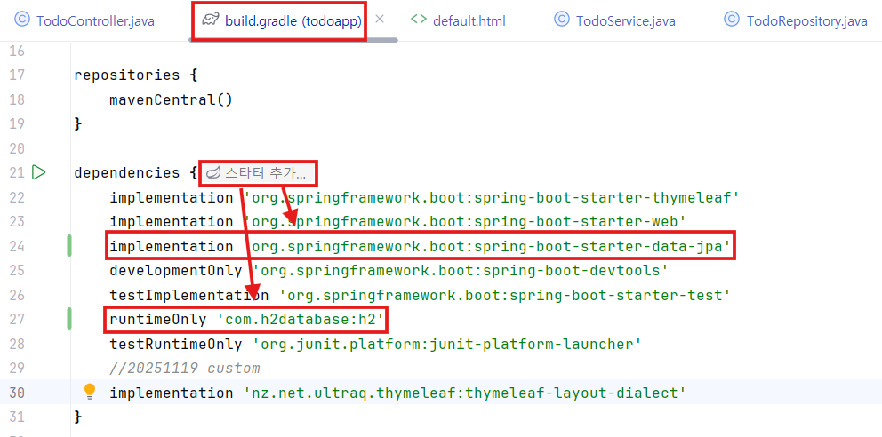

# 3. CRUD3

# 🌱 Spring MVC + Thymeleaf Form 처리 흐름 정리

# 1. **TodoDto 준비**

```java
public TodoDto() {}
```

- **폼 바인딩을 위해(Reflection → 객체 생성)** 기본 생성자가 꼭 필요함
    
    → Spring이 **POST 시 객체를 새로 만들 때 활용**됨.
    

---

# 2. **신규 생성 페이지 렌더링 (GET /todos/new)**

### ✔ 컨트롤러

```java
@GetMapping("/new")
public String newTodo(Model model) {
    model.addAttribute("todo", new TodoDto());
    return "form";
}
```

### 핵심 포인트

- GET 요청에서는 **화면을 그리기 위해** 빈 todo 객체를 모델에 넣는다.
- 모델의 `todo`는 Thymeleaf가 form의 “기준 객체”로 사용된다.

---

# 3. **Thymeleaf form 작성**

### form.html

```html
<form action="/todos" method="post" th:object="${todo}">
    <input id="title" th:field="*{title}">
    <input id="content" th:field="*{content}">
    <input type="submit">
</form>
```

### ✔ th:object & th:field 역할

- `th:object="${todo}"`
    
    → 이 form의 데이터가 TodoDto 필드에 매핑된다는 의미
    
- `th:field="*{title}"`
    
    → input의 name/value를 자동 생성
    
    예: `<input name="title" value="...">`
    

👉 **결국 POST 요청에서 Spring이 DTO에 값을 바인딩할 수 있는 구조가 만들어짐**

---

# 4. **실제 생성 요청 처리 (POST /todos)**

### 컨트롤러

```java
@PostMapping
public String create(@ModelAttribute TodoDto todo,
                     RedirectAttributes redirectAttributes) {
    todoRepository.save(todo);
    redirectAttributes.addFlashAttribute("message", "create todo!");
    return "redirect:/todos";
}
```

### ✔ 핵심 포인트

- **`@ModelAttribute TodoDto todo`**
    
    → Spring이 요청 파라미터(title, content 등)를 이용해
    
    → @RequestParam 여러 개를 받을 필요가 없음.
    
    **새로운 TodoDto 객체를 만들어서** 값 채워 줌.
    
- GET에서 넣은 모델은 이 단계와 전혀 상관 없음.

---

# 🔄 수정(Update)도 같은 방식

---

# 5. **수정 화면 렌더링 (GET /todos/{id}/update)**

```java
@GetMapping("/{id}/update")
public String edit(@PathVariable Long id, Model model) {
    model.addAttribute("todo", todoRepository.findById(id)
        .orElseThrow(...));
    return "form";
}
```

- DB에서 기존 TodoDto 값을 가져와 모델에 넣음
- form.html이 동일한 형식으로 렌더링되지만
    
    이번엔 필드에 기존 값(value)이 채워져 있음
    

---

# 6. **수정 요청 처리 (POST /todos/{id}/update)**

```java
@PostMapping("/{id}/update")
public String update(@PathVariable Long id,
                     @ModelAttribute TodoDto todo,
                     RedirectAttributes redirectAttributes) {
    todo.setId(id);
    todoRepository.save(todo);
    redirectAttributes.addFlashAttribute("message", "update todo!");
    return "redirect:/todos/" + id;
}
```

### ✔ 핵심 포인트

- POST에서는 다시 새로운 TodoDto 생성됨
    
    (GET 때 모델에 넣은 객체와 무관함)
    
- id는 path variable로 따로 받아서 set

---

# 7. **new.html + update.html 합쳐서 form.html로 통합**

```
todo.id == null → 신규 생성 화면
todo.id != null → 수정 화면
```

```html
<h1 th:text="${todo.id == null} ? 'new' : 'update'"></h1>

<form th:action="${todo.id == null} ? '/todos' : @{/todos/{id}/update(id=${todo.id})}"
      method="post"
      th:object="${todo}">
```

- 신규는 `POST /todos`
- 수정은 `POST /todos/{id}/update`
- 체크박스(completed)는 수정 시에만 표시
    
    (`th:if="${todo.id != null}"`)
    

---

# 📌 전체 요청 흐름 요약 그림

```
(1) GET /todos/new
    → model.addAttribute("todo", new TodoDto())
    → form.html 렌더링
    → 비어 있는 form 표시

(2) POST /todos
    → @ModelAttribute TodoDto 자동 바인딩
    → save() → redirect

(3) GET /todos/{id}/update
    → model에 기존 todo 담기
    → form.html 렌더링
    → 기존 값이 채워진 form 표시

(4) POST /todos/{id}/update
    → @ModelAttribute TodoDto 자동 바인딩
    → id set → save() → redirect
```

---

# 🎯 핵심 개념 3줄 정리

1. **GET에서는 화면 렌더링용으로 모델에 DTO를 넣음.**
2. **POST에서는 @ModelAttribute가 HTTP 요청을 기반으로 새로운 DTO를 만들어 채움.**
3. **즉 GET의 model 데이터와 POST의 @ModelAttribute는 서로 독립적이다.**

---

# 🌱 Spring MVC에서 비즈니스 로직을 Service 계층으로 분리하기

# 1. 왜 Service 계층을 분리하는가?

### ✔ Controller는 “요청/응답 처리”에만 집중

- 화면 렌더링
- 데이터 전달
- 경로 이동(redirect)

### ✔ 비즈니스 로직(Service)은 “실제 처리 로직”만 담당

- CRUD 실행
- 예외 처리
- 데이터 가공·검증
- 비즈니스 규칙 처리

→ **각 레이어의 책임이 명확해지고 코드 유지보수가 쉬워진다.**

---

# 2. `@Service`의 의미

- 이 클래스가 **비즈니스 로직을 담당하는 서비스 역할**임을 나타냄
- DDD의 “상태 없는 독립적 기능을 제공하는 요소” 개념에서 유래
- Business Service Facade 같은 구조에도 사용 가능
- `@Component`의 특수 버전 → **자동 컴포넌트 스캔 등록**
- 팀 상황에 따라 의미를 더 구체적으로 정의할 수 있음

---

# 3. TodoService 구현

### ✔ 역할

- TodoRepository 대신 **모든 비즈니스 로직**을 처리하는 계층
- Controller는 이 Service를 호출하기만 하면 됨

### ✔ 코드 요약

```java
@Service
public class TodoService {
    private final TodoRepository todoRepository;

    public TodoService(TodoRepository todoRepository) {
        this.todoRepository = todoRepository;
    }

    // 조회, 생성, 수정, 삭제 등 모든 비즈니스 로직 처리
}
```

### ✔ 제공하는 기능

- 전체 조회 (`getAllTodos`)
- 단건 조회 (`getTodoById`)
- 생성 (`createTodo`)
- 삭제 (`deleteTodoById`)
- 수정 (`updateTodoById`)
- 제목 검색 (`searchTodosByTitle`)
- 완료 여부별 조회 (`getTodosByCompleted`)
- 완료 토글 (`toggleCompleted`)

→ 컨트롤러는 “이 기능들이 있다는 전제만 알고” 호출할 수 있음.

---

# 4. Controller 리팩토링

### 기존 방식 (문제점)

- Controller에서 repository를 직접 호출
- 비즈니스 로직이 Controller에 섞여 있어서 역할이 모호함

### 리팩토링 후

- Controller는 **TodoService**를 주입받아 호출
- 조회/저장/삭제 등의 구체적인 처리는 Service가 담당

---

# 5. 리팩토링된 Controller 구조 정리

### ✔ 주요 변화

- `private final TodoService todoService;` 사용
- Controller는 데이터 처리 로직 없이 단순히 Service 호출
- API의 흐름(화면 이동, redirect)만 담당

---

# 6. Controller 메서드별 책임

### 📌 **GET /todos**

→ 모든 Todo 목록 조회

→ Service가 반환하는 리스트를 모델에 넣어 화면에 전달

### 📌 **GET /todos/new**

→ 새 Todo를 입력할 form 렌더링

→ 빈 DTO 생성하여 모델로 전달

### 📌 **POST /todos**

→ @ModelAttribute로 form 데이터 자동 바인딩

→ Service의 createTodo() 호출

→ redirect

### 📌 **GET /todos/{id}**

→ 상세 조회

→ 존재하지 않으면 redirect

### 📌 **GET /todos/{id}/delete**

→ 삭제 처리 후 redirect

### 📌 **GET /todos/{id}/update**

→ 기존 데이터로 form 렌더링

### 📌 **POST /todos/{id}/update**

→ 수정 처리(Service에서 로직 수행)

→ redirect

### 📌 검색 / 상태 필터링

- keyword 검색
- 완료/미완료 필터링
    
    → 모두 Service를 통해 조회
    

### 📌 toggle (완료 상태 반전)

→ Service.toggleCompleted(id)

---

# 7. 최종적으로 얻는 효과 🎯

### ✔ 1) Controller가 깔끔해짐

- 화면 이동 + 요청 핸들링만 담당
- “Thin Controller” 구조 완성

### ✔ 2) 비즈니스 로직은 모두 Service로 집중

- 변경/확장 시 Controller 코드를 건드릴 필요 없음

### ✔ 3) 코드 테스트 용이

- Service 단위 테스트 가능 → 품질 향상

### ✔ 4) 유지보수성과 확장성이 크게 향상

---

# 📌 전체 구조 한눈에 보기

```
Controller  →  (요청/응답 처리)
   ↓
Service  →  (비즈니스 로직 처리)
   ↓
Repository  →  (DB 액세스)
```

**Controller는 Service를 호출하고,
Service는 Repository를 호출하는 구조.**

---

# ✅ ORM + Service 분리 + 유효성 검사 + 통계 기능

# 1. ✔ Title 유효성 검사

### 📌 `TodoService`에 제목 검증 메서드 추가

```java
private void validateTitle(String title){
    if(title == null || title.trim().isEmpty()) {
        throw new IllegalArgumentException("제목은 필수입니다.");
    }
    if(title.trim().length() > 50){
        throw new IllegalArgumentException("제목은 50자를 초과할 수 없습니다.");
    }
}
```

👉 제목 없는 todo 저장 방지

👉 50자 초과 금지

---

# 2. ✔ 통계 기능(전체 / 완료 / 미완료 개수)

### 📌 TodoService

```java
public long getTotalCount(){
    return todoRepository.findAll().size();
}

public long getCompletedCount(){
    return todoRepository.findByCompleted(true).size();
}

public long getActiveCount(){
    return todoRepository.findByCompleted(false).size();
}
```

### 📌 TodoController

```java
@GetMapping
public String todos(Model model) {
    model.addAttribute("todos", todoService.getAllTodos());
    model.addAttribute("todosCount", todoService.getTotalCount());
    model.addAttribute("completedCount", todoService.getCompletedCount());
    model.addAttribute("activeCount", todoService.getActiveCount());
    model.addAttribute("status", TodoStatus.NORMAL.getCode());
    return "todos";
}
```

### 📌 todos.html

```html
<div th:if="${status == 0}">
    전체 : <span th:text="${todosCount}" class="badge bg-primary"></span>
    완료: <span th:text="${completedCount}" class="badge bg-success"></span>
    미완료: <span th:text="${activeCount}" class="badge bg-warning"></span>
</div>
```

---

# 3. ✔ 완료된 Todo 전체 삭제 기능

### 📌 Controller

```java
@GetMapping("/delete-completed")
public String deleteCompletedTodos(RedirectAttributes redirectAttributes) {
    todoService.deleteCompletedTodos();
    redirectAttributes.addFlashAttribute("status", TodoStatus.DANGER.getCode());
    redirectAttributes.addFlashAttribute("message", "완료된 할 일 전체 삭제!");
    return "redirect:/todos";
}
```

### 📌 Navbar에 메뉴 추가

```html
<a class="nav-link" href="/todos/delete-completed">deleteCompleted</a>
```

---

# 4. ✔ DB 연결 (H2 + Spring Data JPA)

### 📌 build.gradle

Spring Data JPA + H2 DB 의존성 추가




---

# 5. ✔ application.properties

```
spring.application.name=todoapp

# H2 콘솔
spring.h2.console.enabled=true
spring.h2.console.path=/h2-console

# 메모리 DB
spring.datasource.url=jdbc:h2:mem:testdb
spring.datasource.driver-class-name=org.h2.Driver
spring.datasource.username=sa
spring.datasource.password=

# JPA 설정
spring.jpa.hibernate.ddl-auto=create
spring.jpa.show-sql=true

# UTF-8 설정
server.servlet.encoding.charset=UTF-8
server.servlet.encoding.enabled=true
server.servlet.encoding.force=true
```

 서버 재실행 (디비 연결된 것 확인)


---

# 6. ✔ Entity 생성 = DB 테이블 생성

### 📌 TodoEntity

```java
@Entity
public class TodoEntity {

    @Id
    @GeneratedValue(strategy = GenerationType.IDENTITY)
    private Long id;

    private String title;
    private String content;
    private boolean completed;

    public TodoEntity() {}

    public TodoEntity(boolean completed, String content, String title) {
        this.completed = completed;
        this.content = content;
        this.title = title;
    }

    // getters & setters...
}
```

### 🔥 핵심 포인트

- `@Entity` → JPA가 이 클래스로 테이블 생성
- `@Id` + `IDENTITY` → AUTO_INCREMENT와 동일
- 서버 실행 시 **테이블 자동 생성**
    
    [`http://localhost:8080/h2-console`](http://localhost:8080/h2-console) 접속
    
    [`application.properties`](http://application.properties) 에서 작성했던 JDBC URL입력 후 Connect
    
    
    
    
    

---

# 7. ✔ JPA 핵심 개념

### 📌 ORM (Object-Relational Mapping)

- **자바 객체(Entity) ↔ DB 테이블 자동 매핑**
- SQL 없이 객체만 조작해도 DB가 자동 반영
- SQL 코드 작성 횟수가 크게 줄어듦

---

# 8. ✔ JPA의 Query Method (쿼리 자동 생성)

**쿼리 메서드** : 메서드 이름이 곧 SQL이 되는 기능.

### 🔥 자동 생성 가능한 키워드 (일부)

| 키워드 | 의미 |
| --- | --- |
| `Is`, `Equals` | = |
| `Containing` | LIKE %x% |
| `StartsWith` | LIKE x% |
| `EndsWith` | LIKE %x |
| `Between` | 범위 |
| `LessThan`, `GreaterThan` | <, > |
| `Before`, `After` | 날짜 비교 |
| `OrderBy...Desc` | 정렬 |
| `And`, `Or` | 조건 조합 |

👉 즉, **JPA 메서드 이름은 하나의 언어(Language)처럼 동작함**

---

# 9. ✔ DTO vs Entity (가장 중요한 개념)

| 구분 | DTO | Entity |
| --- | --- | --- |
| 목적 | 화면/요청용 데이터 전달 | DB 테이블과 매핑(핵심 도메인) |
| JPA 기능 | ❌ 없음 | ✔ 영속성, Dirty Checking |
| 외부 노출 | 안전 | 위험 |
| 설계 기준 | 화면/요청 | 데이터베이스 구조 |

### 왜 분리해야 함?

- Entity를 직접 뷰/API로 expose하면 보안/유연성 문제 발생
- 프로젝트 규모 커질수록 DTO 분리가 필수

---

# 🔥 최종적으로 구조는 이렇게 된다

```
Controller → Service → Repository → Entity → DB
       ↑
      DTO
```

- Controller ↔ 화면 또는 API = DTO 사용
- Service ↔ Repository = Entity 사용